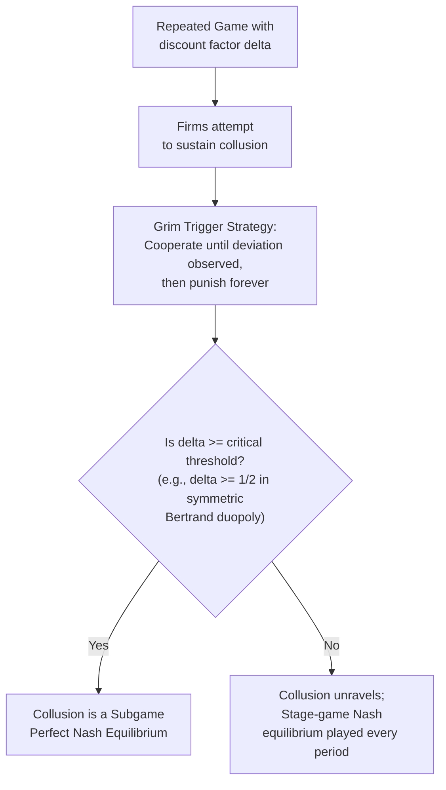

## Repeated Games, Discounting, and the Folk Theorem

### Overview

Repeated games extend the game-theoretic toolkit to settings where the same set of players faces the same (or a related) strategic situation over multiple periods, with each player able to condition future actions on the observed history of past play. This repeated interaction fundamentally changes what is sustainable in equilibrium: outcomes that are impossible to support in a one-shot Nash equilibrium — most importantly, tacit collusion among oligopolists — can become subgame perfect equilibria of the repeated game, provided players are sufficiently patient. This machinery, formalized through the **Folk Theorem**, is the central theoretical tool industrial economists use to analyze the sustainability of collusion, reputation, and cooperation in ongoing market relationships.

### Basic Structure of a Repeated Game

**Key Points**

A repeated game consists of a **stage game** $G$ (a simultaneous- or sequential-move game, e.g., a Bertrand or Cournot pricing game) played repeatedly across periods $t = 0, 1, 2, \dots$. Two canonical horizon structures are distinguished:

- **Finitely repeated game**: the stage game is played a known, fixed number of times $T$.
- **Infinitely repeated game**: the stage game is played in every period $t = 0, 1, 2, \dots$ without a predetermined final period (or, mathematically equivalently for many purposes, an indefinite horizon with a constant per-period continuation probability).

**Key Points**

- In a repeated game, a player's **strategy** specifies an action in the stage game as a function of the entire history of play observed up to that point — this history-dependence is what allows repeated interaction to support outcomes not achievable in the one-shot game.
- Repeated games are distinguished from ordinary sequential games (Stackelberg-type) by the fact that the *same* stage game recurs, and players can use future stage-game outcomes as rewards or punishments contingent on past behavior — this "linking" of periods is the source of all repeated-game equilibrium effects.

### Discounting and Patience

**Key Points**

Because payoffs are realized over multiple future periods, players are assumed to evaluate the entire stream of payoffs using a **discount factor** $\delta \in (0, 1)$, which captures both time preference and, in indefinite-horizon games, the probability that the relationship continues into the next period. Total discounted payoff for a player receiving per-period payoffs $\pi_0, \pi_1, \pi_2, \dots$ is:

$$V = \sum_{t=0}^{\infty} \delta^t \pi_t$$

The discount factor $\delta$ can be interpreted as:

$$\delta = \frac{1}{1+r} \times p$$

Where $r$ is the per-period interest/discount rate and $p$ is the (constant) probability that the relationship/game continues to the next period (with $p = 1$ in a game with certain infinite continuation). A higher $\delta$ (closer to 1) represents greater patience or a higher likelihood of continued future interaction; a lower $\delta$ (closer to 0) represents impatience or a high chance the relationship ends.

**Key Points**

- $\delta$ is the single most important parameter in repeated-game analysis because sustaining cooperative or collusive outcomes always requires trading off a one-time short-run gain from deviating against a stream of future losses from punishment — and whether that trade-off favors cooperation depends entirely on how heavily the future is discounted.
- In applied industrial organization, factors that are commonly associated with a higher effective $\delta$ (and thus more sustainable collusion) include low interest rates, low probability of market exit/disruption, and frequent interaction (short periods between pricing decisions) relative to the flow of profits.

### Finitely Repeated Games and Backward Induction

**Key Points**

If the stage game $G$ has a **unique** Nash equilibrium, then in a finitely repeated version of $G$ with a known final period $T$, backward induction implies that the unique Nash equilibrium of $G$ must be played in every period, including period $T$ — with no scope for sustaining cooperation at any point.

**Reasoning by backward induction:**

1. In the final period $T$, there is no future to threaten punishment or promise reward, so the game reduces to the one-shot stage game; the unique Nash equilibrium of $G$ is played.
2. Given that period $T$'s outcome is fixed regardless of prior play, period $T-1$ also reduces to a one-shot decision with no ability to influence future behavior, so the unique Nash equilibrium is played there too.
3. This unravels backward to period $0$: the unique stage-game Nash equilibrium is played in *every* period.

**Example**

In a finitely repeated Prisoner's Dilemma (or a finitely repeated Bertrand duopoly with homogeneous goods, which has a unique Nash equilibrium of $P = MC$), backward induction predicts (Defect, Defect) — or, in the Bertrand case, marginal-cost pricing — in every single period, with no cooperation/collusion sustained at any point, no matter how many periods the game is repeated.

**Key Points**

- This "unraveling" result depends critically on the stage game having a **unique** Nash equilibrium; if the stage game has *multiple* Nash equilibria, the finitely repeated game can sustain cooperative behavior in earlier periods by using the selection between different final-period equilibria as a reward/punishment device (a mechanism formalized by Benoit and Krishna, 1985).
- **[Unverified]** The finitely-repeated backward-induction prediction is frequently contradicted by experimental and real-world observation (cooperation is often observed well before the final periods of finitely repeated interactions); explanations in the literature include bounded rationality, uncertainty about whether rivals are purely payoff-maximizing, reputation-building motives, and social preferences, though no single explanation is universally accepted as the complete account.

### Infinitely (Indefinitely) Repeated Games

**Key Points**

- In infinitely (or indefinitely, with constant continuation probability) repeated games, there is no final period from which to begin backward induction, so the stark unraveling result above does not apply.
- This opens the door to sustaining a much richer set of outcomes — including cooperative/collusive outcomes strictly better for all players than repeated play of the stage-game Nash equilibrium — provided such outcomes can be supported by credible punishment threats.

### Trigger Strategies and Grim Trigger

**Key Points**

The most common strategy used to analyze cooperation in repeated games is the **grim trigger strategy**:

- Play the cooperative (e.g., collusive) action in period $0$.
- Continue playing the cooperative action in every subsequent period, *as long as* no deviation from the cooperative action has ever been observed.
- If any deviation is ever observed, permanently switch to playing the stage-game Nash equilibrium action in every period thereafter (the harshest available, permanent punishment).

**Example: Sustaining Collusion in a Repeated Bertrand Duopoly**

Consider two firms with identical constant marginal cost $c$, facing the (one-shot) Bertrand Nash equilibrium of $P = MC$ (zero profit for both firms). Suppose the firms instead attempt to sustain the joint-monopoly (collusive) price $P^M$, splitting monopoly profit $\pi^M$ equally each period, so each firm earns $\pi^M / 2$ per period under cooperation.

**Deviation payoff**: If a firm deviates by undercutting the collusive price slightly, it captures the *entire* market demand at (just below) the monopoly price for one period, earning approximately the full monopoly profit $\pi^M$ in that period (a standard result under Bertrand-type homogeneous-good undercutting logic).

**Punishment payoff**: Following detection of the deviation, both firms revert permanently to the Bertrand Nash equilibrium, earning zero profit in every subsequent period.

**Condition for cooperation to be sustainable** (no incentive to deviate): the discounted value of continued cooperation must be at least as large as the one-time gain from deviating plus the discounted value of subsequent punishment:

$$\frac{\pi^M/2}{1 - \delta} \geq \pi^M + \delta \cdot \frac{0}{1-\delta}$$

Simplifying:

$$\frac{\pi^M/2}{1-\delta} \geq \pi^M$$

$$\frac{1}{2(1-\delta)} \geq 1 \implies \delta \geq \frac{1}{2}$$

**Result**: Collusion is sustainable as a subgame perfect equilibrium (via grim trigger) if and only if the discount factor satisfies $\delta \geq 1/2$ — firms must value the future sufficiently (relative to the temptation to grab the entire market for one period by undercutting) for tacit collusion to be self-enforcing.

**Key Points**

- This specific $\delta \geq 1/2$ threshold is a well-known benchmark result for symmetric Bertrand duopoly with grim trigger, homogeneous goods, and constant marginal cost; the threshold value itself is **[Inference]** *sensitive to the specific model assumptions* — it changes with the number of firms (more firms generally raise the required $\delta$, since the one-period deviation gain is shared among fewer punishers relative to a larger collusive pie split more ways, and the temptation to deviate scales differently), the punishment strategy used (grim trigger is the harshest, so it yields the *most permissive* possible collusion condition; other, milder punishment strategies would require a higher $\delta$ for the same cooperative outcome to be sustainable), and the extent of product differentiation or capacity constraints.
- The general logic — trading a one-time deviation gain against a discounted stream of forgone future cooperative profit — is what generalizes across settings, not the precise numerical threshold.

### Diagrammatic Illustration: Sustainability Condition

<svg xmlns="http://www.w3.org/2000/svg" viewBox="0 0 680 420">
<text x="340" y="26" text-anchor="middle" font-size="16" font-weight="bold" fill="#1a1a1a">Cooperation Sustainability as a Function of the Discount Factor (svg_diagram)</text>

<line x1="80" y1="360" x2="620" y2="360" stroke="#333" stroke-width="1.5" />
<line x1="80" y1="360" x2="80" y2="60" stroke="#333" stroke-width="1.5" />
<text x="630" y="365" font-size="13" fill="#333">delta (discount factor)</text>
<text x="55" y="55" font-size="13" fill="#333">Value</text>

<path d="M 100 340 Q 300 280 550 100" fill="none" stroke="#16a34a" stroke-width="2.5" />
<text x="440" y="130" font-size="13" fill="#16a34a" font-weight="bold">Value of Cooperation</text>

<line x1="100" y1="220" x2="550" y2="220" stroke="#dc2626" stroke-width="2.5" stroke-dasharray="6,3" />
<text x="440" y="210" font-size="13" fill="#dc2626" font-weight="bold">Value of Deviating</text>

<line x1="330" y1="360" x2="330" y2="60" stroke="#666" stroke-width="1" stroke-dasharray="3,3" />
<text x="300" y="380" font-size="12" fill="#333">delta* = 1/2</text>

<text x="130" y="300" font-size="12" fill="`#7f1d1d`">Deviation dominates</text>

<text x="130" y="316" font-size="12" fill="`#7f1d1d`">(collusion unravels)</text>

<text x="400" y="330" font-size="12" fill="`#14532d`">Cooperation dominates</text>

<text x="400" y="346" font-size="12" fill="`#14532d`">(collusion sustainable)</text>

</svg>

### The One-Shot Deviation Principle

**Key Points**

- Checking whether a strategy profile is subgame perfect in an infinitely repeated game by considering *every* conceivable deviation (at every possible history) is computationally and conceptually intractable given the infinite number of possible histories.
- The **one-shot deviation principle** (valid for games with discounting/continuous payoffs) states that a strategy profile is subgame perfect if and only if no player can gain by deviating from it in a *single* period and then reverting to the prescribed strategy thereafter — checking one-period deviations at each type of history (on-path and off-path) is sufficient to verify subgame perfection.
- This principle is what makes the grim-trigger sustainability calculation above tractable: it reduces the infinite-horizon verification problem to comparing the payoff from a single deviation against the payoff from continued adherence to the strategy.

### The Folk Theorem

**Key Points**

The **Folk Theorem** (so named because early versions circulated informally among game theorists — "folklore" — before being formally proven; key formal contributions include Friedman, 1971, for Nash-threat versions, and Fudenberg and Maskin, 1986, for the fully general subgame perfect version) is the central theoretical result characterizing what payoffs are achievable in infinitely repeated games.

**Informal statement**: If players are sufficiently patient (i.e., $\delta$ is sufficiently close to 1), then *any* feasible payoff vector that gives each player at least their **minmax payoff** (the lowest payoff that other players can hold a given player to, when that player best-responds) can be sustained as a subgame perfect (or, in weaker versions, plain Nash) equilibrium outcome of the infinitely repeated game.

**Key Points**

- The **minmax payoff** for player $i$ is defined as:

$$\underline{v}_i = \min_{s_{-i}} \max_{s_i} u_i(s_i, s_{-i})$$

This represents the worst payoff that the other players can inflict on player $i$, given that player $i$ responds optimally to that punishment — it is the natural "threat point" or floor below which no rational player would ever accept an outcome, since they could always guarantee at least this much by best-responding to the worst punishment.

- **Feasibility**: a payoff vector is feasible if it lies within (or on the boundary of) the convex hull of the set of possible stage-game payoff vectors (allowing for payoffs from mixed strategies or, in repeated-game context, averages/combinations of different stage-game outcomes across periods).
- **The startling implication**: the Folk Theorem implies that infinitely repeated games with sufficiently patient players typically have an enormous **multiplicity of equilibria** — essentially any individually rational (above-minmax), feasible payoff combination can be supported by *some* strategy profile (typically requiring elaborate punishment schemes if the desired payoff involves asymmetric treatment or payoffs off the stage-game equilibrium path).

### Diagrammatic Illustration: Folk Theorem Payoff Set

<svg xmlns="http://www.w3.org/2000/svg" viewBox="0 0 620 460">
<text x="310" y="26" text-anchor="middle" font-size="16" font-weight="bold" fill="#1a1a1a">Folk Theorem: Sustainable Payoff Region (svg_diagram)</text>

<line x1="80" y1="400" x2="560" y2="400" stroke="#333" stroke-width="1.5" />
<line x1="80" y1="400" x2="80" y2="60" stroke="#333" stroke-width="1.5" />
<text x="570" y="405" font-size="13" fill="#333">Player 1 payoff</text>
<text x="40" y="55" font-size="13" fill="#333">Player 2 payoff</text>

<polygon points="150,370 500,140 460,90 200,180 130,300" fill="#3b82f6" fill-opacity="0.15" stroke="#3b82f6" stroke-width="1.5" />
<text x="330" y="130" font-size="12" fill="#1e40af" font-weight="bold">Feasible Payoff Set</text>

<line x1="220" y1="400" x2="220" y2="60" stroke="#dc2626" stroke-width="1.5" stroke-dasharray="5,4" />
<text x="225" y="80" font-size="12" fill="#dc2626">Player 1 minmax</text>
<line x1="80" y1="260" x2="560" y2="260" stroke="#dc2626" stroke-width="1.5" stroke-dasharray="5,4" />
<text x="440" y="253" font-size="12" fill="#dc2626">Player 2 minmax</text>

<polygon points="220,260 460,90 500,140 220,260" fill="#16a34a" fill-opacity="0.35" stroke="#16a34a" stroke-width="2" />
<text x="330" y="180" font-size="12" fill="#14532d" font-weight="bold">Folk Theorem</text>
<text x="330" y="196" font-size="12" fill="#14532d" font-weight="bold">sustainable region</text>
<text x="330" y="212" font-size="12" fill="#14532d" font-weight="bold">(feasible AND above</text>
<text x="330" y="228" font-size="12" fill="#14532d" font-weight="bold">both minmax payoffs)</text>

<circle cx="300" cy="330" r="6" fill="#f59e0b" />
<text x="310" y="335" font-size="12" fill="#92400e" font-weight="bold">One-shot Nash equilibrium</text>
</svg>

### Applications to Tacit Collusion in Industrial Organization

**Key Points**

- The Folk Theorem and grim-trigger-type sustainability conditions provide the formal theoretical basis for understanding **tacit collusion**: repeated interaction among the same oligopolists over many periods can sustain prices well above the static Nash (Cournot or Bertrand) level, without any explicit communication or formal agreement, purely through the credible threat of reverting to competitive behavior if a firm deviates.
- Factors industrial economists identify (largely derived from repeated-game logic) as facilitating collusion sustainability include: high market transparency (deviations are quickly detected, shortening the delay before punishment begins), frequent interaction/short lag between pricing decisions, low expected future demand volatility, symmetric firm characteristics (cost, capacity), high entry barriers (so punishment profits aren't dissipated by new entrants), and multi-market contact between the same firms (which can effectively pool the "stakes" of cooperation across markets, as formalized by Bernheim and Whinston, 1990).
- Factors that undermine collusion sustainability include low detection probability or long detection lags (weakening/delaying punishment), significant asymmetry among firms (making equal-split collusive schemes harder to agree on or sustain), demand or cost volatility (complicating the ability to distinguish a rival's deviation from an ordinary demand/cost shock — a concern formally modeled by Green and Porter, 1984, in their theory of price wars triggered by imperfect monitoring), and low expected probability of continued future interaction (low $\delta$).

### Imperfect Monitoring and Price Wars: The Green-Porter Framework

**Key Points**

- A significant extension of the basic repeated-game collusion model addresses settings where firms cannot directly observe rivals' actions (e.g., secret price cuts) but only observe a noisy public signal, such as market price or their own realized demand, which is affected by both rivals' behavior and random demand shocks.
- Green and Porter (1984) show that in such settings, grim trigger based on directly observed deviation is not implementable (deviations aren't directly observable); instead, equilibrium strategies must trigger a **temporary punishment phase (a "price war")** whenever the observed public signal (e.g., price) falls below some threshold — even though a low price could result from an actual rival deviation *or* simply from an adverse demand shock unrelated to any deviation.
- **[Inference]** This generates the theoretical prediction that periodic price wars can occur *in equilibrium*, along the equilibrium path, purely as the necessary consequence of imperfect monitoring — not because collusion has permanently broken down, but because occasional punishment phases are required to maintain incentive compatibility given that deviations cannot be perfectly distinguished from bad luck. This is frequently cited as a candidate theoretical explanation for observed episodic price wars in some real-world oligopolistic industries, though attributing any specific historical price war to this mechanism versus alternative explanations (genuine breakdown of collusion, demand shocks, entry) is an empirical judgment call rather than a settled identification in every case.

### Antitrust Relevance

**Key Points**

- Repeated-game and Folk Theorem logic underpins antitrust economists' analysis of tacit coordination: because tacit collusion (sustained purely through repeated-game punishment threats, without explicit agreement or communication) can achieve supra-competitive prices without leaving direct evidence of an agreement, it poses a distinct enforcement challenge compared to explicit cartels, and has motivated "facilitating practices" doctrines (scrutiny of practices like advance price announcements, most-favored-customer clauses, or information-sharing arrangements that can raise the sustainability of tacit collusion by improving detection/monitoring, even absent an explicit agreement).
- Merger analysis frequently incorporates repeated-game logic when assessing "coordinated effects" — the concern that a merger, by reducing the number of firms or increasing symmetry among remaining firms, could shift the industry's parameters (e.g., effectively lowering the number of firms sharing punishment, or improving monitoring) enough to move the industry from a $\delta$ below the collusion-sustaining threshold to one above it.

### Limitations and Caveats

**Key Points**

- The Folk Theorem's multiplicity of equilibria is frequently cited as both its major theoretical strength (explanatory flexibility) and its major practical limitation (weak point predictions) — because virtually any individually rational, feasible payoff can be an equilibrium outcome for sufficiently high $\delta$, the theorem by itself does not predict *which* particular equilibrium (e.g., which specific collusive price) will actually emerge in a given real-world setting.
- Renegotiation-proofness is a further refinement concern: grim trigger strategies threaten *permanent* punishment, but if players could jointly agree to "renegotiate" back to cooperation after a punishment phase begins (since permanent mutual punishment is itself Pareto-dominated by resuming cooperation), the credibility of a literal grim trigger threat is called into question — this has motivated the study of renegotiation-proof equilibrium concepts and more moderate (finite-length or partial) punishment strategies as arguably more realistic alternatives to grim trigger in applied settings.
- **[Unverified]** Directly measuring the discount factor firms actually apply, or empirically confirming that observed pricing patterns reflect a specific repeated-game equilibrium (versus alternative explanations such as static conjectural variations or search frictions) is methodologically difficult, and much of the applied evidence for repeated-game-based tacit collusion in specific industries relies on indirect inference rather than direct measurement of $\delta$ or firms' punishment strategies.

**Next Steps**

- **Related Topics**
  - Simultaneous-move games and Nash equilibrium (prerequisite concept)
  - Sequential games and subgame perfection (prerequisite concept; one-shot deviation principle)
  - The Bertrand and Cournot models (stage games most commonly analyzed in repeated form)
  - Green-Porter model of price wars under imperfect monitoring
  - Multi-market contact and mutual forbearance (Bernheim and Whinston)
  - Cartel stability and explicit collusion versus tacit coordination in antitrust law
  - Facilitating practices doctrine (price announcements, MFN clauses, information exchange)
  - Renegotiation-proof equilibrium concepts
  - Coordinated effects analysis in merger review