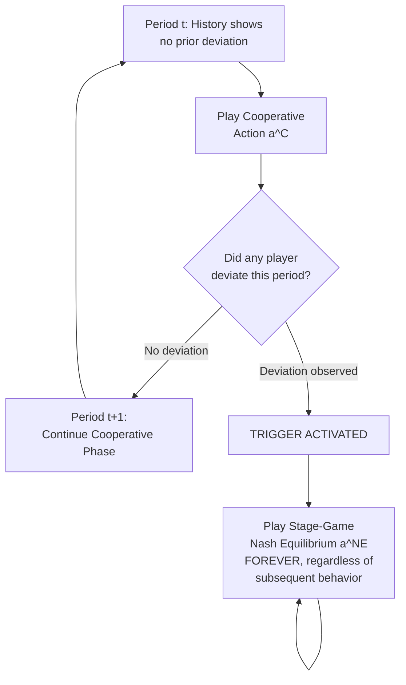

## Trigger Strategies and Grim Punishment

### Overview

Trigger strategies are the primary class of strategies used to sustain cooperative or collusive outcomes in repeated games. A trigger strategy specifies cooperative behavior conditional on an unbroken history of cooperation, with a switch ("trigger") to punishment behavior activated by any observed deviation. **Grim punishment** (or "grim trigger") is the harshest and most tractable member of this class, prescribing permanent reversion to the stage-game Nash equilibrium following any deviation, forever. This material develops the trigger-strategy toolkit in detail, extending the discounting and Folk Theorem foundations to examine strategy design, robustness, and applied variants used throughout industrial organization.

### Formal Definition of a Trigger Strategy

**Key Points**

A trigger strategy for player $i$ in an infinitely repeated game specifies:

$$a_i^t = \begin{cases} a_i^C & \text{if the history through period } t-1 \text{ contains no observed deviation} \\ a_i^P & \text{if a deviation has ever been observed in some period } \tau < t \end{cases}$$

Where $a_i^C$ is the cooperative (e.g., collusive) action and $a_i^P$ is the punishment action. The defining feature of any trigger strategy is that punishment, once triggered, depends only on *whether* a deviation has ever occurred — not on *when* it occurred or on any further behavior afterward. This makes trigger strategies simple to state and, in the grim case, simple to verify using the one-shot deviation principle.

**Key Points**

- Trigger strategies are a subclass of the broader universe of history-contingent strategies available in repeated games; the Folk Theorem shows that a vast range of payoffs can be sustained using more elaborate history-dependent strategies, but trigger strategies (particularly grim trigger) are the workhorse tool because they are the simplest to specify and to verify for subgame perfection.
- All trigger strategies share a **stick-and-carrot logic**: cooperation is the "carrot" sustained by an implicit threat, and the "stick" is a switch to a worse outcome that activates automatically and irreversibly (or, in non-grim variants, temporarily) upon detected deviation.

### Grim Trigger: Full Specification

**Key Points**

The grim trigger strategy is defined precisely as follows:

1. In period $t = 0$, play the cooperative action $a^C$.
2. In any period $t > 0$: if the outcome in every prior period was $(a^C, a^C, \dots)$ (all players cooperated), play $a^C$ again.
3. If, in any prior period, any player played anything other than $a^C$, play the stage-game Nash equilibrium action $a^{NE}$ for the rest of the game, regardless of what happens afterward.

**Key Points**

- Grim trigger is termed "grim" precisely because the punishment is **permanent and unconditional on subsequent behavior**: even if the deviating player immediately "apologizes" by returning to cooperative play, grim trigger prescribes punishment forever, with no path back to cooperation.
- This permanence is exactly what makes grim trigger the *harshest possible* credible punishment among trigger strategies, and hence the punishment that yields the **most permissive** (lowest) discount-factor threshold for sustaining any given cooperative outcome — no other credible (subgame perfect) punishment can support cooperation at a lower $\delta$.

### Verifying Subgame Perfection via the One-Shot Deviation Principle

**Key Points**

To confirm that grim trigger constitutes a subgame perfect Nash equilibrium, it is necessary and sufficient (by the one-shot deviation principle) to check that no player gains from a one-period deviation, evaluated at two distinct types of histories:

**History type 1 — the cooperative path** (no deviation has yet occurred): the relevant comparison is between continuing to cooperate versus deviating once and then facing permanent punishment. This is the calculation already developed in the repeated-games material: cooperation is sustainable if and only if

$$\frac{\pi^C}{1-\delta} \geq \pi^D + \delta \cdot \frac{\pi^{NE}}{1-\delta}$$

Where $\pi^C$ is the per-period cooperative payoff, $\pi^D$ is the one-period deviation payoff, and $\pi^{NE}$ is the stage-game Nash equilibrium payoff received in every period following triggered punishment.

**History type 2 — the punishment path** (a deviation has already occurred, so grim trigger prescribes playing $a^{NE}$ forever): here, the relevant question is whether a player has any incentive to deviate from playing $a^{NE}$ once punishment has begun. Because $a^{NE}$ is by construction a Nash equilibrium of the stage game, no player can gain by unilaterally deviating from it in any single period — this is exactly the definition of a Nash equilibrium.

**Key Points**

- This second check is what makes grim trigger reliably subgame perfect: the punishment phase is **self-enforcing** because it consists of repeating the stage-game Nash equilibrium forever, and no single-period deviation from a Nash equilibrium action is ever profitable, by definition of Nash equilibrium.
- This is precisely why the stage-game Nash equilibrium (rather than some arbitrarily harsh but *not* individually rational action) is used as the punishment phase: using anything that is not itself credible as an ongoing best response would fail the subgame perfection check on the punishment path itself.

### Worked Numerical Example: Symmetric Duopoly Collusion

**Example**

Consider two firms able to choose between a collusive price/quantity yielding each firm a per-period profit of $\pi^C = 40$, a one-period deviation yielding the deviator $\pi^D = 70$ (with the other firm earning correspondingly less that period), and reversion to the stage-game Nash equilibrium yielding each firm $\pi^{NE} = 10$ per period thereafter.

The sustainability condition is:

$$\frac{40}{1-\delta} \geq 70 + \delta \cdot \frac{10}{1-\delta}$$

Multiplying both sides by $(1-\delta)$:

$$40 \geq 70(1-\delta) + 10\delta$$

$$40 \geq 70 - 70\delta + 10\delta$$

$$40 \geq 70 - 60\delta$$

$$60\delta \geq 30$$

$$\delta \geq 0.5$$

**Result**: Collusion sustained via grim trigger requires $\delta \geq 0.5$ in this numerical example — matching the earlier symmetric Bertrand-style benchmark result, since the numbers were chosen to illustrate that specific case ($\pi^D = \pi^M$, $\pi^{NE} = 0$ scaled here to $\pi^{NE}=10$ for generality). If firms are more patient than this threshold, grim trigger successfully deters the one-period temptation to deviate.

### Diagrammatic Illustration: Grim Trigger Decision Tree Across Periods

<svg xmlns="http://www.w3.org/2000/svg" viewBox="0 0 700 400">
<text x="350" y="26" text-anchor="middle" font-size="16" font-weight="bold" fill="#1a1a1a">Grim Trigger: Payoff Path Following a Deviation (svg_diagram)</text>

<line x1="70" y1="340" x2="650" y2="340" stroke="#333" stroke-width="1.5" />
<line x1="70" y1="340" x2="70" y2="60" stroke="#333" stroke-width="1.5" />
<text x="660" y="345" font-size="13" fill="#333">Period t</text>
<text x="30" y="55" font-size="13" fill="#333">Payoff</text>

<line x1="70" y1="180" x2="320" y2="180" stroke="#16a34a" stroke-width="3" />
<text x="130" y="165" font-size="13" fill="#16a34a" font-weight="bold">Cooperative payoff (pi^C)</text>

<line x1="320" y1="180" x2="320" y2="90" stroke="#f59e0b" stroke-width="3" />
<line x1="320" y1="90" x2="380" y2="90" stroke="#f59e0b" stroke-width="3" />
<text x="330" y="80" font-size="13" fill="#92400e" font-weight="bold">One-period deviation gain (pi^D)</text>

<line x1="380" y1="90" x2="380" y2="290" stroke="#dc2626" stroke-width="2" stroke-dasharray="4,3" />
<line x1="380" y1="290" x2="650" y2="290" stroke="#dc2626" stroke-width="3" />
<text x="420" y="310" font-size="13" fill="#dc2626" font-weight="bold">Permanent punishment (pi^NE) forever</text>

<line x1="320" y1="340" x2="320" y2="60" stroke="#999" stroke-width="1" stroke-dasharray="3,3" />
<text x="290" y="360" font-size="12" fill="#333">Deviation occurs</text>
</svg>

### Why "Grim" Is Not Always Optimal: Renegotiation-Proofness

**Key Points**

- Although grim trigger achieves the theoretically most permissive sustainability condition, it does so by prescribing a punishment phase that is itself Pareto-dominated by a return to cooperation: once punishment begins, *both* players would (jointly) prefer to abandon the punishment and resume cooperating, since $\pi^{NE} < \pi^C$ for both.
- This raises the **renegotiation-proofness critique**: if players can communicate and jointly agree to abandon an ongoing punishment phase in favor of resuming mutually beneficial cooperation, the credibility of a literal "punish forever" threat becomes questionable, even though it satisfies subgame perfection under the strict assumption that players cannot renegotiate away from prescribed strategies.
- This concern has motivated the development of **renegotiation-proof equilibrium** concepts (e.g., Farrell and Maskin's "weakly renegotiation-proof" equilibrium, 1989), which require that punishment phases themselves not be susceptible to being jointly abandoned in favor of a Pareto-superior continuation, typically resulting in equilibria with milder, finite-length punishments rather than permanent grim reversion.
- **[Unverified]** Whether real-world firms behave as if punishment phases are genuinely permanent (consistent with literal grim trigger) or instead resume cooperation after some finite punishment interval (consistent with renegotiation-proof or milder trigger strategies) is an empirical question that is difficult to answer definitively from observed pricing data alone, since both are broadly consistent with periods of price wars followed by eventual return to higher prices.

### Milder Alternatives: Finite Punishment ("Punish-and-Forgive") Strategies

**Key Points**

An alternative to grim trigger is a **finite (limited-duration) punishment trigger strategy**: following a detected deviation, players revert to the stage-game Nash equilibrium (or some other punishment action) for a *fixed number of periods* $T^P$, after which cooperation resumes as though no deviation had occurred.

**Key Points**

- Finite punishment strategies are more consistent with renegotiation-proofness concerns and are often viewed as more descriptively realistic of observed price-war episodes (a temporary period of low prices followed by resumed high prices), but they require a *longer or harsher* punishment (relative to grim trigger) to deter deviation for any given $\delta$, since the total discounted cost of punishment must still be sufficient to offset the one-period deviation gain, and a finite punishment phase discounts to a strictly smaller total penalty than an infinite one.
- The minimum punishment length $T^P$ required to deter deviation, for a given $\delta$, can be derived by setting the discounted value of finite punishment equal to (at least) the one-period deviation gain and solving for $T^P$; **[Inference]** as $\delta \to 1$ (players become arbitrarily patient), the required finite punishment length $T^P$ needed to deter deviation, for a fixed one-period deviation gain, generally shrinks, since even a short interruption of a highly valuable, patiently-discounted cooperative stream becomes very costly to a sufficiently patient player — though the exact relationship depends on the specific stage-game payoffs involved.

### Optimal Penal Codes

**Key Points**

- Abreu (1986, 1988) formalized the theory of **optimal penal codes**: the harshest *credible* (subgame perfect) punishment available in a given repeated game, which in many symmetric settings with a bounded action space (e.g., a Cournot-type quantity game) can involve a punishment phase that is even harsher than reverting to the stage-game Nash equilibrium — for instance, a temporary "price war" or "stick" phase involving even lower prices/profits than the static Nash outcome, followed by a return to cooperation.
- This result shows that grim trigger, while simple and effective, is not always the theoretically harshest possible punishment; Abreu's optimal penal codes can sustain cooperation at *even lower* discount factors than grim trigger in games where a punishment phase harsher than $\pi^{NE}$ can itself be made credible (i.e., is itself subgame perfect to carry out, typically because the punishment phase transitions to a subsequent reward phase that makes carrying out the harsh punishment individually rational).
- **[Inference]** In practice, most applied industrial organization analysis of tacit collusion relies on the simpler grim-trigger benchmark (or the Green-Porter imperfect-monitoring variant) rather than fully optimal penal codes, largely because grim trigger provides a clean, interpretable sustainability condition, even though optimal penal codes represent the theoretically tightest possible bound on what can be sustained.

### Detection Lags and the Robustness of Trigger Strategies

**Key Points**

- The sustainability conditions derived above implicitly assume **immediate and perfect detection** of deviation (the deviation is observed within the same period it occurs, triggering punishment starting the very next period).
- If detection is delayed by $n$ periods (deviations are only observed with a lag), the deviating player enjoys the elevated deviation payoff $\pi^D$ for $n$ periods rather than just one, which strictly worsens the sustainability condition (requires a higher $\delta$ to deter deviation), since the temptation payoff is effectively amplified while the punishment is delayed and thus more heavily discounted.
- This detection-lag sensitivity is the direct link to the earlier Green-Porter imperfect-monitoring framework: when deviations cannot be perfectly and immediately distinguished from demand shocks, even a well-designed trigger strategy must tolerate some probability of triggering punishment based on a noisy signal, generating equilibrium price wars as a structural feature rather than a sign of collusion breakdown.

### Trigger Strategies Beyond Two-Player Collusion

**Key Points**

- Grim trigger generalizes readily to $n$-firm oligopoly settings: any single firm's deviation triggers permanent reversion to the $n$-firm stage-game Nash equilibrium by *all* firms.
- **Key comparative-static result**: holding the collusive profit per firm and deviation-gain structure otherwise comparable, sustaining collusion generally becomes **harder** (requires a higher $\delta$) as the number of firms $n$ increases, because the collusive profit is shared among more firms (lowering $\pi^C$ per firm) while the one-period deviation payoff from undercutting to capture the whole market does not shrink proportionately — this is one of the standard theoretical underpinnings for the widely observed empirical association between higher market concentration and greater sustainability of coordinated pricing, though **[Inference]** the precise quantitative relationship between firm count and collusion sustainability depends on the specific demand, cost, and detection assumptions of the model used, and should not be treated as a fixed universal formula.
- Trigger strategies in multi-firm settings also raise coordination questions not present in the two-firm case — e.g., how firms tacitly agree on which asymmetric collusive allocation (market shares, prices) to sustain — which trigger-strategy analysis alone does not resolve (this connects to the broader multiplicity concern flagged under the Folk Theorem).

### Applications and Antitrust Relevance

**Key Points**

- Trigger-strategy logic is directly invoked in merger "coordinated effects" analysis: a merger that reduces the number of independent firms, increases transparency (aiding detection and reducing effective detection lag), or increases symmetry among remaining firms can shift the industry from below to above the critical $\delta$ threshold required to sustain tacit collusion via trigger strategies, even without any change in explicit communication among firms.
- Antitrust economists sometimes examine observed pricing patterns for signatures consistent with trigger-strategy punishment — e.g., episodic sharp price drops followed by recovery — as one (though not conclusive) piece of circumstantial evidence potentially consistent with tacitly coordinated pricing, while recognizing that such patterns are also consistent with ordinary competitive responses to demand or cost shocks, so **[Unverified]** this pattern alone is not treated as definitive proof of collusion in standard antitrust economic practice, and is typically considered alongside other structural and behavioral evidence.

### Summary Comparison of Trigger Strategy Variants

| Strategy Type | Punishment Duration | Relative Severity | Sustainability Threshold ($\delta$) | Renegotiation-Proof? |
| --- | --- | --- | --- | --- |
| Grim Trigger | Permanent | Harshest standard benchmark | Lowest (most permissive) | No |
| Finite/Limited Punishment | Fixed $T^P$ periods | Milder than grim | Higher than grim (for same $T^P$-independent target) | More consistent, though not automatically satisfying formal renegotiation-proofness |
| Optimal Penal Code (Abreu) | Model-specific, may include harsher-than-Nash stick phase | Can exceed grim trigger's severity in some settings | Can be even lower than grim trigger's threshold | Model-dependent |

**Next Steps**

- **Related Topics**
  - Repeated games, discounting, and the Folk Theorem (prerequisite/foundational material)
  - The one-shot deviation principle (verification technique used throughout)
  - Green-Porter model of imperfect monitoring and equilibrium price wars
  - Abreu's optimal penal codes and stick-and-carrot equilibria
  - Renegotiation-proof equilibrium (Farrell and Maskin)
  - Multi-market contact and mutual forbearance in sustaining collusion
  - Coordinated effects analysis in merger control
  - Cartel detection and antitrust economic evidence standards