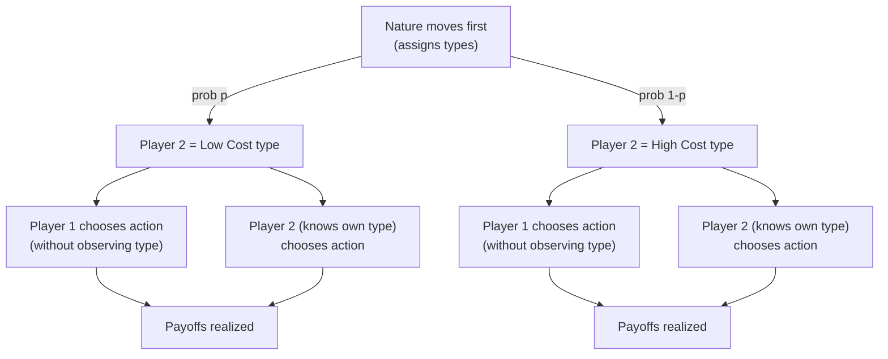

## Incomplete Information and Bayesian Games

### Overview

Incomplete information games model strategic settings where at least one player is uncertain about payoff-relevant characteristics of other players — their costs, valuations, product quality, or even their preferences. In Industrial Organization, this is the norm rather than the exception: a firm rarely knows a rival's exact marginal cost, a buyer rarely knows a seller's true quality, and an entrant rarely knows an incumbent's true capacity or aggressiveness. John Harsanyi's framework (1967–1968) transforms these games of incomplete information into games of *imperfect information* by introducing a fictitious move by "Nature" that assigns private types to players, allowing standard game-theoretic equilibrium tools to apply.

### Complete vs. Incomplete Information

**Key Points**

- **Complete information**: every player knows the full structure of the game — all players' strategy sets and payoff functions — as common knowledge.
- **Incomplete information**: at least one player is uncertain about some payoff-relevant parameter (a "type") of at least one other player.
- **Imperfect information** (a distinct concept) refers to uncertainty about *actions already taken* within a game whose structure is fully known — e.g., simultaneous-move games or hidden moves in sequential games. Incomplete information is about not knowing the *game itself* (payoffs), while imperfect information is about not knowing *where you are* in a known game tree.
- Harsanyi's insight: incomplete information can be reformulated as imperfect information by having Nature move first and draw each player's type, which only that player observes.

### The Harsanyi Transformation

The Harsanyi transformation converts an incomplete information game into a Bayesian game by:

1. Introducing a set of possible **types** $\theta_i$ for each player $i$, capturing the private information (cost, valuation, quality assessment, etc.).
2. Specifying a **prior probability distribution** over the type profiles, representing beliefs about how likely each combination of types is.
3. Having Nature draw the type profile $\theta = (\theta_1, \dots, \theta_n)$ at the start of the game; each player $i$ observes only $\theta_i$, not the types of others.
4. Requiring all of this structure — the type spaces, the prior, and the fact that types are privately observed — to be **common knowledge** among players, even though the realized types are not.

This is a modeling device: instead of saying "Player 2 has some unknown cost," we say "Nature draws Player 2's cost from a known distribution, and only Player 2 observes the realization."

### Formal Definition of a Bayesian Game

A Bayesian game is formally defined by the tuple:

$$G = \left\langle N, (A_i)_{i \in N}, (\Theta_i)_{i \in N}, (p_i)_{i \in N}, (u_i)_{i \in N} \right\rangle$$

Where:

- $N = \{1, \dots, n\}$: the set of players.
- $A_i$: the set of actions available to player $i$.
- $\Theta_i$: the set of possible types for player $i$ (the type space).
- $p_i(\theta_{-i} \mid \theta_i)$: player $i$'s **belief** about the types of other players, conditional on their own type, derived from a common prior $p(\theta)$ over $\Theta = \Theta_1 \times \cdots \times \Theta_n$ via Bayes' rule.
- $u_i(a_1, \dots, a_n; \theta_1, \dots, \theta_n)$: player $i$'s payoff function, which depends on *all* players' actions and *all* players' types (not just their own).

**Common prior assumption**: most applied IO models assume all players share the same prior $p(\theta)$ over the type space, and each player's conditional belief $p_i(\theta_{-i} \mid \theta_i)$ is derived from this shared prior via Bayes' rule. This is what makes the beliefs "Bayesian" and internally consistent across players.

### Strategies in Bayesian Games

A **strategy** in a Bayesian game is not a single action but a **function from types to actions**:

$$s_i : \Theta_i \to A_i$$

This is a critical conceptual shift from complete-information games. Since each type of a player may face a different strategic situation, a full strategy must specify an action for *every possible type* the player could be — even types that, upon reflection, would never be realized in equilibrium. This is analogous to specifying strategies at every information set in an extensive-form game.

**[Inference]** In applied IO papers, when a player has only two or three plausible types (e.g., "high cost" / "low cost"), the strategy function is often written out explicitly as a small table or pair of actions rather than abstract functional notation, though the underlying formalism is unchanged.

### Bayesian Nash Equilibrium (BNE)

A strategy profile $s^* = (s_1^*, \dots, s_n^*)$ is a **Bayesian Nash Equilibrium** if, for every player $i$ and every type $\theta_i \in \Theta_i$ that player $i$ could have, the action $s_i^*(\theta_i)$ maximizes player $i$'s *expected* payoff given their beliefs about other players' types and given that other players follow their equilibrium strategies:

$$s_i^*(\theta_i) \in \arg\max_{a_i \in A_i} \; \mathbb{E}_{\theta_{-i}} \left[ u_i\big(a_i, s_{-i}^*(\theta_{-i}); \theta_i, \theta_{-i}\big) \mid \theta_i \right]$$

Expanding the expectation with the conditional belief:

$$s_i^*(\theta_i) \in \arg\max_{a_i \in A_i} \; \sum_{\theta_{-i} \in \Theta_{-i}} p_i(\theta_{-i} \mid \theta_i) \cdot u_i\big(a_i, s_{-i}^*(\theta_{-i}); \theta_i, \theta_{-i}\big)$$

**Key Points**

- BNE is simply Nash equilibrium applied to the Harsanyi-transformed game, where "players" are effectively type-contingent decision-makers and payoffs are taken in expectation over unknown opponent types.
- Every finite Bayesian game (finite players, finite types, finite actions) has at least one BNE in mixed strategies, by the same fixed-point logic as standard Nash existence (Nash 1950, applied to the transformed game).
- BNE is generally *not* the same as the Nash equilibrium of the "average" or "expected" complete-information game — because each type independently best-responds to its own conditional beliefs, not to an aggregate.

### Worked Example: Cournot Duopoly with Private Cost Information

This is the canonical IO application, originating from the analysis in Harsanyi's own work and widely used in IO courses (e.g., following the treatment in Gibbons' *Game Theory for Applied Economists*).

**Setup:**

- Two firms, $i = 1, 2$, compete in quantities $q_1, q_2 \ge 0$.
- Market inverse demand: $P(Q) = a - Q$, where $Q = q_1 + q_2$.
- Firm 1's marginal cost $c_1$ is **common knowledge**.
- Firm 2's marginal cost is **private information**: $c_2 = c_L$ (low cost) with probability $\theta$, or $c_2 = c_H$ (high cost) with probability $1-\theta$, with $c_L < c_H$.
- Firm 1 does not know Firm 2's realized cost, only the distribution.
- Firm 2 knows its own cost *and* knows Firm 1 does not know it.

**Strategies:**

- Firm 1 chooses a single quantity $q_1$ (it has only one "type").
- Firm 2 chooses a strategy $q_2(c_L)$ and $q_2(c_H)$ — a quantity for each possible cost realization.

**Firm 2's best response (for each type)** is the standard Cournot best response, since Firm 2 knows both its own cost and Firm 1's chosen $q_1$ is fixed (Firm 2 best-responds type-by-type as in complete information):

$$q_2(c_L) = \frac{a - c_L - q_1}{2}, \qquad q_2(c_H) = \frac{a - c_H - q_1}{2}$$

**Firm 1's best response** must maximize *expected* profit, since Firm 1 does not observe which type it faces:

$$\max_{q_1} \; \theta \big[(a - q_1 - q_2(c_L) - c_1) q_1\big] + (1-\theta)\big[(a - q_1 - q_2(c_H) - c_1) q_1\big]$$

This simplifies to Firm 1 best-responding to the **expected quantity** of Firm 2:

$$q_1 = \frac{a - c_1 - \mathbb{E}[q_2]}{2}, \quad \text{where } \mathbb{E}[q_2] = \theta \, q_2(c_L) + (1-\theta)\, q_2(c_H)$$

**Solving the system** (substituting and solving simultaneously) yields the closed-form BNE:

$$q_1^* = \frac{a - 2c_1 + \theta c_L + (1-\theta)c_H}{3}$$

$$q_2^*(c_L) = \frac{a - 2c_L + c_1}{3} - \frac{(1-\theta)(c_H - c_L)}{6}, \qquad q_2^*(c_H) = \frac{a - 2c_H + c_1}{3} + \frac{\theta(c_H - c_L)}{6}$$

**Example (Numerical)**

Let $a = 100$, $c_1 = 20$, $c_L = 10$, $c_H = 30$, $\theta = 0.5$.

$$q_1^* = \frac{100 - 40 + 0.5(10) + 0.5(30)}{3} = \frac{100 - 40 + 5 + 15}{3} = \frac{80}{3} \approx 26.67$$

$$q_2^*(c_L) = \frac{100 - 20 + 20}{3} - \frac{0.5(20)}{6} = \frac{100}{3} - \frac{10}{6} \approx 33.33 - 1.67 = 31.67$$

$$q_2^*(c_H) = \frac{100 - 60 + 20}{3} + \frac{0.5(20)}{6} = \frac{60}{3} + \frac{10}{6} \approx 20 + 1.67 = 21.67$$

**Interpretation**: Firm 1 produces a single quantity that hedges against both possible rival types. Firm 2, when low-cost, produces *less* than it would under complete information (because it partly "pools" with the possibility that Firm 1 believes it might be high-cost, and Firm 1's output is based on the pooled expectation) — precisely, $q_2^*(c_L)$ is adjusted downward relative to the full-information best response, and $q_2^*(c_H)$ upward, relative to their respective complete-information Cournot quantities, since Firm 1's fixed $q_1^*$ sits *between* what it would choose if it knew the type for certain.

### Worked Example: Bayesian Game in Normal Form (Discrete Types)

Consider a simpler discrete-type entry game useful for building intuition before moving to continuous auctions.

**Setup:**

- Player 1 (Entrant) decides to Enter or Stay Out.
- Player 2 (Incumbent) has private type: Strong (high capacity, low cost) with probability $0.4$, or Weak with probability $0.6$.
- Player 2 chooses Fight or Accommodate, *type-contingently*, without observing Player 1's action (simultaneous move within each type node).

| Player 2 = Strong (p=0.4) | Fight | Accommodate |
| --- | --- | --- |
| **Enter** | $(-2, 3)$ | $(1, 1)$ |
| **Stay Out** | $(0, 4)$ | $(0, 2)$ |

| Player 2 = Weak (p=0.6) | Fight | Accommodate |
| --- | --- | --- |
| **Enter** | $(-1, -1)$ | $(2, 0)$ |
| **Stay Out** | $(0, 2)$ | $(0, 1)$ |

**Solving:**

- For the Strong type, Fight strictly dominates Accommodate ($3 > 1$, $4 > 2$), so $s_2^*(\text{Strong}) = \text{Fight}$.
- For the Weak type, Accommodate strictly dominates Fight ($0 > -1$, $1 > 0$), so $s_2^*(\text{Weak}) = \text{Accommodate}$.
- Player 1's expected payoff from Entering: $0.4(-2) + 0.6(2) = -0.8 + 1.2 = 0.4$.
- Player 1's expected payoff from Staying Out: $0$.
- Since $0.4 > 0$, Player 1 enters.

**BNE**: $\big(\text{Enter}, \; s_2^*(\text{Strong}) = \text{Fight}, \; s_2^*(\text{Weak}) = \text{Accommodate}\big)$.

This illustrates a core IO insight: incomplete information about an incumbent's type can *induce entry* that would not occur if the entrant believed the incumbent was certainly Strong, since the pooled expected payoff can be positive even when the Strong-type outcome is very unfavorable.

### Purification and the Role of Private Information

**[Inference]** One classical justification for using mixed-strategy Nash equilibria in complete-information games (Harsanyi's *purification theorem*, 1973) is that observed randomization can be reinterpreted as the limit of pure-strategy BNE in a nearby Bayesian game with slight private payoff perturbations — i.e., what looks like mixing under complete information may actually be deterministic type-contingent behavior under a small amount of incomplete information. This is a well-established theoretical result, though its direct empirical application in IO settings is less common than the direct BNE modeling shown above.

### Applications in Industrial Organization

**Key Points**

- **Auctions**: first-price and second-price sealed-bid auctions with private valuations are the paradigmatic Bayesian games; bidders' valuations are private types, and bidding strategies are functions from valuation to bid.
- **Entry deterrence and limit pricing**: incumbents may signal low costs (or entrants may be uncertain about incumbent costs), generating Bayesian games where entry decisions depend on beliefs about incumbent type (related to, but formally distinct from, signaling games — see below).
- **Cournot/Bertrand competition under cost uncertainty**: as in the worked example above, common in IO textbooks to study how private cost information affects equilibrium output/price and welfare relative to complete information.
- **Product quality and adverse selection**: sellers privately know quality; buyers form beliefs, relevant for market unraveling (Akerlof-style lemons problems) reformulated as Bayesian games.
- **Collusion under private cost information**: cartel stability and communication mechanisms depend on whether members can credibly signal or must rely on prior beliefs about rivals' costs.
- **Patent races and R&D competition**: firms have private information about their own R&D productivity or progress.

### Bayesian Games vs. Related Frameworks

| Framework | Information structure | Key distinguishing feature |
| --- | --- | --- |
| **Complete information Nash game** | All payoffs common knowledge | No private types; standard best-response analysis |
| **Bayesian game (static)** | Private types, drawn once, simultaneous actions | Players act once, guided by conditional expectations |
| **Signaling game** | Private types, *sequential* actions (informed player moves first) | Uninformed player updates beliefs via Bayes' rule after observing the signal; equilibrium concept is Perfect Bayesian Equilibrium (PBE), not plain BNE |
| **Screening game** | Private types, uninformed player moves first (offers a menu) | Informed player self-selects; relevant for price discrimination and mechanism design |
| **Repeated game with incomplete information** | Private types persist across repeated interaction | Beliefs are updated dynamically each period; reputation effects emerge |

**[Inference]** Static Bayesian games (this topic) form the foundational building block; signaling and screening games extend the same Harsanyi type-space machinery to *dynamic* settings, replacing BNE with Perfect Bayesian Equilibrium to handle out-of-equilibrium belief updating — this progression is standard in IO game-theory curricula (e.g., Tirole's *Theory of Industrial Organization*, Fudenberg & Tirole's *Game Theory*).

### Common Pitfalls and Conceptual Clarifications

**Key Points**

- **Type ≠ action**: a player's type is an exogenous characteristic (drawn by Nature), not a choice. Confusing "type" with "strategy" is a frequent source of error — the strategy is the *mapping* from type to action, not the type itself.
- **Ex-ante vs. interim vs. ex-post payoffs**: BNE is typically defined at the **interim** stage — after a player learns their own type but before types are realized for others. Ex-ante refers to before any type is known (used for welfare comparisons); ex-post refers to after all types (including opponents') are revealed (used to check whether outcomes were, in hindsight, individually rational).
- **A BNE requires optimality for every type**, including types that occur with very low probability — a strategy that is optimal "on average" across types but suboptimal for one specific type is not a BNE.
- **The common prior assumption is a modeling choice**, not a logical necessity; models with heterogeneous, non-common priors (each player has different beliefs about the distribution) exist but fall outside the standard Bayesian game framework and raise separate philosophical/methodological debates in game theory.

### Illustrative Diagram: Interim Decision Structure

<svg xmlns="http://www.w3.org/2000/svg" viewBox="0 0 760 380" font-family="sans-serif">
<text x="380" y="24" text-anchor="middle" font-size="16" font-weight="bold">Bayesian Game Timing (svg_diagram)</text>

<rect x="20" y="60" width="160" height="60" rx="6" fill="#e8f0fe" stroke="#3b5bdb" stroke-width="1.5" />
<text x="100" y="85" text-anchor="middle" font-size="12" font-weight="bold">Ex-Ante Stage</text>
<text x="100" y="102" text-anchor="middle" font-size="10">Prior p(θ) is common knowledge</text>
<rect x="220" y="60" width="180" height="60" rx="6" fill="#fff3bf" stroke="#f08c00" stroke-width="1.5" />
<text x="310" y="85" text-anchor="middle" font-size="12" font-weight="bold">Nature Moves</text>
<text x="310" y="102" text-anchor="middle" font-size="10">Type profile θ = (θ1,...,θn) drawn</text>
<rect x="440" y="60" width="180" height="60" rx="6" fill="#d3f9d8" stroke="#2b8a3e" stroke-width="1.5" />
<text x="530" y="85" text-anchor="middle" font-size="12" font-weight="bold">Interim Stage</text>
<text x="530" y="102" text-anchor="middle" font-size="10">Each i observes only θi</text>
<rect x="660" y="60" width="80" height="60" rx="6" fill="#ffe3e3" stroke="#c92a2a" stroke-width="1.5" />
<text x="700" y="85" text-anchor="middle" font-size="12" font-weight="bold">Actions</text>
<text x="700" y="102" text-anchor="middle" font-size="10">sᵢ(θᵢ)</text>

<line x1="180" y1="90" x2="215" y2="90" stroke="#333" stroke-width="1.5" marker-end="url(#arrow1)" />
<line x1="400" y1="90" x2="435" y2="90" stroke="#333" stroke-width="1.5" marker-end="url(#arrow1)" />
<line x1="620" y1="90" x2="655" y2="90" stroke="#333" stroke-width="1.5" marker-end="url(#arrow1)" />
<rect x="220" y="180" width="400" height="90" rx="6" fill="#f8f9fa" stroke="#868e96" stroke-width="1.5" stroke-dasharray="4,3" />
<text x="420" y="205" text-anchor="middle" font-size="12" font-weight="bold">Interim Belief Update (Bayes' Rule)</text>
<text x="420" y="228" text-anchor="middle" font-size="11" font-style="italic">pᵢ(θ₋ᵢ | θᵢ) = p(θᵢ, θ₋ᵢ) / p(θᵢ)</text>
<text x="420" y="250" text-anchor="middle" font-size="10">Player i conditions the common prior on their own realized type</text>
<line x1="530" y1="120" x2="420" y2="175" stroke="#2b8a3e" stroke-width="1.2" stroke-dasharray="3,2" marker-end="url(#arrow1)" />

<rect x="280" y="300" width="280" height="60" rx="6" fill="#eeeeff" stroke="#5c5cff" stroke-width="1.5" />
<text x="420" y="325" text-anchor="middle" font-size="12" font-weight="bold">Ex-Post Stage</text>
<text x="420" y="342" text-anchor="middle" font-size="10">All types and actions revealed; payoffs realized</text>
<line x1="700" y1="120" x2="500" y2="295" stroke="#333" stroke-width="1.2" stroke-dasharray="3,2" marker-end="url(#arrow1)" />
</svg>

### Existence and Computation

**Key Points**

- **Existence**: for finite type spaces, finite action spaces, and finitely many players, a BNE exists in mixed strategies by applying Nash's existence theorem (via Kakutani's fixed-point theorem) directly to the induced normal-form game where "players" are (player, type) pairs.
- **Continuous type spaces** (e.g., valuations drawn from a continuous distribution, as in most auction models) require additional regularity conditions — typically continuity of payoffs in actions and types, and compactness/convexity of action sets — for existence results (Milgrom & Weber, 1985, provide a widely used existence theorem for games with continuous types and affiliated signals).
- **Computation**: for discrete-type, discrete-action games, BNE can be found by solving the induced normal-form game (each type of each player treated as a separate "agent") using standard best-response or support-enumeration algorithms. For continuous-type auction-style games, equilibria are typically derived analytically via first-order conditions on the type-contingent strategy function (as in the Cournot example above) or characterized as differential equations (common in auction theory, e.g., the first-price auction bidding function).

### Welfare and Comparative Statics Considerations

**[Inference]** Incomplete information generically changes equilibrium outcomes relative to complete information, but the *direction* of the effect (more or less aggressive competition, higher or lower welfare) is model-specific and depends on the curvature of payoff functions and the correlation structure of types; there is no general theorem that incomplete information always raises or lowers total output, price, or welfare in oligopoly settings — this must be checked case-by-case as in the Cournot example, where Firm 1's output is a weighted average of what it would produce against each pure type, and Firm 2's outputs are asymmetrically adjusted around the corresponding complete-information benchmarks.

### Related Topics

- Perfect Bayesian Equilibrium and signaling games (e.g., limit pricing, advertising as a quality signal)
- First-price and second-price sealed-bid auctions with independent private values
- Screening and mechanism design (menus, price discrimination under private information)
- Harsanyi's purification theorem and the foundations of mixed-strategy equilibrium
- Global games and equilibrium selection under near-complete information
- Repeated games with incomplete information and reputation effects (Kreps-Milgrom-Roberts-Wilson framework)
- Adverse selection and the market for lemons (Akerlof) as a Bayesian game
- Correlated equilibrium and its relationship to Bayesian rationality
- Affiliated values and the linkage principle in auction design (Milgrom & Weber)