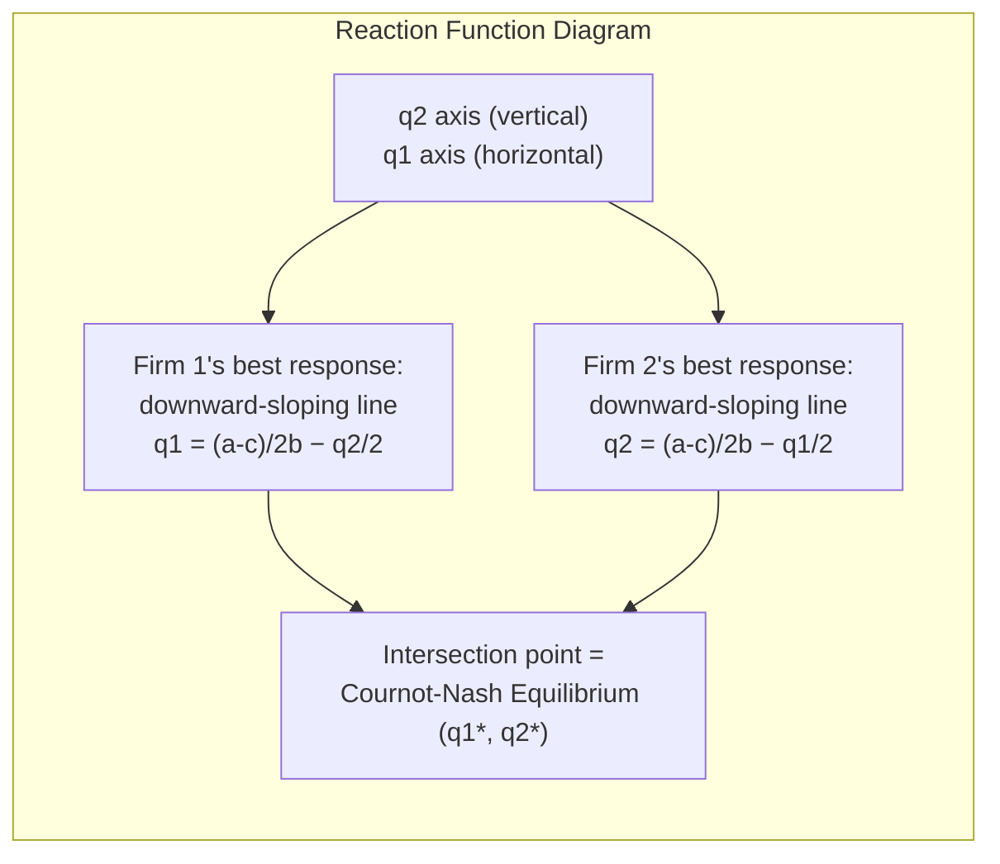

## The Cournot Model of Quantity Setting

### Overview

The Cournot model, introduced by Antoine Augustin Cournot in 1838, is the foundational framework for analyzing oligopolistic competition where firms simultaneously and independently choose **output quantities**, and the market price adjusts to clear demand given total industry output. It sits between the extremes of perfect competition (many price-taking firms) and monopoly (a single price-setting firm), and serves as the baseline model against which Bertrand (price) competition and other oligopoly structures are compared.

### Core Assumptions

**Key Points**

- Firms produce a **homogeneous good** (perfect substitutes from the consumer's perspective).
- Firms choose **quantities** simultaneously and independently (a one-shot, static game).
- The market price is determined by an **inverse demand function** $P(Q)$ applied to total output $Q = \sum_i q_i$.
- Firms have **complete information** about the demand function and (in the basic model) each other's cost functions.
- Firms are **profit-maximizers** and act **non-cooperatively** (no collusion, no binding contracts).
- Free entry is *not* assumed in the basic model — the number of firms $n$ is fixed exogenously.

### Basic Setup: Duopoly Case

Consider two firms, $i = 1, 2$, producing quantities $q_1, q_2 \ge 0$ of a homogeneous good.

**Inverse demand**:

$$P(Q) = a - bQ, \quad Q = q_1 + q_2$$

where $a > 0$ is the demand intercept and $b > 0$ is the slope parameter.

**Cost functions** (linear, for the baseline case):

$$C_i(q_i) = c_i q_i, \quad i = 1, 2$$

where $c_i$ is firm $i$'s constant marginal cost, with $a > c_i$ required for positive equilibrium output.

**Profit functions**:

$$\pi_i(q_i, q_j) = P(Q) q_i - C_i(q_i) = \big(a - b(q_i + q_j) - c_i\big) q_i$$

### Deriving the Best-Response (Reaction) Function

Each firm chooses $q_i$ to maximize $\pi_i$, taking the rival's quantity $q_j$ as given (the defining feature of Cournot-Nash behavior: firms react to quantities, not prices or beliefs about prices).

**First-order condition**:

$$\frac{\partial \pi_i}{\partial q_i} = a - b q_j - 2b q_i - c_i = 0$$

Solving for $q_i$:

$$q_i^{BR}(q_j) = \frac{a - c_i}{2b} - \frac{q_j}{2}$$

This is firm $i$'s **best-response function**: it is downward-sloping in $q_j$, reflecting that quantities are **strategic substitutes** in Cournot competition — an increase in the rival's output makes it optimal to reduce one's own output, because the marginal revenue from an additional unit falls as total quantity in the market rises.

**Second-order condition**: $\partial^2 \pi_i / \partial q_i^2 = -2b < 0$, confirming a profit-maximizing interior solution (given $b > 0$).

### Symmetric Cournot-Nash Equilibrium

With symmetric costs ($c_1 = c_2 = c$), solve the two best-response functions simultaneously:

$$q_1 = \frac{a-c}{2b} - \frac{q_2}{2}, \qquad q_2 = \frac{a-c}{2b} - \frac{q_1}{2}$$

By symmetry, $q_1^* = q_2^* = q^*$:

$$q^* = \frac{a-c}{2b} - \frac{q^*}{2} \;\Rightarrow\; \frac{3}{2}q^* = \frac{a-c}{2b} \;\Rightarrow\; q^* = \frac{a-c}{3b}$$

**Equilibrium aggregate quantity**:

$$Q^* = 2q^* = \frac{2(a-c)}{3b}$$

**Equilibrium price**:

$$P^* = a - bQ^* = a - \frac{2(a-c)}{3} = \frac{a + 2c}{3}$$

**Equilibrium profit per firm**:

$$\pi^* = (P^* - c)q^* = \left(\frac{a-c}{3}\right)\left(\frac{a-c}{3b}\right) = \frac{(a-c)^2}{9b}$$

### Worked Numerical Example

Let $a = 100$, $b = 1$, $c = 10$ (symmetric duopoly).

$$q^* = \frac{100-10}{3(1)} = 30 \text{ per firm}, \qquad Q^* = 60$$

$$P^* = \frac{100 + 2(10)}{3} = \frac{120}{3} = 40$$

$$\pi^* = (40-10)(30) = 900 \text{ per firm}$$

**Comparison benchmarks** (same demand/cost parameters):

| Market structure | Quantity (industry) | Price | Profit (industry) |
| --- | --- | --- | --- |
| **Monopoly** | $Q^M = \frac{a-c}{2b} = 45$ | $P^M = \frac{a+c}{2} = 55$ | $\pi^M = \frac{(a-c)^2}{4b} = 2025$ |
| **Cournot duopoly** | $Q^* = 60$ | $P^* = 40$ | $2\pi^* = 1800$ |
| **Perfect competition** | $Q^{PC} = \frac{a-c}{b} = 90$ | $P^{PC} = c = 10$ | $0$ |

This table illustrates the central qualitative result of the Cournot model: duopoly output lies strictly between the monopoly and competitive levels, and price lies strictly between the monopoly and competitive prices — Cournot competition is a genuine intermediate case.

### Graphical Representation: Reaction Functions

<svg xmlns="http://www.w3.org/2000/svg" viewBox="0 0 500 420" font-family="sans-serif">
<text x="250" y="24" text-anchor="middle" font-size="16" font-weight="bold">Cournot Reaction Functions (svg_diagram)</text>

<line x1="70" y1="360" x2="450" y2="360" stroke="#333" stroke-width="1.5" />
<line x1="70" y1="360" x2="70" y2="50" stroke="#333" stroke-width="1.5" />
<text x="460" y="365" font-size="12">q1</text>
<text x="55" y="45" font-size="12">q2</text>

<line x1="70" y1="80" x2="380" y2="360" stroke="#3b5bdb" stroke-width="2" />
<text x="385" y="358" font-size="11" fill="#3b5bdb">Firm 1 BR: q1(q2)</text>

<line x1="380" y1="80" x2="70" y2="360" stroke="#c92a2a" stroke-width="2" />
<text x="330" y="75" font-size="11" fill="#c92a2a">Firm 2 BR: q2(q1)</text>

<circle cx="225" cy="220" r="5" fill="#2b8a3e" />
<text x="235" y="215" font-size="11" font-weight="bold" fill="#2b8a3e">Cournot-Nash (q1*, q2*)</text>

<circle cx="380" cy="360" r="4" fill="#333" />
<text x="360" y="378" font-size="10">q1 = Monopoly Q</text>
<circle cx="70" cy="80" r="4" fill="#333" />
<text x="10" y="75" font-size="10">q2 = Monopoly Q</text>
</svg>

### Generalization to n Firms (Symmetric Costs)

With $n$ symmetric firms, each with marginal cost $c$, facing inverse demand $P(Q) = a - bQ$:

**Symmetric best-response** for firm $i$, given aggregate rival output $Q_{-i} = \sum_{j \ne i} q_j$:

$$q_i^{BR} = \frac{a - c - bQ_{-i}}{2b}$$

**Symmetric equilibrium**:

$$q_i^* = \frac{a-c}{(n+1)b}, \qquad Q^*_n = \frac{n(a-c)}{(n+1)b}, \qquad P^*_n = \frac{a + nc}{n+1}$$

**Key Points**

- As $n \to \infty$, $Q_n^* \to \frac{a-c}{b}$ (the perfectly competitive quantity) and $P_n^* \to c$ (price converges to marginal cost) — Cournot competition with many firms approximates the competitive outcome.
- As $n \to 1$, the formulas collapse to the monopoly solution, confirming internal consistency of the model across market structures.
- Individual firm output and profit are **strictly decreasing in $n$**, while aggregate output is **strictly increasing in $n$** and price is **strictly decreasing in $n$** — more competitors intensify competition even without any change in cost structure.

### The Lerner Index and Markup in Cournot Equilibrium

The **Lerner index** (price-cost margin) for firm $i$ in Cournot equilibrium is:

$$L_i = \frac{P - c_i}{P} = \frac{s_i}{\varepsilon}$$

where $s_i = q_i/Q$ is firm $i$'s market share and $\varepsilon = -\frac{P}{Q}\frac{\partial Q}{\partial P}$ is the market elasticity of demand (evaluated at the equilibrium). This result — that markup equals market share divided by demand elasticity — is a widely used relationship in empirical IO for inferring conduct and market power from observed shares and elasticity estimates.

**[Inference]** This exact formula assumes firms behave as Cournot competitors; if true conduct deviates (e.g., tacit collusion or more aggressive Bertrand-like behavior), using the Cournot Lerner-index formula to back out marginal costs from observed prices and shares will misstate true costs and margins — this is a standard caveat raised in the conduct-and-market-power literature (the "New Empirical Industrial Organization" identification problem).

### Cournot with Asymmetric Costs

When $c_1 \neq c_2$, the equilibrium (from the general best-response functions derived earlier) is:

$$q_1^* = \frac{a - 2c_1 + c_2}{3b}, \qquad q_2^* = \frac{a - 2c_2 + c_1}{3b}$$

**Key Points**

- The lower-cost firm produces strictly more output and earns strictly higher profit in equilibrium — cost efficiency translates directly into market share advantage.
- If the cost asymmetry is large enough, the high-cost firm's equilibrium quantity can become negative in the *unconstrained* formula, in which case the correct equilibrium involves the high-cost firm producing zero (a corner solution) and the low-cost firm acting as an unconstrained monopolist — the linear best-response formulas above are only valid in the interior region where both $q_1^*, q_2^* > 0$.

### Existence, Uniqueness, and Stability

**Key Points**

- **Existence**: for well-behaved demand and cost functions (e.g., concave revenue, convex costs), a pure-strategy Cournot-Nash equilibrium exists; this follows from applying standard fixed-point theorems (Nash's existence theorem) to the best-response correspondences, provided profit functions are quasi-concave in own quantity.
- **Uniqueness**: with linear demand and (weakly) convex costs, the equilibrium is unique because best-response functions are contractions (each has slope with absolute value less than 1 in the standard linear case, specifically slope $-1/2$).
- **Stability**: the standard **Cournot tâtonnement** (best-response dynamics, where firms sequentially or iteratively adjust toward their best response to the rival's last-period quantity) converges to the Cournot-Nash equilibrium when best-response slopes are less than 1 in absolute value, which holds for linear demand — this is a classic dynamic stability argument distinct from the static equilibrium concept itself.
- **[Inference]** With more general (non-linear) demand or cost functions, best-response functions can be non-monotonic or have slopes exceeding 1 in absolute value, in which case multiple equilibria or unstable dynamics can arise; this is well documented in the theoretical IO literature on existence and uniqueness conditions (e.g., conditions involving the "stability" of the reaction function system via the Jacobian of best responses).

### Cournot Model with General (Non-Linear) Demand and Cost

For a general inverse demand $P(Q)$ and cost functions $C_i(q_i)$, the first-order condition for firm $i$ is:

$$P(Q) + q_i P'(Q) = C_i'(q_i)$$

The left-hand side is marginal revenue; the right-hand side is marginal cost. Rearranging using the market share $s_i = q_i/Q$ and elasticity $\varepsilon = -\frac{P}{Q P'(Q)}$:

$$\frac{P(Q) - C_i'(q_i)}{P(Q)} = \frac{s_i}{\varepsilon}$$

This generalizes the Lerner index relationship derived above for the linear case and holds for any well-behaved demand system.

### Cournot vs. Bertrand: The Key Distinction

| Dimension | Cournot (quantity competition) | Bertrand (price competition) |
| --- | --- | --- |
| **Strategic variable** | Quantity $q_i$ | Price $p_i$ |
| **Best-response slope** | Negative (strategic substitutes) | Positive, homogeneous goods case (strategic complements) |
| **Equilibrium price (homogeneous, symmetric cost)** | Above marginal cost | Equals marginal cost (Bertrand paradox, with $n \geq 2$) |
| **Number of firms needed for competitive outcome** | $n \to \infty$ | Only $n = 2$ suffices under standard Bertrand assumptions |
| **Interpretation** | Capacity/output pre-committed, price adjusts | Prices set directly, consumers buy from cheapest seller |

**[Inference]** The **Kreps-Scheinkman (1983)** result is frequently cited to reconcile these two models: it shows that if firms first choose capacities (a quantity-like decision) and then compete in prices given those capacities, the subgame-perfect equilibrium outcome replicates the Cournot outcome — providing a theoretical justification for treating Cournot competition as capturing price competition under capacity constraints, though this result relies on specific rationing rule assumptions (efficient rationing) and has generated its own literature on robustness to alternative rationing rules.

### Welfare Analysis

Relative to perfect competition, Cournot equilibrium generates a **deadweight loss** because $P^* > c$ (marginal cost), meaning some units valued above marginal cost by consumers are not produced.

**Consumer surplus, producer surplus, and deadweight loss** (symmetric linear duopoly, using the earlier example with $a=100, b=1, c=10$):

$$CS^* = \frac{1}{2}(a - P^*)Q^* = \frac{1}{2}(100-40)(60) = 1800$$

$$PS^* = 2\pi^* = 1800$$

$$DWL^* = \frac{1}{2}(P^* - c)(Q^{PC} - Q^*) = \frac{1}{2}(40-10)(90-60) = 450$$

**Key Points**

- Total welfare $W^* = CS^* + PS^* = 3600$, compared to the maximum attainable (competitive) welfare of $\frac{1}{2}(100-10)(90) = 4050$.
- Welfare strictly increases with the number of Cournot competitors $n$, converging to the competitive welfare level as $n \to \infty$, consistent with the earlier convergence result for price and quantity.
- Because Cournot output lies strictly between monopoly and competitive levels, deadweight loss under Cournot duopoly is strictly smaller than under monopoly but strictly larger than zero.

### Extensions and Variants Commonly Covered Alongside the Basic Model

**Key Points**

- **Cournot with product differentiation**: relaxes the homogeneous-good assumption, introducing cross-price/quantity effects via a differentiated demand system; best responses remain downward-sloping but the degree of substitutability affects equilibrium markups.
- **Cournot with capacity constraints**: firms face upper bounds on producible quantity, relevant for linking to Kreps-Scheinkman-style capacity-then-price games.
- **Repeated Cournot games**: analyzed for tacit collusion sustainability using folk-theorem-style trigger strategies, where deviation to the static Cournot-Nash quantity serves as the punishment benchmark.
- **Cournot with free entry**: endogenizes $n$ via a zero-profit condition, connecting the model to long-run market structure and the determinants of industry concentration.
- **Stackelberg extension**: converts the simultaneous-move Cournot game into a sequential-move game (leader-follower), yielding a first-mover advantage absent in the basic simultaneous Cournot model — this is typically treated as a distinct topic building directly on Cournot best-response functions.

### Common Pitfalls and Conceptual Clarifications

**Key Points**

- Cournot firms are **not price-takers** despite the model sometimes being loosely described this way; each firm recognizes that its own output choice affects market price via the demand curve, which is precisely why $P^* > c$ in equilibrium — the price-taking assumption applies only in the limiting case $n \to \infty$.
- The best-response function assumes each firm takes the *rival's quantity*, not the rival's price or profit, as given; conflating this with Bertrand-style price-taking is a common student error.
- Equilibrium requires **mutual best responses simultaneously** — solving one firm's first-order condition alone, holding the rival's quantity at an arbitrary (non-equilibrium) value, does not yield the Cournot-Nash equilibrium; both first-order conditions must be solved jointly.
- The Cournot model's comparative statics (e.g., effect of a cost increase for one firm) must be evaluated via the full system of best responses, since a shock to one firm's marginal cost shifts that firm's best-response function and consequently changes both firms' equilibrium quantities.

### Next Steps

- **Stackelberg model of sequential quantity leadership** (first-mover advantage, backward induction)
- **Bertrand model of price competition** and the Bertrand paradox
- **Cournot model with product differentiation** (linear demand systems with substitutability parameters)
- **Cournot competition and tacit collusion** (repeated games, trigger strategies, folk theorem)
- **Kreps-Scheinkman capacity-then-price games** and the price/quantity competition reconciliation
- **Free entry and long-run Cournot equilibrium** (endogenous market structure)
- **Empirical estimation of conduct parameters** (New Empirical Industrial Organization, conjectural variations)
- **Cournot competition in Bayesian games** (private cost information — see prior chapter topic)