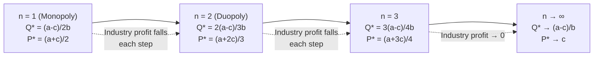

## Comparative Statics and the Effect of Firm Numbers

### Overview

Comparative statics in oligopoly quantity competition examines how equilibrium outcomes — individual output, aggregate output, price, profits, and welfare — respond to changes in exogenous parameters, most centrally the number of competing firms $n$. This analysis sits within the Cournot framework and provides the formal bridge between the polar cases of monopoly ($n=1$) and perfect competition ($n \to \infty$).

### The Symmetric Cournot Framework

**Setup**

Consider $n$ symmetric firms producing a homogeneous good, facing linear inverse demand:

$$P(Q) = a - bQ, \quad Q = \sum_{i=1}^{n} q_i$$

with constant marginal cost $c$ for each firm (where $a > c > 0$, $b > 0$), and no fixed costs.

Firm $i$ solves:

$$\max_{q_i} \; \pi_i = \left[a - b\left(q_i + \sum_{j \neq i} q_j\right)\right]q_i - c q_i$$

**First-Order Condition and Best Response**

$$\frac{\partial \pi_i}{\partial q_i} = a - c - 2bq_i - b\sum_{j \neq i} q_j = 0$$

$$q_i = \frac{a - c - bQ_{-i}}{2b}$$

This is firm $i$'s best-response function: output falls one-for-one at half the rate of rivals' combined output — the hallmark of **strategic substitutes** behavior in quantity competition.

### Symmetric Equilibrium Derivation

Imposing symmetry ($q_i = q^*$ for all $i$), aggregate output is $Q^* = nq^*$. Substituting into the best response:

$$q^* = \frac{a - c - b(n-1)q^*}{2b}$$

Solving:

$$q^*(n) = \frac{a-c}{b(n+1)}$$

$$Q^*(n) = \frac{n(a-c)}{b(n+1)}$$

$$P^*(n) = a - bQ^*(n) = \frac{a + nc}{n+1}$$

$$\pi_i^*(n) = \left[P^*(n) - c\right]q^*(n) = \frac{(a-c)^2}{b(n+1)^2}$$

$$\Pi^*(n) = n\pi_i^*(n) = \frac{n(a-c)^2}{b(n+1)^2}$$

Consumer surplus, given linear demand:

$$CS(n) = \frac{1}{2}b\left[Q^*(n)\right]^2 = \frac{n^2(a-c)^2}{2b(n+1)^2}$$

Total welfare:

$$W(n) = CS(n) + \Pi^*(n) = \frac{(a-c)^2}{2b} \cdot \frac{n(n+2)}{(n+1)^2}$$

### Comparative Statics with Respect to $n$

**Individual Output**

$$\frac{\partial q^*}{\partial n} = -\frac{a-c}{b(n+1)^2} < 0$$

Each firm's output declines monotonically as $n$ rises — more rivals mean a smaller residual demand share for any single firm.

**Aggregate Output**

$$\frac{\partial Q^*}{\partial n} = \frac{a-c}{b(n+1)^2} > 0$$

Aggregate output rises monotonically in $n$, though at a diminishing rate ($\partial^2 Q^*/\partial n^2 < 0$). Total quantity is concave and increasing in the number of firms — each additional entrant adds less to total output than the previous one, since existing incumbents contract in response.

**Price**

$$\frac{\partial P^*}{\partial n} = -\frac{a-c}{(n+1)^2} < 0$$

Price falls monotonically in $n$, converging toward marginal cost:

$$\lim_{n \to \infty} P^*(n) = c$$

**Individual Profit**

$$\frac{\partial \pi_i^*}{\partial n} = -\frac{2(a-c)^2}{b(n+1)^3} < 0$$

Per-firm profit declines steeply (at a faster rate than output or price) because entry both shrinks each firm's quantity and compresses the margin $P^*-c$ simultaneously.

**Industry Profit**

$$\frac{\partial \Pi^*}{\partial n} = \frac{(a-c)^2}{b} \cdot \frac{(1-n)}{(n+1)^3}$$

This is **negative for all $n > 1$**. Remarkably, total industry profit is maximized at the monopoly outcome ($n=1$) and *falls* with every additional entrant thereafter. This reflects a business-stealing externality: each entrant's private gain from entering is smaller than the reduction its entry imposes on incumbents, so aggregate industry profit is dissipated as $n$ grows.

**Consumer Surplus and Welfare**

$$\frac{\partial CS}{\partial n} = \frac{(a-c)^2}{b} \cdot \frac{n}{(n+1)^3} > 0$$

$$\frac{\partial W}{\partial n} = \frac{(a-c)^2}{2b} \cdot \frac{n+2-n(n+2)\cdot 2/(n+1) \cdot \dots}{(n+1)^3}$$

Simplifying directly from $W(n)$, one obtains:

$$\frac{\partial W}{\partial n} = \frac{(a-c)^2}{2b(n+1)^3} > 0$$

Total welfare is strictly increasing in $n$: the consumer-surplus gain from lower prices and higher output always outweighs the loss in industry profit. This is the standard efficiency argument for encouraging entry/deconcentration, though it abstracts from fixed entry costs (see Limitations below).

### Summary Table of Directional Effects

| Variable | Symbol | Sign of $\partial(\cdot)/\partial n$ | Limiting value as $n \to \infty$ |
| --- | --- | --- | --- |
| Individual output | $q^*$ | Negative | $0$ |
| Aggregate output | $Q^*$ | Positive (concave) | $(a-c)/b$ (competitive level) |
| Price | $P^*$ | Negative | $c$ (marginal cost) |
| Individual profit | $\pi_i^*$ | Negative | $0$ |
| Industry profit | $\Pi^*$ | Negative (for $n>1$) | $0$ |
| Consumer surplus | $CS$ | Positive | $(a-c)^2/(2b)$ |
| Total welfare | $W$ | Positive | Efficient/competitive welfare |

### Convergence to the Competitive Benchmark

As $n \to \infty$:

$$Q^*(n) \to \frac{a-c}{b}, \qquad P^*(n) \to c$$

This matches the perfectly competitive outcome where price equals marginal cost. The **deadweight loss** relative to the competitive benchmark shrinks continuously:

$$DWL(n) = \frac{1}{2}\left[Q^{comp} - Q^*(n)\right]\left[P^*(n) - c\right] = \frac{(a-c)^2}{2b(n+1)^2}$$

$DWL(n) \to 0$ as $n \to \infty$, formalizing the intuition that Cournot competition with many small firms approximates the competitive ideal. At $n=1$, $DWL$ recovers the standard monopoly deadweight loss $(a-c)^2/(8b)$... verify by substitution: $DWL(1) = (a-c)^2/(2b \cdot 4) = (a-c)^2/(8b)$, consistent with the textbook monopoly formula.

### The Herfindahl-Hirschman Index (HHI) Link

For $n$ symmetric firms, each has market share $s_i = 1/n$, so:

$$HHI = \sum_{i=1}^n s_i^2 = n \cdot \frac{1}{n^2} = \frac{1}{n}$$

Combined with the equilibrium markup, this generates the **Cournot markup-concentration relationship**. Firm $i$'s Lerner index is:

$$L_i = \frac{P - c}{P} = \frac{s_i}{\varepsilon}$$

where $\varepsilon$ is market demand elasticity. Averaging across symmetric firms and weighting by market share yields the aggregate result:

$$\frac{P-c}{P} = \frac{HHI}{\varepsilon}$$

This is a foundational result linking industry concentration (as measured by HHI) directly to the average price-cost markup, and it underlies much of empirical industrial organization's use of concentration indices as (imperfect) proxies for market power. As $n$ rises, $HHI = 1/n$ falls, and so does the equilibrium markup — consistent with the price comparative static derived above.

### Diagram: Best-Response Shifts as $n$ Increases (Two-Firm Illustration Generalized)

### SVG Illustration: Aggregate Output, Price, and Profit vs. Number of Firms (svg_diagram)

<svg xmlns="http://www.w3.org/2000/svg" viewBox="0 0 720 460" font-family="Arial, sans-serif">
<text x="360" y="28" text-anchor="middle" font-size="18" font-weight="bold">Comparative Statics vs. n (svg_diagram)</text>

<line x1="70" y1="400" x2="680" y2="400" stroke="#333" stroke-width="2" />
<line x1="70" y1="60" x2="70" y2="400" stroke="#333" stroke-width="2" />
<text x="375" y="430" text-anchor="middle" font-size="13">Number of firms (n)</text>
<text x="30" y="230" text-anchor="middle" font-size="13" transform="rotate(-90 30 230)">Normalized value</text>

<polyline points="70,340 130,270 190,225 250,195 310,175 370,160 430,148 490,140 550,133 610,128 670,124" fill="none" stroke="`#2563eb`" stroke-width="3" />

<text x="600" y="115" font-size="12" fill="`#2563eb`" font-weight="bold">Q*(n)</text>

<polyline points="70,80 130,140 190,180 250,208 310,228 370,243 430,255 490,264 550,271 610,277 670,281" fill="none" stroke="`#dc2626`" stroke-width="3" />

<text x="600" y="295" font-size="12" fill="`#dc2626`" font-weight="bold">P*(n)</text>

<polyline points="70,150 130,220 190,270 250,305 310,328 370,344 430,356 490,364 550,371 610,376 670,380" fill="none" stroke="`#16a34a`" stroke-width="3" />

<text x="600" y="392" font-size="12" fill="`#16a34a`" font-weight="bold">Π*(n)</text>

<line x1="70" y1="285" x2="670" y2="285" stroke="#999" stroke-dasharray="4,4" stroke-width="1" />
<text x="80" y="280" font-size="11" fill="#666">c (marginal cost floor)</text>

<line x1="70" y1="60" x2="70" y2="400" stroke="#bbb" stroke-dasharray="2,2" />
<text x="72" y="415" font-size="11">n=1</text>
<text x="660" y="415" font-size="11">n large</text>
</svg>

### Worked Numerical Example

Let $a = 100$, $b = 1$, $c = 10$, so $a - c = 90$.

| $n$ | $q^*$ | $Q^*$ | $P^*$ | $\pi_i^*$ | $\Pi^*$ | $CS$ |
| --- | --- | --- | --- | --- | --- | --- |
| 1 | 45.00 | 45.00 | 55.00 | 2025.00 | 2025.00 | 1012.50 |
| 2 | 30.00 | 60.00 | 40.00 | 900.00 | 1800.00 | 1800.00 |
| 3 | 22.50 | 67.50 | 32.50 | 506.25 | 1518.75 | 2278.13 |
| 4 | 18.00 | 72.00 | 28.00 | 324.00 | 1296.00 | 2592.00 |
| 5 | 15.00 | 75.00 | 25.00 | 225.00 | 1125.00 | 2812.50 |
| 10 | 8.18 | 81.82 | 18.18 | 66.94 | 669.42 | 3347.11 |
| 50 | 1.76 | 88.24 | 11.76 | 3.11 | 155.67 | 3892.03 |

**Key Points**

- $Q^*$ rises but with sharply diminishing increments (45 → 60 → 67.5 → 72 → 75), consistent with concavity.
- $\Pi^*$ falls monotonically from the monopoly level of 2025 onward — confirming that industry profit peaks at $n=1$.
- $P^*$ falls toward $c=10$ but never reaches it for finite $n$.
- $CS$ rises and eventually dominates the welfare calculation as $n$ grows, since profit erosion is outweighed by consumer gains.

### Extensions and Generalizations

**Asymmetric Costs**

When firms have heterogeneous marginal costs $c_i$, the comparative-static logic generalizes: aggregate output still rises and price still falls with entry of an additional (efficient enough) firm, but low-cost incumbents absorb less demand contraction than high-cost incumbents. Entry by a high-cost firm can, in some cases, be Pareto-worsening for consumers relative to entry by a low-cost firm at the same $n$, since aggregate output gains are smaller.

**Non-linear (General) Demand**

For general inverse demand $P(Q)$ and cost $C(q_i)$, the sign of $\partial Q^*/\partial n > 0$ and $\partial P^*/\partial n < 0$ continues to hold under the standard stability conditions (downward-sloping, not-too-convex demand; the Seade conditions ensuring the reaction functions are downward sloping and equilibrium is stable). [Inference] The exact magnitude and curvature of these comparative statics are demand-form dependent, but the qualitative direction — more entrants raise output and lower price under standard regularity conditions — is a general Cournot result, not an artifact of the linear-demand/constant-cost example.

**Free Entry and Endogenous $n$**

If entry requires a fixed cost $F$, the free-entry (zero-profit) number of firms $n^e$ solves $\pi_i^*(n^e) = F$. Because $\Pi^*(n)$ is falling in $n$ while $\pi_i^*(n)$ falls even faster, there exists a finite equilibrium $n^e$ where entry stops. A classical result (Mankiw–Whinston, 1986) shows that free entry tends to generate **excessive entry** relative to the social optimum whenever products are homogeneous and firms are symmetric — because entering firms do not internalize the business-stealing effect on incumbents (already visible in $\partial \Pi^*/\partial n < 0$ above), even though the same entry raises total welfare $W(n)$ up to a point.

**Cournot vs. Bertrand Contrast**

In Bertrand price competition with homogeneous goods and no capacity constraints, price collapses to marginal cost as soon as $n=2$ (the "Bertrand paradox"), so the smooth comparative statics in $n$ characteristic of Cournot are specific to the quantity-setting protocol. This contrast is a standard illustration of why the choice of strategic variable (price vs. quantity) matters for how competitive intensity scales with the number of firms.

### Limitations and Caveats

- The clean monotonic comparative statics above rely on linear demand and constant marginal cost; [Inference] with strongly convex demand or increasing marginal cost, reaction functions can become upward-sloping in some regions, and standard comparative-statics signs may not hold without imposing stability conditions explicitly.
- The model assumes homogeneous products and simultaneous, one-shot quantity choice; the results do not directly describe repeated-game (collusive) settings, where more firms can instead make collusion harder to sustain, an entirely separate comparative static.
- Behavior described here reflects the standard theoretical Cournot–Nash equilibrium; **empirical behavior may vary** depending on capacity constraints, product differentiation, conjectural variations, or dynamic entry deterrence not captured in the static model.

**Related Topics**

- Monopoly and duopoly as boundary cases of Cournot competition
- Stackelberg leader-follower quantity competition
- Cournot with product differentiation and asymmetric costs
- Free entry, excess entry, and the Mankiw–Whinston welfare theorem
- Herfindahl-Hirschman Index and empirical concentration-markup studies
- Bertrand competition and the Bertrand-Cournot comparison
- Conjectural variations models and consistent conjectures
- Welfare analysis and deadweight loss in imperfect competition