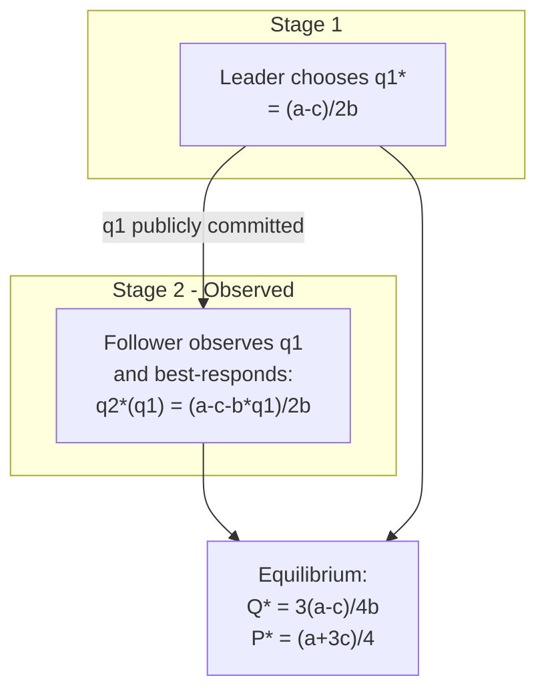

## The Stackelberg Leader-Follower Extension

### Overview

The Stackelberg model extends Cournot quantity competition by introducing **sequential moves**: one firm (the leader) commits to an output level first, and the remaining firm(s) (the followers) observe this commitment and then choose their own outputs. This timing asymmetry — rather than any cost or product asymmetry — is the sole structural difference from simultaneous Cournot competition, and it produces materially different equilibrium outcomes, most notably a **first-mover advantage**.

### Game Structure

**Timing**

1. **Stage 1:** The leader (firm 1) chooses quantity $q_1 \geq 0$.
2. **Stage 2:** The follower (firm 2) observes $q_1$ and chooses $q_2 \geq 0$ to maximize its own profit given $q_1$.

**Solution Concept**

Because the game is sequential with observed actions, the appropriate equilibrium concept is **Subgame Perfect Nash Equilibrium (SPNE)**, solved by **backward induction**: first derive the follower's best response as a function of any $q_1$, then substitute this response into the leader's problem to find the optimal $q_1$.

### Backward Induction Derivation (Linear Demand, Symmetric Costs)

**Setup**

Inverse demand: $P(Q) = a - bQ$, $Q = q_1 + q_2$. Constant marginal cost $c$ for both firms, $a > c > 0$.

**Stage 2: Follower's Problem**

Taking $q_1$ as given, firm 2 maximizes:

$$\max_{q_2} \; \pi_2 = \left[a - b(q_1+q_2) - c\right]q_2$$

First-order condition:

$$a - c - bq_1 - 2bq_2 = 0 \implies q_2^*(q_1) = \frac{a-c-bq_1}{2b}$$

This is identical to the standard Cournot best-response function — the follower behaves exactly as it would in simultaneous Cournot, conditional on observing $q_1$.

**Stage 1: Leader's Problem**

The leader anticipates the follower's reaction function and internalizes it directly into its own maximization:

$$\max_{q_1} \; \pi_1 = \left[a - b\left(q_1 + q_2^*(q_1)\right) - c\right]q_1$$

Substituting $q_2^*(q_1)$:

$$\pi_1 = \left[a - b q_1 - b\cdot\frac{a-c-bq_1}{2b} - c\right]q_1 = \left[\frac{a-c-bq_1}{2}\right]q_1$$

First-order condition:

$$\frac{a-c}{2} - bq_1 = 0 \implies q_1^* = \frac{a-c}{2b}$$

**Equilibrium Quantities**

$$q_1^* = \frac{a-c}{2b} \quad \text{(leader)}$$

$$q_2^* = \frac{a-c-bq_1^*}{2b} = \frac{a-c}{4b} \quad \text{(follower)}$$

The leader produces **exactly twice** the follower's output — a clean and often-cited feature of the linear-demand Stackelberg model.

**Aggregate Output, Price, Profits**

$$Q^* = q_1^* + q_2^* = \frac{3(a-c)}{4b}$$

$$P^* = a - bQ^* = \frac{a+3c}{4}$$

$$\pi_1^* = \left[P^*-c\right]q_1^* = \frac{(a-c)^2}{8b}$$

$$\pi_2^* = \left[P^*-c\right]q_2^* = \frac{(a-c)^2}{16b}$$

$$\Pi^* = \pi_1^* + \pi_2^* = \frac{3(a-c)^2}{16b}$$

### Comparison with Simultaneous Cournot Duopoly

Recall the symmetric Cournot duopoly outcome (from the general $n$-firm formulas with $n=2$):

$$q_i^{Cournot} = \frac{a-c}{3b}, \quad Q^{Cournot} = \frac{2(a-c)}{3b}, \quad P^{Cournot} = \frac{a+2c}{3}, \quad \pi_i^{Cournot} = \frac{(a-c)^2}{9b}$$

| Variable | Cournot (simultaneous) | Stackelberg leader | Stackelberg follower |
| --- | --- | --- | --- |
| Own output | $(a-c)/3b$ | $(a-c)/2b$ | $(a-c)/4b$ |
| Own profit | $(a-c)^2/9b$ | $(a-c)^2/8b$ | $(a-c)^2/16b$ |
| Aggregate output | $2(a-c)/3b$ | \multicolumn{2}{c}{$3(a-c)/4b$} |  |
| Price | $(a+2c)/3$ | \multicolumn{2}{c}{$(a+3c)/4$} |  |

**Key Points**

- **First-mover advantage:** $\pi_1^* = (a-c)^2/8b > \pi_i^{Cournot} = (a-c)^2/9b$. The leader strictly gains from moving first and committing.
- **Second-mover disadvantage:** $\pi_2^* = (a-c)^2/16b < \pi_i^{Cournot} = (a-c)^2/9b$. The follower is strictly worse off than under simultaneous competition.
- **Total industry output rises:** $3(a-c)/4b > 2(a-c)/3b$ (since $3/4 > 2/3$), so Stackelberg output is closer to the competitive benchmark than Cournot output.
- **Price falls relative to Cournot:** $(a+3c)/4 < (a+2c)/3$ for $a > c$, meaning consumers benefit from the sequential structure.
- **Total industry profit is lower than Cournot's:** $\Pi^{Stackelberg} = 3(a-c)^2/16b$ versus $\Pi^{Cournot} = 2(a-c)^2/9b$. Numerically, $3/16 = 0.1875 < 2/9 \approx 0.2222$, so joint industry profit falls when firms move sequentially rather than simultaneously — the leader's gain is more than offset by the follower's loss.

### Why Commitment Creates an Advantage: The Strategic Logic

The mechanism relies entirely on the fact that quantities are **strategic substitutes** — the follower's best-response function $q_2^*(q_1)$ is downward-sloping, i.e., $q_2$ falls when $q_1$ rises. The leader exploits this by **committing to a large output**, which forces the follower's optimal response to contract. Because $q_1$ is chosen first and is unobservable-reversible only at cost, the leader's commitment is credible; the follower has no choice but to best-respond to the observed (already-produced or contractually fixed) quantity.

This is the seminal application of Fudenberg and Tirole's contrasted business-strategy classification: the Stackelberg leader is a "**top dog**" who benefits from being *tough* (aggressive output expansion) precisely because the follower's reaction function is downward sloping. Formally, the leader's profit-maximization problem incorporates the follower's reaction function directly:

$$\frac{d\pi_1}{dq_1} = \frac{\partial \pi_1}{\partial q_1} + \frac{\partial \pi_1}{\partial q_2}\cdot\frac{dq_2^*}{dq_1}$$

The second (strategic) term is negative (since $\partial \pi_1/\partial q_2 < 0$ and $dq_2^*/dq_1 < 0$, their product is positive) — wait, evaluated carefully: $\partial \pi_1/\partial q_2 < 0$ (more rival output hurts the leader) and $dq_2^*/dq_1 < 0$ (follower contracts as leader expands), so the product $\left(\partial \pi_1/\partial q_2\right)\cdot\left(dq_2^*/dq_1\right) > 0$. This positive strategic term is exactly what induces the leader to expand output beyond its simultaneous-game best response — it is profitable to overproduce relative to Cournot because doing so shrinks the rival's output.

### Reaction Function Diagram

### SVG: Stackelberg Equilibrium on the Reaction Function Diagram (svg_diagram)

<svg xmlns="http://www.w3.org/2000/svg" viewBox="0 0 640 520" font-family="Arial, sans-serif">
<text x="320" y="26" text-anchor="middle" font-size="17" font-weight="bold">Stackelberg vs. Cournot Equilibrium (svg_diagram)</text>

<line x1="80" y1="460" x2="580" y2="460" stroke="#333" stroke-width="2" />
<line x1="80" y1="60" x2="80" y2="460" stroke="#333" stroke-width="2" />
<text x="330" y="490" text-anchor="middle" font-size="13">q1 (leader/firm 1 output)</text>
<text x="35" y="260" text-anchor="middle" font-size="13" transform="rotate(-90 35 260)">q2 (follower/firm 2 output)</text>

<line x1="80" y1="140" x2="480" y2="460" stroke="#dc2626" stroke-width="2.5" />
<text x="180" y="180" font-size="12" fill="#dc2626" font-weight="bold">Firm 2 reaction: q2*(q1)</text>

<line x1="80" y1="460" x2="360" y2="80" stroke="#2563eb" stroke-width="2.5" />
<text x="300" y="120" font-size="12" fill="#2563eb" font-weight="bold">Firm 1 reaction: q1*(q2)</text>

<circle cx="228" cy="298" r="6" fill="#16a34a" />
<text x="238" y="295" font-size="12" fill="#16a34a" font-weight="bold">Cournot NE</text>
<text x="238" y="310" font-size="11" fill="#16a34a">((a-c)/3b, (a-c)/3b)</text>

<circle cx="320" cy="230" r="6" fill="#7c3aed" />
<text x="330" y="228" font-size="12" fill="#7c3aed" font-weight="bold">Stackelberg SPNE</text>
<text x="330" y="243" font-size="11" fill="#7c3aed">((a-c)/2b, (a-c)/4b)</text>

<path d="M 200 460 Q 320 150 480 260" fill="none" stroke="#7c3aed" stroke-width="1.5" stroke-dasharray="5,3" />
<text x="420" y="255" font-size="11" fill="#7c3aed">Leader's isoprofit curve</text>

<line x1="228" y1="298" x2="320" y2="230" stroke="#555" stroke-width="1" stroke-dasharray="2,2" marker-end="url(#arrow)" />
<text x="235" y="255" font-size="10" fill="#555">leader moves along</text>
<text x="235" y="267" font-size="10" fill="#555">follower's RF to reach tangency</text>
</svg>

### Multiple Followers: $n$-Firm Stackelberg

**One Leader, $m$ Symmetric Followers**

With one leader and $m$ identical Cournot-competing followers (who move simultaneously with each other after observing the leader), each follower's reaction function accounts for the leader's output and the other $m-1$ followers' aggregate output. Solving by backward induction:

$$q_1^* = \frac{a-c}{2b}, \qquad q_f^* = \frac{a-c}{2b(m+1)}$$

$$Q^* = \frac{a-c}{2b}\left[1 + \frac{m}{m+1}\right]$$

As $m \to \infty$, follower aggregate output approaches $(a-c)/(2b)$, so total output approaches $(a-c)/b$ — the competitive level — with the leader retaining a permanently fixed share $(a-c)/2b$, i.e., the leader continues to earn positive profit in the limit while follower margins are driven to zero. [Inference] This is a standard extension result; exact convergence rates depend on the specific demand and cost functional forms assumed.

**Stackelberg Warfare / Multiple Leaders**

If two or more firms simultaneously attempt to act as leaders (each believing the others are followers), the resulting output choices are typically inconsistent with rational expectations, and the outcome is not a well-defined equilibrium under the stated timing — this scenario ("Stackelberg warfare" or "disequilibrium") typically results in output above the Stackelberg-leader level, driving profits toward the competitive outcome or below for at least one party, since aggregate output exceeds what any consistent equilibrium concept would support. This underscores the strategic value of resolving leadership through observable, credible commitment devices (capacity investment, sunk costs, public announcements) rather than simply assuming a leadership role.

### Endogenizing the Leadership Role

Standard extensions ask: why would a firm become the leader rather than the follower? Given the profit ranking $\pi_1^* > \pi_i^{Cournot} > \pi_2^*$, if firms can freely choose their timing, being the leader is the dominant choice, and models such as **Hamilton and Slutsky's (1990) "extended game with action commitment"** show that when firms simultaneously choose whether to move early or late, the unique outcome (under certain equilibrium refinements) sees one firm move early and the other move late — recovering the sequential Stackelberg equilibrium endogenously from a game with initially symmetric timing options. [Inference] Different refinements or extensions (e.g., allowing simultaneous "early" moves by both firms) can generate multiple equilibria, including a reversion to the simultaneous Cournot outcome, so the specific way commitment options are modeled affects which outcome is selected.

### Requirements for Credible Leadership

For the Stackelberg outcome to be sustained as a genuine SPNE (rather than merely a hypothesized order of play), the leader's first-stage commitment must be:

1. **Observable** — the follower must be able to verify $q_1$ before choosing $q_2$.
2. **Irreversible or costly to reverse** — otherwise the leader could not credibly commit, and the follower would rationally ignore the announced $q_1$, collapsing the game back to simultaneous Cournot (a phenomenon informally called the "commitment must bite" requirement).

In practice, commitment is typically achieved through irreversible capacity investment, long-term supply contracts, or being a first-mover into a market before competitors are technologically or logistically able to enter.

### Worked Numerical Example

Let $a = 100$, $b = 1$, $c = 10$ (identical to the Cournot $n$-firm example for direct comparison).

| Regime | $q_1$ | $q_2$ | $Q$ | $P$ | $\pi_1$ | $\pi_2$ | $\Pi_{total}$ |
| --- | --- | --- | --- | --- | --- | --- | --- |
| Cournot ($n=2$) | 30.00 | 30.00 | 60.00 | 40.00 | 900.00 | 900.00 | 1800.00 |
| Stackelberg | 45.00 | 22.50 | 67.50 | 32.50 | 1012.50 | 506.25 | 1518.75 |

**Example**

Verification of the leader's profit: $\pi_1 = (P^*-c)q_1^* = (32.50-10)(45.00) = 22.50 \times 45.00 = 1012.50$. This exceeds the Cournot profit of 900.00, confirming the first-mover advantage numerically. Note also that this Stackelberg output/price pair is identical to the $n=3$ symmetric Cournot outcome computed in the prior comparative-statics table ($Q=67.50$, $P=32.50$) — a coincidence of the linear-demand parameterization reflecting that Stackelberg leadership with one follower produces the same aggregate output as three-firm simultaneous Cournot, though individual firm profits differ substantially between the two regimes.

### Extensions to Cost Asymmetry and Capacity

**Asymmetric Marginal Costs**

If the leader has cost $c_1$ and follower has cost $c_2 \neq c_1$, the same backward-induction method applies but the algebra no longer yields the clean 2:1 output ratio; the leader's output advantage interacts with any pre-existing cost advantage or disadvantage. [Inference] A sufficiently large cost disadvantage for the leader can, in principle, offset or dominate the first-mover strategic advantage, though the precise threshold is parameter-dependent and not derivable from the symmetric-cost formulas above.

**Capacity-Constrained Followers**

If the follower faces a binding capacity constraint $\bar q_2 < q_2^*(q_1^{Cournot})$, the leader may find it optimal to produce even more aggressively than the unconstrained Stackelberg quantity, since the follower's ability to punish leader overproduction is capped by capacity. This connects Stackelberg analysis to entry-deterrence models (e.g., Dixit's capacity-based entry deterrence).

### Relationship to Entry Deterrence and Limit Pricing

The Stackelberg framework is the formal foundation for **entry deterrence models**: an incumbent (leader) can strategically overproduce or overinvest in capacity specifically to induce a smaller equilibrium output — and hence lower profit or complete non-entry — from a potential entrant (follower). This differs from the basic Stackelberg model chiefly in that the leader's objective explicitly includes deterring entry, sometimes requiring output above the standard $\left(a-c\right)/2b$ leader quantity if deterrence (rather than mere accommodation) is optimal.

### Limitations and Caveats

- The results above are algebraically exact only under linear demand and constant, symmetric marginal cost; [Inference] under general demand and cost functions, the qualitative ranking $\pi_1^* > \pi^{Cournot} > \pi_2^*$ is a standard result under regularity conditions ensuring downward-sloping, stable reaction functions, but is not universal — cases with strongly convex demand can in principle overturn the ranking.
- The model assumes perfect and complete information (the follower observes $q_1$ with certainty); with imperfect observability of the leader's quantity, the strategic advantage of moving first can be eroded or eliminated.
- **Behavior in applied settings may vary** from the theoretical predictions due to capacity constraints, inventory considerations, repeated interaction, or the possibility of tacit collusion between "leader" and "follower" roles not captured in the static one-shot game.

**Related Topics**

- Cournot equilibrium and its comparative statics (baseline for comparison)
- Strategic substitutes vs. strategic complements (Bulow, Geanakoplos, Klemperer taxonomy)
- Hamilton–Slutsky endogenous timing games
- Entry deterrence and limit pricing (Dixit capacity model)
- Fudenberg–Tirole business strategy taxonomy (top dog, puppy dog, fat cat, lean and hungry look)
- First-mover advantage in general extensive-form games
- Stackelberg equilibrium with product differentiation
- Von Stackelberg's original 1934 contribution and historical context