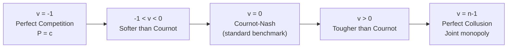

## Capacity Constraints and Conjectural Variations

### Overview

This item covers two distinct but related extensions to standard Cournot quantity competition. **Capacity constraints** examine how binding upper bounds on production affect firms' strategic behavior and can serve as a foundation for price competition outcomes (Kreps-Scheinkman). **Conjectural variations** is a reduced-form modeling device that parameterizes a firm's belief about how rivals will respond to its own output changes, nesting Cournot, perfect competition, and collusion as special cases within a single continuous parameter.

### Part I: Capacity Constraints

**Motivation**

The basic Cournot model implicitly assumes firms can produce any quantity at constant marginal cost $c$ up to demand. In practice, firms face **capacity limits** $\bar q_i$ — physical, technological, or contractual ceilings on output — which can bind in equilibrium and alter both individual firm behavior and market outcomes.

**Formal Setup**

Firm $i$ maximizes profit subject to:

$$0 \leq q_i \leq \bar q_i$$

The Lagrangian for firm $i$'s problem:

$$\mathcal{L}_i = \left[P(Q) - c\right]q_i - \mu_i(q_i - \bar q_i)$$

where $\mu_i \geq 0$ is the multiplier on the capacity constraint. The Kuhn-Tucker conditions yield:

$$\frac{\partial \pi_i}{\partial q_i} = \mu_i \geq 0, \qquad \mu_i(q_i - \bar q_i) = 0$$

If the unconstrained Cournot best response $q_i^{Cournot}$ exceeds $\bar q_i$, the constraint binds: $q_i^* = \bar q_i$, and $\mu_i > 0$ measures the shadow value of relaxing capacity — economically, the marginal profit the firm forgoes by being capacity-constrained.

**Effect on Rivals' Best Responses**

When firm $i$'s capacity binds, its output is fixed at $\bar q_i$ regardless of firm $j$'s choice. This has an important strategic implication: firm $j$'s best response function is computed treating $q_i = \bar q_i$ as a fixed parameter rather than a variable that reacts to $q_j$. In effect, a capacity-constrained rival becomes strategically "passive" — it cannot retaliate against output expansion by unconstrained rivals, which changes the comparative statics relative to the unconstrained Cournot benchmark.

**Worked Example: Binding Capacity for One Firm**

Let $P(Q) = a - bQ$, marginal cost $c$ for both firms, and firm 1 faces a binding capacity constraint $\bar q_1 < q_1^{Cournot} = (a-c)/(3b)$.

Firm 1 produces $q_1^* = \bar q_1$ (capacity-bound). Firm 2, observing (or correctly anticipating) that firm 1 is capacity-constrained, best-responds to the fixed quantity $\bar q_1$:

$$q_2^* = \frac{a-c-b\bar q_1}{2b}$$

Since $\bar q_1 < (a-c)/(3b)$, it follows that $q_2^* > (a-c)/(3b) = q_2^{Cournot}$ — the unconstrained firm expands output to partially offset the capacity-constrained rival's shortfall. This is the standard **residual-demand response**: firm 2 essentially faces demand $P(q_1+q_2)$ with $q_1$ fixed, equivalent to being a monopolist on the residual demand curve $a - b\bar q_1 - bq_2$.

**Key Points**

- A binding capacity constraint converts the constrained firm into a passive quantity-setter from its rivals' perspective.
- Unconstrained rivals expand output above their unconstrained-Cournot level in response, partially — but not fully — offsetting the capacity-constrained firm's shortfall (since demand is downward-sloping, the price effect limits how much rivals wish to expand).
- Aggregate output $Q^*$ under capacity constraints is generally lower than the unconstrained Cournot aggregate $Q^{Cournot}$, and price is correspondingly higher, because rival expansion only partially compensates for the binding firm's shortfall.

### Kreps-Scheinkman: Capacity Then Price

**The Key Result**

A canonical result, formalized by Kreps and Scheinkman (1983), shows that a **two-stage game** — firms first simultaneously choose capacity (which becomes marginal cost up to that level, effectively infinite beyond it), then simultaneously compete in **prices** (Bertrand-style) given those capacities, with efficient rationing — has a unique subgame-perfect equilibrium that **replicates the Cournot outcome**.

**Intuition**

This result is significant because it reconciles the two dominant modes of oligopoly modeling: Cournot's quantity competition (often criticized as an unrealistic description of firm behavior, since firms typically set prices, not quantities) and Bertrand's price competition (which famously predicts marginal-cost pricing even with only two firms, seemingly at odds with observed markups). Kreps-Scheinkman shows that if capacity decisions precede price competition, the capacity-then-price game generates the **same equilibrium quantities and prices as the simultaneous Cournot game** — providing microfoundations for treating "Cournot quantities" as capacity choices rather than literal output commitments, even though firms are actually competing on price in the final stage.

**Mechanism**

1. **Stage 2 (price competition given capacities):** With efficient rationing, if both firms set the same price, demand is split according to a rationing rule; if one firm undercuts, it sells up to its capacity at the lower price, and the rival serves the residual demand at its own price.
2. **Anticipating stage 2 outcomes:** Firms recognize that if they build capacity as in the Cournot solution, aggressive price undercutting is unprofitable — a firm cannot serve more than its own capacity even by cutting price, so the incentive to undercut is capped.
3. **Stage 1 (capacity choice):** Anticipating the stage-2 pricing subgame, capacity choices converge to exactly the Cournot quantities, because any capacity deviation from the Cournot level is unprofitable once the equilibrium of the pricing subgame is correctly anticipated.

**Caveat on Rationing Rules**

[Inference] The Kreps-Scheinkman equivalence result depends critically on the assumed rationing rule (how unmet demand at the low-price firm is allocated to the high-price firm). Under the standard "efficient rationing" assumption (consumers with the highest willingness to pay are served first), the Cournot-replication result holds; under alternative rationing rules (e.g., proportional rationing), the equilibrium of the capacity-price game can diverge from the Cournot outcome. This sensitivity to rationing assumptions is a well-documented qualification in the literature rather than a settled universal result.

### Part II: Conjectural Variations

**Motivation and Definition**

The conjectural variations (CV) approach generalizes the Cournot assumption that rivals hold output fixed ($\partial q_j/\partial q_i = 0$) by allowing firm $i$ to hold a **belief (conjecture)** about how rival $j$ will adjust output in response to a change in firm $i$'s own output:

$$v_i \equiv \frac{\partial q_j}{\partial q_i}\bigg|_{conjectured}$$

This conjecture $v_i$ is not derived from an explicit dynamic game in the basic CV framework but is instead imposed as a parameter — this is the model's central methodological weakness (see Limitations below), but also its analytical convenience, since it permits nesting a continuum of competitive intensities within one first-order condition.

**Modified First-Order Condition**

For symmetric firms with inverse demand $P(Q)$ and marginal cost $c$, firm $i$'s profit is $\pi_i = P(Q)q_i - cq_i$, and the first-order condition incorporating the conjecture becomes:

$$\frac{d\pi_i}{dq_i} = P(Q) + q_i P'(Q)\left(1 + v_i\right) - c = 0$$

where $(1+v_i)$ captures the total effect on aggregate output $Q$ from a unit increase in $q_i$: the direct effect (1) plus the conjectured rival response ($v_i$).

**Symmetric Equilibrium with Linear Demand**

With $P(Q) = a - bQ$ and symmetric conjecture $v$ across all $n$ symmetric firms:

$$a - bQ - bq_i(1+v) - c = 0$$

Imposing symmetry ($q_i = Q/n$):

$$q^*(v) = \frac{a-c}{b\left[n + (1+v)\right]}$$

$$Q^*(v) = \frac{n(a-c)}{b\left[n+1+v\right]}$$

$$P^*(v) = a - bQ^*(v) = \frac{a\left[n+1+v\right] - n(a-c)}{n+1+v}$$

Simplifying:

$$P^*(v) = \frac{a(1+v) + nc}{n+1+v}$$

### Special Cases Nested by the Conjectural Variations Parameter

| Conjecture $v$ | Interpretation | Resulting Equilibrium |
| --- | --- | --- |
| $v = 0$ | Cournot-Nash (standard) | Standard Cournot outcome with $n$ firms |
| $v = -1$ | Perfect competition | $P^* \to c$; each firm believes rivals fully offset its expansion, eliminating market power |
| $v = n-1$ | Perfect collusion (joint monopoly) | Firms internalize the full effect of $q_i$ on aggregate output as if a single decision-maker |
| $-1 < v < 0$ | "Softer" than Cournot | Higher price, lower output than Cournot (firms conjecture rivals will partially expand alongside them, reducing the incentive to be aggressive) |
| $v > 0$ | "Tougher" than Cournot | Lower price, higher output than Cournot (firms conjecture rivals will contract, incentivizing aggressive expansion — similar in spirit to the Stackelberg leader's strategic logic) |

**Verification of the Perfect Competition Case ($v=-1$)**

Substituting $v=-1$: $q^*(v) = (a-c)/(bn)$, so $Q^*(-1) = (a-c)/b$ and $P^*(-1) = c$. This confirms that $v=-1$ recovers exactly the competitive (price-equals-marginal-cost) benchmark, consistent with the interpretation that each firm believes any output increase will be fully neutralized by rivals' contraction of equal magnitude, eliminating any perceived ability to move price.

**Verification of the Collusive Case ($v=n-1$)**

Substituting $v = n-1$: $q^*(n-1) = (a-c)/(2bn)$, so $Q^*(n-1) = (a-c)/(2b)$ — exactly the monopoly (joint-profit-maximizing) aggregate output level, confirming that $v=n-1$ replicates full collusion.

### Diagram: Conjectural Variations Spectrum

### SVG: Price as a Function of the Conjectural Variation Parameter (svg_diagram)

<svg xmlns="http://www.w3.org/2000/svg" viewBox="0 0 640 400" font-family="Arial, sans-serif">
<text x="320" y="26" text-anchor="middle" font-size="17" font-weight="bold">P*(v) for n = 2 Firms (svg_diagram)</text>

<line x1="80" y1="340" x2="580" y2="340" stroke="#333" stroke-width="2" />
<line x1="80" y1="60" x2="80" y2="340" stroke="#333" stroke-width="2" />
<text x="330" y="370" text-anchor="middle" font-size="13">Conjectural variation, v</text>
<text x="35" y="200" text-anchor="middle" font-size="13" transform="rotate(-90 35 200)">Equilibrium price P*</text>

<polyline points="120,320 180,270 240,225 300,190 360,160 420,135 480,115 530,100" fill="none" stroke="`#7c3aed`" stroke-width="3" />

<circle cx="120" cy="320" r="6" fill="#16a34a" />
<text x="90" y="360" font-size="11" fill="#16a34a">v=-1 (P=c)</text>

<circle cx="300" cy="190" r="6" fill="#2563eb" />
<text x="270" y="180" font-size="11" fill="#2563eb" font-weight="bold">v=0 (Cournot)</text>

<circle cx="480" cy="115" r="6" fill="#dc2626" />
<text x="440" y="100" font-size="11" fill="#dc2626">v=1=n-1 (Collusion)</text>

<line x1="80" y1="320" x2="580" y2="320" stroke="#999" stroke-dasharray="3,3" stroke-width="1" />
<text x="500" y="335" font-size="10" fill="#666">P = c</text>
</svg>

### Worked Numerical Example

Let $a=100$, $b=1$, $c=10$, $n=2$.

| $v$ | Regime | $Q^*(v)$ | $P^*(v)$ | $q_i^*(v)$ |
| --- | --- | --- | --- | --- |
| $-1$ | Perfect competition | 90.00 | 10.00 | 45.00 |
| $-0.5$ | Softer than Cournot | 72.00 | 28.00 | 36.00 |
| $0$ | Cournot-Nash | 60.00 | 40.00 | 30.00 |
| $0.5$ | Tougher than Cournot | 51.43 | 48.57 | 25.71 |
| $1$ ($=n-1$) | Perfect collusion | 45.00 | 55.00 | 22.50 |

**Example**

At $v=0$ (standard Cournot), the table recovers exactly the $n=2$ result from the standard Cournot comparative-statics analysis ($Q^*=60$, $P^*=40$), confirming internal consistency. At $v=1=n-1$, the outcome ($Q^*=45$, $P^*=55$) matches the $n=1$ monopoly outcome from the same baseline parameters, confirming the collusive-equivalence result.

### Interpreting Conjectural Variations: Static Model, Dynamic Language

**The Central Methodological Critique**

The conjectural variations approach uses inherently **dynamic language** ("if I increase output, rivals will respond by...") within a **static, one-shot game** framework. This is logically awkward: in a genuine simultaneous-move Nash equilibrium, firms do not observe or react to each other's choices within the same period, so a "conjecture" about rival reactions has no operational meaning within the model's own timing structure. [Inference] This critique is well-established in the industrial organization literature (associated particularly with the work of Bresnahan and others formalizing "consistent conjectures") and is widely regarded as the standard objection to the naive CV approach, though CV parameters remain used as convenient reduced-form devices, especially in empirical IO for estimating market conduct/competitive intensity from data (the New Empirical Industrial Organization, or NEIO, tradition).

**Consistent Conjectures**

A refinement, associated with Bresnahan (1981) and others, requires that the conjectured slope $v$ equal the **actual slope of the rival's best-response/reaction function** in a rational-expectations sense, rather than being an arbitrary free parameter — this is termed a **consistent conjecture**. [Inference] For linear demand and constant marginal cost with two symmetric firms, the consistent-conjectures equilibrium has been shown in the literature to coincide with a specific value of $v$ distinct from $0$ (Cournot) — the exact value depends on the curvature assumptions imposed on off-equilibrium reaction functions, a modeling choice that itself has been criticized as somewhat arbitrary, limiting how much independent explanatory power the "consistency" refinement actually adds.

**Empirical Use: Conduct Parameter Estimation**

In empirical industrial organization, a closely related object — often labeled the "conduct parameter" $\theta$ — is estimated from market-level price, quantity, and cost data by inverting the first-order condition:

$$P + \theta \cdot q \cdot P'(Q) = c$$

where $\theta \in [0,1]$ nests perfect competition ($\theta=0$) through Cournot ($\theta=1/n$ under symmetric firms, or $\theta=1$ in some normalizations) to monopoly/collusion ($\theta=1$ or $n$, depending on normalization). This is structurally identical to the conjectural-variations first-order condition and is used to test the degree of competitiveness in real-world markets without directly observing marginal cost, using only demand elasticity and observed markups. [Inference] The reliability of conduct-parameter estimates depends heavily on correct demand specification and instrument validity for identifying marginal cost separately from the conduct parameter — a well-known identification challenge (the "Bresnahan critique" / Corts critique) in this empirical literature.

### Comparison Table: Capacity Constraints vs. Conjectural Variations as Modeling Devices

| Dimension | Capacity Constraints | Conjectural Variations |
| --- | --- | --- |
| Source of deviation from Cournot | Physical/technical production limits | Beliefs about rival reaction, imposed exogenously |
| Grounded in explicit game theory | Yes (Kuhn-Tucker constrained optimization; Kreps-Scheinkman is a genuine subgame-perfect two-stage game) | Not fully — static one-shot game with dynamic-sounding beliefs (methodological critique above) |
| Primary use | Modeling real production limits; providing price-competition microfoundations for Cournot outcomes | Nesting a spectrum of competitive intensities; empirical conduct estimation |
| Typical effect relative to Cournot | Price rises, aggregate output falls if capacity binds below Cournot levels | Spans from perfectly competitive to fully collusive outcomes depending on $v$ |

### Limitations and Caveats

- The Kreps-Scheinkman Cournot-replication result is sensitive to the assumed rationing rule; **outcomes in specific applied contexts may vary** from the theoretical prediction depending on how excess demand is allocated when prices differ.
- The conjectural variations approach, taken at face value, lacks a fully rigorous non-cooperative game-theoretic foundation for arbitrary $v$; it is best understood either as a reduced-form comparative-statics device or, under the "consistent conjectures" refinement, as an equilibrium concept with its own separate (and debated) justification.
- Empirical conduct-parameter estimates using this framework are sensitive to demand specification and cost-side identifying assumptions; **estimated values of market conduct may vary substantially** across studies using different instruments or functional-form assumptions for the same industry.

**Related Topics**

- Kreps-Scheinkman two-stage capacity-then-price competition (full derivation with rationing rules)
- Bertrand competition and the Bertrand paradox
- Consistent conjectures and Bresnahan's (1981) refinement
- New Empirical Industrial Organization (NEIO) and conduct parameter estimation
- Cournot comparative statics and the effect of firm numbers (baseline model)
- Stackelberg leader-follower model (alternative resolution of the Cournot-Bertrand tension)
- Entry deterrence via capacity investment (Dixit 1980)
- Efficient vs. proportional rationing rules in price competition with capacity