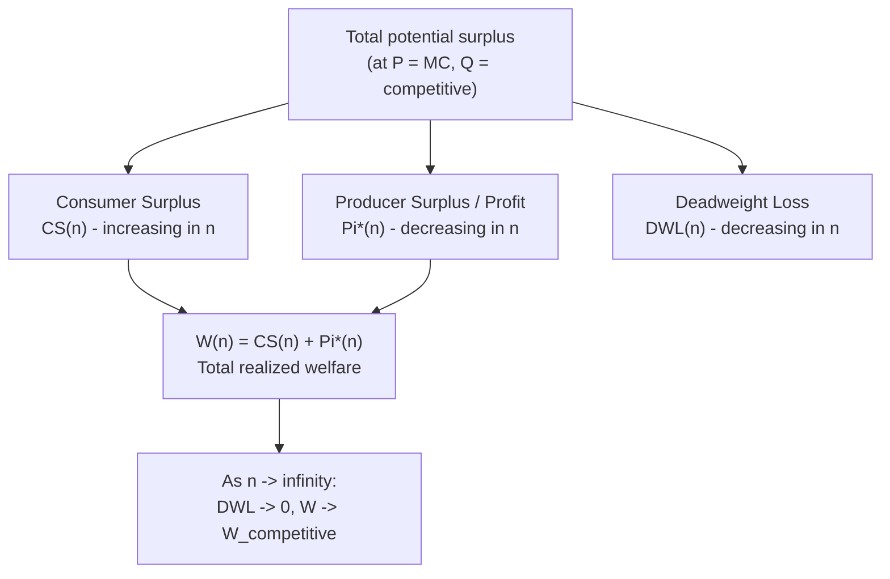

## Welfare Comparison of Cournot Outcomes

### Overview

Welfare analysis of Cournot equilibria evaluates market outcomes against efficiency benchmarks — most commonly perfect competition (the first-best, price-equals-marginal-cost allocation) and monopoly (the most concentrated case). This item consolidates the welfare formulas implicit in the Cournot framework, decomposes deadweight loss, and compares welfare outcomes across market structures (monopoly, Cournot oligopoly with $n$ firms, Stackelberg, and perfect competition), establishing the ordinal welfare ranking central to applied industrial economics.

### Welfare Components: Definitions

For inverse demand $P(Q) = a-bQ$ and constant marginal cost $c$, standard partial-equilibrium welfare accounting decomposes total surplus into:

**Consumer Surplus**

$$CS(Q) = \int_0^Q \left[P(x) - P(Q)\right]dx = \frac{1}{2}bQ^2$$

(using the fact that for linear demand, $CS$ is the triangular area between the demand curve and the equilibrium price, up to quantity $Q$).

**Producer Surplus (= Industry Profit, since marginal cost is constant and there are no fixed costs)**

$$PS(Q) = \left[P(Q)-c\right]Q$$

**Total Welfare**

$$W(Q) = CS(Q) + PS(Q)$$

**Deadweight Loss** (relative to the competitive/efficient quantity $Q^{comp} = (a-c)/b$, where $P=MC$)

$$DWL(Q) = \frac{1}{2}\left[Q^{comp}-Q\right]\left[P(Q)-c\right]$$

This is the area of the standard Harberger triangle between the demand curve and the marginal cost line, measured over the output gap $Q^{comp}-Q$.

### Welfare Under Each Market Structure

**Monopoly ($n=1$)**

$$Q^m = \frac{a-c}{2b}, \quad P^m = \frac{a+c}{2}$$

$$CS^m = \frac{1}{2}b\left(\frac{a-c}{2b}\right)^2 = \frac{(a-c)^2}{8b}$$

$$PS^m = \Pi^m = \left(\frac{a+c}{2}-c\right)\frac{a-c}{2b} = \frac{(a-c)^2}{4b}$$

$$W^m = \frac{(a-c)^2}{8b} + \frac{(a-c)^2}{4b} = \frac{3(a-c)^2}{8b}$$

$$DWL^m = \frac{1}{2}\left[\frac{a-c}{b}-\frac{a-c}{2b}\right]\left[\frac{a+c}{2}-c\right] = \frac{1}{2}\cdot\frac{a-c}{2b}\cdot\frac{a-c}{2} = \frac{(a-c)^2}{8b}$$

**Cournot Oligopoly ($n$ firms)** — using the standard results:

$$Q^*(n) = \frac{n(a-c)}{b(n+1)}, \quad P^*(n) = \frac{a+nc}{n+1}$$

$$CS(n) = \frac{n^2(a-c)^2}{2b(n+1)^2}$$

$$\Pi^*(n) = \frac{n(a-c)^2}{b(n+1)^2}$$

$$W(n) = \frac{(a-c)^2}{2b}\cdot\frac{n(n+2)}{(n+1)^2}$$

$$DWL(n) = \frac{(a-c)^2}{2b(n+1)^2}$$

**Perfect Competition ($n \to \infty$)**

$$Q^{comp} = \frac{a-c}{b}, \quad P^{comp} = c$$

$$CS^{comp} = \frac{(a-c)^2}{2b}, \quad PS^{comp} = 0, \quad W^{comp} = \frac{(a-c)^2}{2b}, \quad DWL^{comp} = 0$$

**Stackelberg Duopoly (one leader, one follower)** — using results from the Stackelberg leader-follower model:

$$Q^{St} = \frac{3(a-c)}{4b}, \quad P^{St} = \frac{a+3c}{4}$$

$$CS^{St} = \frac{1}{2}b\left(\frac{3(a-c)}{4b}\right)^2 = \frac{9(a-c)^2}{32b}$$

$$\Pi^{St} = \frac{3(a-c)^2}{16b}$$

$$W^{St} = \frac{9(a-c)^2}{32b} + \frac{3(a-c)^2}{16b} = \frac{9(a-c)^2}{32b} + \frac{6(a-c)^2}{32b} = \frac{15(a-c)^2}{32b}$$

### Summary Table: Welfare Across Market Structures

Normalizing $(a-c)^2/b = 1$ for direct comparison (i.e., expressing each quantity as a multiple of $(a-c)^2/b$):

| Structure | $Q$ | $P$ | $CS$ | $\Pi$ (PS) | $W$ | $DWL$ |
| --- | --- | --- | --- | --- | --- | --- |
| Monopoly ($n=1$) | $0.5$ | $(a+c)/2$ | $0.1250$ | $0.2500$ | $0.3750$ | $0.1250$ |
| Cournot $n=2$ | $0.6667$ | $(a+2c)/3$ | $0.2222$ | $0.2222$ | $0.4444$ | $0.0556$ |
| Stackelberg (1 leader, 1 follower) | $0.75$ | $(a+3c)/4$ | $0.2813$ | $0.1875$ | $0.4688$ | $0.0313$ |
| Cournot $n=3$ | $0.75$ | $(a+3c)/4$ | $0.2813$ | $0.1875$ | $0.4688$ | $0.0313$ |
| Cournot $n=5$ | $0.8333$ | $(a+5c)/6$ | $0.3472$ | $0.1389$ | $0.4861$ | $0.0139$ |
| Cournot $n=10$ | $0.9091$ | $(a+10c)/11$ | $0.4132$ | $0.0752$ | $0.4884$ | $0.0041$ |
| Perfect competition ($n\to\infty$) | $1.0$ | $c$ | $0.5000$ | $0$ | $0.5000$ | $0$ |

**Key Points**

- $W$ is strictly increasing in $n$: welfare rises monotonically from monopoly toward the competitive benchmark.
- $CS$ is strictly increasing in $n$; $\Pi$ (industry profit) is strictly decreasing in $n$ for $n \geq 1$ — confirming the earlier comparative-statics result that industry profit peaks at monopoly and erodes continuously with entry.
- $DWL$ shrinks monotonically and convexly toward zero as $n$ grows, consistent with $DWL(n) = (a-c)^2/[2b(n+1)^2]$ having a second derivative that confirms diminishing returns to additional entrants in welfare terms.
- The Stackelberg duopoly outcome, in this linear-demand example, produces **identical aggregate welfare to Cournot with three symmetric firms** — a numerical coincidence of this specific parameterization (both give $Q=0.75$, $DWL=0.03125$) rather than a general theorem; the underlying firm-level profit distributions are very different between the two regimes even though total welfare coincides.

### Welfare Ranking (General Statement)

For the standard linear-demand, constant-marginal-cost Cournot model:

$$W^{monopoly} < W^{Cournot}(n) < W^{Cournot}(n+1) < \cdots < W^{comp}$$

with the ranking strict for all finite, distinct $n \geq 1$, and $W(n) \to W^{comp}$ as $n \to \infty$. This establishes market concentration (fewer firms, higher $HHI = 1/n$) as monotonically associated with lower total welfare in the standard symmetric Cournot model — the theoretical basis for antitrust concern about excessive concentration, subject to the caveats on cost efficiencies discussed below.

### Diagram: Welfare Decomposition (Consumer Surplus, Profit, Deadweight Loss)

### SVG: Welfare Components as Functions of $n$ (svg_diagram)

<svg xmlns="http://www.w3.org/2000/svg" viewBox="0 0 700 460" font-family="Arial, sans-serif">
<text x="350" y="26" text-anchor="middle" font-size="17" font-weight="bold">Welfare Decomposition vs. Number of Firms (svg_diagram)</text>

<line x1="80" y1="400" x2="650" y2="400" stroke="#333" stroke-width="2" />
<line x1="80" y1="60" x2="80" y2="400" stroke="#333" stroke-width="2" />
<text x="365" y="430" text-anchor="middle" font-size="13">Number of firms (n)</text>
<text x="35" y="230" text-anchor="middle" font-size="13" transform="rotate(-90 35 230)">Surplus (normalized)</text>

<polyline points="80,250 150,180 220,150 290,132 360,120 430,112 500,106 570,102 640,98" fill="none" stroke="`#111827`" stroke-width="3" />

<text x="560" y="90" font-size="12" fill="`#111827`" font-weight="bold">W(n) total welfare</text>

<polyline points="80,370 150,320 220,280 290,250 360,225 430,205 500,190 570,178 640,168" fill="none" stroke="`#2563eb`" stroke-width="3" />

<text x="560" y="185" font-size="12" fill="`#2563eb`" font-weight="bold">CS(n)</text>

<polyline points="80,130 150,190 220,225 290,248 360,262 430,272 500,279 570,284 640,288" fill="none" stroke="`#16a34a`" stroke-width="3" />

<text x="560" y="300" font-size="12" fill="`#16a34a`" font-weight="bold">Pi*(n)</text>

<polyline points="80,320 150,355 220,372 290,382 360,388 430,391 500,393 570,395 640,396" fill="none" stroke="`#dc2626`" stroke-width="3" />

<text x="560" y="410" font-size="12" fill="`#dc2626`" font-weight="bold">DWL(n)</text>

<text x="90" y="415" font-size="11">n=1</text>

<text x="620" y="415" font-size="11">n large</text>

</svg>

### Cost Efficiencies: A Countervailing Consideration

**The Williamson Trade-off Framework**

The clean monotonic welfare ranking above assumes marginal cost $c$ is identical across market structures. In many real applications — particularly mergers, which reduce $n$ — the relevant comparison involves a trade-off: fewer, larger firms may achieve **lower marginal cost** through economies of scale, synergies, or elimination of duplicated fixed costs. This is formalized in the **Williamson (1968) trade-off model**: a merger that increases market power (moving price up, reducing $n$) can still raise total welfare if the accompanying marginal-cost reduction is sufficiently large, because the consumer-surplus loss from a higher price can be outweighed by (a) direct cost savings on the (still-produced) output and (b) any output expansion the cost reduction induces.

**Formal Condition (Simplified)**

For a merger from $n$ to $n-1$ symmetric firms accompanied by a marginal cost reduction from $c$ to $c' = c - \Delta c$, the net welfare change is:

$$\Delta W = \left[W(n-1; c') - W(n; c)\right]$$

which can be decomposed (approximately, for small changes) into a negative price/output effect and a positive direct cost-saving effect on the (reduced) post-merger output level. [Inference] The precise threshold value of $\Delta c$ needed to make $\Delta W \geq 0$ depends on demand elasticity and the specific $n \to n-1$ transition; this is a standard result in merger-simulation methodology (used in modern antitrust merger review) rather than a fixed numerical rule.

**Key Points**

- Pure firm-number reduction (holding cost fixed) unambiguously lowers welfare in the symmetric linear Cournot model, per the ranking above.
- Firm-number reduction accompanied by sufficient marginal-cost synergies can raise welfare, which is the theoretical basis for antitrust "efficiency defenses" in merger review.
- This trade-off is asymmetric in a policy-relevant sense: consumer-welfare-standard antitrust review (as opposed to total-welfare-standard review) generally requires that cost savings be passed through to consumers via lower prices, not merely retained as producer surplus, to offset the market-power price increase — the choice between total-surplus and consumer-surplus welfare standards materially changes which mergers pass a given welfare test.

### Consumer Surplus Standard vs. Total Welfare Standard

Antitrust practice in most jurisdictions applies a **consumer surplus standard** (only $CS$ must not fall) rather than a **total welfare standard** (only $CS+PS$ must not fall). Because industry profit $\Pi^*(n)$ is monotonically decreasing in $n$ in the standard Cournot model, a merger that reduces $n$ (without cost synergies) unambiguously lowers $CS$ and would fail a consumer-surplus-standard test — the CS-standard test is more restrictive on mergers than the total-welfare-standard test whenever the merging firms' profit gain is not required to be shared with consumers, since a total-welfare test permits mergers where producer gains happen to outweigh consumer losses even absent pass-through.

### Worked Numerical Example: Merger Simulation with Cost Synergy

Let $a=100$, $b=1$, $c=10$ initially, with $n=4$ firms. A merger reduces $n$ to $3$, but generates a cost synergy reducing marginal cost to $c'=6$ for the merged (and, for simplicity, symmetric-cost) post-merger firms.

**Pre-merger ($n=4$, $c=10$):**

$$Q = \frac{4(90)}{5} = 72, \quad P = \frac{100+40}{5}=28, \quad CS = \frac{72^2}{2}=2592, \quad \Pi=\frac{4(90)^2}{25}=1296, \quad W=3888$$

**Post-merger ($n=3$, $c'=6$, so $a-c'=94$):**

$$Q = \frac{3(94)}{4}=70.5, \quad P=\frac{100+18}{4}=29.5, \quad CS=\frac{70.5^2}{2}=2485.125, \quad \Pi=\frac{3(94)^2}{16}=1656.375, \quad W=4141.5$$

**Example**

Despite $n$ falling from 4 to 3 (raising concentration and raising price from 28.00 to 29.50), total welfare *rises* from 3888.00 to 4141.50 because the cost synergy ($\Delta c = 4$) outweighs the market-power loss — but **consumer surplus falls** (2592.00 to 2485.125), meaning this merger would fail a strict consumer-surplus-standard review even though it passes a total-welfare-standard review. This numerically illustrates the Williamson trade-off and the policy-relevant divergence between the two welfare standards discussed above.

### Welfare with Product Differentiation (Brief Note)

[Inference] When products are differentiated (rather than homogeneous, as assumed throughout the baseline linear model), the welfare ranking across $n$ is not guaranteed to be monotonic in the same clean way — with differentiated products, adding firms increases product variety (a source of consumer surplus gain beyond the pure quantity/price channel already covered) but can also lead to excessive product proliferation from a social-planner perspective if fixed costs of variety introduction are not fully internalized by entering firms. This "excess variety vs. insufficient variety" question under free entry is a distinct and more complex welfare question than the homogeneous-product ranking established in this item, and is generally treated as a separate topic (monopolistic competition welfare analysis).

### Limitations and Caveats

- All quantitative welfare formulas in this item are exact only under linear demand and constant marginal cost with no fixed costs; [Inference] under general demand and cost functions, the qualitative welfare ranking ($W$ increasing in $n$) is standard under regularity conditions ensuring stable, well-behaved equilibria, but exact functional forms will differ.
- The Williamson trade-off framework requires an empirical estimate of realized (not merely claimed) cost synergies; **actual post-merger cost outcomes may vary** substantially from ex ante efficiency claims, which is a central practical concern in merger review.
- This analysis is static (single-period) partial equilibrium; it does not capture dynamic welfare effects such as innovation incentives, entry/exit dynamics over time, or general-equilibrium price effects in related markets.

**Related Topics**

- Comparative statics and the effect of firm numbers (source of the underlying formulas)
- The Stackelberg leader-follower extension (welfare comparison point)
- Williamson (1968) merger trade-off model and modern merger simulation
- Consumer surplus standard vs. total welfare standard in antitrust
- Herfindahl-Hirschman Index and structural presumptions in merger review
- Monopolistic competition and product variety welfare analysis
- Deadweight loss measurement under general (non-linear) demand
- Merger simulation methodology in applied antitrust economics