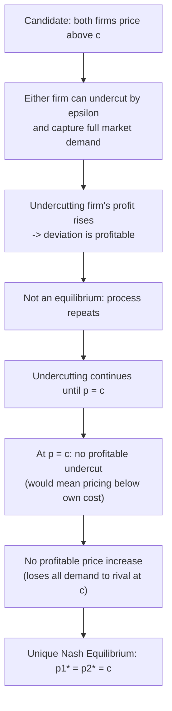

## The Bertrand Model of Price Competition

### Overview

The Bertrand model replaces quantity as the strategic variable (Cournot) with **price**. Firms simultaneously and non-cooperatively set prices for a homogeneous good, and consumers purchase entirely from the lowest-priced firm. Despite its structural similarity to Cournot, this seemingly minor change in strategic variable produces a starkly different — and famously counterintuitive — equilibrium prediction: price collapses to marginal cost with as few as two firms.

### Model Setup

**Assumptions**

- $n \geq 2$ firms produce a **homogeneous** good.
- Constant marginal cost $c$, identical across firms (baseline case).
- Firms simultaneously and independently choose prices $p_i \geq 0$.
- Consumers have perfect information and buy entirely from the firm(s) charging the lowest price.
- If multiple firms tie at the lowest price, demand is split among them (commonly assumed equally, though the specific tie-breaking/rationing rule can matter for equilibrium existence in richer variants).
- No capacity constraints (any firm can serve the entire market at its chosen price).

**Demand Allocation Rule**

Given prices $(p_1, \dots, p_n)$ and market demand $D(p)$ at the lowest price:

$$q_i(p_1,\dots,p_n) = \begin{cases} D(p_i) & \text{if } p_i < p_j \; \forall j \neq i \\ D(p_i)/k & \text{if } p_i = \min_j p_j \text{, tied among } k \text{ firms} \\ 0 & \text{if } p_i > \min_j p_j \end{cases}$$

### Equilibrium Derivation

**Claim:** The unique Nash equilibrium (for $n \geq 2$ symmetric firms with constant marginal cost) is $p_1^* = p_2^* = \cdots = p_n^* = c$.

**Proof by Elimination of Alternatives**

1. **Case $p^{min} > c$:** Any firm at the lowest price (or any rival) can undercut by $\epsilon$, capturing the **entire market demand** instead of a shared or zero fraction, while still earning a strictly positive margin $(p^{min}-\epsilon-c)>0$ on all units sold. This strictly increases profit, so $p^{min}>c$ cannot be an equilibrium.
2. **Case $p_i < c$ for some firm:** No firm would knowingly price below marginal cost, since doing so guarantees a loss on every unit sold. This is dominated by pricing at or above $c$.
3. **Case $p_i = c$ for all firms:** No firm can profitably undercut (would mean pricing below its own marginal cost — a loss). No firm can profitably raise its price above $c$ (demand drops to zero, since rivals still price at $c$ and capture the entire market). Hence $p_i^*=c$ for all $i$ is the unique surviving candidate.

**Result: The Bertrand Paradox**

$$p_1^* = p_2^* = \cdots = p_n^* = c, \qquad \pi_i^* = 0 \; \forall i, \qquad Q^* = D(c)$$

This holds for **any $n \geq 2$** — the competitive (marginal-cost-pricing, zero-profit) outcome is reached with just two firms, in sharp contrast to Cournot, where price converges to marginal cost only asymptotically as $n \to \infty$. This stark discontinuity between "one firm" (monopoly pricing) and "two or more firms" (competitive pricing) is known as the **Bertrand Paradox** — a prediction widely regarded as empirically unrealistic for most real-world duopolies, which is precisely why it is labeled a "paradox."

### Diagram: Bertrand Undercutting Logic

### SVG: Best-Response Correspondence in the Bertrand Game (svg_diagram)

<svg xmlns="http://www.w3.org/2000/svg" viewBox="0 0 620 460" font-family="Arial, sans-serif">
<text x="310" y="26" text-anchor="middle" font-size="17" font-weight="bold">Bertrand Best-Response Logic (svg_diagram)</text>
<line x1="80" y1="400" x2="560" y2="400" stroke="#333" stroke-width="2" />
<line x1="80" y1="60" x2="80" y2="400" stroke="#333" stroke-width="2" />
<text x="320" y="430" text-anchor="middle" font-size="13">p2 (rival's price)</text>
<text x="35" y="230" text-anchor="middle" font-size="13" transform="rotate(-90 35 230)">p1 (firm 1's price)</text>
<line x1="80" y1="400" x2="480" y2="80" stroke="#bbb" stroke-dasharray="4,4" stroke-width="1" />
<text x="440" y="95" font-size="10" fill="#999">p1 = p2</text>
<line x1="80" y1="320" x2="560" y2="320" stroke="#999" stroke-dasharray="3,3" />
<line x1="180" y1="60" x2="180" y2="400" stroke="#999" stroke-dasharray="3,3" />
<text x="90" y="315" font-size="11" fill="#666">c</text>
<text x="185" y="415" font-size="11" fill="#666">c</text>
<line x1="180" y1="320" x2="180" y2="130" stroke="#2563eb" stroke-width="2.5" />
<line x1="180" y1="130" x2="480" y2="130" stroke="#2563eb" stroke-width="2.5" stroke-dasharray="6,3" />
<text x="200" y="120" font-size="11" fill="#2563eb">BR1: undercut p2 by epsilon (when p2 &gt; c),</text>
<text x="200" y="135" font-size="11" fill="#2563eb">capped at monopoly price</text>
<circle cx="180" cy="320" r="7" fill="#dc2626" />
<text x="195" y="340" font-size="12" fill="#dc2626" font-weight="bold">Nash Equilibrium (c, c)</text>
</svg>

### Comparison: Bertrand vs. Cournot

| Feature | Cournot (quantity competition) | Bertrand (price competition) |
| --- | --- | --- |
| Strategic variable | Quantity $q_i$ | Price $p_i$ |
| Reaction function slope | Downward-sloping (strategic substitutes) | Upward-sloping in most differentiated variants; degenerate/discontinuous in homogeneous baseline |
| Price at $n=2$ | Above marginal cost: $(a+2c)/3$ | Equal to marginal cost: $c$ |
| Profit at $n=2$ | Strictly positive | Zero |
| Convergence to competitive outcome | Asymptotic, as $n \to \infty$ | Immediate, at $n=2$ |
| Market structure "bite" | Concentration matters continuously | Concentration is irrelevant above $n=1$ (in the pure homogeneous, unconstrained baseline) |

**Key Points**

- The Cournot–Bertrand divergence for the *same* underlying market demonstrates that the **choice of strategic variable is not a modeling detail** — it fundamentally changes both the predicted equilibrium and the qualitative comparative statics with respect to $n$.
- Empirically, real-world duopolies typically do **not** exhibit the zero-profit Bertrand outcome, which motivates the standard resolutions discussed below.

### Resolutions to the Bertrand Paradox

**1. Capacity Constraints (Kreps-Scheinkman / Edgeworth)**

If firms face binding capacity limits $\bar q_i < D(c)/n$, undercutting to just below a rival's price is no longer necessarily profitable, because the undercutting firm cannot serve the entire resulting demand — some demand spills over to the higher-priced rival. As covered in the capacity-constraints material, the two-stage capacity-then-price game (Kreps-Scheinkman, 1983) can replicate the Cournot outcome exactly under efficient rationing, resolving the paradox.

**Edgeworth Price Cycles**

A related classical resolution (Edgeworth, 1925) notes that with binding capacity constraints, a pure-strategy Bertrand-Nash equilibrium may **fail to exist**: at $p=c$, a firm can profitably raise its price above $c$ (since it cannot supply the whole market anyway due to capacity), but then the rival has an incentive to undercut slightly while staying above $c$, and the cycle can repeat indefinitely. [Inference] In this setting, equilibrium (if it exists) is typically in mixed strategies rather than a stable pure-strategy price pair, a well-established but more technically involved extension beyond the baseline paradox result.

**2. Product Differentiation**

If goods are imperfect substitutes, each firm retains some residual demand even when priced above a rival, because not all consumers switch entirely in response to a price difference. This eliminates the discontinuous "winner-take-all" undercutting incentive that drives the pure Bertrand result to marginal cost. Models such as Hotelling's linear city or Dixit-Stiglitz-based discrete-choice demand systems formalize this and are treated as separate, dedicated topics in oligopoly price competition.

**3. Repeated Interaction and Tacit Collusion**

In a **repeated Bertrand game**, firms interacting over an infinite (or sufficiently long, uncertain-horizon) time period can sustain prices above marginal cost as a **subgame-perfect equilibrium** using trigger strategies (e.g., a grim trigger: price at the monopoly level unless a rival deviates, then revert to marginal-cost pricing forever). This works because the one-period gain from undercutting must be weighed against the discounted loss of future collusive profits once punishment is triggered. [Inference] The standard textbook condition for sustaining full monopoly pricing between two symmetric firms under a grim trigger requires the discount factor to satisfy $\delta \geq 1/2$; this specific threshold is well known for the two-firm case but the required $\delta$ rises as $n$ increases, since each firm's temptation to deviate scales with the potential deviation-period gain relative to shared collusive profit.

**4. Search and Switching Costs**

If consumers face costs to search for the lowest price or to switch suppliers, firms retain some market power even when a rival's price is nominally lower — this is the basis of Diamond's (1971) paradox and related search-theoretic models, an alternative route to positive markups that does not rely on capacity or product differentiation.

### Bertrand with Asymmetric Costs

**Setup**

Suppose firm 1 has marginal cost $c_1$ and firm 2 has marginal cost $c_2$, with $c_1 < c_2$.

**Equilibrium**

The low-cost firm sets price **just below** the high-cost firm's marginal cost:

$$p_1^* \to c_2 \; (\text{from below}), \qquad p_2^* = c_2$$

The high-cost firm is priced out of the market, and the low-cost firm captures the **entire market demand**, earning:

$$\pi_1^* \approx (c_2-c_1)D(c_2)$$

**Key Points**

- Unlike the symmetric case, asymmetric costs allow the more efficient firm to earn **strictly positive profit**, bounded by the cost gap $c_2-c_1$.
- This illustrates that Bertrand competition does not universally predict zero profit — only under cost symmetry. Cost asymmetry is a potential explanation for observed markups in seemingly-Bertrand-like real-world duopolies.

### Worked Numerical Example (Symmetric Costs)

Let demand be $D(p) = 100 - p$, and marginal cost $c=20$ for both firms.

| Scenario | $p_1$ | $p_2$ | Outcome |
| --- | --- | --- | --- |
| Candidate: both at $p=30$ | 30 | 30 | Each earns $\frac{1}{2}(100-30)(30-20)=350$; but firm 1 can deviate |
| Deviation: firm 1 undercuts to $29.99$ | 29.99 | 30 | Firm 1 captures all demand $D(29.99)=70.01$, earning $70.01 \times 9.99 \approx 699.4$ — nearly double |
| Nash Equilibrium | 20 | 20 | Each earns 0; $Q^* = D(20) = 80$ |

**Example**

This numerically confirms the theoretical result: any candidate equilibrium price above $c=20$ is destabilized by a profitable undercutting deviation (350 vs. ≈699.4), and only $p_1=p_2=20$ survives as a mutual best response.

### Relationship to the Cournot Model: A Unifying Perspective

[Inference] The standard synthesis in the literature (following Kreps-Scheinkman and subsequent work) is that the "right" choice between Cournot and Bertrand as a modeling framework for a given real-world industry depends on which strategic variable firms actually commit to first and how flexible capacity is in the short run. Industries with high capital intensity, long lead times to expand capacity, and pre-committed production levels are often argued to be better approximated by Cournot logic, while industries with low capacity-adjustment costs and frequent price changes are often argued to be closer to Bertrand logic. This mapping is a widely used heuristic in applied industrial organization rather than a rigorously derived classification rule.

### Limitations and Caveats

- The baseline Bertrand result (price = marginal cost at $n=2$) relies critically on the homogeneous-good, no-capacity-constraint, complete-information, simultaneous-move assumptions; relaxing any one of these typically restores positive equilibrium markups.
- The existence of a pure-strategy Nash equilibrium under capacity constraints is not guaranteed (Edgeworth cycles); **equilibrium behavior in capacity-constrained price-setting markets may vary** and can require mixed-strategy analysis.
- Real-world markets with a small number of firms selling largely homogeneous goods sometimes exhibit prices well above marginal cost despite $n=2$ or $n=3$ competitors, generally attributed to some combination of the resolutions above rather than treated as a rejection of the Bertrand logic itself.

**Related Topics**

- Bertrand model with product differentiation (Hotelling, Dixit-Stiglitz-based demand)
- Kreps-Scheinkman capacity-then-price game (full resolution of the paradox)
- Edgeworth price cycles and mixed-strategy equilibria under capacity constraints
- Repeated games and tacit collusion (folk theorem, grim trigger, discount factor conditions)
- Bertrand competition with asymmetric marginal costs
- Cournot vs. Bertrand: strategic substitutes vs. strategic complements
- Search costs and the Diamond paradox
- Hotelling's linear city model of spatial price competition