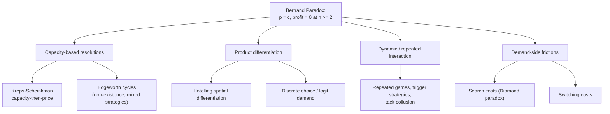

## The Bertrand Paradox and Its Resolutions

### Overview

The Bertrand paradox is the result that price competition between as few as two symmetric firms selling a homogeneous good, with constant marginal cost and no capacity constraints, drives equilibrium price to marginal cost and profit to zero — identical to the perfectly competitive outcome. This item catalogs, in a unified and comparative treatment, the major theoretical resolutions the literature has developed to reconcile this stark prediction with the positive markups routinely observed in real-world duopolies and oligopolies.

### Restating the Paradox

**The Core Result**

For $n \geq 2$ firms with identical constant marginal cost $c$, homogeneous product, and simultaneous price-setting with winner-take-all demand allocation, the unique Nash equilibrium is:

$$p_1^* = \cdots = p_n^* = c, \qquad \pi_i^* = 0$$

**Why It Is a "Paradox"**

The result is paradoxical for three interlocking reasons:

1. **Discontinuity at $n=2$:** Monopoly ($n=1$) yields the standard markup price $p^m = (a+c)/2$ in the linear-demand case, but adding a *single* competitor collapses price all the way to $c$ — a discrete jump with no smooth transition, unlike the gradual convergence to $c$ seen in Cournot as $n \to \infty$.
2. **Irrelevance of $n$ beyond 2:** The equilibrium price is $c$ regardless of whether $n=2$ or $n=200$, so market concentration appears to carry no informational content about competitive intensity once $n \geq 2$ — a prediction sharply at odds with standard structure-conduct-performance intuition and with most empirical studies of concentration and pricing.
3. **Empirical mismatch:** Real-world duopolies and even highly concentrated oligopolies (airlines on specific routes, cement, wireless carriers) routinely sustain prices well above marginal cost, in direct tension with the model's zero-profit prediction.

### Taxonomy of Resolutions

### Resolution 1: Capacity Constraints and the Kreps-Scheinkman Model

**Mechanism**

If a firm has capacity $\bar q_i$ below the demand it would face by capturing the whole market at cost, it cannot fully exploit an undercutting strategy — some consumers who wish to buy from the low-price firm will find it capacity-constrained and be rationed to the higher-priced rival. This breaks the "undercut and capture everything" logic that drives price to $c$ in the baseline model.

**The Two-Stage Game**

Kreps and Scheinkman (1983) formalize this as a two-stage game: firms first choose capacity (Cournot-like commitment), then compete in price given those capacities (Bertrand-like). Under **efficient rationing** (consumers with highest willingness to pay are served first at the low-price firm), the unique subgame-perfect equilibrium of this two-stage game reproduces **exactly the Cournot quantities and price** — providing a price-setting microfoundation for the Cournot outcome and simultaneously resolving the paradox, since the resulting price lies strictly above marginal cost for finite $n$.

**Key Points**

- This is arguably the most theoretically elegant resolution because it does not require abandoning price competition or homogeneous products — it shows that Cournot-like outcomes can emerge *from* price competition once capacity is treated as a prior, costly commitment.
- [Inference] The Cournot-equivalence result is sensitive to the rationing rule assumed in stage 2; under alternative rationing rules (e.g., proportional rationing, where excess demand is split proportionally among all consumers rather than serving high-willingness-to-pay consumers first), the equilibrium can diverge from the exact Cournot outcome, a qualification well documented in subsequent literature.

**Edgeworth Cycles**

A related and historically prior observation (Edgeworth, 1925) is that with capacity constraints, a pure-strategy price equilibrium may fail to exist altogether: at $p=c$, a capacity-constrained firm can profitably raise price (since it wasn't serving the whole market anyway), but the rival then wants to undercut just below that higher price, and the process cycles. [Inference] Where a pure-strategy equilibrium fails to exist, the standard resolution in the literature is a mixed-strategy equilibrium with prices fluctuating over a supported interval — this is a well-established extension, though more technically involved than the deterministic Kreps-Scheinkman result.

### Resolution 2: Product Differentiation

**Mechanism**

If products are imperfect substitutes, a firm pricing above its rival does not lose its *entire* customer base — some consumers prefer its variant enough to pay a premium. This eliminates the discontinuous, winner-take-all demand function that is the technical engine of the Bertrand undercutting argument (case 1 in the baseline proof: infinitesimal undercutting captures the *entire* market only under perfect homogeneity).

**Hotelling Linear City (Horizontal Differentiation)**

Consumers are distributed along a line (or circle) of length 1, with two firms at the endpoints. A consumer at location $x$ faces "transport cost" $t \cdot x$ (or $t \cdot (1-x)$) in addition to the firm's price, reflecting a preference for the variant closer to their ideal point. The resulting price equilibrium (for quadratic transport costs, which guarantee existence in pure strategies) is:

$$p_1^* = p_2^* = c + t$$

Here, the differentiation parameter $t$ acts as a direct wedge above marginal cost — as $t \to 0$ (products become homogeneous), the Hotelling price converges exactly to the Bertrand paradox outcome $p^*=c$, confirming that homogeneity is the specific driver of the paradox and any positive degree of horizontal differentiation restores positive markups.

**Vertical / Discrete-Choice Differentiation**

In logit-demand or other discrete-choice frameworks (e.g., a simplified multinomial logit demand system), each firm faces a smooth, continuous residual demand curve rather than an all-or-nothing demand cliff, because idiosyncratic consumer tastes mean that even a higher-priced firm retains some market share. [Inference] The specific equilibrium markup formula in logit-demand Bertrand competition depends on the assumed distribution of consumer taste shocks, but the qualitative resolution — smooth own-price elasticity replacing the discontinuous "capture everything or nothing" Bertrand demand structure — is general across standard discrete-choice specifications.

### Resolution 3: Repeated Interaction and Tacit Collusion

**Mechanism**

The static, one-shot Bertrand game removes any incentive to sustain cooperative pricing because there is no future to protect. In a **repeated game**, firms can use trigger strategies to sustain prices above marginal cost as long as the threat of future punishment (reversion to competitive/zero-profit pricing) outweighs the one-time temptation to undercut and capture the whole market for a single period.

**The Grim Trigger Sustainability Condition**

For two symmetric firms playing an infinitely repeated Bertrand game with discount factor $\delta$, consider a strategy of setting the monopoly price $p^m$ each period unless a deviation is observed, in which case both firms revert to $p=c$ forever. A firm's payoff from cooperating:

$$V^{coop} = \frac{\pi^m/2}{1-\delta}$$

A firm's payoff from deviating (undercutting slightly to capture the *entire* market for one period, earning approximately $\pi^m$, then reverting to zero profit forever after):

$$V^{dev} = \pi^m + \frac{0}{1-\delta} = \pi^m$$

Cooperation is sustainable ($V^{coop} \geq V^{dev}$) when:

$$\frac{\pi^m/2}{1-\delta} \geq \pi^m \implies \delta \geq \frac{1}{2}$$

**Key Points**

- This $\delta \geq 1/2$ threshold is the canonical textbook result for the two-firm symmetric grim-trigger case in repeated Bertrand competition.
- [Inference] As $n$ increases, each firm's share of collusive profit shrinks (to $\pi^m/n$) while the one-period deviation gain (capturing the *entire* market) remains approximately $\pi^m$, so the required discount factor for sustaining full collusion rises with $n$ — making tacit collusion progressively harder to sustain in more fragmented Bertrand markets, a standard qualitative result though the exact functional form depends on demand and cost specifics.
- This resolution shifts the explanation for observed markups away from static market structure entirely and toward the dynamics of repeated interaction, discount rates, and detection/monitoring of deviations — a substantively different theoretical mechanism from the capacity or differentiation resolutions.

### Resolution 4: Demand-Side Frictions

**Search Costs — the Diamond Paradox**

Diamond (1971) shows that if consumers must pay even an arbitrarily small cost to search for a lower price at a rival firm, the unique equilibrium is for **all firms to charge the monopoly price**, despite the market having many firms — the mirror-image "paradox" to Bertrand's, since here *any* positive search friction, however small, restores full monopoly pricing rather than eroding it to marginal cost. [Inference] The stark reversal (from "$p=c$ regardless of frictionlessness" to "$p=p^m$ regardless of how small search costs are") is itself widely noted in the literature as an illustration of how sensitive price-competition predictions are to small changes in underlying informational assumptions — a broader methodological lesson often drawn from contrasting these two results.

**Switching Costs**

If consumers face a cost to switch away from their current supplier (contract termination fees, learning costs, loyalty programs), firms retain some captive demand even when undercut, softening price competition relative to the frictionless baseline. This is related to, but distinct from, search costs: switching costs are typically modeled as firm-specific and history-dependent (a returning customer faces a cost only if changing suppliers), whereas search costs apply uniformly to price discovery regardless of prior purchase history.

### Comparative Table of Resolutions

| Resolution | Key mechanism | Equilibrium price relative to $c$ | Existence of pure-strategy equilibrium |
| --- | --- | --- | --- |
| Capacity constraints (Kreps-Scheinkman) | Undercutting can't capture full residual demand | Above $c$; converges to Cournot price | Yes, under efficient rationing |
| Capacity constraints (Edgeworth) | Same mechanism, different rationing assumptions | Cycles; no stable pure-strategy price | Often no — mixed strategies required |
| Product differentiation (Hotelling) | Consumers retain preference for own variant | $p^* = c+t$ (increasing in differentiation) | Yes (with quadratic transport costs) |
| Repeated interaction | Future punishment deters one-shot undercutting | Up to $p^m$, if $\delta$ sufficiently high | Yes, as SPNE of repeated game |
| Search costs (Diamond) | Costly price discovery | $p^* = p^m$ | Yes |
| Switching costs | Costly supplier changes | Above $c$, increasing in switching cost | [Inference] Typically yes in standard formulations, though outcome depends on the specific switching-cost model |

### SVG: How Each Friction Shifts Equilibrium Price Above the Bertrand Floor (svg_diagram)

<svg xmlns="http://www.w3.org/2000/svg" viewBox="0 0 700 420" font-family="Arial, sans-serif">
<text x="350" y="26" text-anchor="middle" font-size="17" font-weight="bold">Resolutions and Their Price Effects (svg_diagram)</text>
<line x1="100" y1="360" x2="650" y2="360" stroke="#333" stroke-width="2" />
<text x="375" y="390" text-anchor="middle" font-size="13">Resolution mechanism</text>
<text x="40" y="220" text-anchor="middle" font-size="13" transform="rotate(-90 40 220)">Equilibrium price</text>

<line x1="100" y1="340" x2="650" y2="340" stroke="#999" stroke-dasharray="4,4" />
<text x="560" y="335" font-size="11" fill="#666">p = c (Bertrand paradox baseline)</text>

<rect x="130" y="260" width="70" height="80" fill="#2563eb" />
<text x="165" y="255" text-anchor="middle" font-size="10">Capacity (K-S)</text>
<rect x="230" y="210" width="70" height="130" fill="#16a34a" />
<text x="265" y="205" text-anchor="middle" font-size="10">Differentiation</text>
<rect x="330" y="130" width="70" height="210" fill="#dc2626" />
<text x="365" y="125" text-anchor="middle" font-size="10">Repeated game (high delta)</text>
<rect x="430" y="90" width="70" height="250" fill="#7c3aed" />
<text x="465" y="85" text-anchor="middle" font-size="10">Search costs (Diamond)</text>
<rect x="530" y="230" width="70" height="110" fill="#f59e0b" />
<text x="565" y="225" text-anchor="middle" font-size="10">Switching costs</text>
<line x1="100" y1="60" x2="100" y2="360" stroke="#333" stroke-width="2" />
<text x="80" y="70" font-size="11">p^m</text>
<text x="80" y="345" font-size="11">c</text>
</svg>

### Worked Comparative Example

Let demand be $D(p) = 100-p$, $c=20$, so monopoly price and profit are $p^m=60$, $\pi^m=1600$ (using standard linear-demand monopoly formulas).

| Regime | Resulting price | Resulting industry profit | Mechanism illustrated |
| --- | --- | --- | --- |
| Baseline Bertrand ($n=2$, homogeneous, no frictions) | 20.00 | 0 | Undercutting drives price to $c$ |
| Hotelling with $t=15$ | 35.00 | Positive (firm-specific, depends on demand normalization) | Product differentiation wedge $=t$ |
| Repeated game, $\delta=0.6 > 0.5$ | 60.00 (sustainable) | 1600 (shared) | Grim trigger sustains full collusion |
| Repeated game, $\delta=0.3 < 0.5$ | 20.00 (collusion unravels) | 0 | Insufficient patience to deter deviation |
| Diamond search-cost model (any $\epsilon>0$ search cost) | 60.00 | 1600 | Any friction, however small, restores monopoly price |

**Example**

This table illustrates a subtle but important point: the various resolutions do not all restore markups by the *same amount* or through the *same comparative statics*. The Hotelling markup scales continuously with the differentiation parameter $t$; the repeated-game outcome is a discontinuous function of $\delta$ (either full collusion or none, at least under the simple grim-trigger analysis above); and the Diamond result is a knife-edge discontinuity at $\epsilon=0$ versus $\epsilon>0$, regardless of how small $\epsilon$ is. Recognizing which mechanism is empirically most relevant for a given industry is itself a substantive economic judgment, not just a technical modeling choice.

### Which Resolution Applies? A Practical Framework

[Inference] Applied industrial organization typically selects among these resolutions based on institutional features of the specific industry under study, though this mapping is a widely used heuristic rather than a formally derived selection rule:

- **Capital-intensive industries with long capacity lead times** (cement, steel, semiconductor fabs) → capacity-based resolutions (Kreps-Scheinkman) often considered most relevant.
- **Industries with recognizable brand or spatial differentiation** (retail, restaurants, consumer goods) → Hotelling/discrete-choice differentiation often considered most relevant.
- **Industries with few firms, high price transparency, and long horizons** (some airline routes, telecoms) → repeated-game tacit collusion explanations are commonly invoked, though proving tacit (as opposed to explicit, illegal) collusion empirically is notoriously difficult and a major topic in antitrust economics.
- **Industries with complex products or high price-comparison costs** (financial services, insurance, some B2B markets) → search-cost/switching-cost frictions often considered most relevant.

### Limitations and Caveats

- No single resolution is universally regarded as "the" correct explanation for observed markups in concentrated markets; **the appropriate mechanism, and its magnitude, may vary substantially by industry** and typically requires industry-specific empirical investigation rather than a priori theoretical assignment.
- Several resolutions can operate simultaneously in the same real-world market (e.g., an industry may exhibit both capacity constraints and tacit collusion), and disentangling their separate contributions to observed prices is an active area of applied research rather than a solved problem.
- The exact quantitative predictions of each resolution (the Hotelling markup formula, the $\delta \geq 1/2$ threshold, etc.) are derived under specific simplifying assumptions (e.g., two symmetric firms, linear/quadratic functional forms); **generalizations to asymmetric firms, more than two competitors, or richer cost/demand structures can alter the precise thresholds** even though the qualitative resolution mechanism typically still applies.

**Related Topics**

- The Bertrand model of price competition (baseline result this item resolves)
- Kreps-Scheinkman capacity-then-price game (full derivation)
- Hotelling's linear city and spatial competition models
- Repeated games, folk theorems, and tacit collusion enforcement
- Search theory and the Diamond (1971) paradox
- Antitrust detection of tacit vs. explicit collusion
- Discrete-choice demand systems (logit, nested logit) in oligopoly pricing
- Edgeworth cycles and mixed-strategy price equilibria