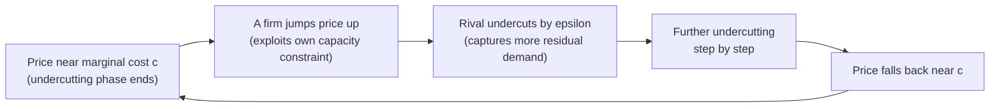

## Price Competition with Capacity Constraints and Edgeworth Cycles

### Overview

When firms compete in price but cannot serve unlimited quantities, the winner-take-all undercutting logic driving the standard Bertrand paradox breaks down. This item develops the formal analysis of price competition under binding capacity constraints, derives the conditions under which a pure-strategy Nash equilibrium fails to exist, and characterizes the resulting Edgeworth price cycle — a foundational explanation for the sawtooth pricing patterns observed in several real-world markets.

### Setup: Price Competition with Capacity

**Assumptions**

- Two firms (generalizable to $n$), each with fixed capacity $\bar q_1, \bar q_2$, set prior to price competition (or simply given exogenously for this item's purposes).
- Constant marginal cost $c$ up to capacity; cost is effectively infinite (or production is simply impossible) beyond $\bar q_i$.
- Linear market demand $D(p) = a - bp$, with firms competing in price given fixed capacities.
- A **rationing rule** specifies how unmet demand at the low-price firm is allocated to the high-price firm when the low-price firm's capacity binds.

**Rationing Rules**

1. **Efficient (surplus-maximizing) rationing:** Consumers with the highest willingness to pay are served first at the low-price firm; the residual demand facing the high-price firm is the original demand curve shifted left by the low-price firm's capacity — i.e., $D_2(p_2) = \max\{0, D(p_2) - \bar q_1\}$ when $p_1 < p_2$.
2. **Proportional rationing:** All consumers who wished to buy from the low-price firm are treated symmetrically; a fraction of demand at every price point is rationed away, so the residual demand facing the high-price firm is $D_2(p_2) = D(p_2)\left(1 - \bar q_1/D(p_1)\right)$, roughly speaking. [Inference] The choice between these rules is a genuine modeling fork in the literature — efficient rationing is the standard assumption in most textbook treatments (and is required for the Kreps-Scheinkman Cournot-equivalence result), but proportional rationing is sometimes argued to be more realistic when queueing or random consumer arrival, rather than willingness-to-pay-based sorting, determines who gets served first.

### When Does Undercutting Remain Profitable?

**The Undercutting Incentive with Capacity**

Suppose firm 2 charges $p_2 > c$. Firm 1 considers undercutting to $p_1 = p_2 - \epsilon$. Under the baseline (no-capacity) Bertrand logic, this captures the entire market demand $D(p_1)$. With capacity, firm 1 can capture **at most** $\bar q_1$. Undercutting is profitable only if the additional revenue from capturing demand up to $\bar q_1$ at the lower price exceeds what firm 1 would have earned serving its residual share at the higher price $p_2$.

**Condition for the Bertrand (Marginal-Cost) Outcome to Survive**

If both firms have "large" capacity — specifically, if $\bar q_i \geq D(c)$ for each firm (either firm alone could serve the entire market at the competitive price without constraint) — the baseline Bertrand logic is essentially unaffected, and $p^*=c$ remains an equilibrium, since a firm can still profitably undercut and capture (a share of) the market without ever hitting its capacity ceiling.

**Condition for Capacity to Bind the Analysis**

If capacities are "small" relative to market demand at cost — specifically, if $\bar q_1 + \bar q_2 < D(c)$ (combined capacity cannot even serve the fully competitive quantity) — then even at $p_1=p_2=c$, the market does not clear, meaning there is excess unmet demand and both firms are capacity-constrained. In this regime, a firm has an incentive to **raise** its price above $c$, since it is already capacity-constrained and cannot lose meaningful demand by doing so — but this immediately breaks the $p^*=c$ candidate equilibrium.

### Non-Existence of Pure-Strategy Equilibrium

**The Core Argument (Edgeworth's Original Insight)**

Consider intermediate capacity levels where $\bar q_i < D(c)$ for each firm individually, but combined capacity roughly matches or slightly exceeds relevant demand ranges. The following cycle of profitable deviations can be shown to have no stopping point:

1. **Start at $p_1=p_2=c$:** Both firms are capacity-constrained (each serves at most $\bar q_i$), and neither earns profit above cost recovery.
2. **Firm 1 raises price to $p_1 > c$:** Since firm 1 was already capacity-constrained at $p=c$, and rationing means it retains some residual demand even at a higher price, this price increase is profitable — firm 1 earns a positive margin on the demand it retains.
3. **Firm 2 undercuts firm 1's new higher price by $\epsilon$:** Firm 2 can now profitably undercut to just below $p_1$ (while remaining above $c$), capturing more of the market at a still-profitable margin.
4. **Firm 1 undercuts firm 2 in turn:** The undercutting continues, price falling step by step, until price is driven back down toward $c$ (or to the point where further undercutting is no longer profitable given capacity limits).
5. **Once price reaches (or approaches) $c$ again:** The logic of step 2 reactivates — a firm capacity-constrained at low price has an incentive to jump price back up, restarting the cycle.

**Result: No Pure-Strategy Nash Equilibrium**

Because every candidate price pair in this range is destabilized by some profitable unilateral deviation, **no pure-strategy Nash equilibrium exists** for this intermediate range of capacities. This is the formal content of Edgeworth's (1925) critique of the Bertrand model.

### The Edgeworth Cycle Pattern

This produces a **sawtooth price pattern** over time: a slow, gradual price war of successive undercutting (the "war of attrition" phase) followed by a sudden price jump back up (the "relenting" or "reset" phase), repeating indefinitely.

### SVG: Edgeworth Price Cycle Over Time (svg_diagram)

<svg xmlns="http://www.w3.org/2000/svg" viewBox="0 0 700 400" font-family="Arial, sans-serif">
<text x="350" y="26" text-anchor="middle" font-size="17" font-weight="bold">Edgeworth Price Cycle Pattern (svg_diagram)</text>
<line x1="80" y1="340" x2="650" y2="340" stroke="#333" stroke-width="2" />
<line x1="80" y1="60" x2="80" y2="340" stroke="#333" stroke-width="2" />
<text x="365" y="370" text-anchor="middle" font-size="13">Time</text>
<text x="35" y="200" text-anchor="middle" font-size="13" transform="rotate(-90 35 200)">Price</text>
<line x1="80" y1="300" x2="650" y2="300" stroke="#999" stroke-dasharray="4,4" />
<text x="600" y="315" font-size="11" fill="#666">p = c</text>

<polyline points="80,300 85,100 150,120 210,145 270,168 330,190 385,210 385,100 450,120 510,145 570,168 625,190 625,100 650,105" fill="none" stroke="`#dc2626`" stroke-width="2.5" />

<text x="90" y="90" font-size="10" fill="`#dc2626`">Price jump (relenting)</text>

<text x="260" y="185" font-size="10" fill="`#dc2626`">Gradual undercutting</text>

<text x="400" y="90" font-size="10" fill="`#dc2626`">Cycle repeats</text>

<line x1="80" y1="95" x2="650" y2="95" stroke="#999" stroke-dasharray="3,3" />
<text x="600" y="88" font-size="11" fill="#666">p ≈ p^m (peak)</text>
</svg>

### Mixed-Strategy Equilibrium

**Formal Resolution**

When a pure-strategy equilibrium fails to exist, the standard game-theoretic resolution is a **mixed-strategy Nash equilibrium**, in which each firm randomizes over a continuous range of prices according to some equilibrium distribution function $F_i(p)$ over a support $[p_L, p_H]$.

**Key Structural Features**

[Inference] In the canonical capacity-constrained duopoly setting, the mixed-strategy equilibrium typically has the following qualitative features, well-established in the literature though the exact closed-form distribution depends on the specific demand and capacity parameters:

- The support of the equilibrium price distribution is bounded below by some price above marginal cost and bounded above by a price at or below the monopoly price.
- There are typically no mass points in the interior of the support (a mass point at some price $p'$ would create an incentive for the rival to undercut just below $p'$ to capture the discrete jump in demand, inconsistent with mixing being an equilibrium).
- A mass point can sometimes occur at the top of the support, since a firm playing the top price faces no undercutting-driven erosion from playing exactly at that price.

**Interpretation**

This cycling or randomized behavior is not a modeling artifact to be dismissed but is argued in the literature to correspond to genuine observed price volatility in several real markets, particularly retail gasoline markets, where researchers have documented empirical price cycles consistent qualitatively with the Edgeworth-cycle mechanism.

### Comparison: Edgeworth Cycles vs. Kreps-Scheinkman

| Feature | Kreps-Scheinkman | Edgeworth Cycles |
| --- | --- | --- |
| Timing structure | Two-stage: capacity first, then price | Single-stage price competition given fixed (exogenous) capacities |
| Rationing rule | Efficient rationing (standard assumption) | Sensitive to rationing rule; results can differ under proportional rationing |
| Capacity choice | Endogenous (firms choose capacity anticipating stage-2 pricing) | Exogenous (capacities given, not chosen strategically within the model) |
| Equilibrium existence | Pure-strategy SPNE exists and replicates Cournot | Pure-strategy equilibrium may fail to exist for intermediate capacity levels |
| Resulting outcome | Stable price equal to the Cournot price | Cycling / mixed-strategy randomization, no stable deterministic price |

**Key Points**

- These two frameworks address **different questions**: Kreps-Scheinkman asks what happens when firms can choose capacity *strategically*, anticipating the pricing game that follows — and finds a stable, Cournot-replicating answer. Edgeworth's analysis takes capacities as exogenously fixed and asks what pure price competition looks like given those capacities — finding, for a range of capacity levels, that no stable price exists.
- [Inference] The apparent tension can be understood as reflecting different time horizons: if capacity is a genuine long-run strategic choice made in anticipation of the pricing subgame, Kreps-Scheinkman's stable result applies; if capacity is a short-run fixed constraint (due to plant construction lead times, regulatory approval, or historical circumstance), Edgeworth-cycle dynamics may better describe observed pricing behavior.

### Empirical Applications: Retail Gasoline Markets

**The Canonical Example**

Several empirical studies have documented price cycle patterns in retail gasoline markets — most notably in parts of Canada, Australia, and Germany — characterized by a rapid, discrete price increase (the "relenting" jump) followed by a slower, gradual decline through successive undercutting, closely matching the qualitative Edgeworth-cycle pattern derived theoretically above.

**Explanatory Fit**

[Inference] The retail gasoline setting is often cited as a particularly clean real-world match for the Edgeworth-cycle mechanism because: (a) gasoline stations have effectively fixed, small capacity relative to daily demand fluctuations; (b) the product is highly homogeneous across nearby stations; (c) prices are highly visible and can be adjusted with very low cost or delay, making frequent undercutting technically feasible; and (d) local market demand at any given price is small relative to what a single station's capacity could serve, consistent with the "intermediate capacity" range where cycles are theoretically predicted. This remains an active area of empirical industrial organization research, and the precise degree to which observed gasoline price patterns are driven by Edgeworth-cycle logic versus other mechanisms (e.g., tacit collusion with periodic price wars, cost pass-through dynamics) continues to be studied and is not fully settled.

### Worked Numerical Illustration

Let $D(p) = 100-p$, $c=10$, and both firms have capacity $\bar q_1 = \bar q_2 = 35$ (so combined capacity is 70, while $D(c) = 90$ — combined capacity is well short of the fully competitive quantity, placing the market in the "capacity binds even at cost" range).

**At $p_1=p_2=10$:** Each firm sells at most 35 units (rationed, since total demand at $p=10$ is 90, exceeding combined capacity of 70). Each just covers cost, earning zero margin-based profit even though physically constrained.

**Firm 1 deviates to $p_1=40$:** Firm 1 retains some residual demand from consumers with high willingness to pay who are still willing to buy at 40 rather than search elsewhere. Firm 1 now earns a margin of $40-10=30$ on whatever quantity (up to its capacity of 35) it can sell at this higher price — a clear improvement over zero margin at $p=10$.

**Example**

This illustrates concretely why $p_1=p_2=c=10$ cannot be an equilibrium when combined capacity falls short of competitive demand: a capacity-constrained firm always has *something* to gain by testing a higher price, since it isn't sacrificing much realized demand. Firm 2 would then rationally undercut firm 1's 40, and the cycle proceeds as described in the general mechanism above.

### Limitations and Caveats

- The exact boundary conditions distinguishing "capacity large enough that Bertrand logic survives," "capacity small enough that Edgeworth cycling occurs," and other intermediate regimes depend on the specific demand function and rationing rule; [Inference] these thresholds are well-characterized in the theoretical literature for standard linear-demand cases but require case-by-case derivation for general demand specifications.
- Mixed-strategy equilibrium predictions, while game-theoretically rigorous, are harder to test directly against real-world data than deterministic point predictions; empirical work on gasoline cycles typically tests **qualitative pattern matching** rather than exact quantitative markup levels.
- **Real-world pricing dynamics in capacity-constrained markets may vary** depending on factors outside the baseline model, including menu costs, demand seasonality, wholesale cost pass-through timing, and the degree of tacit coordination among competitors — all of which can interact with, reinforce, or partially obscure the pure Edgeworth-cycle mechanism in observed data.

**Related Topics**

- The Bertrand model of price competition (baseline result)
- The Bertrand paradox and its resolutions (broader taxonomy)
- Kreps-Scheinkman capacity-then-price two-stage game
- Mixed-strategy Nash equilibrium concepts in oligopoly
- Empirical retail gasoline price cycle studies
- Rationing rules in price competition (efficient vs. proportional)
- Menu costs and price adjustment frictions
- Tacit collusion and price wars as alternative explanations for cyclical pricing