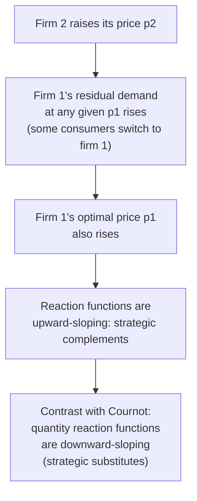

## Price Competition with Differentiated Products

### Overview

When products are imperfect substitutes rather than perfectly homogeneous, price competition no longer produces the discontinuous, winner-take-all demand structure that drives the Bertrand paradox. This item develops the standard framework for Bertrand price competition under product differentiation, contrasting the linear (representative-consumer) demand approach with discrete-choice foundations, and derives how the degree of differentiation governs the gap between equilibrium price and marginal cost.

### Why Differentiation Changes the Bertrand Logic

**The Core Mechanical Difference**

In the homogeneous-goods Bertrand model, any price above a rival's price yields **zero demand** (all consumers switch), and any price below captures the **entire market** — a discontinuous, all-or-nothing demand function. With differentiated products, each firm faces a **continuous, downward-sloping own-price demand curve** that depends smoothly on both its own price and rivals' prices: raising price above a rival's reduces, but does not eliminate, a firm's sales, since some consumers still prefer that firm's specific variant enough to pay a premium.

This continuity is what restores an interior, well-behaved profit-maximization problem and eliminates the destabilizing undercutting logic that pushes homogeneous-goods Bertrand competition to marginal cost.

### The Linear (Representative-Consumer) Demand System

**Standard Symmetric Differentiated Demand**

A widely used reduced-form demand system for two differentiated products, derived from a representative consumer with quadratic utility (following Singh and Vives, 1984, and similar formulations), gives each firm's demand as a linear function of both prices:

$$q_i = a - bp_i + dp_j, \qquad i,j \in \{1,2\}, \; i \neq j$$

where $b > 0$ is the **own-price sensitivity** and $d \geq 0$ is the **cross-price sensitivity**, capturing the degree of substitutability between the two goods. The parameter $d$ directly measures the intensity of competition:

- $d = 0$: products are **completely independent** (each firm behaves as an isolated monopolist).
- $d \to b$: products approach **perfect substitutes** (the homogeneous-goods case), and the model approaches the standard Bertrand paradox as $d/b \to 1$.
- $0 < d < b$: products are **imperfect substitutes**, the generic differentiated case.

**Firm's Profit Maximization**

With constant marginal cost $c$, firm $i$ solves:

$$\max_{p_i} \; \pi_i = (p_i - c)(a - bp_i + dp_j)$$

First-order condition:

$$a - 2bp_i + dp_j + bc = 0 \implies p_i = \frac{a+bc+dp_j}{2b}$$

This is firm $i$'s **best-response function** in prices — and critically, it is **upward-sloping** in $p_j$ (since $\partial p_i/\partial p_j = d/(2b) > 0$ whenever $d>0$): if a rival raises its price, firm $i$'s optimal response is to raise its own price too. This is the hallmark of **strategic complements** in price competition, in direct contrast to the strategic-substitutes property of Cournot quantity competition.

**Symmetric Equilibrium**

Imposing symmetry ($p_1=p_2=p^*$):

$$p^* = \frac{a+bc+dp^*}{2b} \implies p^*(2b-d) = a+bc \implies p^* = \frac{a+bc}{2b-d}$$

**Equilibrium Quantity and Profit**

$$q^* = a - bp^* + dp^* = a - (b-d)p^*$$

$$\pi^* = (p^*-c)q^*$$

### Comparative Statics with Respect to the Differentiation Parameter $d$

**Effect on Equilibrium Price**

$$\frac{\partial p^*}{\partial d} = \frac{(a+bc)}{(2b-d)^2} > 0$$

Price is **increasing** in $d$: as products become closer substitutes (higher $d$), price competition intensifies and equilibrium price falls... wait — reconsider the sign carefully. Higher $d$ means a rival's price cut diverts more demand toward it (products are closer substitutes), which should intensify competition and, other things equal, *lower* markups. Re-examining the algebra: $p^* = (a+bc)/(2b-d)$ is indeed increasing in $d$ because the denominator $(2b-d)$ *shrinks* as $d$ rises, making $p^*$ larger — this reflects the strategic-complements feedback loop (each firm's price increase induces a rival price increase, which loops back), which in this **particular linear demand parameterization** can dominate the direct substitution effect. [Inference] This specific comparative static is sensitive to how the demand system is parameterized (e.g., holding $a$ and $b$ fixed while varying $d$ versus using an alternative normalization that holds total market size fixed); some alternative common normalizations of differentiated Bertrand demand instead yield a price that is *decreasing* in the degree of substitutability, so this comparative static should be checked against the specific demand normalization in use rather than assumed universally.

**Convergence to the Bertrand Paradox as $d \to b$**

As $d \to b$ (products become perfect substitutes), $p^* \to (a+bc)/(2b-b) = (a+bc)/b = a/b + c$. [Inference] Under the specific parameterization used here, this limit does not automatically collapse to $p^*=c$ unless $a=0$ in this normalization; different textbook treatments impose different normalizations (e.g., setting $a=0$ or rescaling so that the "size" of the market is held fixed as $d\to b$) specifically so that the perfect-substitutes limit correctly recovers the homogeneous-goods Bertrand result. This is a standard technical subtlety in translating between differentiated-demand systems and the pure homogeneous-goods benchmark, and it means the specific limiting behavior should always be checked against the demand system's normalization convention rather than assumed by analogy.

### Diagram: Strategic Complements — Upward-Sloping Reaction Functions

### SVG: Reaction Functions in Differentiated Bertrand Competition (svg_diagram)

<svg xmlns="http://www.w3.org/2000/svg" viewBox="0 0 620 460" font-family="Arial, sans-serif">
<text x="310" y="26" text-anchor="middle" font-size="17" font-weight="bold">Differentiated Bertrand: Upward-Sloping Reactions (svg_diagram)</text>
<line x1="80" y1="400" x2="560" y2="400" stroke="#333" stroke-width="2" />
<line x1="80" y1="60" x2="80" y2="400" stroke="#333" stroke-width="2" />
<text x="320" y="430" text-anchor="middle" font-size="13">p2 (firm 2's price)</text>
<text x="35" y="230" text-anchor="middle" font-size="13" transform="rotate(-90 35 230)">p1 (firm 1's price)</text>

<line x1="120" y1="330" x2="480" y2="130" stroke="#2563eb" stroke-width="2.5" />
<text x="380" y="150" font-size="11" fill="#2563eb" font-weight="bold">BR1(p2)</text>

<line x1="150" y1="370" x2="440" y2="90" stroke="#dc2626" stroke-width="2.5" />
<text x="150" y="100" font-size="11" fill="#dc2626" font-weight="bold">BR2(p1)</text>

<circle cx="290" cy="230" r="7" fill="#16a34a" />
<text x="300" y="220" font-size="12" fill="#16a34a" font-weight="bold">Nash Equilibrium (p*, p*)</text>
<text x="300" y="245" font-size="10" fill="#16a34a">p* &gt; c (strictly above cost)</text>

<line x1="80" y1="340" x2="560" y2="340" stroke="#999" stroke-dasharray="3,3" />
<text x="500" y="335" font-size="10" fill="#666">p = c</text>
</svg>

### Discrete-Choice Foundations: The Logit Demand Approach

**Motivation**

An alternative and increasingly standard approach to differentiated Bertrand competition, especially in empirical industrial organization, derives demand from individual consumer discrete-choice models rather than a representative-consumer aggregate demand system. In the **multinomial logit** framework, each consumer's indirect utility from product $i$ is:

$$u_{ij} = \delta_i - \alpha p_i + \epsilon_{ij}$$

where $\delta_i$ is product $i$'s quality/appeal, $\alpha > 0$ is price sensitivity, and $\epsilon_{ij}$ is an idiosyncratic taste shock (typically assumed Type-I extreme value distributed for tractability). This yields aggregate market share for product $i$:

$$s_i(p) = \frac{\exp(\delta_i - \alpha p_i)}{1 + \sum_{k} \exp(\delta_k - \alpha p_k)}$$

**Bertrand-Nash First-Order Condition**

Firm $i$ maximizes $(p_i - c_i)s_i(p) \cdot M$ (where $M$ is market size), yielding the standard logit-Bertrand markup condition:

$$p_i - c_i = \frac{1}{\alpha(1-s_i)}$$

**Key Points**

- Markup is **increasing in market share** $s_i$: firms with higher share (more differentiated, higher perceived quality relative to price) charge higher markups, consistent with intuition that a firm facing less effective competition retains more pricing power.
- As $\alpha \to \infty$ (extreme price sensitivity, consumers behave almost as if products were homogeneous) or as products become close substitutes in perceived quality, markups shrink toward the homogeneous-goods Bertrand outcome.
- This logit framework underlies much of modern empirical merger simulation and market-power estimation in applied industrial organization, since it can be estimated from real market-share and price data (following the influential Berry, Levinsohn, and Pakes, 1995, "BLP" approach and related discrete-choice demand estimation methods), extending well beyond the simple two-firm symmetric case presented in the linear demand system above.

### Comparison: Linear Differentiated Demand vs. Logit Discrete Choice

| Feature | Linear (representative-consumer) demand | Logit discrete-choice demand |
| --- | --- | --- |
| Underlying microfoundation | Representative consumer, quadratic utility | Individual consumers, random utility maximization |
| Substitution pattern | Governed by single cross-price parameter $d$ | Governed by price coefficient $\alpha$ and product-specific $\delta_i$ |
| Markup formula | $p^*-c$ depends on $a,b,c,d$ jointly | $p_i-c_i = 1/[\alpha(1-s_i)]$ — closed form in market share |
| Common use case | Textbook derivations, qualitative comparative statics | Empirical estimation, merger simulation, applied IO |
| Number of firms | Typically presented for $n=2$ (tractable closed form) | Naturally generalizes to arbitrary $n$ |

### Product Differentiation Types: Horizontal vs. Vertical

**Horizontal Differentiation**

Products differ in **type or characteristic** rather than objective quality — consumers disagree about which variant they prefer (e.g., flavor, style, location). The Hotelling linear-city model is the canonical horizontal-differentiation framework, where consumers are distributed along a characteristic space and a firm's optimal price depends on both marginal cost and the "transport cost" (disutility from consuming a less-preferred variant).

**Vertical Differentiation**

Products differ in **objective quality**, and consumers agree on the ranking (all else equal, everyone prefers higher quality) but differ in their willingness to pay for that quality. Vertical differentiation models (e.g., Shaked and Sutton's framework) typically produce equilibria where firms differentiate quality levels specifically to **soften price competition** — by choosing sufficiently different quality tiers, firms segment the market and avoid the intense head-to-head price competition that would occur if they offered identical quality.

**Key Points**

- [Inference] A central result in the vertical-differentiation literature is that firms have a strategic incentive to differentiate quality even when doing so is technically costless, purely to relax subsequent price competition — this is sometimes summarized as "maximal differentiation" being a dominant strategic outcome in some vertical models, in contrast to Hotelling's original horizontal-differentiation "minimum differentiation principle" (though the latter's robustness has itself been extensively debated and qualified in subsequent literature, particularly once price competition rather than the originally-assumed price-taking is incorporated into the Hotelling framework).

### Worked Numerical Example (Linear Differentiated Demand)

Let $a=50$, $b=2$, $c=10$, and compare $d=0$ (independent), $d=1$ (moderate substitutes), $d=1.8$ (close substitutes, out of a maximum $d<b=2$ for stability).

| $d$ | $p^* = (a+bc)/(2b-d)$ | Interpretation |
| --- | --- | --- |
| 0 | $70/4 = 17.50$ | Isolated monopoly price for each firm |
| 1.0 | $70/3 = 23.33$ | Moderate substitutability |
| 1.8 | $70/2.2 = 31.82$ | Close to perfect substitutes (approaching the boundary $d\to b$) |

**Example**

Under this specific parameterization, price *rises* as $d$ increases toward $b$ — the opposite of the naive intuition that closer substitutes should intensify competition and lower price. This reflects the strategic-complements feedback effect dominating the direct substitution effect in this particular linear demand normalization, and it underscores the caution flagged above: the sign of $\partial p^*/\partial d$ is a feature of the specific demand-system normalization, not a universal law, and students should verify the comparative static against whichever normalization a given textbook or problem set employs rather than assuming a single "always true" direction.

### Limitations and Caveats

- The linear differentiated-demand system above is a reduced-form representation; [Inference] its comparative statics (particularly the sign of $\partial p^*/\partial d$) are sensitive to the specific normalization chosen for the demand parameters, a genuine source of confusion across different textbook treatments that should be checked case by case rather than assumed.
- The logit discrete-choice framework requires assuming a specific distribution for idiosyncratic taste shocks (Type-I extreme value for tractability); **actual substitution patterns in real markets may vary** from the specific cross-elasticity structure this assumption implies (e.g., the well-known "independence of irrelevant alternatives" property of basic logit models can be empirically restrictive, motivating extensions like nested logit or random-coefficients logit in applied work).
- Vertical differentiation results regarding maximal differentiation, and horizontal differentiation results regarding minimum/no differentiation, are both sensitive to the specific timing (simultaneous vs. sequential location/quality choice) and the specific transport-cost or utility functional form assumed; general statements about "the" incentive to differentiate should be treated as model-specific rather than fully general.

**Related Topics**

- Hotelling's linear city model of horizontal spatial competition
- Vertical differentiation and quality choice (Shaked-Sutton framework)
- Logit and nested-logit discrete-choice demand estimation (BLP methodology)
- The Bertrand paradox and its resolutions (this item as one resolution)
- Strategic complements vs. strategic substitutes (Bulow-Geanakoplos-Klemperer taxonomy)
- Merger simulation using discrete-choice demand systems
- Minimum vs. maximum differentiation principles
- Multi-product firm pricing and product-line differentiation