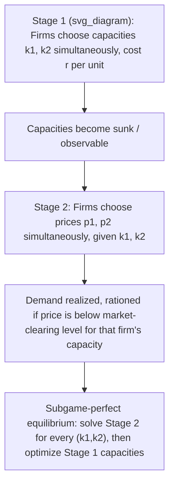

## Reconciling Cournot and Bertrand through Capacity Precommitment

### Overview

The Kreps-Scheinkman result addresses a long-standing tension in oligopoly theory: Cournot competition (quantity-setting) and Bertrand competition (price-setting) generate starkly different predictions for identical industries, yet both seem like plausible descriptions of firm behavior. Kreps and Scheinkman (1983) showed that when firms first commit to capacity and then compete in prices, the subgame-perfect equilibrium outcome replicates the Cournot quantities and Cournot price — even though the second stage is literally a Bertrand price game.

### The Underlying Puzzle

**Key Points**

- Cournot duopoly with linear demand and constant marginal cost predicts price above marginal cost and positive markups.
- Bertrand duopoly with homogeneous products and constant marginal cost predicts price collapses to marginal cost (the Bertrand paradox), even with only two firms.
- Empirically, industries with few firms rarely exhibit marginal-cost pricing, which suggests the Bertrand paradox is too extreme.
- The modeling question: what feature of real competition is Bertrand's assumption set missing?

The candidate answer is capacity. Bertrand's paradox relies on firms being able to costlessly and instantaneously serve the entire market at any price they choose. Real firms build plants, hire labor, and install equipment before they observe or set prices, and these commitments cap how much they can sell in the short run.

### The Two-Stage Game Structure

Kreps-Scheinkman embeds price competition inside a larger game with an earlier capacity-choice stage.

**Stage 1 (Capacity choice):** Firms $i = 1, 2$ simultaneously choose capacities $k_i \geq 0$ at a constant unit cost $r$ per unit of capacity. Capacity is sunk once chosen — it cannot be increased before Stage 2 and is costlessly available up to $k_i$ thereafter.

**Stage 2 (Price competition):** Having observed both capacities, firms simultaneously choose prices $p_i$. Demand is realized and must be rationed according to a specified rule if a firm's price is low enough to generate demand exceeding its capacity.

The equilibrium concept is subgame perfection: solve Stage 2 for every possible capacity pair $(k_1, k_2)$, then fold back to find the capacities that are mutually optimal given the anticipated Stage 2 outcome.

### Why Rationing Rule Choice Is Decisive

**Key Points**

- The result does not hold for arbitrary rationing rules; it depends critically on using the **efficient rationing rule** (also called the surplus-maximizing or Beckmann rationing rule).
- Under efficient rationing, when the low-price firm cannot serve the whole market, the consumers with the *highest* willingness to pay are served first at the low price, and the *residual demand curve* facing the high-price firm is the market demand curve shifted left by the low-price firm's capacity.
- This is the same residual demand construction used to define the low-price firm's best response and, critically, it is what generates the "efficient" allocation across consumers.
- An alternative, the **proportional rationing rule**, allocates each consumer to the low-price firm with probability equal to that firm's share of capacity relative to demand, regardless of willingness to pay. This rule generally does *not* deliver the Cournot outcome and can yield equilibria with dispersed or mixed-strategy pricing quite different from Cournot.

Efficient rationing means the residual demand curve facing a capacity-constrained firm at Stage 2 is:

$$D_2^{res}(p_2) = \max\{D(p_2) - k_1, 0\}$$

when firm 1 charges the lower price $p_1 < p_2$ and holds capacity $k_1$. This is exactly the residual demand a Cournot firm faces when computing its best response to a rival's quantity — this structural equivalence is the technical heart of the reconciliation.

### Solving Stage 2: Price Equilibrium Given Capacities

**Key Points**

- Given capacities $(k_1, k_2)$ that are both "small" relative to unconstrained monopoly/Bertrand demand (formally, both below the Cournot best-response capacities), no pure-strategy price equilibrium generally exists at arbitrary price levels except at one specific point.
- Kreps and Scheinkman show that for capacities in the empirically relevant range, the unique (pure-strategy, or appropriately characterized) equilibrium of the Stage 2 subgame has **both firms charging the market-clearing price** $p^*(k_1, k_2)$ — the price at which total demand exactly equals $k_1 + k_2$.
- Intuition: if a firm charged below the market-clearing price, it could not raise revenue enough to compensate for foregone margin, since it is already capacity-constrained and cannot sell more even at a lower price. If a firm charged above the market-clearing price, the rival — anticipating efficient rationing — captures the price-sensitive residual, but standard undercutting logic pushes both firms back toward the clearing price. Deviations are unprofitable because capacity limits what extra sales an undercut can generate.

The market-clearing price is defined implicitly by:

$$D(p^*) = k_1 + k_2$$

so that

$$p^* = P(k_1 + k_2)$$

where $P(\cdot) = D^{-1}(\cdot)$ is the inverse demand function. This is *exactly* the price that would prevail in a Cournot market where the two firms produced quantities $k_1$ and $k_2$.

### Solving Stage 1: Capacity Choice Replicates Cournot Quantities

**Key Points**

- Because Stage 2 always resolves to the market-clearing price $P(k_1 + k_2)$, each firm's Stage 1 profit function is:

  $$\pi_i(k_1, k_2) = P(k_1 + k_2) \cdot k_i - r k_i$$
- This is *identical in form* to the Cournot profit function, where quantities are chosen simultaneously and price is determined by inverse demand applied to total quantity, except marginal production cost is replaced by unit capacity cost $r$.
- The Stage 1 game is therefore mathematically equivalent to a Cournot game with marginal cost $r$. Its Nash equilibrium $(k_1^C, k_2^C)$ is the standard Cournot equilibrium capacities/quantities.
- Since Stage 2 prices always equal $P(k_1 + k_2)$, the overall subgame-perfect equilibrium price is $P(k_1^C + k_2^C)$ — the Cournot price.

**Conclusion:** the two-stage capacity-then-price game yields the Cournot outcome as its unique subgame-perfect equilibrium (for the relevant capacity range and efficient rationing), even though the observable, immediate decision variable in the final stage is price, not quantity.

### Worked Example (Linear Demand)

**Example**

Let inverse demand be $P(Q) = a - Q$, marginal capacity cost $r$, and two symmetric firms.

Cournot best response (with cost $r$): each firm's reaction function is $k_i = \dfrac{a - r - k_j}{2}$.

Symmetric solution:

$$k_1^C = k_2^C = \frac{a - r}{3}$$

Market-clearing price at Stage 2:

$$p^* = P(k_1^C + k_2^C) = a - \frac{2(a-r)}{3} = \frac{a + 2r}{3}$$

This is identical to the standard Cournot duopoly price with linear demand and marginal cost $r$. If instead the firms had played Bertrand directly (no capacity stage, or capacities set arbitrarily large), the equilibrium price would collapse to $p = r$ — the Bertrand paradox outcome. Capacity precommitment strictly raises the equilibrium price from $r$ to $\frac{a+2r}{3} > r$ (for $a > r$).

### Boundary Conditions and Caveats

**Key Points**

- **Capacity range:** the clean market-clearing-price result for Stage 2 holds only when capacities are not "too large." If capacities are large enough that one firm alone could serve the whole market profitably below the rival's price, undercutting incentives reappear and the analysis must consider mixed-strategy equilibria (Kreps-Scheinkman characterize these in the appendix of the original paper for the region above Cournot capacities).
- **Rationing rule sensitivity:** [Unverified — sensitive to modeling choice] Davidson and Deneckere (1986) showed that under proportional rationing rather than efficient rationing, the two-stage game does *not* generally converge to Cournot outcomes; prices can be lower than the Cournot price and mixed-strategy equilibria become more prevalent. This means the Kreps-Scheinkman reconciliation is not a rationing-free result — it depends on the specific (efficient) rationing assumption.
- **Homogeneous product assumption:** results are derived for a single homogeneous good; differentiated-product extensions require separate treatment and do not automatically inherit the same equivalence.
- **Two-stage timing assumption:** the reconciliation requires a genuine two-stage structure (capacity sunk and observed before price competition). If capacity and price are chosen simultaneously, or if capacity can be adjusted after observing rival prices, the equivalence breaks down.
- **Symmetric cost structure:** the clean symmetric solution above assumes identical unit capacity costs across firms; asymmetric costs preserve the general logic but complicate the closed-form solution.

### Economic Interpretation

**Key Points**

- The model reframes the Cournot/Bertrand distinction: rather than treating "quantity competition" and "price competition" as alternative descriptions of firm conduct, it shows they can be **two stages of the same underlying game**, with quantity-like commitments (capacity) determining the *effective* competitive intensity of the subsequent price stage.
- Cournot's quantity variable is reinterpreted not as a literal strategic choice but as a **reduced-form representation of capacity constraints** that firms build in advance of price-setting.
- This gives Cournot's traditionally ad hoc quantity-setting assumption a **micro-founded justification**: it need not be that firms literally choose "quantity" as their strategic variable; it suffices that they choose capacity ex ante and then compete on price ex post.
- Policy and antitrust implication: markets with firms that make large, sunk capacity investments prior to competing on price (e.g., power generation, semiconductor fabs, airlines w.r.t. seat capacity) are more likely to sustain Cournot-like markups than markets where capacity is fully flexible.

### Illustrative Diagram — Reduced-Form Equivalence

<svg xmlns="http://www.w3.org/2000/svg" viewBox="0 0 720 340" font-family="sans-serif">
<text x="360" y="24" text-anchor="middle" font-size="16" font-weight="bold">Kreps-Scheinkman Equivalence (svg_diagram)</text>
<rect x="30" y="60" width="280" height="90" fill="none" stroke="black" stroke-width="1.5" rx="6" />
<text x="170" y="85" text-anchor="middle" font-size="13" font-weight="bold">Cournot Game</text>
<text x="170" y="108" text-anchor="middle" font-size="12">Firms choose quantities q_i</text>
<text x="170" y="126" text-anchor="middle" font-size="12">Price = P(q1 + q2)</text>
<rect x="410" y="60" width="280" height="90" fill="none" stroke="black" stroke-width="1.5" rx="6" />
<text x="550" y="85" text-anchor="middle" font-size="13" font-weight="bold">Two-Stage Capacity-Price Game</text>
<text x="550" y="108" text-anchor="middle" font-size="12">Stage 1: choose capacity k_i</text>
<text x="550" y="126" text-anchor="middle" font-size="12">Stage 2: choose price p_i</text>
<line x1="310" y1="105" x2="410" y2="105" stroke="black" stroke-width="2" marker-end="url(#arrow)" />
<text x="360" y="95" text-anchor="middle" font-size="11">equivalent under</text>
<text x="360" y="120" text-anchor="middle" font-size="11">efficient rationing</text>
<rect x="220" y="190" width="280" height="110" fill="none" stroke="black" stroke-width="1.5" rx="6" />
<text x="360" y="212" text-anchor="middle" font-size="13" font-weight="bold">Shared Equilibrium Outcome</text>
<text x="360" y="235" text-anchor="middle" font-size="12">k1 = k2 = q1 = q2 = (a - r)/3</text>
<text x="360" y="253" text-anchor="middle" font-size="12">Price p* = P(k1 + k2) = (a + 2r)/3</text>
<text x="360" y="271" text-anchor="middle" font-size="12">Stage 2 always clears at Cournot price</text>
<line x1="170" y1="150" x2="320" y2="190" stroke="black" stroke-width="1.5" marker-end="url(#arrow)" />
<line x1="550" y1="150" x2="420" y2="190" stroke="black" stroke-width="1.5" marker-end="url(#arrow)" />
</svg>

### Contrast with Standard Bertrand and Cournot

| Model | Strategic variable | Equilibrium price | Key assumption driving result |
| --- | --- | --- | --- |
| Bertrand (unconstrained) | Price | $p = MC$ | Firms can serve unlimited demand at chosen price |
| Cournot | Quantity | $P(q_1^C + q_2^C) > MC$ | Firms directly choose output; price adjusts to clear market |
| Kreps-Scheinkman | Capacity, then price | $P(k_1^C + k_2^C)$ = Cournot price | Capacity sunk before pricing; efficient rationing in Stage 2 |

### Related Literature Extensions

**Key Points**

- **Davidson and Deneckere (1986):** relaxes the efficient rationing assumption and shows outcomes can diverge from Cournot under proportional rationing — establishing that rationing rule choice is not a technical footnote but a substantive driver of the result.
- **Osborne and Pitchik (1986):** analyze the region of capacities above the Cournot level, where mixed-strategy price equilibria emerge, extending the characterization of the Stage 2 subgame beyond the "small capacity" region.
- **Applications to endogenous timing:** the framework has been used to motivate why industries with large capital investment (e.g., utilities, chemicals, airlines) may sustain Cournot-like conduct despite firms nominally posting prices.
- **Contestability and entry:** related work asks how the capacity-precommitment logic interacts with entry threats and contestable markets literature, since sunk capacity can also serve as an entry deterrence signal (linking to Dixit-style strategic capacity models).

**Related Topics**

- Cournot model fundamentals and reaction functions
- Bertrand paradox and its resolutions (product differentiation, capacity constraints, repeated interaction)
- Efficient vs. proportional rationing rules in formal detail
- Dixit (1980) strategic capacity investment and entry deterrence
- Mixed-strategy price equilibria in capacity-constrained duopoly (Osborne-Pitchik)
- Cournot as a reduced form: general conditions under which multi-stage games collapse to Cournot outcomes
- Empirical tests of capacity-precommitment models in capital-intensive industries