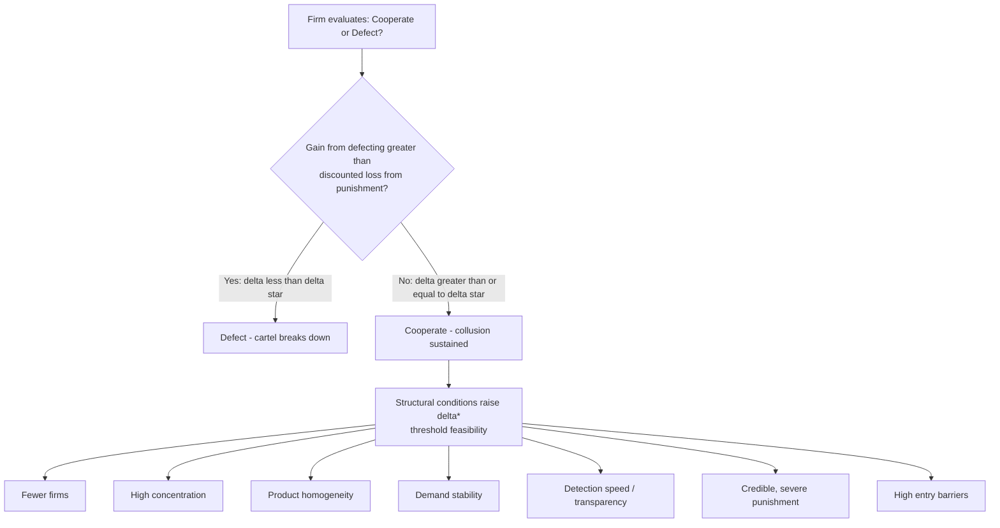

## Conditions Favoring Successful Collusion

### Definition and Scope

Collusion refers to a coordinated arrangement among firms in an oligopoly to restrict output, raise prices, or otherwise act as a joint profit-maximizing entity rather than compete independently. Collusion can be **explicit** (formal agreements, cartels) or **tacit** (parallel behavior sustained without direct communication). Its stability is not automatic — game-theoretic analysis shows that collusive outcomes are inherently vulnerable to unilateral defection, since any single firm can typically increase its own short-run profit by undercutting the agreed price or expanding output beyond the agreed quota. The "conditions favoring successful collusion" literature identifies the structural, strategic, and institutional features that make sustained cooperation more likely to survive this temptation to cheat.

### The Core Tension: Incentive to Cheat vs. Incentive to Cooperate

Collusion can be modeled as a repeated game. In a single-period (static) interaction, the Nash equilibrium in a homogeneous-goods oligopoly with price competition collapses to the competitive (Bertrand) outcome, since each firm has an incentive to undercut rivals. Collusion becomes sustainable only when the game is repeated indefinitely (or with an uncertain end point), allowing firms to use **trigger strategies**: cooperate as long as rivals cooperate, but revert to punishment (e.g., competitive pricing) if a rival deviates.

A firm will maintain collusion if the discounted value of continued cooperation exceeds the one-time gain from defection plus the discounted cost of subsequent punishment:

$$\frac{\pi^C}{1-\delta} \geq \pi^D + \delta \cdot \frac{\pi^P}{1-\delta}$$

where $\pi^C$ is the per-period collusive profit, $\pi^D$ is the one-period deviation (defection) profit, $\pi^P$ is the punishment-phase profit, and $\delta$ is the discount factor. Rearranging gives the **critical discount factor** $\delta^*$ above which collusion is sustainable:

$$\delta \geq \delta^* = \frac{\pi^D - \pi^C}{\pi^D - \pi^P}$$

All of the structural conditions discussed below operate by either raising $\delta$ (patience, likelihood of repeated interaction), lowering $\pi^D$ (the temptation to cheat), or raising the severity/credibility of $\pi^P$ (the punishment).

### Structural Market Conditions

**Number and Concentration of Firms**

Collusion is easier to sustain with fewer firms. A smaller number of participants reduces coordination costs, makes monitoring feasible, and increases each firm's individual stake in maintaining the arrangement. High market concentration (high Herfindahl-Hirschman Index) is empirically associated with a higher incidence of successful cartels, since fewer independent decision-makers must agree on and adhere to terms.

**Symmetry Among Firms**

Cartels are more stable when firms have similar cost structures, market shares, capacity, and product lines. Symmetric firms tend to agree more easily on a focal collusive price or output allocation, since asymmetric costs create conflicting preferences over the profit-maximizing collusive price — a low-cost firm prefers a lower price than a high-cost firm would. Symmetry also simplifies allocation rules (e.g., equal market-share quotas), reducing bargaining friction during cartel formation.

**Product Homogeneity**

When products are largely undifferentiated (commodities such as cement, steel, or bulk chemicals), price is the primary competitive variable and is easy to monitor and compare across firms. Differentiated products complicate collusion because quality, features, and brand positioning create multiple dimensions along which firms could covertly compete (non-price rivalry), making deviations harder to detect and agreements harder to specify.

**High Entry Barriers**

Successful collusion requires that supra-competitive profits not attract new entrants, which would expand output and undermine the restricted supply. Barriers such as economies of scale, control of essential inputs, patents, licensing requirements, high sunk costs, or network effects protect the incumbent cartel's rents. Without such barriers, entry erodes collusive profits even if incumbents perfectly coordinate.

### Conditions Affecting Detection and Monitoring

**Market Transparency**

Collusion is easier to sustain when firms can observe rivals' prices, output, or sales relatively quickly and accurately. Transparent markets — for example, those with public price lists, standardized products, or centralized exchanges — make deviations from the agreed price immediately visible, shortening the lag between a defection and its detection and punishment. Opaque markets with individually negotiated contracts, rebates, or bundled pricing make secret discounting harder to detect, which weakens collusive discipline.

**Frequency of Interaction**

Frequent, regular transactions (e.g., firms competing for many small orders per year rather than a few large, infrequent contracts) allow faster detection of cheating and quicker retaliation, raising the effective cost of defection relative to its one-time gain. Infrequent large-contract markets (e.g., government procurement auctions held once every few years) provide long windows in which a single large defection can be highly profitable before punishment arrives.

**Multi-Market Contact**

Firms that compete against each other in several distinct markets simultaneously can support collusion in one market by threatening retaliation across all shared markets. This broadens the punishment's scope and severity relative to the gain available in any single market, raising the effective punishment term $\pi^P$ used in the discount-factor condition above. This mechanism is well documented in the industrial organization literature on multimarket contact (e.g., Bernheim and Whinston, 1990).

### Demand-Side and Macroeconomic Conditions

**Demand Stability**

Stable or predictably growing demand makes it easier for firms to distinguish a rival's price cut (a defection) from a legitimate response to a demand shock. In volatile or cyclically fluctuating demand environments, it is harder to tell whether a fall in a rival's price/output reflects cheating or an optimal reaction to changing market conditions — this ambiguity, formalized in models of collusion under imperfect monitoring (notably Green and Porter, 1984), can trigger costly price wars even absent actual defection, or conversely can mask genuine cheating.

**Excess Capacity and Business Cycle Position**

Cartels are more vulnerable during demand downturns because the short-run gain from undercutting rivals (capturing a larger share of a shrinking pie) rises relative to the value of maintained cooperation, while firms burdened with idle capacity face stronger incentives to defect and boost utilization. Historically, cartel breakdowns are correlated with recessions and periods of substantial excess capacity.

**Low Buyer Power / Fragmented Buyers**

Collusion is easier to sustain against numerous small, dispersed buyers with limited bargaining power than against a few large, sophisticated buyers who can negotiate individually, play sellers off against each other, or credibly threaten to vertically integrate or switch suppliers. Concentrated buyer power undermines cartel discipline by giving buyers the ability to solicit and exploit secret discounts.

### Strategic and Institutional Conditions

**Credible and Severe Punishment Mechanisms**

For a trigger strategy to deter defection, the threatened punishment (e.g., reversion to Bertrand competition, or an explicit price war) must be both credible (rational for firms to actually carry out) and sufficiently severe. Simple "grim trigger" strategies (permanent reversion to competition) are theoretically effective but may be too harsh to be credible in practice; **optimal penal codes** (Abreu, 1986, 1988) show that the most severe *credible* punishment consistent with subsequent equilibrium play maximizes the sustainable collusive profit.

**Communication and Facilitating Practices**

Explicit cartels benefit from mechanisms that reduce coordination and monitoring costs: trade associations that aggregate and publish price/output data, standardized price-announcement practices, price leadership by a dominant firm, or resale price maintenance. These "facilitating practices" can sustain tacit or explicit coordination even without formal, legally enforceable agreements (which are unenforceable in court in most jurisdictions since cartels are per se illegal under most competition law regimes, e.g., Sherman Act §1 in the U.S., Article 101 TFEU in the EU).

**Low Probability or Cost of Detection/Enforcement by Antitrust Authorities**

The expected legal cost of collusion — probability of detection multiplied by the magnitude of fines, damages, or criminal penalties, discounted appropriately — factors into the profitability calculus. Weak antitrust enforcement, low fines relative to cartel profits, or the absence of leniency/whistleblower programs increase the expected net payoff to collusion. Conversely, robust enforcement (frequent dawn raids, large fines, individual criminal liability, and effective **leniency programs** that reward the first defector to report the cartel) directly destabilizes collusion by increasing the effective cost of participation and by reintroducing a strong individual incentive to defect (to the authorities, not just on price).

**Firm Patience / Long Time Horizons**

Consistent with the discount-factor condition, collusion is more sustainable among firms with low discount rates (i.e., that place high value on future profit streams) — for example, firms with long expected life spans, stable ownership, or low managerial turnover, since managers who expect to reap the benefits of future cooperation are less tempted by short-run deviation gains.

### Summary Table of Conditions

| Condition | Effect on Collusion Sustainability |
| --- | --- |
| Few firms / high concentration | Favors collusion |
| Symmetric costs and market shares | Favors collusion |
| Homogeneous product | Favors collusion |
| High entry barriers | Favors collusion |
| High market transparency | Favors collusion |
| Frequent, small transactions | Favors collusion |
| Multimarket contact | Favors collusion |
| Stable, predictable demand | Favors collusion |
| Fragmented, low-power buyers | Favors collusion |
| Credible punishment mechanisms | Favors collusion |
| Facilitating institutions (trade associations, price leadership) | Favors collusion |
| Weak antitrust enforcement / no leniency program | Favors collusion |
| Demand volatility / recession | Undermines collusion |
| Excess capacity | Undermines collusion |
| Large, powerful buyers | Undermines collusion |
| Infrequent, large "lumpy" contracts | Undermines collusion |
| Product differentiation | Undermines collusion |
| Low entry barriers | Undermines collusion |
| Strong antitrust enforcement + leniency programs | Undermines collusion |

### Illustrative Numerical Example

Suppose two symmetric firms face collusive profit $\pi^C = 50$ per period, a one-period deviation profit $\pi^D = 80$, and a post-deviation (Bertrand) punishment profit $\pi^P = 20$, sustained forever after a deviation. The critical discount factor is:

$$\delta^* = \frac{80 - 50}{80 - 20} = \frac{30}{60} = 0.5$$

Collusion is sustainable as long as firms' discount factor $\delta \geq 0.5$ — i.e., firms must value next period's profit at least half as much as this period's. [Inference] If market transparency improves such that a defection is detected and punished one period sooner than before, the effective $\pi^D$ available before punishment falls, lowering $\delta^*$ and making collusion sustainable for a wider range of firm patience levels — this directional relationship is a standard theoretical implication of repeated-game monitoring models, though the precise magnitude is context- and model-specific.

### Historical and Empirical Illustrations

Classic cartel case studies consistent with these conditions include the international electrical equipment cartels of the 1950s-60s, OPEC's oil production coordination (concentrated among few large producers with homogeneous product, though undermined at times by demand volatility and cheating incentives among smaller members), and the lysine and vitamins cartels prosecuted in the 1990s (facilitated by frequent industry association meetings and transparent commodity pricing). [Unverified] Specific quantitative estimates of cartel overcharge magnitudes vary substantially across studies and industries and should be sourced from the specific empirical literature (e.g., Connor's cartel overcharge meta-studies) rather than treated as fixed constants.

### Related Topics

- Cartel stability and the Prisoner's Dilemma in repeated games
- Trigger strategies and optimal penal codes (Abreu)
- Green-Porter model of collusion under imperfect price monitoring
- Antitrust leniency (amnesty) programs and their effect on cartel deterrence
- Tacit collusion vs. explicit collusion: legal distinctions
- Price leadership models (dominant firm / barometric)
- Multimarket contact theory (Bernheim and Whinston)
- Bertrand vs. Cournot competition as punishment benchmarks
- Facilitating practices and information exchange under competition law