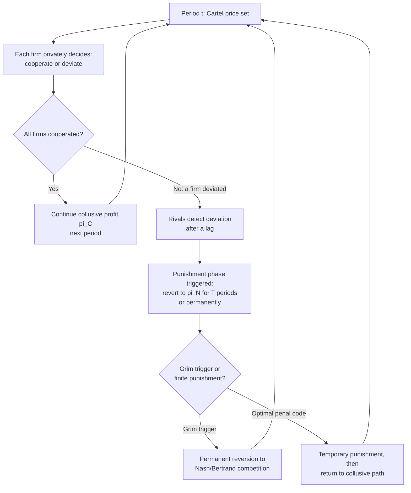

## Repeated Interaction and Cartel Sustainability

### Definition and Scope

Repeated interaction refers to the setting in which oligopolistic firms compete against the same rivals over multiple periods rather than in a single, one-shot encounter. This repetition is the central theoretical mechanism that makes collusion a rational equilibrium strategy rather than an unstable, immediately-abandoned agreement. In a **one-shot game**, dominant-strategy incentives push firms toward the competitive (Bertrand/Cournot) outcome even if they would jointly prefer to collude, since there is no future period in which defection can be punished. Repetition introduces the possibility of **conditional cooperation**: firms sustain collusive prices or output restrictions today because they value the stream of future collusive profits and fear retaliation if they cheat.

### The Folk Theorem and the Foundation of Sustainable Collusion

The **Folk Theorem** of repeated games establishes that in an infinitely (or indefinitely) repeated game, any individually rational payoff — including the fully collusive (joint-profit-maximizing) payoff — can be supported as a subgame-perfect Nash equilibrium, provided firms are sufficiently patient (i.e., the discount factor $\delta$ is high enough). This is the theoretical bridge between the static Bertrand paradox (price collapses to marginal cost with just two firms) and the observed reality that real-world oligopolies frequently sustain prices well above competitive levels.

The Folk Theorem does not claim collusion *will* occur — it establishes that collusion is *one of many possible equilibria*, alongside the competitive outcome and a continuum of intermediate outcomes. This multiplicity is itself an important analytical point: repeated games do not uniquely predict collusion, they merely make it *sustainable*.

### Formal Sustainability Condition

Consider a symmetric duopoly repeated infinitely, with firms sharing a common discount factor $\delta \in (0,1)$, representing the probability the game continues to the next period times the pure time-value discount. Let:

- $\pi^C$ = per-period profit under continued collusion
- $\pi^D$ = one-period profit from defecting (undercutting) while rivals still cooperate
- $\pi^N$ = per-period profit reverting to the non-cooperative (Nash/Bertrand) equilibrium after detection

A firm compares the present value of perpetual cooperation to the present value of defecting once and then suffering permanent punishment (grim trigger strategy):

$$V^{Cooperate} = \pi^C + \delta\pi^C + \delta^2\pi^C + \dots = \frac{\pi^C}{1-\delta}$$

$$V^{Deviate} = \pi^D + \delta\pi^N + \delta^2\pi^N + \dots = \pi^D + \frac{\delta\pi^N}{1-\delta}$$

Collusion is sustainable (i.e., cooperation is a best response) if $V^{Cooperate} \geq V^{Deviate}$, which rearranges to the **critical discount factor**:

$$\delta \geq \delta^* = \frac{\pi^D - \pi^C}{\pi^D - \pi^N}$$

This single inequality is the formal core of "repeated interaction and cartel sustainability": collusion survives exactly when firms are patient enough ($\delta$ high) relative to the temptation to cheat ($\pi^D - \pi^C$) and the severity of punishment ($\pi^D - \pi^N$).

### Trigger Strategies

**Grim Trigger Strategy**

The simplest punishment rule: cooperate until any deviation is observed, then defect (play the Nash equilibrium) forever after. Grim trigger strategies are the most severe possible punishment and thus support collusion for the widest possible range of $\delta$, but their extreme severity can make them non-credible in richer settings (firms may find it individually irrational to punish forever once punishment actually becomes necessary, particularly if punishment is also costly for the punisher).

**Tit-for-Tat and Finite Punishment**

Alternative strategies punish defection for a limited number of periods before returning to collusion. This trades off some deterrence power (a shorter punishment is a smaller threat) for greater credibility and resilience to occasional mistakes or misread signals.

**Optimal Penal Codes (Abreu)**

Abreu (1986, 1988) showed that the *harshest credible* punishment — not necessarily infinite reversion to Nash — maximizes the sustainable collusive payoff. In some settings, an optimal punishment involves a short, intense "price war" (even below Nash/marginal-cost pricing to inflict maximal pain) followed by a return to collusion, rather than permanent competitive pricing. This generates the sharpest possible deterrent while remaining a credible, self-enforcing equilibrium strategy.

### Factors That Strengthen Repeated-Game Sustainability

**Higher Discount Factor / Patience**

$\delta$ increases with lower firm-specific discount rates, higher expected probability of continued market interaction (low expected firm exit or industry disruption), and lower interest rates or lower perceived risk of the relationship ending. A firm expecting to compete against the same rivals for decades weighs future collusive profit far more heavily than one facing frequent entry/exit or expected industry disruption.

**Detection Speed**

The shorter the lag between a defection and its detection, the smaller the one-period deviation profit $\pi^D$ effectively becomes in present-value terms (since punishment arrives sooner), which lowers $\delta^*$ and widens the range of firms and market conditions for which collusion is an equilibrium.

**Severity of Available Punishment**

A wider gap between $\pi^D$ and $\pi^N$ — i.e., a punishment phase that inflicts substantial pain relative to the collusive baseline — increases the deterrent effect and lowers $\delta^*$. This is why some optimal penal codes involve punishment prices *below* the static Nash price: the deeper the punishment, the smaller $\delta^*$ needs to be for collusion to hold.

**Frequency of Interaction**

More frequent rounds of competition (e.g., daily pricing decisions vs. annual contract bidding) compress the same calendar time into more discrete "periods" of the repeated game, effectively increasing the number of opportunities for detection and retaliation per unit of real time, which functions similarly to raising $\delta$ in per-period terms.

### Imperfect Monitoring and the Green-Porter Model

Green and Porter (1984) extended the analysis to settings where firms cannot directly observe rivals' actions — they can only observe a noisy public signal, such as the market price, which is affected by both collusive behavior and random demand shocks. In this setting, firms cannot distinguish "a rival secretly cheated" from "demand fell for exogenous reasons," so a simple grim trigger becomes both too blunt (punishing during any low-price period, even absent cheating) and potentially non-credible.

The Green-Porter equilibrium instead involves periodic **price wars that occur on the equilibrium path even without actual cheating** — triggered whenever the observed price falls below some threshold, regardless of the true cause. These episodic reversions to competitive pricing are the necessary cost of maintaining collusion under imperfect information; they are not evidence of cartel failure but rather the deterrence mechanism working exactly as designed. [Inference] This is a widely accepted theoretical characterization of markets like historical price movements observed in some U.S. wholesale electricity or shipping cartels, but attributing any specific observed price war to Green-Porter dynamics versus a genuine cartel breakdown must be empirically substantiated case by case rather than assumed.

### Factors That Undermine Repeated-Game Sustainability

**Finite, Known Horizon: Backward Induction Unraveling**

If the game has a known, finite end date (e.g., a fixed-term joint venture or a market known to disappear at a certain date), the Folk Theorem's infinite-repetition logic breaks down. Using **backward induction**: in the final period, there is no future to protect, so all firms defect (static Nash). Anticipating this, all firms also defect in the second-to-last period (since the "reward" of continued cooperation into the final period is worthless), and this logic unravels all the way to period 1 — full collusion collapses even in period 1 under standard backward induction with common knowledge of the end date and payoffs. [Inference] In practice, real-world cartels with finite horizons sometimes still sustain partial or high levels of cooperation because of factors outside the strict theoretical model — reputational spillovers into other markets, uncertainty about the exact end date, or bounded rationality — but the pure finite-horizon prediction is full unraveling.

**Uncertain Continuation Probability**

If there is a positive probability $p$ that the relationship ends exogenously each period (e.g., risk of firm exit, market disruption, or regulatory shutdown), the effective discount factor becomes $\delta(1-p)$, reducing sustainability. Highly volatile or nascent industries with high firm turnover are therefore less conducive to stable collusion even absent any legal risk.

**Low-Frequency, High-Value Transactions**

Markets characterized by large, infrequent, lumpy contracts (e.g., government procurement, large infrastructure tenders) offer a very large one-time deviation payoff $\pi^D$ relative to the value of the ongoing relationship, since the next opportunity to "cooperate" may be years away. This structurally raises $\delta^*$ and makes collusion harder to sustain absent other stabilizing mechanisms (e.g., bid-rotation schemes explicitly designed to address this).

**New Entrants and Changing Firm Composition**

The repeated game logic assumes a relatively stable set of players who can build and rely on reputations. Frequent entry and exit disrupts this — new entrants have no established relationship or credible way of signaling long-term commitment to the cartel, and incumbents cannot be certain a new entrant's threshold $\delta$ or payoff structure supports cooperation, increasing coordination costs and defection risk.

### Numerical Example: Effect of Detection Lag

Suppose $\pi^C = 40$, $\pi^N = 15$ per period. With **immediate detection** (one-period lag), $\pi^D = 70$:

$$\delta^*_{immediate} = \frac{70-40}{70-15} = \frac{30}{55} \approx 0.545$$

If detection instead takes **two periods** (the deviating firm enjoys the deviation profit for two periods before punishment begins), the deviation value becomes $\pi^D + \delta\pi^D$ instead of just $\pi^D$, materially raising the effective temptation and thus raising $\delta^*$ — collusion requires firms to be substantially more patient to remain sustainable when detection is slow. [Inference] The exact magnitude of this shift depends on the specific extensive-form specification of the delayed-detection game; the qualitative direction (slower detection → higher $\delta^*$ → harder to sustain) is a standard and robust theoretical result.

### Empirical and Policy Relevance

Antitrust economics uses the repeated-game framework directly: leniency (amnesty) programs are designed to lower the effective $\delta$ firms perceive by introducing a large, immediate, and firm-specific payoff to defecting *to the authorities* rather than on price, which is a powerful deviation temptation that standard cartel punishment mechanisms cannot counteract (since punishing a whistleblower firm via price war is largely ineffective once the cartel itself has been prosecuted). This is why leniency programs have proven especially effective at destabilizing cartels relative to price-based enforcement alone.

### Related Topics

- The Folk Theorem in repeated games
- Grim trigger vs. optimal penal codes (Abreu, 1986/1988)
- Green-Porter model of collusion under imperfect monitoring
- Backward induction and finite-horizon game unraveling
- Bid-rigging and bid-rotation schemes in procurement markets
- Antitrust leniency programs and their game-theoretic rationale
- Reputation effects and multimarket contact
- Discount factors and firm time horizons in industrial organization