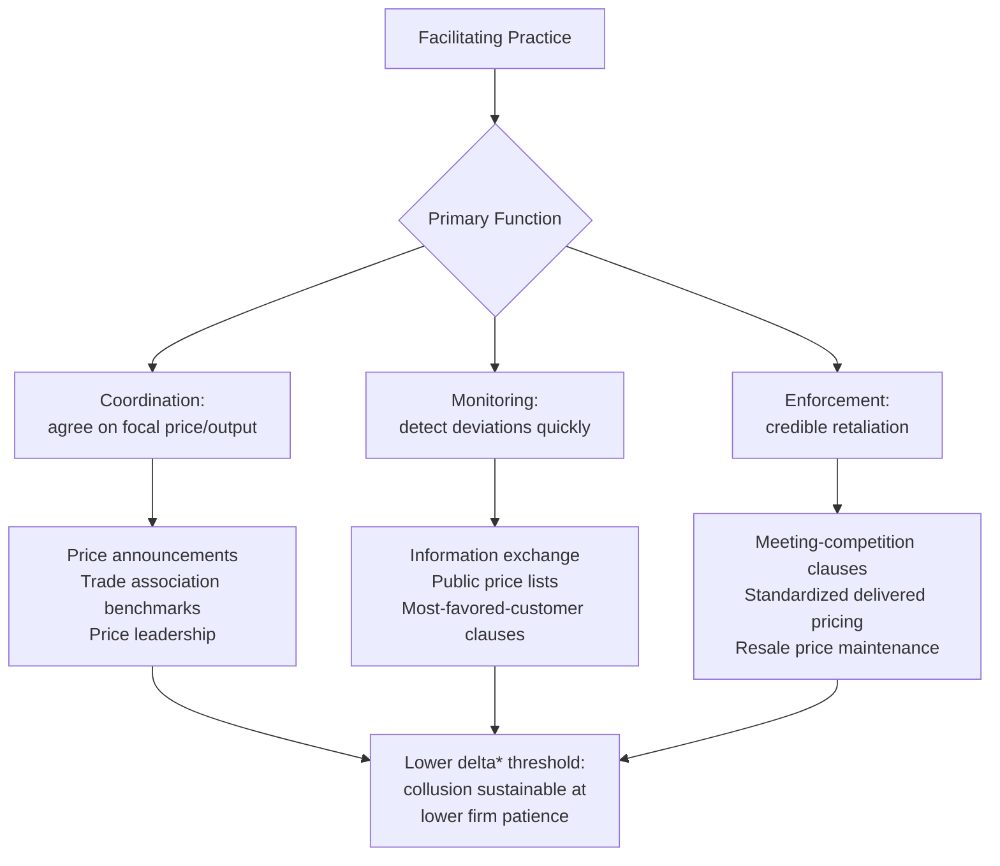

## Facilitating Practices and Information Exchange

### Definition and Scope

Facilitating practices are business conduct and institutional mechanisms that make coordinated pricing or output restriction easier to reach, monitor, and enforce, without necessarily constituting an explicit, legally enforceable cartel agreement. They operate by reducing the transaction costs of collusion identified in repeated-game theory: the costs of *reaching* a coordinated point (coordination problem), *detecting* deviations (monitoring problem), and *credibly punishing* deviations (enforcement problem). Facilitating practices are of particular interest in industrial economics and competition law because they frequently occupy a legal gray zone — falling short of a per se illegal price-fixing agreement while still producing collusive or supra-competitive outcomes.

### Theoretical Role in Sustaining Collusion

Recall the sustainability condition from repeated-game theory:

$$\delta \geq \delta^* = \frac{\pi^D - \pi^C}{\pi^D - \pi^N}$$

Facilitating practices work by shifting the components of this inequality in directions that favor collusion:

- **Lowering the effective temptation to cheat** ($\pi^D$) by making secret discounting harder to execute profitably
- **Raising the probability and speed of detection**, which functionally lowers the present value of any deviation
- **Reducing the coordination cost** of initially selecting and maintaining a common focal price or output level
- **Strengthening the credibility of punishment** by making rivals' compliance and non-compliance observable

### Categories of Facilitating Practices

**Price Announcements and Advance Notice**

Public, advance announcement of price changes (rather than immediate, silent implementation) allows rivals to observe and match a price increase before it takes effect, reducing the risk that a firm which raises price alone loses market share to non-announcing rivals. This transforms price-setting into an implicitly sequential, observable process even without direct agreement.

**Most-Favored-Customer (MFC) Clauses**

Contractual clauses guaranteeing a buyer that it will receive any lower price the seller offers to other customers. While ostensibly pro-competitive/pro-consumer on their face, MFC clauses reduce a seller's incentive to offer secret, targeted discounts to win business from rivals, since any such discount would have to be extended to *all* MFC customers, dramatically raising the effective cost of deviation ($\pi^D$ falls). This is a textbook example of a practice that appears consumer-protective but can facilitate tacit collusion.

**Meeting-Competition and Most-Favored-Nation Clauses**

Clauses guaranteeing to match (but not necessarily beat) any lower competitor price. These reduce customers' incentive to actively shop for lower prices (since the incumbent will simply match), softening price competition and reducing the payoff from a rival's price cut, thereby weakening the incentive to initiate one.

**Standardized or Delivered (Basing-Point) Pricing**

Uniform delivered-pricing systems, where all firms quote an identical delivered price to a given customer regardless of the seller's actual location (historically associated with the U.S. "Pittsburgh Plus" steel pricing system), eliminate freight-cost-based price variation as a competitive lever and make price comparison across sellers trivial for both rivals and antitrust authorities.

**Trade Association Data Exchange**

Trade associations that collect and redistribute aggregated, and especially *disaggregated* or *firm-identifiable*, information on prices, output, capacity utilization, or costs substantially lower the cost of monitoring rivals' behavior. This is one of the most heavily scrutinized categories under modern competition law because it can arise from ostensibly legitimate industry benchmarking activities.

**Resale Price Maintenance (RPM)**

Vertical agreements in which a manufacturer sets minimum resale prices for its distributors/retailers. While primarily a vertical restraint, RPM can facilitate horizontal collusion among manufacturers by making it easier to monitor whether rivals' *effective* prices to consumers (via their retailers) have deviated from an implicit understanding, since retail prices are far more visible than manufacturer wholesale terms.

**Uniform/Standardized Product and Contract Terms**

Industry-wide standardization of product specifications, contract terms, or billing formats (beyond what interoperability strictly requires) reduces the number of dimensions along which firms can compete, channeling all competitive pressure onto the single, easily monitored dimension of price — making collusion on that single dimension both easier to reach and easier to police.

### Information Exchange: Theoretical Effects

Economic theory distinguishes information exchange effects by several dimensions:

**Type of Information**

- *Historical/aggregated data* (e.g., past total industry shipments) is generally viewed as less likely to facilitate collusion, since it cannot be used to detect an individual rival's current deviation.
- *Individualized, current, or future-looking data* (e.g., firm-specific future price intentions or planned output) is far more collusion-facilitating, since it directly supports both coordination on a focal point and real-time monitoring of compliance.

**Frequency**

More frequent exchange (e.g., real-time or daily data) supports tighter monitoring and faster detection of deviations, strengthening collusive sustainability per the repeated-game logic above (shorter detection lag → smaller effective $\pi^D$ → lower $\delta^*$).

**Market Structure Context**

Information exchange is generally considered more concerning (from a competition-policy standpoint) in already-concentrated markets with homogeneous products and high entry barriers — i.e., markets where the other structural conditions for collusion (see "Conditions favoring successful collusion") are already present. In markets with many firms, differentiated products, or low concentration, the same information exchange is less likely to be collusion-facilitating because coordination is already difficult on structural grounds.

### Legal and Policy Treatment

**Per Se Illegality vs. Rule of Reason**

Direct price-fixing or output-restriction agreements are typically treated as *per se* illegal under major competition law regimes (e.g., Sherman Act §1 in the United States; Article 101(1) TFEU in the European Union), meaning no defense based on reasonableness or pro-competitive justification is permitted once the conduct is established. Facilitating practices and information exchange, by contrast, are generally analyzed under a **rule of reason** standard, weighing pro-competitive justifications (e.g., legitimate benchmarking, demand forecasting, or reducing information asymmetry for buyers) against anticompetitive effects.

**Concerted Practice Doctrine (EU)**

EU competition law recognizes "concerted practices" as a distinct, intermediate category between independent unilateral conduct and formal agreement — covering coordination that falls short of an explicit contract but goes beyond independent parallel behavior, particularly where firms have exchanged strategic information that reduces uncertainty about rivals' future conduct. [Unverified] The precise evidentiary threshold and current enforcement posture vary by jurisdiction and have evolved through case law (e.g., the *T-Mobile Netherlands* and related European Court of Justice jurisprudence); specific current legal standards should be verified against up-to-date primary legal sources rather than treated as static.

**Safe Harbors and Guidance**

Antitrust authorities (e.g., the U.S. FTC/DOJ and the European Commission) have issued guidance distinguishing generally lawful information-sharing practices (e.g., third-party aggregated and sufficiently historical data, disseminated broadly including to consumers) from higher-risk practices (e.g., direct firm-to-firm exchange of individualized, current, forward-looking pricing intentions).

### Distinguishing Facilitating Practices from Efficient Market Institutions

[Inference] Not all transparency-enhancing or information-sharing institutions are anticompetitive; many (e.g., public commodity exchanges, standardized product grading, consumer price-comparison platforms) primarily reduce search costs and information asymmetry for *buyers*, which is generally pro-competitive. The economic distinction that competition authorities and scholars generally draw is *who benefits* from the reduced uncertainty — mechanisms that primarily reduce uncertainty *among competing sellers* about each other's conduct raise collusion concerns, while those that primarily reduce uncertainty *for buyers* about sellers' offerings tend to intensify competition. This distinction is a widely used analytical heuristic in the literature but requires case-specific economic analysis to apply, since some institutions (e.g., published price lists) can plausibly serve both functions simultaneously.

### Numerical Illustration: Detection Lag and Facilitating Practices

Suppose a market without any facilitating practice has a detection lag of 3 periods, giving a high deviation payoff $\pi^D_{slow} = \pi^D_0 + \delta\pi^D_0 + \delta^2\pi^D_0$ before punishment begins (a firm enjoys the deviation profit for three periods). If a trade association introduces monthly disaggregated price reporting, cutting the detection lag to 1 period, the deviation payoff falls to just $\pi^D_0$ — substantially lowering $\delta^*$ and making collusion sustainable across a much wider range of underlying firm patience levels, even though no explicit price agreement was ever reached. This illustrates why information exchange alone, absent any formal agreement, can be economically equivalent in effect to strengthening a cartel's enforcement mechanism.

### Related Topics

- Conditions favoring successful collusion (structural determinants)
- Repeated interaction and cartel sustainability (game-theoretic foundations)
- Tacit collusion vs. explicit collusion: legal and economic distinctions
- Concerted practices doctrine under EU competition law (Article 101 TFEU)
- Sherman Act §1 and per se vs. rule of reason analysis
- Price leadership models and focal-point coordination
- Antitrust leniency programs and cartel destabilization
- Vertical restraints: resale price maintenance and its horizontal spillover effects