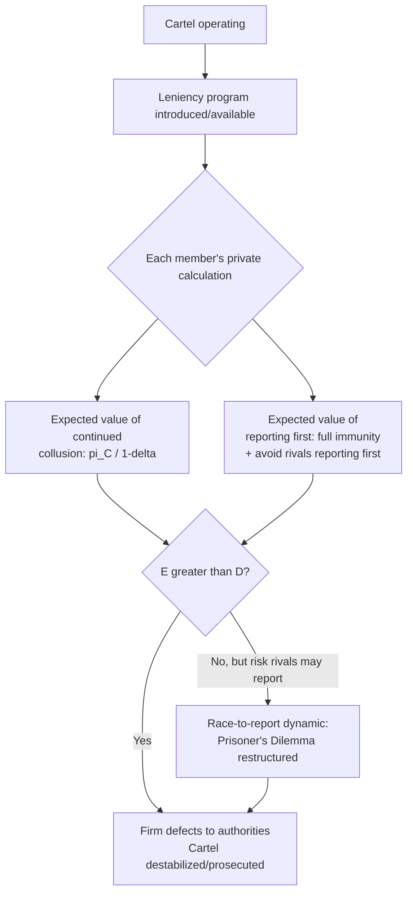

## Cartel Detection, Leniency Programs, and Destabilization

### Definition and Scope

This topic covers the mechanisms — economic, institutional, and legal — through which cartels are identified, prosecuted, and structurally undermined. While the sustainability conditions discussed elsewhere in this chapter explain how collusion can be a stable equilibrium, this topic addresses the countervailing forces, especially antitrust enforcement architecture, that push firms' effective discount factor $\delta$ below the sustainability threshold $\delta^*$ or otherwise disrupt the self-enforcing cartel equilibrium. Leniency programs occupy the center of modern enforcement policy because they attack collusion's core game-theoretic vulnerability: the individual incentive to defect, redirected from price-cutting toward disclosure.

### The Detection Problem

Cartels are secret arrangements by design, leaving few traces reliably distinguishable from legitimate parallel conduct — this is especially true for tacit collusion or facilitating practices that fall short of an explicit agreement. Three detection channels dominate in practice:

**Structural and Behavioral Screens**

Quantitative techniques flag markets exhibiting statistical patterns associated with collusion: unusually stable market shares over time, prices that fail to track underlying cost or demand shocks, or bid-rigging signatures in procurement data (e.g., regular bid rotation, or cover bids submitted just above a pre-designated winner). [Inference] Screens generate investigative leads rather than standalone legal proof, since a flagged anomaly is often also consistent with innocent explanations such as a common cost shock hitting all firms simultaneously; screens are typically a starting point for deeper investigation.

**Complaints and Whistleblowers**

Customers, excluded competitors, or internal employees may report suspected collusive conduct directly.

**Leniency (Amnesty) Applications**

The dominant modern detection channel: a cartel participant voluntarily discloses the arrangement, typically in exchange for reduced or eliminated penalties.

### Leniency Programs: Mechanism Design

**Core Logic**

Leniency programs restructure the payoff matrix of the underlying repeated game by introducing a large, immediate, firm-specific payoff to defection-via-disclosure — a channel that standard intra-cartel punishment (price war, exclusion) cannot counteract, since threatening a firm that has already secured immunity and triggered prosecution offers little deterrent value.

**First-Mover Immunity Structure**

Modern leniency programs, modeled substantially on the U.S. Department of Justice Corporate Leniency Policy (established 1978, revised 1993) and the EU Leniency Notice (first adopted 2002), typically grant full immunity from fines — and, in jurisdictions with criminal cartel enforcement, from criminal prosecution — only to the **first** cartel member to report, contingent on conditions such as:

- Being first to provide evidence before an investigation opens, or providing evidence that significantly advances an existing one
- Terminating cartel participation
- Providing full, continuing, complete cooperation
- Not having instigated or coerced others' participation (in some program variants)

Subsequent applicants typically receive only partial, sliding-scale fine reductions, generating a strong **race-to-the-door** dynamic once any member suspects discovery risk or that a rival might apply first.

**Effect on Cartel Sustainability**

Leniency programs operate outside the standard $\delta \geq \delta^*$ price-deviation framework by introducing a distinct, asymmetric payoff structure. A firm now weighs not just $\pi^C$ vs. a price-cutting deviation $\pi^D$, but also:

$$V^{Report} = \text{immunity value} - \text{cost of cartel unwinding} + P(\text{rival reports first}) \times (\text{penalty if not first})$$

As a firm's perceived probability that some rival will eventually report rises, its own incentive to preempt by reporting first rises correspondingly — a self-reinforcing destabilization dynamic once leniency programs are credible and well-publicized.

### The Prisoner's Dilemma Restructuring

Leniency programs convert the reporting-stage decision into a structure resembling a **Prisoner's Dilemma**: if all firms stay silent, they share cartel profits (good collectively, but requires mutual trust); if one firm reports while others stay silent, the reporter secures full immunity while others face maximal penalties; if all firms report, penalties are reduced for everyone but each still incurs some fine. This generates a dominant incentive to report once a firm perceives any non-negligible probability that a rival might report first — mirroring the classic dilemma's logic of individually rational but collectively costly defection.

### Empirical Effectiveness

[Inference] The introduction and strengthening of leniency programs — particularly the U.S. 1993 revision, which introduced automatic amnesty for qualifying first-in applicants, and the EU's subsequent adoption — is widely credited in the economics and legal literature with substantially increasing cartel detection and prosecution from the mid-1990s onward. Precise causal attribution and quantitative deterrence estimates vary across empirical studies (e.g., Miller, 2009, and subsequent replications/critiques) and should be sourced from that specific literature rather than treated as settled figures.

**Deterrence vs. Detection Trade-off**

A theoretical subtlety: leniency programs unambiguously raise the *detection* of existing cartels, but their effect on *ex ante deterrence* — discouraging cartel formation in the first place — is more ambiguous. [Speculation] Some models suggest that if leniency makes cartels more likely to be caught but with lower *expected* penalties per firm (since the first reporter avoids fines and remaining fines are discounted on a sliding scale), the net expected cost of *forming* a cartel could, in some parameter ranges, fall for potential future cartelists — partially offsetting deterrence. This remains an actively debated question in the industrial organization and law-and-economics literature rather than a settled empirical conclusion.

### Other Destabilization Mechanisms

**Merger Control and Structural Remedies**

Blocking mergers that would raise concentration in markets already prone to coordinated effects — or, in extreme historical cases, mandating divestiture — directly attacks the "few firms / high concentration" structural condition for collusion.

**Private Litigation and Treble Damages**

In jurisdictions permitting private antitrust enforcement (notably the U.S., where successful plaintiffs can recover treble damages under the Clayton Act), the prospect of large follow-on civil litigation after a leniency-triggered investigation adds substantial expected cost to cartel participation. [Unverified] The precise interaction between leniency-granted immunity from public fines and continued exposure to private civil litigation — in the U.S., the Antitrust Criminal Penalty Enhancement and Reform Act limits cooperating leniency applicants to single rather than treble damages — is a jurisdiction-specific legal detail that should be verified against current statute and case law.

**Ongoing Market Monitoring and Ex Post Screens**

Continued behavioral screening by competition authorities or academic researchers can flag markets for renewed scrutiny even after an initial investigation closes, creating persistent background risk that discourages re-cartelization.

**Buyer-Side Countermeasures**

Large, sophisticated buyers — particularly in procurement — can redesign auctions, require second sourcing, or apply bid-data analytics to raise the practical difficulty of sustaining bid-rigging arrangements, functioning as a market-based, non-governmental destabilizing force.

### Numerical Illustration: Race-to-Report Dynamics

Consider a three-firm cartel where being the first leniency applicant yields immunity (net cost normalized to 0), while being second or third yields increasingly severe fines (e.g., $-20$ for second, $-40$ for third), and each firm holds some subjective probability that the cartel could be discovered independently of self-reporting. As a firm's belief that *any* rival might report first rises even modestly above zero, the expected value of "wait and hope no one reports" falls relative to "report immediately and lock in the immunity payoff of 0" — particularly once a firm suspects an investigation may already be underway, since being first *before* an investigation opens typically carries the strongest immunity terms. [Inference] This dynamic underlies the commonly observed pattern of "leniency stampedes" — clusters of near-simultaneous applications once a cartel's stability is perceived at risk — though the precise timing of any specific stampede is a case-specific empirical matter rather than a fixed theoretical prediction.

### Related Topics

- Repeated interaction and cartel sustainability (game-theoretic foundations)
- Conditions favoring successful collusion (structural determinants)
- Facilitating practices and information exchange
- Sherman Act §1 criminal enforcement and corporate leniency policy (DOJ)
- EU Leniency Notice and Article 101 TFEU enforcement
- Bid-rigging detection: statistical screens in procurement auctions
- Treble damages and private antitrust litigation (Clayton Act)
- Merger control and coordinated-effects theories of harm