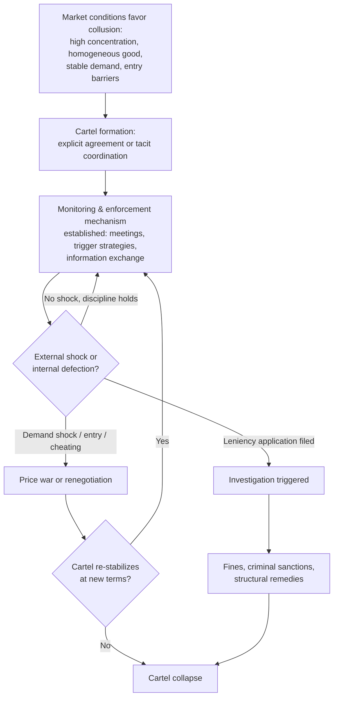

## Historical and Contemporary Cartel Case Studies

### Overview

Cartel case studies serve as the empirical backbone of collusion theory in industrial economics. While game-theoretic models (Bertrand, Cournot with collusion, folk theorem repeated games) describe *why* and *how* firms could sustain supra-competitive prices, real-world cases reveal *how cartels are actually organized*, *why they break down*, and *what enforcement mechanisms deter or fail to deter them*. This document surveys landmark historical cartels, major contemporary prosecutions, and cross-cutting analytical lessons drawn from competition authority decisions and academic ex-post studies.

### Analytical Framework for Case Studies

Before examining specific cases, it is useful to have a consistent lens:

- **Formation conditions**: market concentration, product homogeneity, demand stability, entry barriers, multi-market contact
- **Coordination mechanism**: explicit agreements (price-fixing, output quotas, market/customer allocation, bid-rigging) versus tacit coordination (parallel pricing, price leadership, focal points)
- **Enforcement/monitoring mechanism**: how the cartel detected and punished cheating (trigger strategies, information exchange, meeting frequency)
- **Destabilizing forces**: demand shocks, entry, technological change, leniency programs, whistleblowers
- **Welfare effect**: estimated overcharge (the percentage by which cartel prices exceeded the competitive counterfactual), deadweight loss, duration
- **Legal outcome**: fines, criminal sanctions, structural remedies, private damages litigation

Empirical cartel studies (notably the meta-analyses by Connor and Lande, and Levenstein and Suslow) find that the median cartel overcharge is commonly cited in the range of 15–25%, though estimates vary widely by industry, cartel duration, and estimation method. [Inference: precise overcharge figures depend heavily on the counterfactual benchmark chosen and should be treated as central tendencies from meta-studies rather than universal constants.]

---

### Part I: Historical Cartel Case Studies

#### 1. The International Electrical Manufacturers' Cartels (Pre-WWII)

Before modern antitrust enforcement matured, cartels were often legal or quasi-legal instruments of industrial policy, especially in Europe.

- **Structure**: Firms like AEG, Siemens, Philips, and General Electric participated in international patent-pooling and market-division agreements (e.g., the Phoebus cartel for incandescent light bulbs, 1924–1939).
- **Mechanism**: Market allocation by geography, output quotas enforced via reporting requirements, and a deliberate agreement to shorten bulb lifespan (planned obsolescence) to sustain replacement demand.
- **Lesson**: Cartels can extend beyond price-fixing into coordinated product design decisions when firms control complementary technology via cross-licensing.

#### 2. The U.S. Electrical Equipment (Heavy Electrical Machinery) Conspiracy, 1959–1961

One of the most studied cartel cases in the history of U.S. antitrust law.

- **Participants**: General Electric, Westinghouse, and roughly 29 other manufacturers of turbines, transformers, and switchgear.
- **Mechanism**: A "phase of the moon" bid-rotation formula—executives allocated bids according to a rotating schedule tied to the lunar calendar, disguising communication as informal trade association contacts.
- **Detection**: A combination of suspicious identical bidding patterns on public utility contracts and a grand jury investigation.
- **Outcome**: Criminal convictions, jail sentences for several executives (rare for the era), and treble-damage civil suits from injured utilities.
- **Significance**: One of the first cases where individual executives, not just corporations, received prison sentences in the U.S., reshaping deterrence theory to include personal criminal liability.

#### 3. OPEC as a Quasi-Cartel (1960–present)

While not a private cartel prosecutable under competition law (sovereign states are generally immune), OPEC is the canonical teaching example of cartel dynamics at the international level.

- **Structure**: Coordinated output quotas among member states to influence the world price of crude oil.
- **Key dynamic**: Classic cartel instability—incentive for individual members (especially smaller producers) to cheat on quotas when the residual demand curve is favorable, offset by Saudi Arabia's historical role as "swing producer" absorbing demand shocks to defend the price floor.
- **Shocks**: 1973 oil embargo (supply-side price quadrupling), 1980s glut (cartel discipline collapse), 2014–2016 price war (strategic decision to flood the market to discipline U.S. shale entrants), 2020 COVID-19 demand collapse and the brief OPEC+/Russia price war.
- **Lesson**: Demonstrates the folk-theorem prediction that cartel stability depends on discount factors, demand elasticity, and the credibility of punishment strategies (e.g., Saudi Arabia's repeated willingness to increase output to punish quota violations).

#### 4. The Sugar Refineries and Standard Oil Trusts (Late 19th Century U.S.)

- **Structure**: Legal "trusts"—shareholders of competing firms transferred voting shares to a single board of trustees, functionally merging governance while formally preserving separate corporate identities.
- **Mechanism**: Centralized control over output, pricing, and predatory practices against independent refiners/producers.
- **Legal response**: Directly motivated the Sherman Antitrust Act (1890) and the subsequent breakup of Standard Oil (1911) into 34 successor companies following *Standard Oil Co. of New Jersey v. United States*.
- **Lesson**: Illustrates how loophole-driven legal structures can achieve cartel-like coordination even where formal price-fixing agreements are absent, prompting statutory responses targeting the *effect* of concentration rather than only explicit contracts.

---

### Part II: Contemporary Cartel Case Studies

#### 5. The Lysine Cartel (1992–1995) — Archer Daniels Midland (ADM)

A frequently cited case because of the unusually rich evidentiary record (FBI wiretaps and video surveillance of cartel meetings).

- **Product**: Lysine, an amino acid feed additive.
- **Participants**: ADM (U.S.), Ajinomoto, Kyowa Hakko, Sewon (South Korea), Cheil Jedang.
- **Mechanism**: Regular international meetings to set global price targets and allocate sales volumes by region; the famous internal ADM slogan, paraphrased in court records as treating rival firms as friends rather than as adversaries, characterized the cartel's philosophy that customers—not competitors—were the actual target.
- **Detection**: An ADM executive turned FBI informant (Mark Whitacre) secretly recorded cartel meetings over roughly three years.
- **Outcome**: ADM paid what was at the time the largest antitrust fine in U.S. history ($100 million in 1996); several executives received prison sentences.
- **Estimated overcharge**: Academic ex-post studies place lysine cartel overcharges in a range consistent with the broader empirical literature on cartel overcharges (commonly cited in double-digit percentage terms), though the exact figure is sensitive to the benchmark period chosen. [Unverified: a single precise overcharge percentage without citing the specific study.]
- **Lesson**: A textbook illustration of the "prisoner's dilemma with communication"—the cartel needed frequent, well-documented meetings precisely because trust was low and monitoring costs were high, which paradoxically created the evidentiary trail that later ended it.

#### 6. The Vitamins Cartel (1990–1999)

- **Participants**: Hoffmann-La Roche, BASF, Rhône-Poulenc, and others, covering roughly a dozen different vitamin product markets (A, E, B, C, etc.).
- **Mechanism**: Separate but coordinated sub-cartels for each vitamin product, with joint "budgets," market-share targets, and price lists agreed at international meetings.
- **Scale**: Described by the European Commission as one of the most damaging cartels it had investigated to that point, given the sheer breadth of downstream markets affected (animal feed, food, pharmaceuticals).
- **Outcome**: Roche paid a then-record EU fine; combined global fines (U.S., EU, Canada) exceeded $1 billion.
- **Lesson**: Demonstrates multi-market contact reinforcing collusion—firms competing simultaneously across many vitamin sub-markets could use tacit cross-market punishment (retaliating in market B for cheating in market A), increasing the effective discount factor supporting cooperation.

#### 7. The Marine Hose Cartel (2000s)

- **Product**: Rubber marine hoses used for offshore oil loading.
- **Mechanism**: Bid allocation via a coding system communicated over encrypted channels and in-person meetings often disguised as trade conferences, using pre-agreed "win" designations for specific contracts.
- **Detection**: A joint UK-U.S. sting operation; participants were arrested upon arrival in the U.S. for a scheduled meeting.
- **Outcome**: Criminal convictions and prison sentences for UK executives extradited to the U.S.—notable for demonstrating cross-border criminal enforcement cooperation.
- **Lesson**: Highlights how leniency/immunity programs (see below) increasingly incentivize cartel members to defect and cooperate with authorities once an investigation begins, since the first cooperator typically receives substantially reduced or zero fines.

#### 8. LIBOR and Foreign Exchange (FX) Benchmark Manipulation (2005–2013)

Though often classified as benchmark manipulation rather than a "classic" cartel, these cases share core collusion economics: traders at competing banks coordinated to manipulate a shared reference rate for mutual benefit.

- **Mechanism**: Traders at different banks used chat rooms (with names such as "The Cartel") to coordinate submissions to the LIBOR panel or FX fixing windows, profiting from derivative and spot positions tied to the manipulated benchmark.
- **Outcome**: Billions of dollars in fines across U.S. and UK regulators (CFTC, FCA, DOJ); several individual traders convicted.
- **Lesson**: Extends cartel theory to "benchmark" or "reference-price" markets, where coordination doesn't require agreeing on the final consumer price directly but instead manipulating a shared input that feeds into thousands of downstream contracts—illustrating how collusion analysis generalizes beyond simple homogeneous-good price-fixing.

#### 9. Generic Pharmaceuticals Price-Fixing (U.S., ongoing litigation since ~2014)

- **Participants**: A large group of generic drug manufacturers named in a multistate/DOJ investigation (including Teva, Mylan/Viatris, and others).
- **Mechanism**: Alleged coordination via industry trade association contacts and direct communications to avoid competing on price for specific generic drugs, allocating "fair share" of customers among competitors instead of undercutting each other.
- **Detection**: Whistleblower testimony and email/text evidence obtained during a multi-year DOJ Antitrust Division investigation.
- **Status**: [Unverified as of training cutoff — verify current litigation status via search, as generics cases were still working through settlements and trials.]

Given the "recent/ongoing litigation" nature of this case, live verification is warranted:

The generic drug price-fixing litigation, which the DOJ's Antitrust Division and dozens of state attorneys general have pursued as one of the largest cartel cases in U.S. history, has continued to see settlements roll in.

Searched the webgeneric drug price-fixing cartel case settlement 2025 2026 status

As of 2026, this litigation is still very much active and remains one of the largest antitrust cases in U.S. history. The multi-district litigation (MDL No. 2724, filed 2016, consolidated in the Eastern District of Pennsylvania) now covers over 100 generic drugs and has drawn support from 49 state attorneys general alongside federal enforcement, with allegations of price increases exceeding 1,000% for some products. Settlement activity has accelerated through 2025–2026: the court granted final approval to a combined $533 million package of end-payer settlements—$275 million with Sandoz and Fougera, $200 million with Sun Pharmaceutical and Taro, and $58 million combined with Heritage and Apotex. The end-payer claims window opened to consumers and health plans with a November 9, 2026 deadline, while states are preparing for the first trial against non-settling defendants, expected in late 2026 in Connecticut. Individual state programs continue in parallel; for example, Oklahoma announced a $17.85 million settlement with Lannett and Bausch Health in February 2026. Total settlements across all tracks now exceed $1 billion, though litigation continues against non-settling defendants. [Generic Pharmaceuticals Pricing Antitrust Litigation +5](https://www.mcaginc.com/post/generic-pharmaceuticals-pricing-antitrust-litigation)

### Cross-Cutting Analytical Themes

#### A. Detection and Enforcement Mechanisms

| Mechanism | How It Works | Example Case(s) |
| --- | --- | --- |
| Leniency/amnesty programs | First cartel member to confess and cooperate receives full or substantial fine immunity, creating a "race to the regulator" | Vitamins cartel, Marine hose cartel |
| Whistleblowers/informants | Insider reports conduct directly to authorities, sometimes wearing a wire | Lysine cartel (ADM) |
| Screening/econometric detection | Antitrust authorities use statistical screens (price variance, bid rotation patterns, market share stability) to flag suspicious markets | Heavy electrical equipment bid-rotation |
| Sting operations | Undercover law enforcement poses as cartel participants or customers | Marine hose cartel |
| Follow-on private litigation | Civil damages suits filed after a criminal/regulatory case establishes wrongdoing | Generic pharmaceuticals MDL |

**Key Points**

- Leniency programs are widely regarded by competition economists as the single most significant enforcement innovation of the past three decades because they weaponize the cartel's own inherent instability (the incentive to defect) against itself.
- Once one firm defects under a leniency program, the expected payoff from continued cartel participation for the remaining members drops sharply, often triggering a cascade of subsequent leniency applications.

#### B. Why Cartels Break Down

Consistent findings across the case studies above (this pattern is well-documented across the empirical cartel-stability literature, e.g., Levenstein & Suslow's survey work):

1. **Demand shocks**: Sudden demand contraction increases the temptation to cheat on quotas (marginal short-run gain from undercutting rises relative to the discounted value of future cooperation).
2. **Entry/imports**: New entrants or import competition erode the cartel's market share, undermining the incentive compatibility of the agreement.
3. **Detection technology**: Improved surveillance, digital communications forensics (email, chat logs), and international cooperation between antitrust authorities raise the probability of detection.
4. **Internal monitoring failure**: Cartels with heterogeneous costs or demand across members face difficulty agreeing on stable quotas, especially as membership grows.
5. **Legal risk asymmetry**: As criminal penalties (personal prison time) supplement corporate fines, individual executives' private incentive to defect and cooperate with prosecutors rises.

#### C. Stylized Cartel Life Cycle Diagram

### Quantitative Illustration: Modeling Cartel Overcharge

A standard way to formalize the case-study overcharge estimates is the **but-for price** comparison:

$$\text{Overcharge}\% = \frac{P_{\text{cartel}} - P_{\text{but-for}}}{P_{\text{but-for}}} \times 100$$

Where $P_{\text{cartel}}$ is the observed price during the collusive period and $P_{\text{but-for}}$ is the counterfactual competitive price, typically estimated via:

- **Before-and-after method**: comparing prices in the same market before and after the cartel period
- **Yardstick (comparator) method**: comparing to a structurally similar but non-cartelized market
- **Cost-based method**: estimating price as a markup over estimated marginal cost derived from firm cost data

**Example**

If a construction cartel like the heavy electrical equipment conspiracy set bid prices such that $P_{\text{cartel}} = \$120{,}000$ per transformer unit while the estimated but-for competitive price was $P_{\text{but-for}} = \$95{,}000$:

$$\text{Overcharge}\% = \frac{120{,}000 - 95{,}000}{95{,}000} \times 100 \approx 26.3\%$$

This is a stylized numerical illustration for pedagogical purposes, not an actual reported figure from the case. [Inference: illustrative only; real damages calculations require expert econometric analysis specific to each case's evidentiary record.]

### Deadweight Loss Illustration (svg_diagram)

<svg xmlns="http://www.w3.org/2000/svg" viewBox="0 0 640 420" font-family="Helvetica, Arial, sans-serif">
<text x="320" y="24" text-anchor="middle" font-size="16" font-weight="bold" fill="#1a1a1a">Cartel Deadweight Loss (svg_diagram)</text>

<line x1="70" y1="360" x2="600" y2="360" stroke="#333" stroke-width="2" />
<line x1="70" y1="360" x2="70" y2="50" stroke="#333" stroke-width="2" />
<text x="600" y="380" font-size="13" fill="#333">Quantity</text>
<text x="35" y="55" font-size="13" fill="#333">Price</text>

<line x1="100" y1="70" x2="560" y2="340" stroke="#2b6cb0" stroke-width="2.5" />
<text x="560" y="330" font-size="13" fill="#2b6cb0">Demand (D)</text>

<line x1="100" y1="270" x2="560" y2="270" stroke="#2f855a" stroke-width="2.5" />
<text x="500" y="262" font-size="13" fill="#2f855a">Marginal Cost (MC = competitive price)</text>

<line x1="100" y1="70" x2="380" y2="270" stroke="#805ad5" stroke-width="2" stroke-dasharray="6,4" />
<text x="385" y="230" font-size="13" fill="#805ad5">Marginal Revenue (MR)</text>

<line x1="70" y1="160" x2="320" y2="160" stroke="#c53030" stroke-width="1.5" stroke-dasharray="4,3" />
<text x="40" y="164" font-size="12" fill="#c53030">Pc</text>

<line x1="70" y1="270" x2="450" y2="270" stroke="#2f855a" stroke-width="1.5" stroke-dasharray="4,3" />
<text x="40" y="274" font-size="12" fill="#2f855a">Pm</text>

<line x1="320" y1="160" x2="320" y2="360" stroke="#c53030" stroke-width="1.5" stroke-dasharray="4,3" />
<text x="313" y="375" font-size="12" fill="#c53030">Qc</text>
<line x1="450" y1="270" x2="450" y2="360" stroke="#2f855a" stroke-width="1.5" stroke-dasharray="4,3" />
<text x="443" y="375" font-size="12" fill="#2f855a">Qm</text>

<polygon points="320,160 450,270 320,270" fill="#f6ad55" fill-opacity="0.55" stroke="#dd6b20" stroke-width="1.5" />
<text x="345" y="245" font-size="12" fill="#7b341e" font-weight="bold">DWL</text>

<rect x="70" y="160" width="250" height="110" fill="#63b3ed" fill-opacity="0.30" stroke="none" />
<text x="150" y="200" font-size="12" fill="#2c5282" font-weight="bold">Cartel Overcharge</text>
<text x="150" y="216" font-size="12" fill="#2c5282" font-weight="bold">(transfer from buyers)</text>

<text x="70" y="405" font-size="11" fill="#555">Pc = cartel price · Pm = competitive (but-for) price · Qc, Qm = corresponding quantities</text>

</svg>

**Key Points**

- The blue rectangle represents the **overcharge**—a transfer from consumers to cartel members, not a net welfare loss to society, but a significant distributional harm and the basis for damages claims.
- The orange triangle (**DWL**, deadweight loss) represents output that would have been produced and consumed at the competitive price but is foregone at the cartel price—this is the pure efficiency loss from restricted output.
- Restitution/damages litigation (e.g., the generic pharmaceuticals end-payer settlements) primarily targets the overcharge component; the deadweight loss is generally uncompensated because there is no specific harmed party for the "missing" transactions.

### Comparative Summary Table

| Case | Era | Product/Market | Detection Method | Notable Outcome |
| --- | --- | --- | --- | --- |
| Phoebus cartel | 1924–1939 | Incandescent bulbs | Historical/archival record | Coordinated planned obsolescence |
| Heavy electrical equipment | 1959–1961 | Turbines, transformers | Bid-pattern investigation, grand jury | Criminal prison sentences (rare for era) |
| OPEC | 1960–present | Crude oil | N/A (sovereign immunity) | Ongoing quota discipline/instability cycle |
| Standard Oil Trust | 1870s–1911 | Oil refining | Sherman Act litigation | Corporate breakup into 34 firms |
| Lysine cartel | 1992–1995 | Animal feed additive | FBI informant/wiretap | Record corporate fine (at the time) |
| Vitamins cartel | 1990–1999 | Vitamins A, E, B, C, etc. | EU Commission investigation | Then-record EU fine; >$1B combined |
| Marine hose cartel | 2000s | Offshore oil-loading hoses | International sting operation | Cross-border criminal extraditions |
| LIBOR/FX manipulation | 2005–2013 | Benchmark interest/FX rates | Chat-log/regulatory investigation | Multi-billion dollar fines, individual convictions |
| Generic pharmaceuticals MDL | 2014–present | Generic prescription drugs | Whistleblower, DOJ/state AG investigation | Over $1B in settlements; litigation ongoing into 2026 |

### Policy and Enforcement Design Implications

- **Leniency program calibration**: Economic theory (Motta and Polo; Spagnolo) shows that leniency programs must balance full immunity for the first reporter against the risk of encouraging firms to form cartels in the first place anticipating an "exit option" if caught—a subtle unintended-incentive problem policymakers must manage carefully.
- **Fine design**: Optimal deterrence theory (Becker-style expected penalty framework) suggests fines should be calibrated to the probability of detection; if detection probability is low, fines must be a correspondingly large multiple of the illegal gain to maintain deterrence—one rationale behind treble damages in U.S. private antitrust litigation.
- **Structural vs. behavioral remedies**: Some jurisdictions favor divestitures or ownership unbundling (structural) over ongoing monitoring/consent decrees (behavioral) when recidivism risk is high.
- **Criminalization**: The shift toward personal criminal liability (seen from the 1961 electrical equipment case onward, and central to the U.S. approach versus the more fine-centric EU approach) reflects the view that corporate fines alone may be treated as a mere cost of doing business absorbed by shareholders, whereas prison risk directly changes individual executives' incentive calculus.

**Related Topics**

- Game-theoretic foundations of collusion (repeated games, trigger strategies, folk theorem)
- Tacit coordination and parallel pricing versus explicit cartel agreements
- Leniency and amnesty program design (Spagnolo, Motta-Polo models)
- Cartel overcharge estimation methods (before-and-after, yardstick, cost-based, structural/reduced-form econometrics)
- Bid-rigging detection using econometric screens
- Multi-market contact and mutual forbearance theory
- Facilitating practices: information exchange, price signaling, most-favored-nation clauses
- International cooperation in cartel enforcement (positive comity, extradition treaties)
- Private damages litigation and passing-on defenses
- Algorithmic collusion and tacit coordination via pricing algorithms