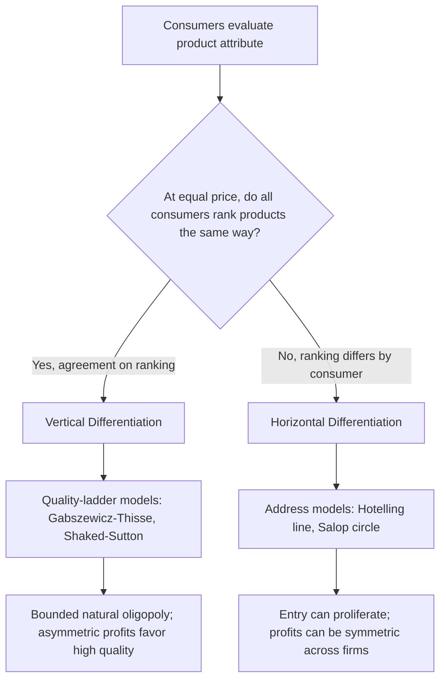

## Horizontal versus Vertical Product Differentiation

### Definitions

**Product differentiation** occurs when firms produce goods that are close but imperfect substitutes, giving each firm some degree of market power despite competing in the same broad market. Differentiation is conventionally split into two analytically distinct types based on how consumer preferences over product attributes are structured.

**Horizontal differentiation** describes variation along an attribute for which consumers disagree about the ranking of options, even when all products are priced identically. Given equal prices, different consumers choose different varieties because their ideal points differ. Examples include flavor, color, location, or stylistic design — a consumer who prefers vanilla ice cream does not consider chocolate an objectively worse product, only a worse match for their taste.

**Vertical differentiation** describes variation along an attribute for which all consumers agree on the ranking, given equal prices. If two products were priced the same, every consumer would choose the higher-quality one. Examples include durability, safety, processing speed, or fuel efficiency. Consumers differ not in their ranking of quality but in their willingness to pay for it.

### Key Points

- The distinction is about the **structure of preferences**, not the physical nature of the attribute. The same attribute (e.g., screen size) can be horizontal for some consumer segments and vertical for others.
- Horizontal differentiation is typically modeled with **location/address models** (Hotelling line, Salop circle), where "distance" from a consumer's ideal point generates disutility.
- Vertical differentiation is typically modeled with **quality-ladder models** (Gabszewicz–Thisse, Shaked–Sutton), where consumers are heterogeneous in income or marginal utility of quality.
- Most real-world differentiation is a **hybrid**: products differ on both horizontal attributes (style) and vertical attributes (quality), requiring multi-characteristic models.
- The type of differentiation shapes market outcomes: horizontal differentiation tends to permit **peaceful coexistence** of many firms even at equal prices; vertical differentiation tends toward **market segmentation or exclusion**, where low-quality firms survive only by pricing far below high-quality rivals.

### Horizontal Differentiation: Formal Structure

#### The Hotelling Linear City Model

Consumers are uniformly distributed on a line segment $[0,1]$, representing a spectrum of tastes (not necessarily physical geography). Two firms, $A$ and $B$, locate at positions $a$ and $b$ on the line. A consumer at location $x$ incurs a **transportation cost** (disutility of mismatch) proportional to distance from the firm's location.

Consumer utility from buying from firm $i$ located at $x_i$, charging price $p_i$:

$$U_i(x) = v - p_i - t|x - x_i|$$

where $v$ is the reservation value (gross utility from the product) and $t$ is the transportation cost parameter (intensity of preference for match).

The consumer indifferent between the two firms, $x^*$, is found by setting $U_A(x^*) = U_B(x^*)$:

$$x^* = \frac{a+b}{2} + \frac{p_B - p_A}{2t}$$

Firm $A$'s demand is $x^*$ (mass of consumers to its left, assuming $a<b$), and firm $B$'s demand is $1-x^*$.

**Key results:**

- **Principle of Minimum Differentiation** (Hotelling's original 1929 claim): firms have an incentive to locate close to each other (at the center) to maximize market share, because location competition alone pulls firms toward the median consumer.
- **d'Aspremont, Gabszewicz, and Thisse (1979) correction**: Hotelling's own equilibrium claim is flawed. With linear transport costs, no pure-strategy price equilibrium exists when firms are close together, because a firm has an incentive to undercut and capture the whole market. Maximal differentiation (firms locating at the endpoints, $a=0, b=1$) is required for equilibrium in prices to exist. Using **quadratic transport costs** ($t \cdot d^2$ instead of $t \cdot d$) restores existence of equilibrium and yields maximal differentiation as the two-stage (location-then-price) subgame-perfect outcome.
- Firms differentiate to **soften price competition**: locating apart makes each firm's demand less sensitive to the rival's price, relaxing the intensity of Bertrand-style competition.

#### Two-Stage Game (Location then Price)

1. **Stage 1 (long-run):** firms simultaneously choose locations $a, b$.
2. **Stage 2 (short-run):** firms simultaneously choose prices $p_A, p_B$, taking locations as given.

Solving backward, equilibrium prices as functions of locations (quadratic cost case) are:

$$p_A^* = t(b-a)\left(1 + \frac{a+b}{3}\right), \quad p_B^* = t(b-a)\left(2 - \frac{a+b}{3}\right)$$

Substituting into profit functions and optimizing over locations yields $a^*=0$, $b^*=1$ — firms differentiate maximally to relax price competition, at the cost of not being close to the average consumer.

#### The Salop Circular City Model

Extends Hotelling to allow **free entry** and more than two firms. Consumers are uniformly distributed on a circle of circumference 1; $n$ firms are symmetrically spaced at distance $1/n$ apart. Each firm faces two neighbors, and competition is localized.

Symmetric equilibrium price:

$$p^* = c + \frac{t}{n}$$

Free-entry zero-profit condition (fixed cost $F$ per firm) pins down the equilibrium number of firms:

$$n^* = \sqrt{\frac{t}{F}}$$

This model is the workhorse for analyzing **entry and product proliferation**: more firms crowd the circle, reducing each firm's local market power and price-cost margin, while entry continues until profits are driven to zero.

### Vertical Differentiation: Formal Structure

#### The Gabszewicz–Thisse / Shaked–Sutton Quality Model

Consumers differ in a taste-for-quality parameter $\theta$, uniformly distributed on $[\underline{\theta}, \overline{\theta}]$. Products differ in quality level $s$, with $s_H > s_L$. Utility from purchasing a good of quality $s$ at price $p$:

$$U(\theta) = \theta s - p$$

(with the outside option of not purchasing yielding zero utility). Consumers with higher $\theta$ (higher income or stronger preference for quality) are willing to pay proportionally more for quality improvements.

**Key results:**

- Unlike horizontal models, firms in vertical models want to differentiate **quality**, not location, because head-to-head quality competition drives quality convergence toward the socially optimal level and intensifies price competition, eroding profits.
- **Maximal quality differentiation** is again the equilibrium outcome in the standard two-stage game: one firm chooses high quality, the other chooses low quality, softening subsequent price competition. This is the vertical analog of the Hotelling maximal-differentiation result.
- **Natural oligopoly / finiteness property** (Shaked and Sutton, 1983): unlike horizontal differentiation (Salop), where the number of firms can grow without bound as fixed costs fall (market fragments indefinitely), vertical differentiation markets have a **bounded number of firms** that can profitably coexist in equilibrium, regardless of how large the market or how low fixed costs become. This is because low-quality entrants get squeezed out — consumers at the bottom of the willingness-to-pay distribution simply exit the market rather than buy a marginally-differentiated low-quality good, so there's a limit to how many quality tiers the demand distribution can support profitably.
- **Market coverage**: if $\underline{\theta}$ is low enough, the market is **uncovered** (some low-$\theta$ consumers do not buy at all), which is what generates the natural oligopoly result. If the market is fully covered, results resemble the Hotelling model more closely, with all consumers purchasing from one firm or the other.

#### Equilibrium Price Ordering

In the duopoly vertical model, equilibrium prices and profits satisfy:

$$p_H^* > p_L^* > c, \quad \pi_H^* > \pi_L^*$$

The high-quality firm earns strictly higher profit — quality leadership is rewarded, unlike in symmetric horizontal models where firms at different locations can earn equal profits under symmetric demand.

### Comparative Table

| Dimension | Horizontal | Vertical |
| --- | --- | --- |
| Consumer agreement on ranking (equal price) | Disagree | Agree |
| Canonical model | Hotelling line / Salop circle | Gabszewicz–Thisse / Shaked–Sutton |
| Source of heterogeneity | Location of ideal point (taste) | Income / marginal utility of quality |
| Equilibrium differentiation incentive | Maximal (softens price competition) | Maximal (softens price competition) |
| Effect of free entry | Number of firms grows without bound as $F \to 0$ | Number of firms bounded (natural oligopoly) |
| Profit symmetry | Can be symmetric across firms | Asymmetric — high-quality firm earns more |
| Market coverage | Typically full coverage assumed | Coverage endogenous; may be partial |

### Diagram: Conceptual Comparison (svg_diagram)

<svg xmlns="http://www.w3.org/2000/svg" viewBox="0 0 760 380">
<text x="190" y="30" font-size="18" font-weight="bold" text-anchor="middle" fill="#1a1a1a">Horizontal Differentiation (svg_diagram)</text>
<line x1="60" y1="100" x2="340" y2="100" stroke="#333" stroke-width="2" />
<circle cx="60" cy="100" r="5" fill="#2563eb" />
<text x="60" y="125" font-size="12" text-anchor="middle">Firm A</text>
<circle cx="340" cy="100" r="5" fill="#dc2626" />
<text x="340" y="125" font-size="12" text-anchor="middle">Firm B</text>
<circle cx="150" cy="100" r="4" fill="#555" />
<text x="150" y="80" font-size="11" text-anchor="middle">Consumer x1</text>
<circle cx="270" cy="100" r="4" fill="#555" />
<text x="270" y="80" font-size="11" text-anchor="middle">Consumer x2</text>
<text x="200" y="160" font-size="12" text-anchor="middle" fill="#444">Same price -&gt; consumers split by nearest location</text>
<text x="200" y="180" font-size="12" text-anchor="middle" fill="#444">Disagreement on ranking of A vs B</text>

<text x="580" y="30" font-size="18" font-weight="bold" text-anchor="middle" fill="`#1a1a1a`">Vertical Differentiation (svg_diagram)</text>

<line x1="440" y1="220" x2="720" y2="220" stroke="#333" stroke-width="2" />

<line x1="440" y1="220" x2="440" y2="60" stroke="#333" stroke-width="2" />

<text x="430" y="55" font-size="11" text-anchor="end">Quality (s)</text>

<text x="720" y="240" font-size="11" text-anchor="end">Willingness to pay (θ)</text>

<circle cx="480" cy="180" r="6" fill="`#059669`" />

<text x="480" y="200" font-size="11" text-anchor="middle">Low quality (sL)</text>

<circle cx="660" cy="90" r="6" fill="`#7c3aed`" />

<text x="660" y="80" font-size="11" text-anchor="middle">High quality (sH)</text>

<line x1="480" y1="180" x2="660" y2="90" stroke="#999" stroke-dasharray="4,3" />

<text x="580" y="270" font-size="12" text-anchor="middle" fill="#444">Same price -&gt; all consumers</text>

<text x="580" y="288" font-size="12" text-anchor="middle" fill="#444">prefer sH; agreement on ranking</text>

<rect x="30" y="320" width="700" height="45" fill="none" stroke="#999" stroke-dasharray="2,2" />
<text x="380" y="340" font-size="12" text-anchor="middle" fill="#333">Horizontal: firms split market by matching taste. Vertical: firms split market by ability/willingness to pay for quality.</text>
<text x="380" y="356" font-size="11" text-anchor="middle" fill="#666">Both: firms differentiate maximally in equilibrium to relax price competition.</text>
</svg>

### Worked Example: Hotelling Duopoly (Horizontal)

**Setup:** Firms located at endpoints $a=0$, $b=1$ on unit line, quadratic transport cost $t=1$, marginal cost $c=0$, consumers uniformly distributed.

Using the formulas above with $a=0, b=1$:

$$p_A^* = p_B^* = t(b-a) = 1$$

Each firm captures half the market ($x^* = 0.5$), earns profit $\pi^* = p^* \cdot 0.5 = 0.5$. Neither firm can profitably deviate: moving toward the center increases market share slightly but intensifies price competition more than it gains, so maximal differentiation with symmetric pricing is the subgame-perfect equilibrium.

### Worked Example: Vertical Duopoly

**Setup:** Qualities $s_L = 1$, $s_H = 2$, $\theta \sim U[0,1]$, zero marginal cost, market not fully covered.

The indifferent consumer between low and high quality, $\theta_1$, satisfies:

$$\theta_1 s_H - p_H = \theta_1 s_L - p_L \implies \theta_1 = \frac{p_H - p_L}{s_H - s_L}$$

The indifferent consumer between buying low quality and not buying, $\theta_0$, satisfies:

$$\theta_0 s_L - p_L = 0 \implies \theta_0 = \frac{p_L}{s_L}$$

Demands: $D_H = 1 - \theta_1$, $D_L = \theta_1 - \theta_0$. Solving the profit-maximization first-order conditions for both firms simultaneously (standard result) yields:

$$p_H^* = \frac{s_H(\overline{\theta}-\underline{\theta})}{4}, \quad p_L^* = \frac{s_L(\overline{\theta}-\underline{\theta})}{4}\cdot\text{(adjustment factor)}$$

with $p_H^* > p_L^*$ and $\pi_H^* > \pi_L^*$ in equilibrium — the high-quality firm's advantage in willingness-to-pay translates into a durable profit advantage, unlike the symmetric-profit horizontal case.

### Mixed / Hybrid Models

Real markets typically combine both dimensions — e.g., smartphones differ horizontally (operating system ecosystem, design aesthetic) and vertically (camera quality, processor speed). Formal treatment typically nests a vertical quality index inside a horizontal address model:

$$U_i(x,\theta) = \theta s_i - t|x - x_i| - p_i$$

This hybrid framework is used in empirical **discrete choice demand estimation** (e.g., logit and nested logit demand systems in industrial organization, as in Berry–Levinsohn–Pakes-style models), where both horizontal (brand/location dummies) and vertical (quality/characteristics) attributes enter the indirect utility function together.

### Strategic Implications

- **Entry deterrence**: incumbents may use vertical quality choices to occupy the top of the quality ladder, leaving insufficient willingness-to-pay "room" below for profitable entry (Shaked–Sutton natural oligopoly logic).
- **Price competition intensity**: horizontal differentiation softens competition through *spatial/taste* separation; vertical differentiation softens it through *quality/willingness-to-pay* separation — but in vertical markets, the low-quality firm remains vulnerable to being squeezed out entirely if quality gaps or income heterogeneity are small.
- **Welfare**: horizontal differentiation can lead to **excess entry** relative to the social optimum (business-stealing effect in Salop-type models); vertical differentiation can lead to **underprovision of quality diversity** at the low end, since firms cluster their offerings where willingness-to-pay is thickest. [Inference: the direction and magnitude of over/under-provision depends on specific model assumptions such as market coverage and cost structure, and is not a universal law.]

### Mermaid Diagram: Decision Framework

### Conclusion

Horizontal and vertical differentiation are complementary lenses for analyzing why firms in the same industry avoid head-to-head competition. Horizontal differentiation exploits diversity in consumer *taste*, modeled through spatial address frameworks, and tends to support many firms coexisting even without cost or quality asymmetries. Vertical differentiation exploits diversity in consumer *willingness to pay for objectively better quality*, modeled through quality-ladder frameworks, and structurally limits the number of firms the market can sustain because low-end differentiation eventually fails to attract marginal consumers. Both forms share the strategic logic that maximal differentiation — in location or in quality — is typically the equilibrium response to the threat of intense price competition.

**Related Topics:**

- Hotelling's Principle of Minimum vs. Maximal Differentiation (linear vs. quadratic transport costs)
- Salop Circular City Model and free-entry equilibrium
- Shaked and Sutton's Natural Oligopoly / Finiteness Property
- Multi-characteristics / hybrid differentiation models (address models with quality)
- Discrete choice demand estimation (logit, nested logit, BLP-style models) in empirical IO
- Entry deterrence and limit quality strategies
- Welfare analysis of product variety (excess entry theorem, business-stealing effect)
- Bertrand price competition and its interaction with product differentiation