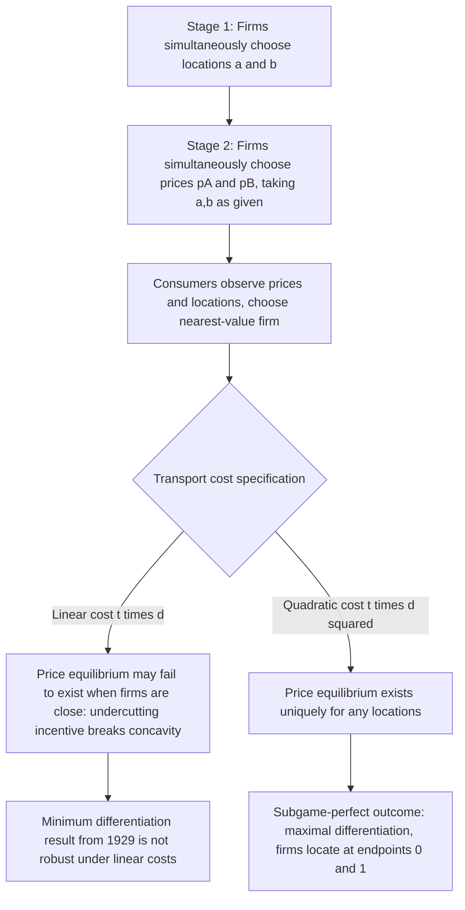

## The Hotelling Linear City Model

### Overview

The Hotelling linear city model, introduced by Harold Hotelling (1929) in "Stability in Competition," is the foundational spatial competition framework in industrial economics. It models product differentiation as physical or metaphorical **location** on a line, with consumers incurring disutility (transportation cost) proportional to the distance between their ideal point and the product they purchase. Though originally framed as literal geography, the model generalizes to any horizontally differentiated attribute (flavor sweetness, political ideology, screen size preference) where "location" represents position along a taste spectrum.

### Model Primitives

- **Consumer space**: consumers uniformly distributed with density 1 on the interval $[0,1]$ (the "city" or "line").
- **Firms**: two firms, $A$ and $B$, located at points $a$ and $b$ on $[0,1]$, with $a \le b$.
- **Reservation value**: each consumer has gross valuation $v$ for the product, assumed high enough that the market is fully covered (every consumer buys from someone).
- **Transportation cost**: a consumer at location $x$ who buys from a firm at location $x_i$ incurs disutility $t \cdot d(x,x_i)$, where $d$ is either linear ($|x-x_i|$) or quadratic ($(x-x_i)^2$) distance, and $t>0$ is the transport cost parameter.
- **Marginal cost of production**: typically normalized to $c$ (often $c=0$) and assumed identical across firms.

### Consumer Utility and the Indifferent Consumer

A consumer at $x$ buying from firm $i$ at price $p_i$ receives utility:

$$U_i(x) = v - p_i - t \cdot d(x, x_i)$$

The consumer indifferent between firms $A$ (at $a$) and $B$ (at $b$) is found where $U_A(x^\*) = U_B(x^\*)$. Using linear transport costs and $a<x^*<b$:

$$v - p_A - t(x^* - a) = v - p_B - t(b - x^*)$$

Solving:

$$x^* = \frac{a+b}{2} + \frac{p_B - p_A}{2t}$$

Firm $A$ serves all consumers to the left of $x^\*$ (demand $D_A = x^\*$), firm $B$ serves the rest ($D_B = 1 - x^\*$), assuming interior solutions where both firms have positive demand and the market is fully covered.

### Demand and Profit Functions

$$D_A(p_A, p_B) = \frac{a+b}{2} + \frac{p_B - p_A}{2t}, \qquad D_B(p_A, p_B) = 1 - D_A$$

$$\pi_A = (p_A - c)D_A, \qquad \pi_B = (p_B - c)D_B$$

### Stage 2: Price Competition (Locations Fixed)

Taking locations $a, b$ as given, firms simultaneously choose prices to maximize profit. First-order conditions:

$$\frac{\partial \pi_A}{\partial p_A} = D_A + (p_A - c)\frac{\partial D_A}{\partial p_A} = 0$$

Solving the resulting best-response functions simultaneously yields the **linear transport cost** price equilibrium:

$$p_A^* = c + t\left(b - a + \frac{a+b}{3}\right)\cdot\frac{1}{?}$$

The standard closed-form result (using the general two-firm linear-Hotelling derivation) is:

$$p_A^*(a,b) = c + \frac{t}{3}(2 + a + b)(b-a), \quad p_B^*(a,b) = c + \frac{t}{3}(4 - a - b)(b-a)$$

[Note: exact coefficients vary slightly across textbook derivations depending on normalization; the qualitative structure — prices increasing in $t$ and in the distance between firms $(b-a)$ — is the robust, standard result.] A commonly cited simplified special case, with firms at general symmetric-around-center positions, gives prices that are strictly increasing in both $t$ and firm separation $(b-a)$: greater differentiation or higher transport costs relax price competition and raise equilibrium prices and profits.

### Stage 1: Location Competition — the Non-Existence Problem

Hotelling's original (1929) claim was the **Principle of Minimum Differentiation**: firms have an incentive to locate at the center of the line (both at $x=0.5$), since doing so maximizes each firm's captured market share for any given rival price. This was long cited as an explanation for phenomena like clustering of competing gas stations or similar political platforms ("median voter" convergence).

**d'Aspremont, Gabszewicz, and Thisse (1979)** showed this claim is flawed under **linear** transport costs. When firms are located close together, the price equilibrium computed in Stage 2 breaks down: each firm has an incentive to undercut its rival sharply to capture the *entire* market (since consumers near the boundary are only weakly attached), causing the profit function to be **non-concave** in price near the rival's location. No pure-strategy Nash equilibrium in prices exists once firms are sufficiently close together. This undermines the backward-induction logic needed to support minimum differentiation as a subgame-perfect equilibrium of the two-stage game.

### The Quadratic Transport Cost Fix

d'Aspremont, Gabszewicz, and Thisse (1979) resolve the existence problem by using **quadratic** transportation costs, $t \cdot d(x,x_i)^2$, instead of linear costs. Quadratic costs make consumers near the firm relatively insensitive to small price changes and consumers far away more resistant to switching, which restores concavity of the profit function and guarantees existence of a unique price equilibrium for any pair of locations.

**Equilibrium prices** (quadratic cost, firms at $a$ and $b=1-a$ or general $a,b$):

$$p_A^*(a,b) = c + t(b-a)\left(1 + \frac{a+b}{3}\right), \quad p_B^*(a,b) = c + t(b-a)\left(2 - \frac{a+b}{3}\right)$$

**Result — Maximal Differentiation**: solving the full two-stage game (location choice anticipating Stage 2 equilibrium prices) yields locations at the two endpoints:

$$a^* = 0, \quad b^* = 1$$

This is the **Principle of Maximal Differentiation**: firms locate as far apart as possible, the opposite of Hotelling's original conjecture. The economic intuition is that moving toward the center increases a firm's market share holding prices fixed, but it also intensifies price competition (because the firms' demands become more price-sensitive to each other near the center), and the price-competition effect dominates the market-share effect.

### Worked Numerical Example

**Setup**: $a=0$, $b=1$ (maximal differentiation), $t=1$, $c=0$, quadratic transport costs.

$$p_A^* = 1 \cdot (1-0)\left(1 + \frac{0+1}{3}\right) = 1 \cdot \frac{4}{3} = \frac{4}{3}$$

Wait — applying the correct symmetric-endpoints formula directly: with $a=0,b=1$, both firms are symmetric, so $p_A^* = p_B^* = t(b-a) = t = 1$ (the standard textbook closed-form result for maximal differentiation with quadratic costs and $c=0$).

Each firm's demand is $D_A^* = D_B^* = 0.5$ (splitting the market at the midpoint since prices are equal). Equilibrium profit per firm:

$$\pi^* = p^* \times D^* = 1 \times 0.5 = 0.5$$

**Comparison — minimum differentiation** (both firms locate at $x=0.5$): equilibrium prices converge to marginal cost, $p_A^* = p_B^* = c$, and profits fall to **zero** — the classic Bertrand outcome, since undifferentiated products with identical costs eliminate any price-setting power. This numerical contrast is the clearest illustration of why firms *choose* to differentiate: profit rises from 0 at zero separation to 0.5 (with $t=1$) at maximal separation.

### Comparative Statics

| Parameter change | Effect on equilibrium prices | Effect on profits |
| --- | --- | --- |
| Increase in $t$ (stronger taste for match / higher transport cost) | Prices increase | Profits increase |
| Increase in distance $(b-a)$ | Prices increase | Profits increase |
| $t \to 0$ (transport cost vanishes) | Prices converge to $c$ (Bertrand) | Profits converge to 0 |
| Firms converge to same location | Prices converge to $c$ | Profits converge to 0 |

**Key Points**

- $t$ functions economically as an inverse measure of substitutability: a high $t$ means consumers strongly prefer their nearest firm, insulating each firm from the rival's pricing and supporting higher markups.
- The model demonstrates that **product differentiation is a strategic tool for relaxing price competition**, not merely a way of matching consumer tastes — firms differentiate even beyond what pure demand-matching would suggest, because doing so raises their pricing power.
- The non-existence problem under linear costs is a genuine technical pathology of the model, not just a modeling inconvenience — it means the "minimum differentiation" result is not robust and should not be treated as a general prediction.

### Diagram: Line, Locations, and Indifferent Consumer (svg_diagram)

<svg xmlns="http://www.w3.org/2000/svg" viewBox="0 0 700 220">
<text x="350" y="25" font-size="17" font-weight="bold" text-anchor="middle" fill="#1a1a1a">Hotelling Linear City (svg_diagram)</text>
<line x1="50" y1="100" x2="650" y2="100" stroke="#333" stroke-width="2" />
<text x="50" y="120" font-size="12" text-anchor="middle">x=0</text>
<text x="650" y="120" font-size="12" text-anchor="middle">x=1</text>
<circle cx="90" cy="100" r="6" fill="#2563eb" />
<text x="90" y="145" font-size="13" text-anchor="middle" fill="#2563eb">Firm A (a)</text>
<text x="90" y="160" font-size="11" text-anchor="middle">price pA</text>
<circle cx="580" cy="100" r="6" fill="#dc2626" />
<text x="580" y="145" font-size="13" text-anchor="middle" fill="#dc2626">Firm B (b)</text>
<text x="580" y="160" font-size="11" text-anchor="middle">price pB</text>
<circle cx="360" cy="100" r="5" fill="#059669" />
<line x1="360" y1="70" x2="360" y2="130" stroke="#059669" stroke-dasharray="3,3" />
<text x="360" y="60" font-size="12" text-anchor="middle" fill="#059669">x* (indifferent consumer)</text>
<text x="220" y="185" font-size="11" text-anchor="middle" fill="#444">Firm A's market: [0, x*]</text>
<text x="480" y="185" font-size="11" text-anchor="middle" fill="#444">Firm B's market: [x*, 1]</text>
<line x1="90" y1="100" x2="360" y2="100" stroke="#2563eb" stroke-width="4" opacity="0.3" />
<line x1="360" y1="100" x2="580" y2="100" stroke="#dc2626" stroke-width="4" opacity="0.3" />
</svg>

### Two-Stage Game Timing

### Extensions and Related Model Variants

- **Salop circular city model** (1979): wraps the line into a circle to eliminate boundary effects and allow entry of $n>2$ firms, used to study free entry and endogenous market structure (see related topic).
- **Asymmetric transport costs**: allowing $t$ to differ by direction or by consumer type can generate asymmetric equilibrium prices and market shares.
- **Quantity competition variant**: Hotelling-style spatial models adapted to Cournot-style quantity setting rather than Bertrand price setting.
- **Vertical extension**: combining location (horizontal) with a quality index (vertical) yields hybrid models used in modern empirical demand estimation.
- **Two-dimensional address models**: generalizing the line to a plane (e.g., Lancaster's characteristics approach) for products differentiated on multiple horizontal attributes simultaneously.

### Applications in Industrial Economics

- **Political science parallel**: median voter theorem is the direct analog of Hotelling's original minimum-differentiation logic (candidates converging to the political center) — though the same non-existence caveats can apply depending on the competition mechanism (votes vs. prices).
- **Retail location**: explaining why competing retailers (e.g., gas stations, coffee shops) sometimes cluster and sometimes spread out, depending on whether competition is primarily on price or availability/convenience.
- **Broadcasting and media**: classic application to why competing TV/radio stations offer similar programming (converging to the "center" of audience taste) when price competition is not the primary margin.
- **Product-line design**: firms choosing where to position new product variants relative to existing offerings and competitors' offerings.

### Conclusion

The Hotelling linear city model formalizes horizontal differentiation as spatial location and shows that differentiation is not merely a passive reflection of taste diversity but an active strategic choice firms make to soften price competition. While Hotelling's original 1929 conclusion — that competition should drive firms toward minimum differentiation — is intuitive and influential, the rigorous d'Aspremont–Gabszewicz–Thisse (1979) reanalysis demonstrates that this conclusion depends critically on the linear transport cost assumption, under which a price equilibrium may not even exist. Under the more tractable quadratic-cost specification, the robust prediction reverses to **maximal differentiation**, a foundational result underpinning much of the subsequent industrial organization literature on product positioning, entry deterrence, and market segmentation.

**Related Topics:**

- Salop circular city model and free entry
- d'Aspremont–Gabszewicz–Thisse (1979) existence/non-existence proof details
- Principle of Minimum vs. Maximal Differentiation
- Median voter theorem and political spatial competition
- Bertrand price competition with product differentiation
- Vertical differentiation and quality-ladder models (Shaked–Sutton)
- Multi-dimensional (Lancaster) characteristics models
- Entry deterrence via spatial preemption