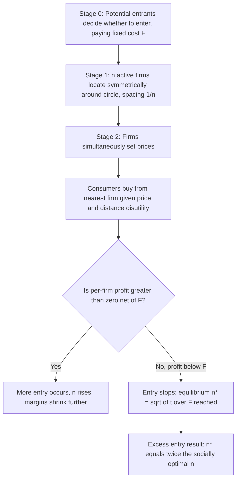

## The Salop Circular City Model

### Overview

The Salop circular city model, introduced by Steven Salop (1979) in "Monopolistic Competition with Outside Goods," extends the Hotelling linear-city framework to a **circular** consumer space. This eliminates the boundary/endpoint effects inherent to the line, allows a natural treatment of **more than two firms**, and — most importantly — endogenizes the **number of firms** in the market through a free-entry condition. It is the standard workhorse model for analyzing product proliferation, entry, and monopolistic competition with spatial (horizontal) differentiation.

### Model Primitives

- **Consumer space**: consumers uniformly distributed with density 1 around the circumference of a circle of total length (circumference) normalized to 1.
- **Firms**: $n$ firms, symmetrically and equally spaced around the circle, each separated from its neighbors by arc distance $1/n$.
- **Transportation cost**: a consumer incurs disutility $t \cdot d$ (linear) or $t \cdot d^2$ (quadratic) per unit of distance $d$ traveled to reach a firm, where $t>0$.
- **Reservation value**: consumers have gross valuation $v$ for the product; assumed large enough to support **full market coverage** in the baseline model (every consumer buys from their nearest firm), though an "outside good" / uncovered-market variant is also standard (see below).
- **Costs**: each firm incurs constant marginal cost $c$ per unit and a **fixed entry cost** $F>0$ to operate in the market.
- **Local competition**: because the circle has no boundary, each firm's demand is determined only by its two immediate neighbors, symmetric on both sides — competition is inherently **localized**, unlike in some Hotelling-line specifications where a firm may only face one active rival.

### Consumer Demand and the Indifferent Consumer

Consider firm $i$ and its neighbor $i+1$, spaced $1/n$ apart. A consumer located at distance $x$ from firm $i$ (toward firm $i+1$) is indifferent between the two firms when:

$$v - p_i - tx = v - p_{i+1} - t\left(\frac{1}{n} - x\right)$$

Solving for the indifferent point $x^\*$:

$$x^*(p_i,p_{i+1}) = \frac{1}{2n} + \frac{p_{i+1}-p_i}{2t}$$

Firm $i$ draws demand from both its left and right neighbor boundaries. Total demand for firm $i$, facing neighbors on both sides with prices $p_{i-1}$ and $p_{i+1}$:

$$D_i(p_{i-1}, p_i, p_{i+1}) = \frac{1}{n} + \frac{p_{i-1} + p_{i+1} - 2p_i}{2t}$$

### Symmetric Price Equilibrium

In the symmetric Nash equilibrium, all firms charge the same price $p^\*$, so demand for each equals $1/n$ (equal division of the circle). Each firm chooses $p_i$ to maximize profit taking rivals' prices as fixed at $p^\*$:

$$\pi_i = (p_i - c)\left[\frac{1}{n} + \frac{2p^* - 2p_i}{2t}\right]$$

The first-order condition yields the symmetric equilibrium price:

$$p^* = c + \frac{t}{n}$$

**Interpretation**: the equilibrium price-cost margin, $t/n$, shrinks as the number of firms $n$ increases (more crowded market → more localized competition → thinner margins), and rises with $t$ (stronger consumer attachment to nearest variety → more market power per firm).

### Equilibrium Profit (Fixed n)

$$\pi^*(n) = (p^* - c)\cdot\frac{1}{n} - F = \frac{t}{n}\cdot\frac{1}{n} - F = \frac{t}{n^2} - F$$

Profit per firm is strictly decreasing in $n$: as more firms enter and the circle becomes more finely divided, each firm's local monopoly power (captured market segment) shrinks quadratically, eventually driving profit below the fixed cost required to operate.

### Free Entry and the Equilibrium Number of Firms

The **long-run free-entry equilibrium** number of firms $n^\*$ is determined by the zero-profit condition, $\pi^\*(n) = 0$:

$$\frac{t}{n^2} = F \implies n^* = \sqrt{\frac{t}{F}}$$

[Note: in practice $n^\*$ must be rounded to an integer, and free entry drives profits to approximately (not exactly) zero at the nearest integer $n$ that keeps profits non-negative but insufficient to justify one more entrant.]

**Comparative statics on $n^\*$:**

| Parameter | Effect on $n^*$ | Economic Intuition |
| --- | --- | --- |
| $t$ increases | $n^*$ increases | Stronger differentiation value supports more firms, each retaining a defensible local niche |
| $F$ increases | $n^*$ decreases | Higher fixed costs make it harder for firms to break even, so fewer can profitably operate |
| $t \to 0$ | $n^* \to 0$ | Without differentiation value, competition collapses toward Bertrand and firms cannot recover fixed costs |

### Worked Numerical Example

**Setup**: $t = 1$, $F = 0.01$, $c = 0$.

$$n^* = \sqrt{\frac{1}{0.01}} = \sqrt{100} = 10$$

At $n^\*=10$: equilibrium price $p^\* = 0 + \frac{1}{10} = 0.1$. Each firm's market share is $1/10$. Profit per firm: $\pi^\* = \frac{1}{100} - 0.01 = 0$, confirming the zero-profit free-entry condition holds exactly at this integer value.

**Sensitivity**: if fixed cost falls to $F=0.0025$, then $n^\* = \sqrt{1/0.0025} = \sqrt{400} = 20$ — entry doubles as fixed costs fall to one-quarter, illustrating the square-root (not linear) relationship between cost conditions and market fragmentation.

### Excess Entry / Business-Stealing Effect

A central welfare result from the Salop model concerns whether the free-entry equilibrium $n^\*$ delivers too many or too few firms relative to the **socially optimal** number $n^{SO}$, which minimizes the sum of fixed costs and total consumer transportation costs:

$$\text{Total cost}(n) = nF + n \cdot \int_0^{1/2n} 2t x \, dx \cdot n = nF + \frac{t}{4n}$$

Minimizing with respect to $n$:

$$\frac{d}{dn}\left(nF + \frac{t}{4n}\right) = F - \frac{t}{4n^2} = 0 \implies n^{SO} = \sqrt{\frac{t}{4F}} = \frac{1}{2}\sqrt{\frac{t}{F}}$$

Comparing to the free-entry equilibrium:

$$n^* = \sqrt{\frac{t}{F}} = 2 \cdot n^{SO}$$

**Key Result — Excess Entry Theorem**: the free-entry equilibrium number of firms is **exactly twice** the socially optimal number, $n^\* = 2n^{SO}$. This is the canonical **business-stealing externality**: each entrant, in deciding whether to enter, considers only its own private profitability and ignores the fact that its entry steals demand from existing firms (a pure transfer, not a social gain) while adding fixed costs and only marginally reducing aggregate transportation costs. Private incentives to enter therefore exceed the social optimum. [Inference: the precise "exactly double" result is a feature of this specific linear-transport-cost, uniform-density Salop specification; the qualitative direction (excess entry) is more general across similar spatial models, but the exact multiplier depends on functional form assumptions.]

**Key Points**

- Excess entry arises from firms failing to internalize that their entry displaces business from incumbents rather than purely creating new social value.
- This result is a classic argument for caution in treating "more competition/more variety" as automatically welfare-improving — variety has a fixed-cost overhead that the market may not price efficiently.
- The result depends on assumptions of symmetric spacing and uniform consumer density; asymmetric variants can shift the multiplier.

### Uncovered Market Variant (Outside Good)

If reservation value $v$ is not sufficiently high, some consumers located far from any firm may prefer not to purchase at all (the "outside good"). This introduces:

- A **coverage boundary** at each firm, beyond which consumers opt out entirely.
- Firms then compete on two margins: **market share** (business stealing from neighbors) and **market expansion** (drawing in previously non-purchasing consumers).
- This variant is used to study **monopolistic competition with variable total demand**, and is closer to Chamberlin's monopolistic competition framework than the fully-covered baseline Salop model.

### Diagram: Circular City with n Firms (svg_diagram)

<svg xmlns="http://www.w3.org/2000/svg" viewBox="0 0 500 500">
<text x="250" y="30" font-size="17" font-weight="bold" text-anchor="middle" fill="#1a1a1a">Salop Circular City, n=8 (svg_diagram)</text>
<circle cx="250" cy="270" r="150" fill="none" stroke="#333" stroke-width="2" />
<circle cx="250" cy="120" r="6" fill="#2563eb" />
<circle cx="356" cy="164" r="6" fill="#2563eb" />
<circle cx="400" cy="270" r="6" fill="#2563eb" />
<circle cx="356" cy="376" r="6" fill="#2563eb" />
<circle cx="250" cy="420" r="6" fill="#2563eb" />
<circle cx="144" cy="376" r="6" fill="#2563eb" />
<circle cx="100" cy="270" r="6" fill="#2563eb" />
<circle cx="144" cy="164" r="6" fill="#2563eb" />
<text x="250" y="105" font-size="11" text-anchor="middle">Firm 1</text>
<text x="380" y="150" font-size="11" text-anchor="middle">Firm 2</text>
<text x="430" y="270" font-size="11" text-anchor="middle">Firm 3</text>
<text x="380" y="400" font-size="11" text-anchor="middle">Firm 4</text>
<text x="250" y="445" font-size="11" text-anchor="middle">Firm 5</text>
<text x="120" y="400" font-size="11" text-anchor="middle">Firm 6</text>
<text x="65" y="270" font-size="11" text-anchor="middle">Firm 7</text>
<text x="120" y="150" font-size="11" text-anchor="middle">Firm 8</text>
<text x="250" y="270" font-size="11" text-anchor="middle" fill="#666">Each firm's demand comes only from its two nearest neighbors</text>
<text x="250" y="288" font-size="11" text-anchor="middle" fill="#666">Symmetric spacing = 1/n around circumference</text>
</svg>

### Timing / Mermaid Diagram: Free-Entry Game

### Comparison with the Hotelling Linear Model

| Feature | Hotelling Line | Salop Circle |
| --- | --- | --- |
| Boundary effects | Present (endpoints are special) | Absent (symmetric, no edges) |
| Number of firms | Fixed at 2 (baseline) | Endogenous via free entry, $n \ge 2$ |
| Competition structure | Each firm faces at most one active rival | Each firm faces two neighbors symmetrically |
| Primary analytical use | Location/differentiation choice, price competition | Entry, market structure, product variety, welfare |
| Welfare question addressed | Optimal differentiation distance | Optimal number of firms / excess entry |

### Applications in Industrial Economics

- **Product proliferation**: explaining why markets with low fixed costs and strong taste heterogeneity (e.g., breakfast cereal, soft drinks) support many closely-spaced brand variants.
- **Retail and franchise density**: modeling the number of gas stations, coffee shops, or bank branches that free entry supports in a market.
- **Broadcasting/media channel proliferation**: extending to study how many differentiated channels or platforms a market can sustain.
- **Antitrust and merger analysis**: providing a baseline for assessing whether reduced variety from a merger (effectively reducing $n$) raises or lowers welfare, given the excess-entry backdrop.
- **Regulation of entry**: providing formal justification for policies restricting entry (e.g., licensing) in markets prone to business-stealing, though such policies carry their own tradeoffs against reduced variety and consumer choice. [Inference: whether real-world entry regulation is welfare-improving depends heavily on context-specific factors not captured by the stylized Salop model, such as regulatory capture and dynamic innovation effects.]

### Conclusion

The Salop circular city model generalizes Hotelling's insights on spatial/horizontal differentiation to a symmetric, boundary-free setting that naturally accommodates $n>2$ firms and, crucially, endogenizes market structure through free entry. Its central results — equilibrium price-cost margins that shrink with the number of firms ($p^\*=c+t/n$), the square-root relationship between fixed/transport costs and the equilibrium number of firms ($n^\*=\sqrt{t/F}$), and the striking **excess entry theorem** showing free-entry outcomes deliver exactly twice the socially optimal number of firms — make it the standard tool for analyzing product variety, monopolistic competition, and the welfare economics of entry in differentiated-product industries.

**Related Topics:**

- Hotelling linear city model and maximal differentiation
- Excess entry theorem and business-stealing externality
- Chamberlin's monopolistic competition
- Free entry and endogenous market structure
- Uncovered market / outside-good extensions
- Welfare analysis of product variety
- Entry deterrence and limit pricing
- Multi-product firms and spatial preemption strategies