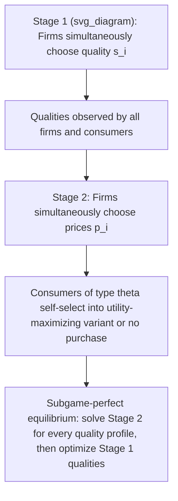

## Vertical Differentiation and Endogenous Quality Choice

### Overview

Vertical differentiation describes a market in which products differ along a quality dimension that all consumers agree on ranking the same way — every consumer prefers higher quality to lower quality *at the same price* — but consumers differ in their willingness to pay for that quality. This distinguishes vertical differentiation from horizontal differentiation (Hotelling-style), where consumers disagree about which variant they prefer even at equal prices. The canonical framework, due to Gabszewicz and Thisse (1979) and Shaked and Sutton (1982), embeds quality as a strategic choice variable firms make before competing in price, and is used to explain why oligopolistic markets do not collapse into the Bertrand paradox and why market structure can remain concentrated even as the market grows.

### Core Model Setup

**Key Points**

- Consumers are indexed by a taste/income parameter $\theta$, uniformly distributed on $[\underline{\theta}, \bar{\theta}]$, representing marginal willingness to pay for quality.
- Firms choose a quality level $s_i \in [\underline{s}, \bar{s}]$ and a price $p_i$.
- A consumer of type $\theta$ purchasing quality $s_i$ at price $p_i$ obtains utility:

  $$U(\theta) = \theta s_i - p_i$$
- Consumers either buy one unit of one variant or abstain (unit-demand, "address" framework); there is no repeat purchase or quantity choice.
- Because *all* consumer types agree that higher $s$ is better holding price fixed, this ranking-agreement property is what defines the differentiation as "vertical" rather than "horizontal."

### Two-Stage Game Structure

**Key Points**

- **Stage 1 (Quality choice):** Firms simultaneously and independently choose quality levels $s_i$, often subject to a quality-dependent fixed or marginal cost.
- **Stage 2 (Price competition):** Having observed all qualities, firms simultaneously set prices $p_i$; consumers then self-select into the variant (or no purchase) that maximizes their surplus.
- Solved by backward induction: derive price equilibrium as a function of the quality profile, then find the qualities that are mutually optimal in Stage 1 given the anticipated Stage 2 price competition.

### Consumer Self-Selection and Market Segmentation

**Key Points**

- With two firms offering qualities $s_L < s_H$ at prices $p_L < p_H$, the marginal consumer indifferent between the two products has type $\theta^*$ solving:

  $$\theta^* s_L - p_L = \theta^* s_H - p_H \implies \theta^* = \frac{p_H - p_L}{s_H - s_L}$$
- Consumers with $\theta > \theta^*$ (higher willingness to pay for quality) buy the high-quality variant; consumers with $\theta < \theta^*$ buy the low-quality variant, down to a second cutoff $\theta_0 = p_L / s_L$ below which consumers abstain entirely.
- This generates a market fully segmented by consumer type — an ordered "quality ladder" — rather than the symmetric splitting seen in horizontal (Hotelling) models.

### The Central Result: Endogenous Maximal Differentiation

**Key Points**

- The Shaked-Sutton result: in the subgame-perfect equilibrium of the two-stage quality-then-price game, firms **do not choose the same or similar quality levels** — they choose *maximally differentiated* qualities, one firm settling near the top of the feasible quality range and the other near the bottom.
- Intuition: if two firms chose similar qualities, Stage 2 price competition would be fierce (near-Bertrand, prices driven toward marginal cost) because products are close substitutes. Firms anticipate this and use Stage 1 quality choice strategically to **relax subsequent price competition** by differentiating.
- This is the vertical-differentiation analogue of the principle of maximal differentiation from Hotelling-style horizontal models (d'Aspremont, Gabszewicz and Thisse, 1979), but the driving force here is quality-space distance directly softening Bertrand price competition, rather than transport costs.
- **Result:** the Bertrand paradox is resolved without needing capacity constraints (contrast with Kreps-Scheinkman) — pure product differentiation in quality space suffices to generate positive equilibrium margins.

### Natural Oligopoly and the Finiteness Property

**Key Points**

- A striking implication of the Shaked-Sutton framework, sometimes called the **finiteness property**, is that as the size of the market (number of consumers, or market "extent") grows, the number of firms that can profitably coexist in equilibrium does **not** grow proportionally — it converges to a finite upper bound.
- This contrasts sharply with horizontally differentiated or homogeneous-good markets, where free entry drives the number of firms up roughly proportionally with market size, and each firm's market share (and profit) shrinks toward zero as the market grows (the standard "monopolistic competition" limiting result).
- Mechanism: because higher-quality firms can always capture a discrete premium from higher-$\theta$ consumers, quality competition is not "diluted" by market growth in the way that price competition among homogeneous firms is; a bounded number of quality tiers can absorb an arbitrarily large, growing population of consumers without additional entry eroding margins to zero.
- Empirical implication: industries with strong vertical differentiation (e.g., a small number of quality tiers in cars, processors, or fashion segments) tend to remain concentrated even as the underlying market expands, whereas horizontally differentiated industries (e.g., restaurant variety by cuisine/location) tend to fragment as demand grows.

### Quality as a Strategic Cost Structure

**Key Points**

- The specific form assumed for the cost of quality is critical to which equilibrium (maximal differentiation vs. minimal/quality convergence) emerges.
- **Quality-independent marginal cost:** if quality only affects fixed cost (not marginal production cost), the model produces the classical Shaked-Sutton maximal-differentiation and natural-oligopoly result.
- **Quality-dependent marginal cost:** if higher quality raises marginal (not just fixed) production cost, the qualitative maximal-differentiation logic typically persists but equilibrium quality levels and profit margins are compressed relative to the fixed-cost-only case, since marginal cost differences partially substitute for price differences in segmenting the market.
- [Inference] the general robustness of the maximal-differentiation result across cost specifications is a standard textbook simplification; specific functional forms for cost-of-quality can generate intermediate differentiation outcomes rather than the polar (extreme low/extreme high) result, particularly when quality costs are convex and steep near the top of the feasible range.

### Worked Example (Duopoly, Linear-Uniform Setup)

**Example**

Let consumer types $\theta$ be uniform on $[0, 1]$, with two firms choosing qualities $s_L$ and $s_H$ ($s_H > s_L \geq 0$) at zero marginal cost of production (quality cost is sunk/fixed only). The market fully covers, so every consumer buys from one of the two firms.

Given qualities, Stage 2 Bertrand-style price competition (with vertical product differentiation) yields the standard result:

$$p_H^* = \frac{s_H - s_L}{3}(2), \quad p_L^* = \frac{s_H - s_L}{3}$$

(with the exact constants depending on the covered/uncovered market assumption used), and resulting profits:

$$\pi_H \propto (s_H - s_L), \quad \pi_L \propto (s_H - s_L)$$

Since both firms' Stage 2 profits are **increasing in the quality gap** $(s_H - s_L)$, each firm's Stage 1 incentive is to push its own quality as far as possible from the rival's — the high-quality firm to the top of the feasible range $\bar{s}$, the low-quality firm to the bottom $\underline{s}$ — confirming maximal differentiation as the subgame-perfect outcome.

### Comparison: Vertical vs. Horizontal Differentiation

| Feature | Horizontal (Hotelling) | Vertical (Shaked-Sutton) |
| --- | --- | --- |
| Consumer preference structure | Consumers disagree on best variant | All consumers agree on quality ranking |
| Differentiation dimension | Location/taste, no inherent ranking | Quality, universally ranked |
| Bertrand paradox resolution | Transport costs soften price competition | Quality gap softens price competition |
| Effect of market growth on entry | Entry roughly scales with market size | Entry bounded (finiteness property / natural oligopoly) |
| Equilibrium differentiation | Maximal (linear city, quadratic costs) or minimal (linear costs) | Maximal, under standard cost assumptions |

### Applications and Extensions

**Key Points**

- **Endogenous market structure:** the framework is used to explain why some industries (e.g., aircraft manufacturing, premium/economy segmentation in many consumer goods) sustain only a small number of firms even at large scale, consistent with the natural-oligopoly prediction.
- **Multi-firm/multi-quality extensions:** with $n > 2$ firms, equilibrium typically involves firms locating at distinct quality tiers rather than clustering, though the precise number of active tiers depends on cost parameters and market coverage assumptions.
- **Combined vertical-horizontal models:** real products often differ on both dimensions simultaneously (e.g., a car varies in both quality/reliability and brand "feel"); such models nest Hotelling-style horizontal competition within a vertical quality dimension, and are used to study segmented markets like automobiles or smartphones. [Inference] full closed-form characterizations of combined models are less standardized than the pure vertical or pure horizontal cases and typically require numerical or case-specific solution methods.
- **Quality regulation and standards:** the framework informs policy questions such as minimum-quality standards, since a regulator raising the floor $\underline{s}$ can compress the feasible quality-differentiation range and intensify Stage 2 price competition, potentially reducing firm profits while raising realized product quality for lower-end consumers. Behavioral response to any such regulation may vary depending on firms' cost structures and the covered/uncovered nature of the market. [Unverified — policy-context dependent]

### Illustrative Diagram — Quality Ladder and Consumer Segmentation

<svg xmlns="http://www.w3.org/2000/svg" viewBox="0 0 720 300" font-family="sans-serif">
<text x="360" y="24" text-anchor="middle" font-size="16" font-weight="bold">Vertical Differentiation: Consumer Segmentation (svg_diagram)</text>
<line x1="60" y1="150" x2="660" y2="150" stroke="black" stroke-width="2" />
<text x="360" y="175" text-anchor="middle" font-size="12">Consumer type θ (willingness to pay for quality)</text>
<line x1="60" y1="140" x2="60" y2="160" stroke="black" stroke-width="1.5" />
<text x="60" y="130" text-anchor="middle" font-size="11">θ_low (0)</text>
<line x1="270" y1="140" x2="270" y2="160" stroke="black" stroke-width="1.5" />
<text x="270" y="130" text-anchor="middle" font-size="11">θ0 (no purchase cutoff)</text>
<line x1="460" y1="140" x2="460" y2="160" stroke="black" stroke-width="1.5" />
<text x="460" y="130" text-anchor="middle" font-size="11">θ* (indifference point)</text>
<line x1="660" y1="140" x2="660" y2="160" stroke="black" stroke-width="1.5" />
<text x="660" y="130" text-anchor="middle" font-size="11">θ_high (1)</text>
<rect x="60" y="200" width="210" height="30" fill="none" stroke="black" stroke-width="1" />
<text x="165" y="220" text-anchor="middle" font-size="11">No purchase</text>
<rect x="270" y="200" width="190" height="30" fill="none" stroke="black" stroke-width="1" />
<text x="365" y="220" text-anchor="middle" font-size="11">Buy low-quality (s_L, p_L)</text>
<rect x="460" y="200" width="200" height="30" fill="none" stroke="black" stroke-width="1" />
<text x="560" y="220" text-anchor="middle" font-size="11">Buy high-quality (s_H, p_H)</text>
<line x1="165" y1="230" x2="165" y2="200" stroke="black" stroke-width="0.5" stroke-dasharray="2,2" />
<line x1="365" y1="230" x2="365" y2="200" stroke="black" stroke-width="0.5" stroke-dasharray="2,2" />
<line x1="560" y1="230" x2="560" y2="200" stroke="black" stroke-width="0.5" stroke-dasharray="2,2" />

<text x="360" y="270" text-anchor="middle" font-size="11">θ* = (p_H − p_L) / (s_H − s_L); θ0 = p_L / s_L</text>

</svg>

**Related Topics**

- Shaked and Sutton (1982): "Relaxing Price Competition through Product Differentiation"
- Natural oligopoly and the finiteness property in concentrated industries
- Comparison with Kreps-Scheinkman capacity precommitment as an alternative resolution of the Bertrand paradox
- Minimum quality standards and vertical-differentiation policy analysis
- Multi-firm quality-ladder models and endogenous number of active quality tiers
- Combined horizontal-vertical differentiation models
- Cournot vs. Bertrand competition with product differentiation