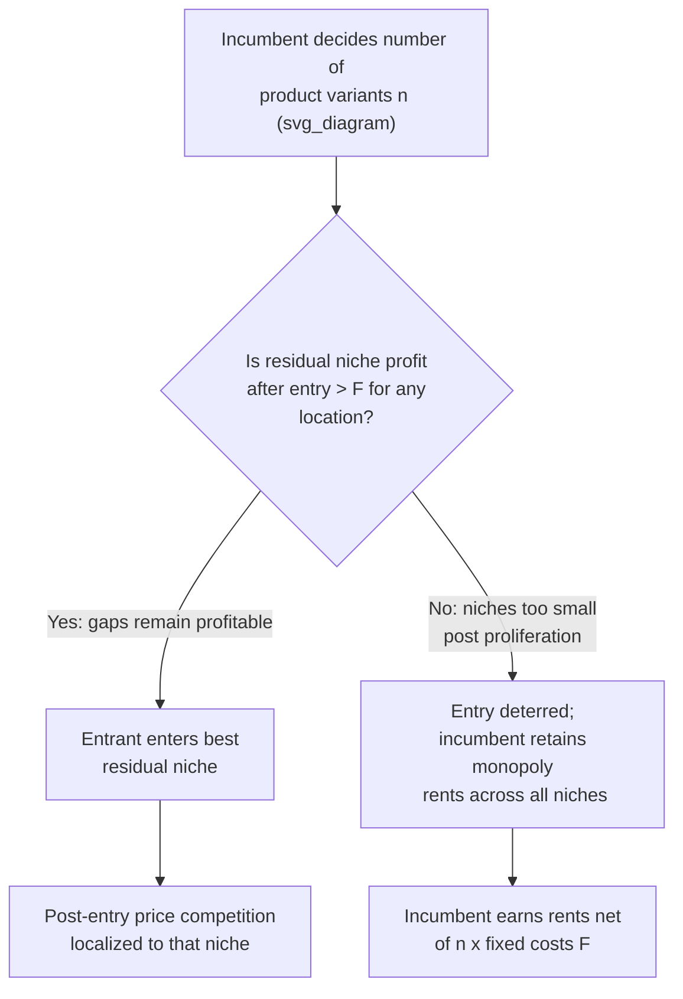

## Product Proliferation as an Entry-Deterring Strategy

### Definition and Conceptual Overview

Product proliferation refers to the strategic practice by which incumbent firms introduce a large number of product variants (brands, models, flavors, or spatial locations in characteristic space) to fill the available niches in a market, leaving insufficient demand for a potential entrant to profitably occupy any remaining gap. It is a preemptive, non-price entry-deterrence mechanism rooted in models of spatial and monopolistic competition, distinct from limit pricing or capacity expansion, because it operates on the dimension of product space rather than output volume or price alone.

The strategy exploits the structure of horizontally differentiated markets: since consumers incur disutility (transport costs, mismatch costs) from consuming a product that does not match their ideal variety, an incumbent that saturates the product space with closely spaced offerings raises the fixed-cost hurdle for entrants relative to the residual demand available in any unfilled niche.

### Theoretical Foundations

**Key Points**

- Builds on Hotelling-type linear city and Salop circular city models of spatial competition
- Formalized rigorously by Schmalensee (1978) for the ready-to-eat cereal industry and by Bonanno (1987), Judd (1985), and Eaton and Lipsey (1979) for entry deterrence
- Relies on the interaction between economies of scope in brand proliferation and the sunk costs of introducing each variant

The canonical logic follows three conditions, jointly necessary for proliferation to be a credible deterrent:

1. **Product differentiation with localized competition**: consumers only substitute toward "nearby" varieties, so an incumbent's product occupies a defensive zone in characteristic space.
2. **Sunk costs of entry per variant**: each new product (incumbent's or entrant's) requires a fixed, non-recoverable setup cost $F$.
3. **Post-entry price competition**: if a new firm enters near an existing product, Bertrand-like price competition in that neighborhood erodes margins, so anticipated post-entry profit at any niche must be compared against $F$.

### The Eaton–Lipsey Model (Spatial Preemption)

Eaton and Lipsey (1979) formalized proliferation in the context of spatial and temporal preemption. An incumbent holding multiple store/product locations along a Hotelling line can preempt entry by maintaining product age/location advantages, since a first mover's ability to relocate or refresh products at zero or low cost prevents an entrant from finding an underserved segment.

**Setup (Linear City Analogue)**

Let consumers be uniformly distributed on $[0,1]$ with density 1. Each consumer incurs a linear transport cost $t$ per unit distance from their ideal point to the nearest available product. An incumbent monopolist chooses $n$ product locations to maximize profit net of $n$ fixed setup costs $F$, while deterring an entrant who would need to find a segment of the line with residual demand large enough to cover $F$ after post-entry price competition.

$$\pi_{entrant} = \left(\frac{t}{4}\right)\left(\frac{1}{n+1}\right)^2 \cdot D - F$$

Here $D$ is total market demand and $n$ is the number of incumbent products already spaced along the line; the entrant's maximal captured segment shrinks as $n$ increases, since closer incumbent spacing reduces the width of any residual gap. Entry is deterred once $n$ is large enough that $\pi_{entrant} \le 0$ for every feasible location.

### The Schmalensee Cereal Model

Schmalensee's analysis of ready-to-eat breakfast cereal argued that incumbents (Kellogg, General Mills, General Foods) proliferated brands to occupy every plausible taste/nutrition niche (sweetened, bran, corn-based, children-oriented, adult-oriented), such that any entrant's new brand would necessarily be a close substitute for an existing incumbent brand, triggering intense localized competition and cannibalization risk that made entry unattractive even though aggregate industry profits were high.

**Key Points**

- Aggregate industry-level profitability signals (suggesting room for entry) can coexist with firm-level deterrence at the niche level
- The strategy is easier to sustain when incumbents have already amortized fixed costs of a base brand and can extend at lower marginal fixed cost (brand extension economies)
- Antitrust scrutiny historically treated this as a borderline practice: proliferation can be read either as pro-competitive product variety provision or as anti-competitive foreclosure

### Formal Entry-Deterrence Condition (Bonanno Framework)

Bonanno (1987) generalized the two-stage game: in stage 1, the incumbent(s) choose the number and location of products; in stage 2, entry occurs if profitable, followed by price competition (Nash equilibrium in prices).

The incumbent's proliferation decision solves:

$$\max_{n} \; \Pi_I(n) = \sum_{i=1}^{n} \pi_i(n) - nF \quad \text{subject to} \quad \pi_E(n^*) < F \; \forall \text{ potential entry locations}$$

where $\pi_i(n)$ is the profit earned by the incumbent's $i$-th product given $n$ total products in the market, and $\pi_E(n^*)$ is the maximum profit obtainable by an entrant choosing the best residual location given the incumbent's configuration $n^*$.

This yields a **Stackelberg-leader crowding logic**: the incumbent overinvests in product variety relative to the socially or monopolistically optimal number of variants purely to depress $\pi_E$ below $F$, even though each marginal product may earn less than it would in an unconstrained optimum.

### Distinguishing Proliferation from Related Strategies

**Key Points**

| Strategy | Instrument | Mechanism |
| --- | --- | --- |
| Limit pricing | Price | Signals low post-entry price via pre-entry price/output |
| Capacity expansion (Dixit) | Physical capacity | Commits to aggressive post-entry output via sunk capital |
| Product proliferation | Product variety/location | Commits to filling niches via sunk product-specific fixed costs |
| Predatory innovation | R&D/patents | Uses IP or technical standards to block substitutes |

Product proliferation is a **credible commitment device** in the Dixit (1980) sense: because product introduction costs are sunk, the incumbent's multi-product configuration cannot be costlessly reversed, making the threat of post-entry price competition in any niche believable to a rational entrant.

### Conditions Favoring Proliferation as a Viable Deterrent

- **Low marginal cost of additional variants relative to a full new brand launch** (shared distribution, manufacturing, or R&D platforms)
- **High transport/mismatch costs $t$**, which localize competition and make each niche a near-monopoly absent proliferation
- **Sunk, irreversible entry costs $F$** for both incumbent and entrant, symmetric enough that the incumbent's earlier mover advantage is decisive
- **Limited total market size $D$**, since a small market divided among many products leaves thin residual demand for entrants
- **Weak inter-niche substitution**, ensuring an entrant cannot aggregate demand across multiple underserved segments simultaneously

### Illustrative Numerical Example

**Example**

Consider a Salop circular city of circumference 1, transport cost $t = 4$, entry fixed cost $F = 0.05$, and market size normalized to $D = 1$. With $n$ symmetric incumbent products evenly spaced around the circle, the maximal profit available to a marginal entrant squeezing into the midpoint between two adjacent incumbents is approximately:

$$\pi_E(n) \approx \frac{t}{4(n)^2} - F$$

| $n$ (incumbent products) | Residual entrant profit $\pi_E(n)$ | Entry deterred? |
| --- | --- | --- |
| 2 | $1.00 - 0.05 = 0.95$ | No |
| 4 | $0.25 - 0.05 = 0.20$ | No |
| 6 | $0.111 - 0.05 = 0.061$ | No |
| 8 | $0.0625 - 0.05 = 0.0125$ | Yes |
| 10 | $0.04 - 0.05 = -0.01$ | Yes |

At $n = 8$ or above, the incumbent's product spacing shrinks the entrant's maximal captured segment enough that entry becomes unprofitable. [Inference] The exact deterrence threshold is sensitive to the assumed post-entry pricing game (Bertrand-Nash vs. sequential); alternative specifications shift the critical $n$.

### Diagram: Spatial Proliferation on a Circular Market

### SVG: Product Space Saturation (Linear City)

<svg xmlns="http://www.w3.org/2000/svg" viewBox="0 0 720 220">
<text x="360" y="24" text-anchor="middle" font-size="16" font-weight="bold" fill="#1a1a1a">Product Proliferation Along a Linear City (svg_diagram)</text>
<line x1="60" y1="120" x2="660" y2="120" stroke="#333" stroke-width="2" />
<text x="60" y="145" font-size="12" fill="#555">0</text>
<text x="650" y="145" font-size="12" fill="#555">1</text>
<circle cx="120" cy="120" r="7" fill="#2b6cb0" />
<circle cx="220" cy="120" r="7" fill="#2b6cb0" />
<circle cx="320" cy="120" r="7" fill="#2b6cb0" />
<circle cx="420" cy="120" r="7" fill="#2b6cb0" />
<circle cx="520" cy="120" r="7" fill="#2b6cb0" />
<circle cx="600" cy="120" r="7" fill="#2b6cb0" />

<text x="120" y="100" text-anchor="middle" font-size="11" fill="`#2b6cb0`">P1</text>

<text x="220" y="100" text-anchor="middle" font-size="11" fill="`#2b6cb0`">P2</text>

<text x="320" y="100" text-anchor="middle" font-size="11" fill="`#2b6cb0`">P3</text>

<text x="420" y="100" text-anchor="middle" font-size="11" fill="`#2b6cb0`">P4</text>

<text x="520" y="100" text-anchor="middle" font-size="11" fill="`#2b6cb0`">P5</text>

<text x="600" y="100" text-anchor="middle" font-size="11" fill="`#2b6cb0`">P6</text>

<line x1="170" y1="160" x2="170" y2="175" stroke="#c53030" stroke-width="1.5" stroke-dasharray="3,2" />
<text x="170" y="190" text-anchor="middle" font-size="10" fill="#c53030">gap width</text>
<text x="170" y="200" text-anchor="middle" font-size="10" fill="#c53030">too small for F</text>
<rect x="30" y="30" width="14" height="14" fill="#2b6cb0" />
<text x="50" y="42" font-size="11" fill="#333">Incumbent product location</text>
</svg>

Each incumbent product $P_i$ occupies a defensive radius; the maximal residual segment (gap) between adjacent products shrinks as more products are added, eventually falling below the width needed for an entrant to recover fixed cost $F$.

### Welfare and Antitrust Considerations

**Key Points**

- Proliferation can be **welfare-enhancing** insofar as it genuinely increases product variety available to consumers, reducing average mismatch/transport costs
- It can simultaneously be **allocatively inefficient** if the number of variants exceeds the socially optimal number derived from balancing variety benefits against duplicated fixed costs (the classic excess-entry/product-diversity externality result)
- Distinguishing predatory proliferation from legitimate variety provision is empirically difficult; courts and competition authorities generally require evidence that variants were introduced with the specific intent and effect of foreclosing entry rather than serving genuine unmet demand
- [Unverified] The degree to which historical antitrust cases (e.g., FTC's cereal industry investigation in the 1970s–80s) established binding legal precedent varies by jurisdiction and outcome; the cereal case itself did not result in a successful FTC enforcement action

### Limitations of the Strategy

- Proliferation is costly to sustain: each additional variant carries its own fixed cost, so the incumbent trades some monopoly rent for deterrence value, and the strategy is only rational if the discounted value of deterred entry exceeds the sum of the incremental fixed costs
- If economies of scope across variants are low, proliferation becomes prohibitively expensive relative to alternative deterrence tools (price commitments, contracts, capacity)
- Entrants may circumvent localized proliferation by targeting a fundamentally different characteristic dimension not covered by the incumbent's existing product space (lateral rather than local entry)
- [Inference] In markets with rapid technological change or shifting consumer preferences, a static proliferation configuration may become stale, reopening niches faster than incumbents can respond, though the empirical magnitude of this effect is context-dependent

### Related Topics

- Hotelling linear city and Salop circular city models of spatial competition
- Limit pricing and Bain-Sylos entry deterrence models
- Dixit's capacity commitment model of strategic entry deterrence
- Brand proliferation and shelf-space competition in retail economics
- Excess entry theorem and social vs. private incentives for product diversity (Spence, Dixit-Stiglitz variety models)
- Predatory innovation and standard-setting as entry barriers
- Contestable markets theory as a counterpoint to preemption strategies
- Two-stage games of location choice followed by price competition (d'Aspremont, Gabszewicz, Thisse)