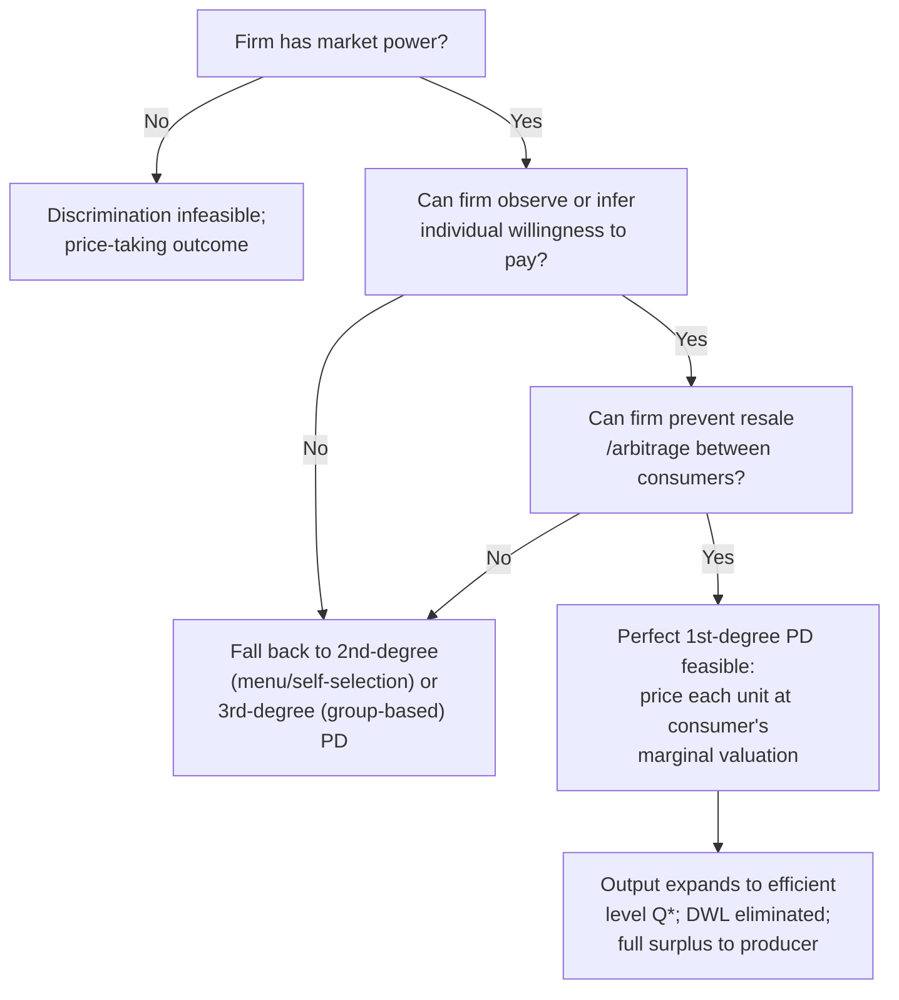

## First-Degree Price Discrimination

### Definition and Conceptual Overview

First-degree price discrimination (also termed perfect price discrimination) occurs when a seller charges each buyer the maximum amount that buyer is willing to pay for each unit purchased, thereby extracting the entirety of consumer surplus and converting it into producer surplus. It represents the theoretical limiting case of price discrimination, requiring the seller to know each consumer's individual demand curve (or willingness to pay) with certainty and to prevent arbitrage (resale) between consumers.

Under perfect first-degree discrimination, price varies both across consumers and across units purchased by the same consumer, such that the price charged for the marginal unit equals that unit's marginal valuation.

### Theoretical Foundations

**Key Points**

- Distinguished from second-degree (menu-based, self-selecting) and third-degree (group-based, observable-characteristic) discrimination in Pigou's (1920) original taxonomy
- Requires three conditions: (1) market power, (2) knowledge of individual willingness to pay, (3) no resale/arbitrage across consumers
- Yields an allocatively efficient output level (marginal cost pricing at the margin) while transferring all surplus to the producer

Under perfect price discrimination, the firm effectively charges a personalized, non-linear price schedule $p_i(q)$ for each consumer $i$, equal to that consumer's inverse demand curve. The firm's problem is:

$$\max_{q_i} \; \sum_i \left[ \int_0^{q_i} p_i(x)\,dx - c(q_i) \right]$$

where $p_i(x)$ is consumer $i$'s inverse demand (marginal willingness to pay) and $c(q_i)$ is the cost of serving quantity $q_i$. The first-order condition for each consumer sets:

$$p_i(q_i) = c'(q_i)$$

meaning each consumer is supplied up to the point where their marginal valuation equals marginal cost — the same efficiency condition as perfect competition, but with the entire surplus captured by the seller rather than shared with buyers.

### Graphical Representation and Surplus Extraction

**Key Points**

- Under uniform (single-price) monopoly: price is constant at $p^m$, quantity $Q^m < Q^*$ (competitive/efficient quantity), generating deadweight loss
- Under perfect first-degree discrimination: quantity expands to $Q^* $ (where $P(Q) = MC$), deadweight loss is eliminated, but all surplus becomes producer surplus

In the standard linear demand/constant marginal cost case, with inverse demand $P(Q) = a - bQ$ and constant marginal cost $c$:

$$Q^* = \frac{a-c}{b}, \qquad \text{Total Surplus} = \frac{(a-c)^2}{2b}$$

Under uniform monopoly pricing, $Q^m = \frac{a-c}{2b}$, and deadweight loss equals:

$$DWL = \frac{(a-c)^2}{8b}$$

Perfect first-degree discrimination recovers this entire deadweight loss as additional producer surplus, since output rises to $Q^*$ and every unit is sold at the corresponding point on the demand curve rather than at a single uniform price.

### SVG: Surplus Extraction Under Perfect Price Discrimination

<svg xmlns="http://www.w3.org/2000/svg" viewBox="0 0 700 420">
<text x="350" y="24" text-anchor="middle" font-size="16" font-weight="bold" fill="#1a1a1a">Consumer Surplus Capture Under 1st-Degree PD (svg_diagram)</text>
<line x1="70" y1="360" x2="640" y2="360" stroke="#333" stroke-width="2" />
<line x1="70" y1="360" x2="70" y2="40" stroke="#333" stroke-width="2" />
<text x="645" y="365" font-size="12" fill="#333">Quantity</text>
<text x="40" y="35" font-size="12" fill="#333">Price</text>
<line x1="70" y1="60" x2="600" y2="340" stroke="#2b6cb0" stroke-width="2" />
<text x="590" y="335" font-size="11" fill="#2b6cb0">Demand P(Q)</text>
<line x1="70" y1="260" x2="600" y2="260" stroke="#c53030" stroke-width="2" />
<text x="605" y="264" font-size="11" fill="#c53030">MC</text>
<polygon points="70,60 70,260 400,260" fill="#68d391" fill-opacity="0.45" />
<text x="180" y="180" font-size="12" fill="#22543d">Captured as Producer Surplus</text>
<text x="180" y="196" font-size="11" fill="#22543d">(formerly Consumer Surplus)</text>
<line x1="400" y1="260" x2="400" y2="360" stroke="#555" stroke-width="1" stroke-dasharray="3,2" />
<text x="400" y="378" text-anchor="middle" font-size="11" fill="#333">Q* (efficient quantity)</text>
<line x1="220" y1="150" x2="220" y2="360" stroke="#999" stroke-width="1" stroke-dasharray="2,2" />
<text x="220" y="378" text-anchor="middle" font-size="10" fill="#666">Qm (uniform monopoly)</text>
<rect x="30" y="390" width="14" height="14" fill="#68d391" fill-opacity="0.45" />
<text x="50" y="401" font-size="10" fill="#333">Surplus transferred from consumers to firm; DWL eliminated relative to uniform pricing</text>
</svg>

### Implementation Mechanisms in Practice

**Key Points**

Perfect first-degree discrimination is rarely observed in pure form because it requires complete information about individual valuations, but several real-world mechanisms approximate it:

- **Personalized negotiation**: car dealerships, real estate transactions, B2B procurement, and professional services (lawyers, consultants) where prices are individually negotiated based on observed or inferred willingness to pay
- **Auctions**: a well-designed auction (e.g., a discriminatory-price or "pay-as-bid" multi-unit auction) approximates first-degree discrimination by eliciting each bidder's valuation directly through the bidding mechanism
- **Algorithmic/personalized pricing**: e-commerce platforms using browsing history, purchase history, device type, and geolocation data to infer individual reservation prices and dynamically adjust displayed prices
- **Two-part tariffs with individually calibrated fixed fees**: if the seller can observe each consumer's total surplus and set a personalized fixed fee equal to it while pricing the variable component at marginal cost, this replicates first-degree outcomes even without literally varying the marginal price schedule unit-by-unit

[Inference] The empirical prevalence of near-perfect discrimination via algorithmic pricing is difficult to establish precisely because firms rarely disclose the granularity of their pricing algorithms, and observed price variation may reflect cost differences (e.g., shipping, inventory) rather than discrimination based purely on willingness to pay.

### Formal Model: Personalized Two-Part Tariff

Suppose consumer $i$ has inverse demand $p_i(q) = \alpha_i - \beta q$. A firm with marginal cost $c$ that can identify $\alpha_i$ for each consumer sets a personalized tariff $T_i(q) = A_i + cq$, where the fixed fee $A_i$ is calibrated to extract the consumer's entire surplus at the efficient quantity $q_i^* = \frac{\alpha_i - c}{\beta}$:

$$A_i = \int_0^{q_i^*} \left[p_i(x) - c\right] dx = \frac{(\alpha_i - c)^2}{2\beta}$$

Each consumer purchases at marginal cost (so consumption is efficient) but pays a fixed fee exactly equal to their consumer surplus, leaving them indifferent between purchasing and not purchasing — the hallmark outcome of perfect discrimination even though the mechanism resembles second-degree pricing.

### Illustrative Numerical Example

**Example**

Let inverse market demand be $P(Q) = 100 - 2Q$ and marginal cost $c = 20$.

**Uniform monopoly:**

Marginal revenue $MR(Q) = 100 - 4Q$; setting $MR = MC$: $100 - 4Q = 20 \Rightarrow Q^m = 20$, $P^m = 60$.

Profit $= (60-20)(20) = 800$.

Consumer surplus $= \frac{1}{2}(100-60)(20) = 400$.

Deadweight loss $= \frac{1}{2}(40)(40-20) = 200$.

**Perfect first-degree discrimination:**

Efficient quantity where $P(Q) = MC$: $100 - 2Q = 20 \Rightarrow Q^* = 40$.

Total surplus (all captured by firm) $= \frac{1}{2}(100-20)(40) = 1600$.

Consumer surplus $= 0$.

Deadweight loss $= 0$.

| Metric | Uniform Monopoly | Perfect 1st-Degree PD |
| --- | --- | --- |
| Quantity | 20 | 40 |
| Producer Surplus | 800 | 1600 |
| Consumer Surplus | 400 | 0 |
| Deadweight Loss | 200 | 0 |
| Total Surplus | 1200 | 1600 |

Perfect discrimination doubles producer surplus relative to uniform pricing and recovers the full deadweight loss, illustrating the efficiency–distribution tradeoff central to the topic.

### Diagram: Decision Logic for Feasibility of First-Degree Discrimination

### Welfare and Distributional Considerations

**Key Points**

- **Allocative efficiency**: total surplus is maximized under perfect discrimination since output reaches the competitive/efficient level; there is no deadweight loss in the standard single-market model
- **Distributional effects**: efficiency gains accrue entirely to the producer; consumers are made no better off than under non-participation (each consumer is held to their reservation utility)
- **Behavioral and fairness objections**: even though perfect discrimination is efficient in the narrow surplus-maximization sense, it raises equity concerns and is often perceived as unfair by consumers, which can generate reputational costs, regulatory scrutiny, or consumer backlash not captured in the static surplus model
- [Speculation] Some behavioral economics literature suggests that consumer perception of personalized/discriminatory pricing as unfair may reduce long-run demand or brand loyalty in ways not reflected in the static first-degree discrimination model, though the magnitude of such effects is context- and market-specific

### Conditions That Undermine Perfect Discrimination

- **Imperfect information**: firms rarely observe true individual valuations with certainty; observed proxies (browsing behavior, demographics, location) are noisy signals, so real-world "personalized pricing" is closer to a hybrid of first- and third-degree discrimination
- **Arbitrage and resale**: if consumers can resell to one another, low-price buyers can undercut the firm by reselling to high-valuation consumers, unwinding the discrimination scheme; this is why perfect discrimination is more feasible for services (non-transferable) than for easily resold physical goods
- **Legal and regulatory constraints**: many jurisdictions restrict discriminatory pricing based on protected characteristics (e.g., race, gender) even when correlated with willingness to pay; algorithmic personalized pricing has drawn regulatory attention in several jurisdictions regarding transparency and fairness
- **Strategic consumer behavior**: if consumers anticipate personalized pricing, they may strategically misrepresent preferences (e.g., clearing cookies, using incognito browsing) to avoid revealing high willingness to pay, degrading the firm's ability to price discriminate

### Related Topics

- Second-degree price discrimination and self-selecting nonlinear tariffs (menu pricing, quantity discounts)
- Third-degree price discrimination and market segmentation by observable characteristics
- Two-part tariffs and Coase's durable-goods monopoly problem
- Mechanism design and screening models (Mussa-Rosen, Maskin-Riley)
- Algorithmic pricing, dynamic pricing, and personalized pricing regulation
- Bundling and mixed bundling as discrimination substitutes
- Arbitrage conditions and resale markets in discrimination sustainability
- Welfare comparisons across discrimination degrees (Pigou's taxonomy)