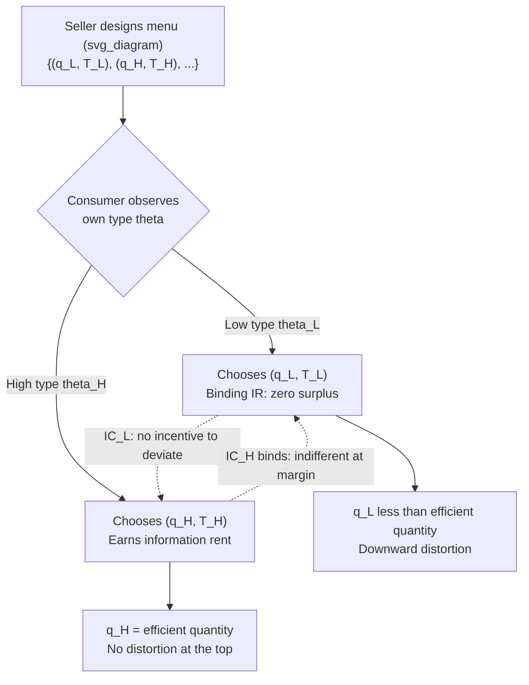

## Second-Degree Price Discrimination and Self-Selecting Menus

### Definition and Core Concept

Second-degree price discrimination (2PD) occurs when a monopolist offers a menu of distinct price-quantity or price-quality bundles, and consumers self-select the bundle intended for their type based on private information about their own preferences. Unlike first-degree (perfect) discrimination, the seller cannot observe each consumer's type directly. Unlike third-degree discrimination, the seller cannot condition prices on an observable group identifier (age, location, occupation). Instead, the seller relies on a **screening mechanism**: designing a menu of options such that consumers voluntarily reveal their type through the choice they make.

This is also called **indirect segmentation** or **screening**, and it is the canonical application of mechanism design theory to monopoly pricing.

### The Informational Environment

**Key Points**

- The seller knows the *distribution* of consumer types but not any individual consumer's realized type.
- Consumers know their own type (their valuation function or marginal willingness to pay).
- The seller must design contracts (bundles) that induce **self-selection**: each type chooses the bundle designed for it, not a bundle designed for another type.

Formally, let consumer type be indexed by $\theta \in [\underline{\theta}, \overline{\theta}]$, distributed according to a cumulative distribution $F(\theta)$ with density $f(\theta)$. A consumer of type $\theta$ derives utility $U(q, \theta) - T$ from consuming quantity/quality $q$ and paying tariff $T$. The standard single-crossing assumption requires:

$$\frac{\partial}{\partial \theta}\left(\frac{\partial U/\partial q}{1}\right) > 0$$

meaning higher-$\theta$ types have a higher marginal valuation for $q$ at every level of $q$ — this ordering of marginal valuations is what makes self-selection possible at all.

### The Menu Design Problem

The seller offers a menu of contracts $\{(q(\theta), T(\theta))\}_{\theta \in [\underline{\theta}, \overline{\theta}]}$. By the **Revelation Principle**, the seller can restrict attention to *direct mechanisms* where each type $\theta$ is asked to report a type $\hat{\theta}$, and the optimal mechanism can always be implemented as one where truthful reporting is optimal for every type.

The seller's problem is to choose $\{q(\theta), T(\theta)\}$ to maximize expected profit:

$$\max_{q(\theta), T(\theta)} \int_{\underline{\theta}}^{\overline{\theta}} \left[T(\theta) - c(q(\theta))\right] f(\theta)\, d\theta$$

subject to two constraint families.

### Incentive Compatibility (IC)

Each type must prefer its own bundle to any other type's bundle:

$$U(q(\theta), \theta) - T(\theta) \geq U(q(\hat{\theta}), \theta) - T(\hat{\theta}) \quad \forall \theta, \hat{\theta}$$

This is the formal statement of **self-selection**: the menu must be constructed so that mimicking another type's contract is never profitable.

### Individual Rationality (IR) / Participation Constraint

Each type must receive nonnegative surplus from participating rather than opting out:

$$U(q(\theta), \theta) - T(\theta) \geq 0 \quad \forall \theta$$

### Standard Solution Properties

Under regularity conditions (monotone hazard rate, single crossing), the solution to the relaxed problem exhibits several well-established structural results.

**No Distortion at the Top**

The highest type $\overline{\theta}$ receives the efficient (first-best) quantity: $q(\overline{\theta}) = q^*(\overline{\theta})$, where marginal utility equals marginal cost. This type has no one above it to mimic, so the seller extracts all its surplus above the next-highest type's indifference point without needing to distort its quantity.

**Downward Distortion Below the Top**

All types below $\overline{\theta}$ receive quantities *below* the efficient level: $q(\theta) < q^*(\theta)$ for $\theta < \overline{\theta}$. The seller deliberately underprovides quantity/quality to lower types in order to make their bundles less attractive to higher types, relaxing the binding IC constraints. This distortion is the source of the classic **quality/quantity distortion** result in screening models.

**Binding Constraints Pattern**

- Only the **local downward** IC constraints bind in equilibrium (type $\theta$ is indifferent only relative to the type just below it, $\theta - d\theta$).
- Only the **lowest type's** IR constraint binds; the lowest type $\underline{\theta}$ gets exactly zero surplus, and all higher types earn strictly positive **information rents**.

### Information Rents

Because the seller cannot identify types, it cannot fully extract surplus from any type above $\underline{\theta}$. The information rent of type $\theta$ is:

$$U(\theta) = U(q(\theta), \theta) - T(\theta) = \int_{\underline{\theta}}^{\theta} \frac{\partial U(q(x), x)}{\partial x}\, dx$$

This rent exists purely because higher types could mimic lower types and enjoy the (relatively cheap) lower-type bundle while deriving more utility from it than the lower type does. To prevent this, the seller must leave information rents on the table — a direct cost of asymmetric information relative to first-degree discrimination.

### The Two-Type Case (Canonical Teaching Model)

The two-type model with a low type $\theta_L$ and high type $\theta_H$ (with $\theta_H > \theta_L$ and prior probabilities $\lambda$ and $1-\lambda$) is the standard vehicle for deriving these results algebraically.

The seller's problem reduces to:

$$\max_{q_L, q_H, T_L, T_H} \lambda[T_L - c(q_L)] + (1-\lambda)[T_H - c(q_H)]$$

subject to:

- $IR_L$: $U(q_L, \theta_L) - T_L \geq 0$
- $IR_H$: $U(q_H, \theta_H) - T_H \geq 0$
- $IC_L$: $U(q_L, \theta_L) - T_L \geq U(q_H, \theta_L) - T_H$
- $IC_H$: $U(q_H, \theta_H) - T_H \geq U(q_L, \theta_H) - T_L$

At the optimum: $IR_L$ binds, $IC_H$ binds, and $IR_H$, $IC_L$ are slack. Solving these two binding constraints yields $q_H = q_H^*$ (efficient) and $q_L < q_L^*$ (distorted downward), with the high type earning rent equal to the difference in valuation of the low-type bundle between the two types:

$$\text{Rent}_H = U(q_L, \theta_H) - U(q_L, \theta_L)$$

### Diagram: Self-Selection Menu Structure

### Graphical Intuition (Surplus Diagram)

The standard textbook picture plots quantity $q$ on the horizontal axis and total payment $T$ on the vertical axis, with indifference curves for each type. Because of single crossing, the high type's indifference curves are flatter (lower marginal cost of quantity in utility terms is not quite right — rather, higher types have steeper marginal utility, so their indifference curves are less steep in $(q,T)$ space, meaning they need to be compensated less per unit of $T$ for a given increase in $q$). This generates a single crossing point between any two types' indifference curves through a given bundle, which is exactly what permits a menu to separate them.

<svg xmlns="http://www.w3.org/2000/svg" viewBox="0 0 640 420" font-family="sans-serif">
<text x="320" y="24" font-size="16" text-anchor="middle" font-weight="bold">Self-Selecting Menu: Quantity vs. Total Payment (svg_diagram)</text>
<line x1="70" y1="370" x2="600" y2="370" stroke="black" stroke-width="1.5" />
<line x1="70" y1="370" x2="70" y2="50" stroke="black" stroke-width="1.5" />
<text x="600" y="392" font-size="13" text-anchor="end">Quantity q</text>
<text x="45" y="55" font-size="13" text-anchor="end">Payment T</text>
<path d="M 90 340 Q 250 260 300 150" stroke="#2563eb" stroke-width="2" fill="none" />
<text x="100" y="330" font-size="12" fill="#2563eb">IC of theta_L through (q_L,T_L)</text>
<path d="M 90 355 Q 300 300 480 100" stroke="#dc2626" stroke-width="2" fill="none" />
<text x="330" y="200" font-size="12" fill="#dc2626">IC of theta_H through (q_L,T_L)</text>
<circle cx="230" cy="215" r="5" fill="#2563eb" />
<text x="238" y="212" font-size="12" fill="#2563eb">(q_L, T_L): IR_L binds</text>
<circle cx="470" cy="115" r="5" fill="#dc2626" />
<text x="478" y="112" font-size="12" fill="#dc2626">(q_H, T_H): efficient q_H</text>
<line x1="470" y1="370" x2="470" y2="115" stroke="#999" stroke-dasharray="4,3" />
<line x1="230" y1="370" x2="230" y2="215" stroke="#999" stroke-dasharray="4,3" />
<text x="220" y="385" font-size="12">q_L</text>
<text x="460" y="385" font-size="12">q_H = q*_H</text>
<line x1="70" y1="215" x2="230" y2="215" stroke="#999" stroke-dasharray="4,3" />
<line x1="70" y1="115" x2="470" y2="115" stroke="#999" stroke-dasharray="4,3" />

<text x="90" y="60" font-size="11" fill="#555">Vertical gap between the theta_H curve</text>

<text x="90" y="75" font-size="11" fill="#555">and (q_H,T_H) at q_H = information rent</text>

</svg>

### Real-World Examples of Self-Selecting Menus

**Example**

- **Airline fare classes**: Economy, Premium Economy, Business, First — differentiated by refundability, seat width, baggage allowance, and lounge access. Business travelers (high valuation for flexibility) self-select into expensive flexible fares; leisure travelers (price-sensitive) self-select into restrictive, cheap fares. The restrictions (advance purchase, Saturday-night stay, non-refundability) are **deliberately inefficient screening devices** — their function is not to reduce cost but to make the cheap fare unattractive to high-value business travelers.
- **Software versioning**: "Lite," "Pro," and "Enterprise" tiers of SaaS products, where feature-limited lower tiers are sometimes *more costly to produce* per the extra code needed to cripple them, illustrating that the distortion is about screening, not cost savings.
- **Quantity discounts / nonlinear pricing**: Bulk pricing (e.g., $\$1$ per unit for the first 10 units, $\$0.80$ per unit thereafter) screens high-volume buyers from low-volume buyers.
- **Insurance contract menus**: Policies with different deductible-premium combinations, where risk-averse or high-risk types self-select into low-deductible/high-premium contracts (this application blends with the broader screening literature in insurance markets, e.g., Rothschild-Stiglitz, though that setting has adverse selection with zero-profit competitive constraints rather than monopoly).
- **Utility pricing (two-part and block tariffs)**: Electricity or water tariffs with increasing block rates, screening high-usage from low-usage households.

### Relationship to Nonlinear Pricing

Second-degree price discrimination is the general theory underlying **nonlinear pricing** schedules — where the price per unit is not constant but varies with the quantity purchased, such as:

- **Block tariffs**: Different per-unit prices at different consumption blocks.
- **Two-part tariffs**: A fixed fee plus a per-unit price, which is optimal for extracting surplus when there is a single consumer type but becomes a menu problem when there is a distribution of types (this connects directly to the Chapter's broader nonlinear pricing framework).
- **Versioning**: Bundling of quality attributes rather than pure quantity.

The unifying mathematical structure is that the seller is choosing a **tariff function** $T(q)$ (or equivalently, a menu of discrete points on it) such that the marginal price $T'(q)$ is set optimally to balance surplus extraction against rent concession, with $T'(q)$ typically *decreasing* in $q$ for the standard model with a single crossing property (i.e., higher usage is rewarded with lower marginal price), which rationalizes observed quantity discounts as an *equilibrium screening outcome* rather than a cost-based practice.

### Bunching and Countervailing Incentives (Extensions)

**Bunching**: When the regularity condition on the type distribution (monotone hazard rate) fails, or when there are additional constraints (e.g., discrete number of allowed contracts, or exogenous bounds on $q$), the fully separating solution may require a decreasing allocation $q(\theta)$ over some range, which violates monotonicity requirements imposed by IC. In these cases, the optimal mechanism **bunches** adjacent types into a single pooling contract over that range, since a monotonic $q(\theta)$ is a *necessary condition* for implementability under single crossing.

**Countervailing incentives**: In extended models where the participation constraint is type-dependent in a way that is not monotonic (e.g., outside options that are more attractive to some middle type), the standard "IR binds only at the bottom" result can fail, requiring different qualitative predictions.

**Finite Menus vs. Continuum**: In practice, firms rarely offer a continuum of contracts. With a discrete number $n$ of contracts (e.g., 3 airline fare classes for a continuum of traveler valuations), the menu partitions the type space into intervals, each of which is served by one contract — this is the practically relevant version of the model firms implement, and it can be derived as the solution to a constrained version of the continuous mechanism design problem. [Inference: the exact welfare loss from restricting to $n$ discrete contracts versus the continuum depends on the specific functional forms and type distribution, and does not have a universal closed-form expression across all cases.]

### Contrast Table: First-, Second-, and Third-Degree Price Discrimination

| Feature | First-Degree | Second-Degree | Third-Degree |
| --- | --- | --- | --- |
| Seller's information | Observes individual type | Knows distribution only | Observes group membership |
| Mechanism | Personalized price per unit | Self-selecting menu | Group-specific uniform price |
| Consumer surplus | Zero (fully extracted) | Positive for all but lowest type | Positive, varies by group elasticity |
| Efficiency | Efficient (no distortion) | Distorted below the top | Efficient within group, allocatively inefficient across groups |
| Key constraint | None (perfect information) | IC and IR | Arbitrage/resale prevention across groups |

### Conditions Required for Second-Degree Discrimination to Work

**Key Points**

- **No resale/arbitrage**: consumers who buy the low-tier bundle must not be able to resell access or the good itself to high-type consumers (otherwise the screening menu unravels).
- **Verifiable self-selection instruments**: the seller must be able to attach observable, enforceable restrictions (quantity limits, quality caps, usage conditions) to each contract.
- **Sufficient heterogeneity and single crossing**: without an ordered, single-crossing preference structure, no incentive-compatible separating menu can be constructed.
- **Commitment**: the seller must be able to commit to the menu (including not renegotiating with a consumer who reveals low value after choosing an option), or else the **Coase conjecture**-style dynamic unraveling problems can undermine the static screening result.

### Welfare Implications

Relative to a single monopoly price, second-degree price discrimination is [Inference] generally welfare-ambiguous: it can raise total surplus by expanding output/participation to lower types who would otherwise be priced out (since the seller can now serve a wider range of the market profitably by offering a low-tier option) but it also introduces a deadweight loss from the downward quantity distortion imposed on non-top types. Whether total welfare rises or falls relative to uniform monopoly pricing depends on the specific distribution of types, cost function, and utility specification, and no universal sign holds across all parameterizations.

**Next Steps**

- Nonlinear pricing and optimal two-part tariffs
- Bunching and pooling equilibria under failure of the monotone hazard rate condition
- The Mussa-Rosen (1978) quality-versioning model as the canonical continuous-type formulation
- Maskin-Riley multi-product screening and multidimensional type spaces
- Adverse selection in insurance markets (Rothschild-Stiglitz) as a competitive analogue
- Dynamic price discrimination and the Coase conjecture (commitment failure)
- Durable goods monopoly and intertemporal versioning
- Auction-theoretic connections: revenue equivalence and the link between screening and optimal auction design (Myerson)