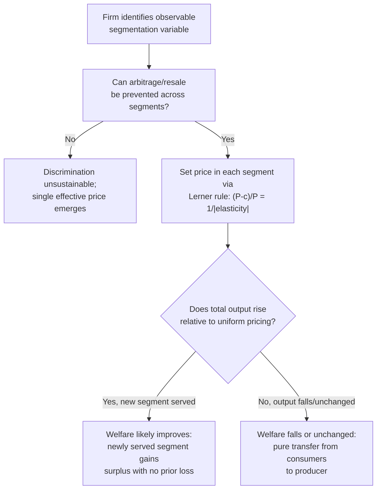

## Third-Degree Price Discrimination Across Market Segments

### Definition and Conceptual Overview

Third-degree price discrimination occurs when a seller with market power charges different prices to different, observably distinguishable groups of consumers, where each group faces a uniform (linear) price but prices vary across groups according to each segment's demand elasticity. Unlike first-degree discrimination (personalized pricing based on individual valuation) or second-degree discrimination (self-selecting menus), third-degree discrimination relies on **directly observable segmentation variables** — age, geography, student status, time of purchase, membership status — that correlate with willingness to pay, rather than requiring the firm to elicit private information through mechanism design.

This is historically the most commonly observed form of price discrimination in practice (student/senior discounts, geographic pricing, peak/off-peak pricing, coupon-based discrimination).

### Theoretical Foundations

**Key Points**

- Formalized in Pigou's (1920) original taxonomy as "discrimination of the third degree"
- Requires three conditions: (1) market power (downward-sloping firm-level demand), (2) ability to sort consumers into segments based on an observable and (ideally) unalterable characteristic, (3) prevention of resale/arbitrage across segments
- The optimal price in each segment follows directly from the inverse elasticity rule applied segment-by-segment

Consider a firm selling to $n$ segments with inverse demand $P_i(Q_i)$ in segment $i$, facing a common marginal cost $c$ (assuming no capacity constraints linking segments). The firm's profit-maximization problem decomposes into independent monopoly problems for each segment:

$$\max_{Q_i} \; \sum_{i=1}^{n} \left[ P_i(Q_i) Q_i - c \, Q_i \right]$$

The first-order condition for each segment yields the standard Lerner markup condition:

$$\frac{P_i - c}{P_i} = \frac{1}{|\varepsilon_i|}$$

where $\varepsilon_i$ is the price elasticity of demand in segment $i$. This is the central result of third-degree discrimination theory: **segments with more inelastic demand are charged higher prices**, and the price differential across any two segments $i, j$ is governed entirely by the ratio of their elasticities:

$$\frac{P_i}{P_j} = \frac{1 - 1/|\varepsilon_j|}{1 - 1/|\varepsilon_i|}$$

### Graphical Representation: Elasticity-Based Segmentation

<svg xmlns="http://www.w3.org/2000/svg" viewBox="0 0 720 400">
<text x="360" y="24" text-anchor="middle" font-size="16" font-weight="bold" fill="#1a1a1a">Third-Degree Discrimination: Elastic vs. Inelastic Segments (svg_diagram)</text>
<line x1="60" y1="340" x2="330" y2="340" stroke="#333" stroke-width="2" />
<line x1="60" y1="340" x2="60" y2="60" stroke="#333" stroke-width="2" />
<text x="150" y="365" font-size="11" fill="#333">Segment A (elastic)</text>
<line x1="60" y1="80" x2="300" y2="320" stroke="#2b6cb0" stroke-width="2" />
<line x1="60" y1="240" x2="300" y2="260" stroke="#38a169" stroke-width="2" />
<text x="70" y="245" font-size="10" fill="#38a169">MR_A</text>
<text x="70" y="90" font-size="10" fill="#2b6cb0">D_A</text>
<line x1="60" y1="200" x2="300" y2="200" stroke="#c53030" stroke-width="1.5" stroke-dasharray="4,2" />
<text x="305" y="204" font-size="10" fill="#c53030">MC</text>
<line x1="170" y1="200" x2="170" y2="340" stroke="#999" stroke-width="1" stroke-dasharray="2,2" />
<text x="170" y="358" text-anchor="middle" font-size="9" fill="#333">Q_A</text>
<line x1="60" y1="150" x2="170" y2="150" stroke="#999" stroke-width="1" stroke-dasharray="2,2" />
<text x="45" y="153" font-size="9" fill="#333">P_A (lower)</text>
<line x1="400" y1="340" x2="670" y2="340" stroke="#333" stroke-width="2" />
<line x1="400" y1="340" x2="400" y2="60" stroke="#333" stroke-width="2" />
<text x="480" y="365" font-size="11" fill="#333">Segment B (inelastic)</text>
<line x1="400" y1="70" x2="600" y2="330" stroke="#2b6cb0" stroke-width="2" />
<line x1="400" y1="180" x2="600" y2="290" stroke="#38a169" stroke-width="2" />
<text x="605" y="290" font-size="10" fill="#38a169">MR_B</text>
<text x="605" y="330" font-size="10" fill="#2b6cb0">D_B</text>
<line x1="400" y1="200" x2="640" y2="200" stroke="#c53030" stroke-width="1.5" stroke-dasharray="4,2" />
<text x="645" y="204" font-size="10" fill="#c53030">MC</text>
<line x1="480" y1="200" x2="480" y2="340" stroke="#999" stroke-width="1" stroke-dasharray="2,2" />
<text x="480" y="358" text-anchor="middle" font-size="9" fill="#333">Q_B</text>
<line x1="400" y1="105" x2="480" y2="105" stroke="#999" stroke-width="1" stroke-dasharray="2,2" />
<text x="380" y="108" font-size="9" fill="#333">P_B (higher)</text>
</svg>

The steeper (more inelastic) demand curve in Segment B supports a markup further above marginal cost than the flatter (more elastic) demand curve in Segment A, consistent with the inverse elasticity rule.

### Feasibility Conditions in Detail

**Key Points**

- **Segmentation must be based on an observable, verifiable signal**: age (student/senior ID), location (IP address, shipping address, store location), time (matinee vs. evening showtimes), or membership status
- **The signal should be difficult or costly for consumers to falsify**, otherwise high-valuation consumers migrate into the low-price segment (e.g., an adult using a fake student ID), eroding the price differential
- **Arbitrage prevention across segments is essential** — this is why third-degree discrimination is more sustainable for non-transferable services (movie tickets, haircuts, airline seats tied to identity) than for easily resold physical goods (textbooks resold across a national border)
- **Geographic price discrimination** frequently faces legal constraints under competition law (e.g., EU single market rules restricting geo-blocking) precisely because it depends on preventing consumers from purchasing across borders

### Welfare Analysis and the Output Effect

**Key Points**

Whether third-degree discrimination raises or lowers total welfare relative to uniform pricing is theoretically ambiguous and depends critically on whether **total output increases or decreases** when the firm switches from uniform to discriminatory pricing — a result formalized by Robinson (1933) and generalized rigorously by Varian (1985) and Schmalensee (1981).

**Key Points**

- If discriminatory pricing **increases total output** relative to the uniform-price benchmark (e.g., because it allows the firm to serve a previously unserved low-valuation segment that would have been priced out under a single uniform price), then aggregate welfare **can rise**, since the newly served segment's surplus gain can outweigh the surplus loss in segments facing higher discriminatory prices
- If discriminatory pricing **decreases or leaves output unchanged**, welfare necessarily **falls or stays the same** relative to uniform pricing, because discrimination in that case does nothing but redistribute surplus from consumers (in the high-price segment) to the firm, with no offsetting output-expansion benefit
- Varian's (1985) sufficient condition: a necessary condition for discrimination to raise welfare is that total output must increase; this is necessary but not always sufficient

Formally, for two segments with demands $Q_1(P_1)$ and $Q_2(P_2)$, if uniform monopoly price $P^u$ excludes segment 2 entirely (corner solution, $Q_2(P^u) = 0$) but discrimination allows segment 2 to be served profitably at a segment-specific price $P_2^* < P^u$, this is the paradigm case where discrimination is welfare-improving — it opens a previously foreclosed market.

### Illustrative Numerical Example

**Example**

A firm faces two markets. Market 1 (business travelers): $Q_1 = 100 - P_1$. Market 2 (leisure travelers): $Q_2 = 60 - 2P_2$. Marginal cost $c = 10$.

**Segment-specific monopoly pricing (third-degree discrimination):**

Market 1: $MR_1 = 100 - 2Q_1$; set $MR_1 = c$: $100 - 2Q_1 = 10 \Rightarrow Q_1 = 45$, $P_1 = 55$

Market 2: inverse demand $P_2 = 30 - 0.5Q_2$; $MR_2 = 30 - Q_2$; set $MR_2 = c$: $30 - Q_2 = 10 \Rightarrow Q_2 = 20$, $P_2 = 20$

**Uniform pricing counterfactual:**

Aggregate demand $Q = Q_1 + Q_2 = 160 - 3P$ (for $P \le 30$, both markets active); inverse: $P = \frac{160-Q}{3}$

$MR = \frac{160 - 2Q}{3}$; set $MR = c$: $\frac{160-2Q}{3} = 10 \Rightarrow Q = 65$, $P = 31.67$

At $P = 31.67$, however, Market 2's demand $Q_2 = 60 - 2(31.67) = -3.3 < 0$, meaning **Market 2 is entirely foreclosed under uniform pricing** — the uniform-price monopolist optimally serves only Market 1.

Re-solving with Market 2 excluded: uniform price on Market 1 alone gives the same $P_1 = 55$, $Q_1 = 45$ as before, and Market 2 receives zero output and zero surplus under uniform pricing.

| Regime | Q1 | P1 | Q2 | P2 | Market 2 served? |
| --- | --- | --- | --- | --- | --- |
| Uniform pricing | 45 | 55 | 0 | — | No |
| Third-degree discrimination | 45 | 55 | 20 | 20 | Yes |

Since discrimination strictly increases total output (from 45 to 65 units) by opening Market 2 without reducing Market 1's output or price, this is a textbook case satisfying Varian's necessary condition, and welfare **rises** under discrimination relative to uniform pricing — Market 2 consumers gain surplus that did not exist previously, while Market 1 consumers are unaffected.

### Diagram: Third-Degree Discrimination Decision and Welfare Logic

### Common Empirical Applications

**Key Points**

- **Geographic/international price discrimination**: pharmaceuticals priced differently across countries by income level and reimbursement systems; software/media regional pricing
- **Peak-load pricing**: electricity, congestion pricing, airline fares varying by time of booking and travel date (closely related to but distinct from pure third-degree discrimination, since peak pricing also reflects genuine marginal cost differences across time periods)
- **Demographic discounts**: student, senior, military, and corporate discounts tied to verifiable status
- **Coupon and rebate targeting**: coupons function as a self-selection-adjacent mechanism (closer to second-degree in strict mechanism-design terms, since redemption requires costly search effort) but are often discussed alongside third-degree discrimination in applied contexts
- [Inference] Whether observed peak/off-peak pricing constitutes "true" third-degree discrimination or reflects underlying marginal cost differences (e.g., higher generation costs at peak electricity demand) is often ambiguous in specific empirical settings and depends on separating cost-based from elasticity-based components of the price differential

### Legal and Regulatory Considerations

**Key Points**

- In the United States, the Robinson-Patman Act (1936) restricts certain forms of price discrimination in sales to resellers where the effect may substantially lessen competition, though enforcement has historically been inconsistent and the Act does not generally prohibit discrimination against final consumers
- EU competition law addresses discriminatory pricing primarily through Article 102 TFEU (abuse of dominance) and geo-blocking regulations aimed at preserving single-market integration
- [Unverified] The precise current enforcement posture of Robinson-Patman and analogous statutes varies over time with regulatory priorities and case law developments; readers should consult current legal sources for jurisdiction-specific and time-sensitive enforcement status

### Related Topics

- First-degree price discrimination and perfect surplus extraction
- Second-degree price discrimination and self-selecting nonlinear menus
- Peak-load pricing and time-of-use tariff design
- Ramsey pricing and welfare-optimal price discrimination under regulatory constraints
- International price discrimination and parallel trade/grey markets
- Robinson-Patman Act and antitrust treatment of discriminatory pricing
- Varian (1985) and Schmalensee (1981) welfare conditions for price discrimination
- Behavioral responses to perceived price discrimination and consumer fairness perceptions