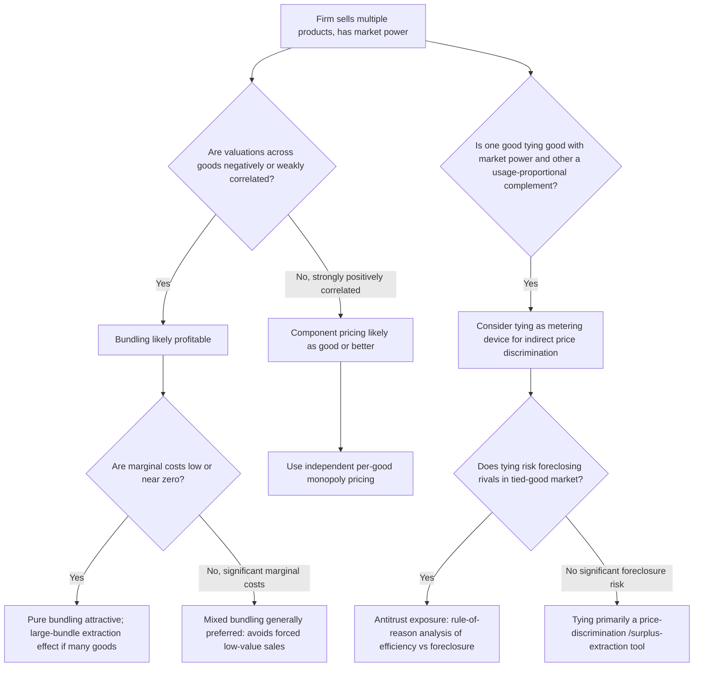

## Bundling and Tying Strategies

### Conceptual Foundations

Bundling and tying are strategies in which a firm sells two or more products together, either as a package or by conditioning the sale of one product on the purchase of another. Like two-part tariffs and quantity discounts, bundling is a form of nonlinear/multi-product pricing that can be used to extract consumer surplus, but its core mechanism is different: rather than screening a single-dimensional type via quantity, bundling exploits **negative correlation** (or heterogeneity) in valuations *across products* to reduce the dispersion of a buyer's willingness to pay for the package as a whole.

**Definitions**

- **Pure bundling**: products are sold *only* as a package; individual components are not available separately.
- **Mixed bundling**: the firm offers both the bundle *and* the individual components separately, letting buyers self-select.
- **Tying**: purchase of one good (the "tying good") is made conditional on also purchasing another good (the "tied good") from the same seller, often used when the tying good has market power and the tied good is a complement.
- **Component/unbundled/à la carte pricing**: goods sold and priced entirely independently (the baseline against which bundling is compared).

---

### Why Bundling Increases Profit: The Reduced-Dispersion Mechanism

**Core Intuition (Stigler's Insight, 1963)**

George Stigler first formalized why bundling can be profitable even when it appears to "give away" a good: if consumer valuations for two goods are negatively correlated (or simply not perfectly positively correlated), then the *sum* of valuations across the bundle has **lower relative dispersion** (lower coefficient of variation) than either valuation individually. A firm facing more homogeneous willingness-to-pay can set a price that captures a larger share of total surplus, because there is less of a trade-off between a high price (excluding low-value buyers) and a low price (leaving surplus on the table with high-value buyers).

**Numerical Illustration**

Suppose two goods, A and B, and two consumer types, each type demanding at most one unit of each good:

| Type | $v_A$ | $v_B$ | $v_A + v_B$ |
| --- | --- | --- | --- |
| Type 1 | 100 | 40 | 140 |
| Type 2 | 40 | 100 | 140 |

**Component (à la carte) pricing**: If the firm sells A and B separately, the profit-maximizing price for A is $\min(100,40)$ depending on which price captures more revenue: pricing $A$ at 100 sells only to Type 1 (revenue 100); pricing $A$ at 40 sells to both (revenue 80). So $p_A = 100$ (revenue 100) dominates. Symmetrically $p_B = 100$ (revenue 100). Total revenue $= 200$ (each type buys only the good they value at 100, forgoing the other).

**Pure bundling**: Since both types value the bundle at exactly 140, set $p_{bundle} = 140$. Both types buy. Total revenue $= 280$.

Bundling strictly dominates component pricing here (280 > 200) because it converts two goods with high *individual* valuation dispersion (100 vs. 40) into a bundle with *zero* dispersion in total valuation (both types value the bundle identically at 140), allowing full extraction.

**When Bundling Does NOT Help**

If valuations are perfectly positively correlated (Type 1 values both A and B highly, Type 2 values both lowly), bundling provides no dispersion-reduction benefit, and pure component pricing (or simple linear pricing per good) performs at least as well. [Inference] The general result — that bundling profitability depends on the correlation structure of valuations, with negative correlation typically favoring bundling — is a well-established finding from the bundling literature (Stigler 1963; Adams and Yellen 1976; McAfee, McMillan, and Whinston 1989), though the precise profit ranking between pure bundling, mixed bundling, and component pricing depends on the specific joint distribution of valuations and cannot be signed in general without further assumptions.

---

### Formal Model: Two Goods, Continuum of Types (Adams-Yellen / McAfee-McMillan-Whinston Framework)

Let a consumer be characterized by $(v_A, v_B)$ drawn from a joint distribution over $[0, \bar v_A] \times [0, \bar v_B]$. Marginal costs are $c_A, c_B$ (often normalized to zero in the simplest treatments, e.g., digital goods).

**Three canonical strategies:**

1. **Component pricing**: prices $p_A^*, p_B^*$ chosen independently to maximize revenue from each good's marginal distribution.
2. **Pure bundling**: single price $P$ for the bundle, chosen to maximize $P \cdot \Pr(v_A + v_B \geq P)$.
3. **Mixed bundling**: prices $p_A, p_B, P$ offered simultaneously; consumers choose whichever option (A alone, B alone, bundle, or nothing) maximizes their surplus.

**Key Result (McAfee, McMillan, and Whinston, 1989)**

Starting from any component-pricing equilibrium, introducing mixed bundling at prices set optimally (bundle price slightly below $p_A + p_B$, component prices weakly above their original levels) **weakly increases profit** for the seller, under mild regularity conditions on the joint valuation distribution. [Inference] This "mixed bundling dominance" result is a standard finding in the bundling literature, though its strength (strict vs. weak dominance, and the size of the gain) depends on distributional assumptions and does not imply mixed bundling dominates pure bundling in every specific numerical case.

**Intuition for Mixed Bundling's Advantage over Pure Bundling**

Pure bundling forces *all* buyers — including those who value only one good highly and the other minimally — into an all-or-nothing bundle purchase. Mixed bundling recovers surplus from these "corner" consumers (high $v_A$, near-zero $v_B$) by allowing them to buy the single good, while still using the bundle discount to extract surplus from consumers with more balanced valuations.

---

### Bundling with Marginal Costs and Zero-Marginal-Cost Goods

- When marginal costs are **positive and significant**, pure bundling can be unprofitable relative to component pricing for low-value combinations (forcing a sale to a consumer who values only one good below its cost is a loss), which favors **mixed bundling** as it is (weakly) more robust to cost structure.
- When marginal costs are **near zero** (the canonical case for digital goods, software, streaming content, information products), pure bundling of many goods becomes especially attractive. This is formalized in the "**bundling of information goods**" literature (Bakos and Brynjolfsson, 1999): as the number of bundled items $n$ grows large, under fairly general conditions, the *per-unit* valuation dispersion of the bundle shrinks toward zero (a law-of-large-numbers effect across many independent or weakly correlated valuations), letting the seller capture a share of surplus approaching the *average* valuation across the whole population — extracting almost all potential surplus with a single bundle price.
  - [Inference] The Bakos-Brynjolfsson large-bundle result is a well-known theoretical benchmark; its practical force depends on the number of goods bundled, the correlation and variance structure of valuations, and whether costs remain near zero as bundle size grows — real-world large-bundle products (e.g., streaming platforms, software suites) approximate but do not perfectly replicate the idealized independence assumptions of the model.

---

### Tying

**Definition and Motivation**

Tying conditions the sale of a **tying good** (often one where the seller has market power, e.g., a patented machine, a dominant OS, a printer) on the purchase of a **tied good** (often a complement, e.g., supplies, software, ink cartridges), frequently from the same seller.

**Classic Rationales for Tying**

1. **Metering / indirect price discrimination**: If usage of the tied good (e.g., cartridges, punch cards, ink) is proportional to a customer's intensity of use of the tying good, tying lets the firm indirectly price discriminate based on usage even when direct usage-based pricing of the tying good itself is infeasible (e.g., IBM's historical tying of punch cards to its tabulating machines; the classic "razor and blades" model where the razor is sold near cost and blades carry the markup).
2. **Quality assurance / protecting goodwill**: The tying firm claims the tied good is necessary to ensure proper functioning or safety of the tying good (a common antitrust defense).
3. **Bundling as a form of price discrimination**: functionally similar to the bundling logic above — tying can serve the same surplus-extraction role as mixed or pure bundling when framed as conditional sale rather than joint packaging.
4. **Foreclosure / leveraging market power**: tying can be used to extend market power from the tying-good market into the tied-good market, potentially foreclosing rival tied-good suppliers — this is the central antitrust concern (distinct from the price-discrimination rationale above).

**The "Metering" Model Formally**

Suppose a buyer's valuation for the tying good (machine) depends on an intensity parameter $\theta$ (unobservable to the seller), and usage of the tied good (units of $q$, e.g., cartridges) is monotonically related to $\theta$. By pricing the tied good above marginal cost ($p_{tied} > c_{tied}$) while pricing (or effectively subsidizing) the tying good below the level that would be optimal under simple monopoly pricing, the seller creates a two-part-tariff-like structure:

$$T(\theta) = A_{machine} + p_{tied} \cdot q(\theta)$$

This is mathematically closely related to the two-part tariff structure discussed in the previous section, with the tied good's usage serving as the "quantity" metering device. This is the historical basis of tying cases such as *International Business Machines Corp. v. United States* (1936) and *International Salt Co. v. United States* (1947), where courts scrutinized tying arrangements involving punch cards and salt-processing machines/supplies respectively. [Unverified] Specific legal holdings and doctrinal tests from these and related tying cases are stated here only in general historical terms; current per se vs. rule-of-reason antitrust treatment of tying has evolved substantially and should be verified against current case law and jurisdiction for any applied legal analysis.

---

### Comparison of Multi-Product Pricing Strategies

| Strategy | Structure | Best When | Key Risk/Cost |
| --- | --- | --- | --- |
| Component (à la carte) pricing | Independent price per good | Valuations positively correlated across goods | Leaves surplus on table from consumers with high-dispersion valuations |
| Pure bundling | Single price for full package only | Negatively/weakly correlated valuations; low marginal costs | Excludes buyers who value only one good highly (forces all-or-nothing) |
| Mixed bundling | Bundle + individual options, buyer self-selects | General case; (weakly) dominates both pure alternatives | More complex menu; requires monitoring/enforcing multiple price points |
| Tying | Purchase of good 1 conditional on buying good 2 | Usage of tied good proxies for unobservable intensity type (metering); or complementary market leverage | Antitrust exposure (foreclosure concerns), especially with dominant tying-good market power |

---

### Antitrust and Competition Policy Considerations

- Tying and bundling by a firm with **market power** in the tying-good market are subject to antitrust scrutiny in most jurisdictions, distinct from ordinary price-discrimination analysis. Historically, U.S. courts treated some tying arrangements as **per se illegal**; over time, doctrine has generally shifted toward a **rule-of-reason** analysis weighing efficiency justifications (quality control, cost savings, innovation) against foreclosure and anticompetitive harm.
- The **Microsoft** antitrust litigation (tying of Internet Explorer to the Windows operating system) is a widely cited modern example illustrating the foreclosure concern in technology-tying cases. [Unverified] Detailed procedural history, holdings, and remedies from this and related cases are not reproduced here in full; consult primary legal sources or a competition-law treatment for case-specific analysis.
- Efficiency defenses commonly raised include: quality/compatibility assurance, cost savings from joint production or distribution, and reduction of transaction costs. Anticompetitive concerns commonly raised include: foreclosure of rivals in the tied-good market, raising barriers to entry, and using tying to extend market power across markets ("leverage theory," though the theoretical robustness of pure leverage as an independent antitrust harm — distinct from metering/price discrimination — has been debated in the economics literature).
- [Inference] Contemporary antitrust economics generally treats price-discrimination-motivated bundling/tying (the metering and surplus-extraction rationales above) as analytically distinct from foreclosure-motivated tying, with the welfare implications of the former being ambiguous (transfers plus possible efficiency gains from serving more consumers) and the latter being a more direct competitive-harm concern — but assigning any specific real-world tying practice to one category versus the other is typically a fact-intensive, case-specific determination.

---

### Mermaid Diagram: Strategy Selection Logic

---

### Key Points

- Bundling profitability rests on reducing the relative dispersion of buyer valuations by summing across negatively or weakly correlated goods, allowing a single (or near-single) price to capture more surplus than independent per-good pricing.
- Mixed bundling (weakly) dominates both pure bundling and pure component pricing under general conditions, because it recovers surplus from "corner" consumers who value only one good highly.
- Bundling of low-marginal-cost (especially digital/information) goods becomes increasingly effective as the number of bundled items grows, due to a law-of-large-numbers reduction in per-unit valuation dispersion.
- Tying conditions purchase of one good on another; its "metering" rationale functions like a two-part tariff, using tied-good usage as a proxy for unobservable buyer intensity.
- Tying and bundling by dominant firms face antitrust scrutiny distinct from the price-discrimination analysis, centered on foreclosure and leveraging of market power into adjacent markets.

---

**Related Topics**

- Two-part tariffs and nonlinear pricing (metering mechanism connection)
- Mussa-Rosen and Maskin-Riley screening models (general nonlinear pricing theory)
- Multi-product monopoly pricing under correlated demand
- Requirements contracts and exclusive dealing as related vertical restraints
- Predatory pricing and loyalty/all-units discounts
- Digital goods and information-product pricing (Bakos-Brynjolfsson large-bundle results)
- Antitrust treatment of tying: per se rule vs. rule of reason (jurisdiction-specific legal analysis)
- Aftermarket monopolization and the "razor and blades" business model
- Versioning as an alternative multi-product screening strategy
- Empirical estimation of bundle valuations from purchase/scanner data