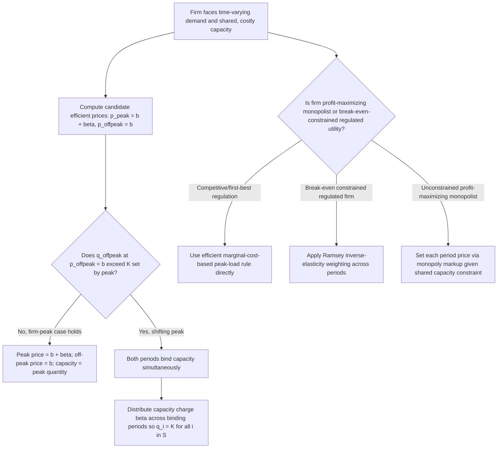

## Peak-Load Pricing Under Demand Fluctuations

### Conceptual Foundations

Peak-load pricing addresses a pricing problem distinct from the buyer-heterogeneity screening problems of two-part tariffs, quantity discounts, and bundling: here, a *single* population of buyers has demand that fluctuates predictably across time periods (peak vs. off-peak), while the firm faces a capacity constraint that is costly to build and must be sized to meet peak demand. The central question is how to price output across time periods to (a) efficiently allocate scarce capacity and (b) efficiently determine how much capacity to build in the first place.

This is a foundational topic in the economics of industries with **non-storable output** and **time-varying demand**, including electricity, telecommunications networks, transportation (airlines, toll roads, transit), and hospitality (hotels). It is classified under nonlinear/price-discrimination topics because peak-load pricing charges *different prices for the physically identical good* depending on the time of consumption — a form of price discrimination based on a directly observable characteristic (time of purchase/use) rather than buyer type.

---

### The Basic Model: Two Periods, Capacity Constraint

**Setup**

- Two demand periods: peak (period 1) and off-peak (period 2), with inverse demand functions $p_1(q_1)$ and $p_2(q_2)$
- A single homogeneous, non-storable output (cannot be produced in period 2 and saved for period 1 consumption)
- **Operating cost**: constant marginal cost $b$ per unit of output, in each period
- **Capacity cost**: constant marginal cost $\beta$ per unit of capacity $K$, which must be sufficient to serve output in *both* periods (i.e., $q_1 \leq K$ and $q_2 \leq K$)
- Capacity is chosen once and shared across periods (e.g., generation capacity, network bandwidth, hotel rooms)

**Social Planner's (or Perfectly Competitive Market's) Problem**

$$\max_{q_1, q_2, K} \left[ \int_0^{q_1} p_1(x)\,dx - b q_1 \right] + \left[ \int_0^{q_2} p_2(x)\,dx - b q_2 \right] - \beta K$$

subject to $q_1 \leq K$, $q_2 \leq K$.

---

### Case 1: "Firm Peak" — One Period Strictly Larger

If period 1 (peak) has sufficiently higher demand than period 2 (off-peak) that the capacity constraint binds only in period 1 even after efficient pricing, the efficient (and profit-maximizing, under perfect price discrimination or perfectly competitive pricing) solution is:

$$p_1^* = b + \beta \quad \text{(peak price = marginal operating cost + full marginal capacity cost)}$$

$$p_2^* = b \quad \text{(off-peak price = marginal operating cost only)}$$

$$K^* = q_1(p_1^*)$$

**Intuition**: Peak users are the ones whose demand determines how much capacity must be built, so the peak price must reflect the full marginal cost of capacity — this is the **efficient signal** for both consumption and capacity-investment decisions. Off-peak users impose zero marginal capacity cost (existing capacity, sized for the peak, is already sufficient to serve them), so they should only pay the marginal operating cost.

This is often summarized as the principle: **"peak users bear the capacity cost, off-peak users do not."**

---

### Case 2: "Shifting Peak" — Both Periods Binding

If off-peak demand, though lower than peak, is still high enough that charging $p_2 = b$ and $p_1 = b + \beta$ would cause $q_2$ to *exceed* $q_1$ (the "peak" and "off-peak" labels would flip), a more general solution applies in which **both** periods share the capacity cost. This is the "shifting-peak" or "coincident peak" problem.

**General efficient pricing rule with $n$ periods**

Let $S \subseteq \{1, \dots, n\}$ denote the set of periods in which the capacity constraint binds (demand equals capacity). The efficient prices satisfy:

$$p_i = b \quad \text{for } i \notin S$$

$$\sum_{i \in S} (p_i - b) = \beta$$

with the requirement that all periods in $S$ have equal quantity $q_i = K$ (they share capacity utilization simultaneously at the margin). The capacity cost $\beta$ is distributed across all binding periods such that their combined markup over marginal operating cost sums to $\beta$ — the specific split across periods in $S$ is typically pinned down by requiring $q_i = K$ for all $i \in S$ simultaneously, given each period's demand curve.

**Intuition for shifting peak**: If off-peak demand is close enough to peak demand that shifting some of the capacity charge onto off-peak users would reduce peak demand below off-peak demand, then efficiency requires distributing the capacity charge in whatever proportion keeps both periods bound at exactly $K$ simultaneously — otherwise the "peak" period is ambiguous or would flip.

---

### Graphical Illustration: Firm-Peak Case (svg_diagram)

<svg xmlns="http://www.w3.org/2000/svg" viewBox="0 0 680 460">
<text x="340" y="24" font-size="16" font-weight="bold" text-anchor="middle">Peak-Load Pricing, Firm-Peak Case (svg_diagram)</text>
<line x1="70" y1="400" x2="640" y2="400" stroke="black" stroke-width="2" />
<line x1="70" y1="400" x2="70" y2="50" stroke="black" stroke-width="2" />
<text x="650" y="405" font-size="13">q</text>
<text x="55" y="50" font-size="13">p</text>
<line x1="360" y1="80" x2="360" y2="400" stroke="gray" stroke-width="2" stroke-dasharray="5,4" />
<text x="366" y="70" font-size="12">K* (capacity)</text>
<line x1="70" y1="100" x2="480" y2="400" stroke="#1f77b4" stroke-width="2" />
<text x="440" y="330" font-size="12" fill="#1f77b4">Peak demand p1(q1)</text>
<line x1="70" y1="300" x2="380" y2="400" stroke="#2ca02c" stroke-width="2" />
<text x="200" y="380" font-size="12" fill="#2ca02c">Off-peak demand p2(q2)</text>
<line x1="70" y1="150" x2="640" y2="150" stroke="#d62728" stroke-width="2" stroke-dasharray="4,3" />
<text x="500" y="145" font-size="12" fill="#d62728">p1* = b + beta</text>
<line x1="70" y1="320" x2="640" y2="320" stroke="#9467bd" stroke-width="2" stroke-dasharray="4,3" />
<text x="500" y="315" font-size="12" fill="#9467bd">p2* = b</text>
</svg>

---

### Worked Numerical Example

**Setup**

- Peak demand: $p_1(q_1) = 20 - q_1$
- Off-peak demand: $p_2(q_2) = 12 - q_2$
- Marginal operating cost: $b = 2$
- Marginal capacity cost: $\beta = 6$

**Step 1 — Guess firm-peak case**

$p_1^* = b + \beta = 2 + 6 = 8 \Rightarrow q_1 = 20 - 8 = 12$

$p_2^* = b = 2 \Rightarrow q_2 = 12 - 2 = 10$

**Step 2 — Check consistency**

$q_1 = 12 > q_2 = 10$, and capacity is set at $K^* = q_1 = 12$, which is sufficient (off-peak only needs 10). Since $q_2 < K^*$, the off-peak capacity constraint does not bind — the firm-peak assumption is self-consistent. Solution confirmed:

$$p_1^* = 8, \quad q_1^* = 12, \quad p_2^* = 2, \quad q_2^* = 10, \quad K^* = 12$$

**Step 3 — Contrast with uniform (non-discriminatory) pricing**

If the firm instead charged a single price $\bar p$ in both periods with capacity sized to meet the higher of the two resulting quantities, welfare would generally fall short of the peak-load optimum: either off-peak consumption is inefficiently restricted (if $\bar p > b$) or capacity is inefficiently sized relative to willingness to pay in each period. [Inference] The specific welfare loss from uniform pricing relative to optimal peak-load pricing depends on the demand elasticities and cost parameters in each case; it is not generally zero except in the degenerate case where peak and off-peak demand curves coincide.

---

### Monopoly vs. Competitive/Regulated Peak-Load Pricing

The efficient pricing rule above corresponds to the **competitive or first-best regulated outcome** (e.g., marginal-cost-based regulation of a utility). A profit-maximizing monopolist facing separate peak and off-peak demand curves would instead set **each period's price using standard monopoly markup logic** (accounting for the shared capacity constraint), generally resulting in higher off-peak and/or peak prices than the efficient benchmark, with markups reflecting each period's own demand elasticity (a form of **Ramsey pricing** when the firm must also satisfy a zero-profit or fixed-revenue-requirement constraint — see Related Topics).

**Ramsey-Peak-Load Interaction**: When a regulated peak-load-pricing firm must recover total costs (including capacity costs) subject to a **break-even constraint** (common for regulated utilities not permitted to earn pure profit), the efficient unconstrained peak-load rule above is modified using **inverse-elasticity weighting** across periods — periods with less elastic demand bear a proportionally larger share of the capacity cost markup, analogous to standard Ramsey pricing but applied across time periods rather than across distinct markets.

---

### Extensions and Real-World Applications

- **Electricity markets**: the archetypal peak-load pricing application. Modern implementations include **time-of-use (TOU) tariffs** (fixed peak/off-peak price blocks by time of day), **critical-peak pricing (CPP)** (very high prices on a small number of designated high-demand days), and **real-time pricing (RTP)** (prices that track wholesale marginal cost continuously). These map directly onto the theoretical framework, with capacity costs (generation and transmission) recovered disproportionately from peak users.
- **Telecommunications and internet bandwidth**: "peak hour" data caps, throttling, or higher pricing during high-congestion periods reflect the same capacity-sharing logic, though non-storability is less absolute (buffering, caching) than in electricity.
- **Transportation**: airline peak/off-peak fares (weekday morning/evening vs. midday), congestion pricing for toll roads and urban traffic zones, and peak transit fares are direct applications, with capacity corresponding to road/track/aircraft capacity.
- **Hospitality**: hotel and resort seasonal/weekend pricing reflects peak-load logic where room capacity is fixed in the short run and demand fluctuates by season, day of week, or event calendar.
- **Stochastic peak-load pricing**: when peak demand is uncertain (rather than deterministically known in advance), the model extends to incorporate a probability of **capacity shortfall** (a period where realized demand exceeds available capacity), introducing a **loss-of-load probability (LOLP)**-weighted marginal capacity cost and rationing/shortage-cost considerations — foundational to modern electricity resource-adequacy and capacity-market design. [Inference] The stochastic extension is a well-established branch of the peak-load pricing literature (associated with authors such as Crew, Fernando, and Kleindorfer's surveys of peak-load pricing), though specific LOLP-based formulas depend on the assumed demand and outage probability distributions and are not derived here in full.

---

### Comparison Table: Peak-Load Pricing Variants

| Pricing Regime | Price Basis | Efficiency Property | Typical Use Case |
| --- | --- | --- | --- |
| Uniform (non-time-varying) | Single price, all periods | Inefficient relative to time-varying pricing | Legacy flat-rate utility tariffs |
| Time-of-use (TOU) | Fixed price blocks by time period | Approximates efficient peak/off-peak split | Standard modern electricity tariffs |
| Critical-peak pricing (CPP) | TOU plus very high price on rare critical days | Better targets true capacity-scarcity events | Utilities managing extreme demand spikes |
| Real-time pricing (RTP) | Continuous price = real-time marginal cost | Closest to first-best efficient benchmark | Wholesale electricity markets, some retail RTP programs |
| Ramsey-constrained peak-load | Efficient rule modified by inverse elasticity, subject to revenue constraint | Second-best efficient given break-even constraint | Rate-of-return regulated utilities |

---

### Mermaid Diagram: Peak-Load Pricing Decision Logic

---

### Key Points

- Peak-load pricing allocates the cost of shared, non-storable capacity efficiently by charging peak users the marginal capacity cost (in addition to marginal operating cost) while charging off-peak users only marginal operating cost, when the "firm peak" condition holds.
- When off-peak demand is close enough to peak demand that this rule would flip the label of "peak," the "shifting peak" case requires distributing the capacity charge across all periods that bind capacity simultaneously.
- The efficient peak-load pricing rule corresponds to the competitive/regulated marginal-cost benchmark; a profit-maximizing monopolist or a break-even-constrained regulated utility instead applies monopoly or Ramsey-style markups reflecting demand elasticity in each period.
- Real-world implementations (time-of-use, critical-peak, and real-time pricing) approximate the theoretical efficient rule with varying degrees of granularity, trading off administrative simplicity against efficiency.
- Under demand uncertainty, the model extends to incorporate loss-of-load probability and shortage costs, connecting directly to modern electricity resource-adequacy and capacity-market design.

---

**Related Topics**

- Ramsey pricing and second-best pricing under a break-even/revenue constraint
- Two-part tariffs and quantity discounts (related nonlinear pricing instruments)
- Electricity market design: capacity markets and resource adequacy
- Congestion pricing in transportation and urban economics
- Stochastic peak-load pricing and loss-of-load probability (LOLP) models
- Regulated utility rate-of-return and cost-of-service ratemaking
- Third-degree price discrimination based on observable buyer/purchase characteristics
- Demand response and dynamic pricing in smart grid systems
- Airline revenue management and dynamic/yield pricing