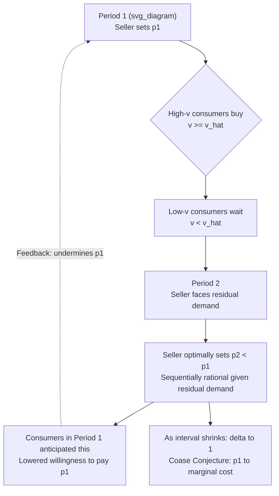

## The Durable Goods Monopoly Problem

### Definition and Core Concept

The durable goods monopoly problem describes the difficulty a monopolist faces when selling a good that does not depreciate or get consumed in a single period, to a market where consumers make forward-looking purchase decisions. Because a durable good yields a stream of services over multiple periods, a monopolist selling in period 1 competes, in effect, with **its own future self** in period 2, period 3, and so on — since consumers who decline to buy today anticipate that the monopolist will lower its price tomorrow to sell to remaining lower-valuation buyers. This anticipation depresses the price the monopolist can charge today, eroding its ability to exercise monopoly power. This phenomenon is closely tied to the **Coase conjecture**, which is the central formal result in this literature.

### Why Durability Creates a Problem for the Monopolist

**Key Points**

- A monopolist selling a nondurable good (or renting a durable good period-by-period) faces a static profit-maximization problem each period, unconstrained by past or future pricing decisions.
- A monopolist selling a durable good outright must consider that a sale today **permanently removes** that consumer from the future market (since the good does not wear out and the buyer's demand is satisfied for all future periods).
- If the monopolist could **commit** to a single price for all time (or credibly commit never to cut price), it would set the standard static monopoly price and extract standard monopoly profits.
- The core difficulty is a **time-consistency problem**: after selling to high-valuation consumers in period 1 at the monopoly price, the monopolist has a private incentive to cut price in period 2 and sell to the remaining lower-valuation consumers, since the marginal cost of production is sunk relative to the decision of whether to sell more today. Rational consumers anticipate this price-cutting behavior and therefore delay purchase, which unravels the monopolist's ability to sustain a high price in period 1.

### Formal Setup

Consider a two-period model. There is a unit mass of consumers with valuations $v$ distributed uniformly on $[0, 1]$ (following the standard textbook exposition, e.g., Tirole's treatment). Each consumer buys at most one unit of the durable good, which yields utility $v$ per period it is owned, and the seller has zero marginal cost of production.

Let $p_1$ be the period-1 price and $p_2$ the period-2 price, with common discount factor $\delta \in (0,1)$ for both seller and consumers.

A consumer with valuation $v$ buys in period 1 if:

$$v - p_1 \geq \delta(v - p_2)$$

Rearranging, this defines a threshold valuation $\hat{v}$ such that all consumers with $v \geq \hat{v}$ buy in period 1, and the rest wait (or never buy) for period 2:

$$\hat{v} = \frac{p_1 - \delta p_2}{1 - \delta}$$

The seller then, in period 2, faces only the residual demand from consumers with $v < \hat{v}$ and chooses $p_2$ to maximize period-2 profit given that residual market — this is the source of the sequential rationality problem, since $p_2$ is chosen to be optimal **given** $\hat{v}$, not chosen in advance to support a high $p_1$.

### The Time-Consistency / Sequential Rationality Problem

Solving the model by **backward induction**:

1. In period 2, the seller observes the remaining mass of unsold consumers (those with $v < \hat{v}$) and sets $p_2$ optimally against that residual demand curve. This price is *strictly below* what would have been charged had the seller been able to serve the full original market — because the residual demand curve is lower and more elastic near the top.
2. Consumers in period 1, correctly anticipating this future price cut, are only willing to pay $p_1$ up to the point where $v - p_1 = \delta(v - p_2)$ — i.e., today's price must be discounted for the fact that waiting yields a *positive expected surplus* from the anticipated period-2 discount.
3. This lowers the sustainable $p_1$ relative to the case with commitment, which lowers total profit relative to a monopolist that could **commit** to holding $p_1$ forever (i.e., a rental monopolist, or a seller who could burn the technology to prevent future production).

This structure means the monopolist's inability to commit to future prices is formally a **subgame-perfect equilibrium** outcome, in the game-theoretic sense: the strategy profile in which the seller "commits" to a high $p_2$ is not credible, because it is not sequentially rational for the seller to actually charge that price once period 2 arrives with the residual demand curve realized.

### The Coase Conjecture

**Key Points**

- Formulated by Ronald Coase (1972) as an informal conjecture, later formalized rigorously by Bulow (1982), Stokey (1981), and especially Gul, Sonnenschein, and Wilson (1986).
- **Statement**: As the time interval between successive price offers shrinks to zero (i.e., as the monopolist can revise its price arbitrarily quickly, $\delta \to 1$), the durable goods monopolist's ability to sustain any price above marginal cost collapses. In the limit, the monopolist is forced to sell at (approximately) the competitive, marginal-cost price essentially immediately.
- Intuition: If consumers believe the monopolist will quickly cut price toward marginal cost, no consumer is willing to pay a price much above marginal cost today, since waiting costs them almost nothing (given $\delta \to 1$) but saves them the price markup. This is a self-fulfilling prophecy: the monopolist, facing this refusal to pay a markup, is indeed forced to cut price rapidly, confirming the consumers' beliefs.
- The formal result (Gul, Sonnenschein, and Wilson 1986) establishes that in the unique stationary equilibrium of the infinite-horizon bargaining/pricing game with the interval between offers $\Delta \to 0$, the initial price converges to marginal cost.

### Mathematical Sketch of the Coase Conjecture Limit

In the continuous-time limit of the sequential pricing game, the equilibrium initial price $p_1^*(\Delta)$ as a function of the time interval $\Delta$ between price revisions satisfies:

$$\lim_{\Delta \to 0} p_1^*(\Delta) = c$$

where $c$ is marginal cost. Equivalently, letting $\delta = e^{-r\Delta}$ for a fixed discount rate $r$ as the interval $\Delta$ shrinks, $\delta \to 1$, and the monopolist's equilibrium profit converges to (or below) the profit it would earn under **perfect price discrimination minus the entire consumer-surplus wedge that competition would otherwise eliminate** — in effect, static monopoly power is fully dissipated. [Inference: the exact rate of convergence and the precise profit expression depend on the specific demand distribution and bargaining protocol assumed; the qualitative conclusion (convergence to marginal cost) is the robust, well-established result, but closed-form convergence rates vary by model specification.]

### Diagram: Sequential Price-Cutting Dynamic

### Solutions and Escapes from the Coase Conjecture

The literature has identified several mechanisms that allow a durable goods monopolist to escape or mitigate the Coasian erosion of monopoly power.

**Key Points**

- **Commitment devices**: If the seller can credibly commit to a future price path (e.g., via a contractual most-favored-customer clause, published price lists with legal force, or reputational mechanisms in repeated interactions with the same buyer pool), the standard monopoly outcome can be restored.
- **Renting instead of selling**: A monopolist that **rents** the durable good rather than selling it outright does not face the same problem, because it retains ownership and can serve each period's demand independently without the "cannibalization" of removing high-value buyers from future periods. Bulow (1982) formally shows that a durable goods monopolist may strictly prefer renting to selling when it cannot commit, precisely because renting sidesteps the time-consistency problem.
- **Planned obsolescence / limited durability**: By deliberately reducing the durability of the good (or through designed obsolescence), the seller reduces the extent to which today's sale forecloses future sales, softening the erosion of pricing power. This is a classic explanation offered for why some durable-goods monopolists might rationally choose non-cost-minimizing degrees of durability.
- **Capacity constraints / limited supply commitments**: If the seller can credibly commit to limiting total quantity produced (e.g., via a burned production technology, contractual supply caps, or a numbered-edition strategy), this functions similarly to a commitment device.
- **Behavioral/switching frictions**: If some fraction of consumers are naive, have high search costs, or are otherwise present-biased and do not fully anticipate future price cuts, the erosion effect is dampened, [Inference] though the degree of dampening depends on the specific share and nature of non-strategic consumers assumed.
- **Network effects and switching costs**: If the good exhibits network effects or the seller can create switching costs (e.g., proprietary formats, ecosystem lock-in), consumers face a different intertemporal calculus that can blunt the pure Coasian dynamic.
- **Introducing a competing durable-goods seller with capacity limits, or bargaining power asymmetries**, can also alter the equilibrium relative to the baseline monopoly bargaining game, though these are extensions rather than the canonical single-seller result.

### Diagrammatic Comparison: Commitment vs. No Commitment

<svg xmlns="http://www.w3.org/2000/svg" viewBox="0 0 640 400" font-family="sans-serif">
<text x="320" y="24" font-size="16" text-anchor="middle" font-weight="bold">Price Path: Commitment vs. No-Commitment Monopolist (svg_diagram)</text>
<line x1="70" y1="350" x2="600" y2="350" stroke="black" stroke-width="1.5" />
<line x1="70" y1="350" x2="70" y2="50" stroke="black" stroke-width="1.5" />
<text x="600" y="372" font-size="13" text-anchor="end">Time / Period</text>
<text x="45" y="55" font-size="13" text-anchor="end">Price</text>
<line x1="90" y1="90" x2="580" y2="90" stroke="#2563eb" stroke-width="2.5" />
<text x="440" y="80" font-size="12" fill="#2563eb">Commitment: constant monopoly price p_M</text>
<path d="M 90 90 L 180 90 L 180 160 L 270 160 L 270 210 L 360 210 L 360 250 L 450 250 L 450 280 L 540 280 L 540 300" stroke="#dc2626" stroke-width="2.5" fill="none" />
<text x="380" y="320" font-size="12" fill="#dc2626">No commitment: sequential price cuts</text>
<text x="380" y="335" font-size="12" fill="#dc2626">converging toward marginal cost c</text>
<line x1="90" y1="300" x2="580" y2="300" stroke="#666" stroke-dasharray="5,4" />
<text x="590" y="304" font-size="12" text-anchor="start" fill="#666">c</text>
</svg>

### Empirical and Practical Examples

**Example**

- **Software and digital goods with frequent version updates**: Firms sometimes deliberately introduce new versions or subscription models (shifting from selling to a rental/SaaS structure) partly to avoid the durable-goods erosion problem — moving from perpetual licenses to subscription (rental) pricing is a direct real-world instance of the "rent, don't sell" escape identified by Bulow.
- **Automobile and consumer electronics markdowns**: The well-documented pattern of end-of-model-year discounting reflects sellers cutting prices for remaining unsold durable inventory once early adopters (high-valuation buyers) have already purchased — closely mirroring the residual-demand dynamic in the model.
- **Textbook publishers issuing frequent new editions**: [Inference] often interpreted in the industrial organization literature as a strategy to limit the used/durable-goods market's erosion effect on new-book demand, since new editions reduce the substitutability between the used stock and new sales, though this is a debated interpretation subject to alternative explanations (e.g., genuine content updates).
- **Limited-edition or numbered releases** (art, collectibles, sneaker "drops"): Function as a credible commitment to restrict future supply, propping up the sustainable initial price.

### Relation to Bargaining Theory

The durable goods monopoly problem is structurally similar to a **bargaining game with one-sided incomplete information**, where the seller does not know buyers' valuations and repeatedly makes price offers over time. This connects the durable goods monopoly literature directly to the broader theory of dynamic mechanism design and sequential bargaining (e.g., Fudenberg, Levine, and Tirole 1985; Ausubel and Deneckere 1989), which characterize the **full set of sequential equilibria** (not just the stationary one) and show that non-stationary or reputational equilibria can sometimes support prices above marginal cost even without formal commitment, [Inference] depending on the specific refinement concept and information structure imposed — this remains an active and technically subtle area of the literature rather than a fully settled one.

### Contrast: Durable Goods Monopoly vs. Standard (Nondurable) Monopoly

| Feature | Standard Monopoly | Durable Goods Monopoly (No Commitment) |
| --- | --- | --- |
| Own-future competition | None | Yes — future self competes with today's sale |
| Sustainable markup | Standard monopoly markup | Eroded, potentially toward marginal cost |
| Commitment requirement | Not needed | Central to sustaining monopoly power |
| Key friction | None beyond static demand | Time-consistency / sequential rationality |
| Escape mechanisms | N/A | Renting, capacity commitment, planned obsolescence, switching costs |

### Welfare Implications

The Coasian erosion of monopoly pricing power is, [Inference] in a narrow static sense, welfare-improving relative to a monopolist that can fully commit, since prices move closer to marginal cost and quantity moves closer to the efficient level — however, this comes with important caveats: (1) it may distort the timing of purchases relative to the efficient allocation (some consumers rationally delay purchase inefficiently in anticipation of price cuts), (2) it can discourage the monopolist from investing in durability, product quality, or even innovation ex ante if it anticipates being unable to capture the returns to durability, and (3) dynamic efficiency effects on R&D and product development are theoretically ambiguous and empirically difficult to isolate. No universal welfare ranking holds once these dynamic and investment margins are taken into account.

**Next Steps**

- Coase conjecture formal proofs (Gul, Sonnenschein, and Wilson 1986; Stokey 1981)
- Bulow (1982) "Durable-Goods Monopolists" — rent-vs-sell analysis
- Planned obsolescence and endogenous durability choice
- Dynamic mechanism design and sequential screening
- Used-goods markets and their interaction with new-goods durable monopoly pricing
- Behavioral extensions: present-biased or naive consumers in durable goods markets
- Reputation and non-stationary equilibria in bargaining games with incomplete information
- Subscription/SaaS business models as a commitment mechanism in software markets