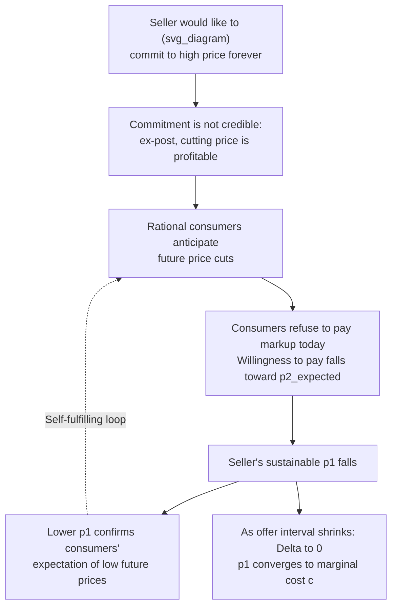

## The Coase Conjecture and Time-Inconsistent Pricing

### Definition and Core Statement

The Coase conjecture, proposed by Ronald Coase (1972), states that a monopolist selling a **durable, non-depreciating good** to a market of heterogeneous buyers, when unable to commit to a future price path and able to revise prices frequently, will find its market power **competed away by its own future incarnations**. In the limiting case where the interval between successive price offers shrinks to zero, the monopolist is forced to sell at (or arbitrarily close to) marginal cost essentially immediately, as if facing a perfectly competitive market — despite being the sole seller.

This result is one of the most striking illustrations in industrial economics of how a **time-consistency problem** can completely undermine a monopolist's static market power, even absent any entry or competition from rival firms.

### The Underlying Logic

**Key Points**

- A durable good, once sold, satisfies a consumer's demand for many future periods, meaning a sale today permanently shrinks the size of the market the monopolist can sell to tomorrow.
- Because the seller retains an incentive to sell to *remaining* (lower-valuation) consumers in every future period, it cannot credibly promise to hold price high forever — cutting price later is always privately profitable once early high-valuation buyers have already purchased.
- Rational, forward-looking consumers **anticipate** this future price-cutting behavior. A consumer with a given valuation compares buying now (at $p_1$) versus waiting for the anticipated lower price $p_2$ in the future.
- Because waiting is attractive when future prices are expected to be much lower, consumers refuse to pay much above the *anticipated future price* today. This unravels the seller's ability to sustain a high price now, which in turn validates the consumers' expectation that prices will fall — a **self-fulfilling, unraveling dynamic**.

This is fundamentally a problem of the seller being unable to make a **credible commitment** not to compete with its own future self.

### Formal Statement (Continuous-Time Limit)

Let $\Delta > 0$ denote the length of time between successive opportunities the monopolist has to revise its price, and let $\delta = e^{-r\Delta}$ be the per-interval discount factor for a fixed discount rate $r$. Let $p_1^*(\Delta)$ denote the equilibrium initial price in the (unique, stationary) equilibrium of the sequential pricing game as a function of the interval length $\Delta$, and let $c$ denote marginal cost.

The Coase Conjecture, as formally established by Gul, Sonnenschein, and Wilson (1986) for the case of a continuum of buyer valuations, is:

$$\lim_{\Delta \to 0} p_1^*(\Delta) = c$$

Equivalently, as the seller's ability to revise price becomes arbitrarily fast ($\Delta \to 0$, so $\delta \to 1$), monopoly rents collapse to (approximately) zero, and the outcome converges to the competitive benchmark despite there being only one seller in the market.

### Key Contributions to the Formal Literature

**Key Points**

- **Coase (1972)**: Original informal conjecture, illustrated with intuitive numerical examples and the observation that a durable-goods monopolist behaves "as if" facing competition from its future self.
- **Bulow (1982)**: Formalized the two-period durable-goods monopoly problem, established that the monopolist may prefer **renting to selling** as a means of avoiding the erosion of market power (since renting does not remove buyers from future demand), and clarified the role of durability choice.
- **Stokey (1981)**: Analyzed the continuous-time limit for the case of a monopolist selling to a continuum of buyer types, providing an early rigorous treatment showing price approaching marginal cost as the commitment interval shrinks.
- **Gul, Sonnenschein, and Wilson (1986)**: The definitive game-theoretic proof of the Coase conjecture for the general case with a continuum of consumer types, using the tools of sequential equilibrium in an infinite-horizon bargaining game, establishing both existence and the uniqueness of the stationary equilibrium price path converging to marginal cost.
- **Fudenberg, Levine, and Tirole (1985)** and **Ausubel and Deneckere (1989)**: Extended the analysis to characterize the **full set** of sequential equilibria (not only the stationary Coasian one), showing that reputational or non-stationary equilibria can, under certain informational and refinement assumptions, support prices persistently above marginal cost — an important qualification to the strong form of the conjecture. [Inference: whether these non-Coasian equilibria are considered the economically relevant prediction depends on the equilibrium refinement concept applied and remains a debated methodological question within the literature, rather than a settled consensus.]

### The Two-Period Building Block

The intuition is most transparent in a two-period model. Consumer valuations $v$ are distributed on $[0, 1]$ (uniform, in the canonical textbook case), each consumer demands at most one unit, and marginal cost is normalized to zero. The seller sets $p_1$ in period 1 and $p_2$ in period 2, with common discount factor $\delta$.

A consumer buys in period 1 if and only if $v - p_1 \geq \delta(v - p_2)$, which defines the marginal (indifferent) type:

$$\hat{v} = \frac{p_1 - \delta p_2}{1 - \delta}$$

The critical step is that $p_2$ is **not chosen in advance**; it is chosen **optimally in period 2** by the seller, taking as given the residual demand of unsold consumers with $v < \hat{v}$. Because this second-period price is sequentially rational — i.e., it maximizes the seller's period-2 profit given the *actual* residual market it faces — it cannot be committed away. Consumers know this, price it into their period-1 purchase decision, and the resulting equilibrium $p_1$ is strictly lower than the price a **commitment-capable** seller (e.g., one that could credibly announce and enforce a permanent price, or a rental monopolist facing an equivalent static problem each period) would charge.

Extending this logic to $T$ periods, and then taking $T \to \infty$ with $\Delta \to 0$, produces the full Coase conjecture limit.

### Time Inconsistency Formalized

The problem is a canonical instance of **time inconsistency** in the sense of dynamic optimization: an ex-ante optimal plan (commit to a high price forever) is not ex-post optimal (once period 2 arrives, cutting price is optimal given the residual demand curve). This is structurally analogous to time-inconsistency problems studied elsewhere in economics — most famously in monetary policy (the Kydland-Prescott inflation-bias problem) — where a policymaker or firm would like to commit to a future action but cannot credibly bind its own future self, and rational agents unravel the announced policy in anticipation.

**Key Points**

- The **source** of time inconsistency here is the seller's inability to resist ex-post profitable price cuts once early sales have "used up" the high-valuation segment of demand.
- The conjecture is a **subgame-perfect equilibrium** result: it does not rely on the seller behaving irrationally or failing to optimize; rather, it is a consequence of *fully rational, sequentially optimal behavior* by both the seller and the consumers, given the game's information and commitment structure.
- The absence of commitment is what distinguishes this equilibrium outcome from the (higher-profit) outcome that could be sustained if the seller could bind itself to a pricing rule in advance.

### Diagram: The Unraveling Mechanism

### Convergence Path Illustration

<svg xmlns="http://www.w3.org/2000/svg" viewBox="0 0 640 400" font-family="sans-serif">
<text x="320" y="24" font-size="16" text-anchor="middle" font-weight="bold">Equilibrium Initial Price as Offer Interval Shrinks (svg_diagram)</text>
<line x1="70" y1="350" x2="600" y2="350" stroke="black" stroke-width="1.5" />
<line x1="70" y1="350" x2="70" y2="50" stroke="black" stroke-width="1.5" />
<text x="600" y="372" font-size="13" text-anchor="end">1/Delta (offer frequency)</text>
<text x="45" y="55" font-size="13" text-anchor="end">p1*(Delta)</text>
<path d="M 90 90 C 200 110, 300 200, 400 280 S 550 335, 580 342" stroke="#dc2626" stroke-width="2.5" fill="none" />
<text x="150" y="80" font-size="12" fill="#dc2626">p1*(Delta) declines as offers become more frequent</text>
<line x1="90" y1="345" x2="580" y2="345" stroke="#666" stroke-dasharray="5,4" />
<text x="590" y="349" font-size="12" text-anchor="start" fill="#666">c (marginal cost)</text>
<line x1="90" y1="90" x2="90" y2="350" stroke="#999" stroke-dasharray="3,3" />
<text x="60" y="100" font-size="11">p_M</text>
<text x="80" y="365" font-size="11">Delta large</text>
<text x="540" y="365" font-size="11">Delta to 0</text>
</svg>

### Escapes from the Coase Conjecture

Several mechanisms are documented as ways a seller can avoid, weaken, or circumvent the full erosion of monopoly power predicted by the strong form of the conjecture.

**Example**

- **Renting rather than selling**: Bulow (1982) shows renting avoids the problem entirely, because the seller does not permanently remove buyers from the future market — each period's rental decision is an independent static monopoly problem.
- **Capacity/production commitment**: Credibly limiting total quantity ever to be produced (e.g., a numbered limited edition, or destroying/burning production capacity) mimics a commitment device.
- **Most-favored-customer (MFC) clauses**: Contractual commitments that if the seller cuts price later, all previous buyers are entitled to a rebate to the new lower price. This raises the seller's cost of cutting price ex post, restoring some ability to sustain a high initial price.
- **Planned obsolescence / reduced durability**: Deliberately making the good less durable reduces the extent to which a current sale forecloses future demand, softening the erosion dynamic.
- **Switching costs and network effects**: Ecosystem lock-in or network externalities change the intertemporal calculus for buyers, potentially sustaining higher prices than the frictionless Coasian benchmark would predict.
- **Reputational/non-stationary equilibria**: As shown by Ausubel and Deneckere (1989) and related work, when the equilibrium selection is not restricted to the stationary Coasian equilibrium, other sequential equilibria can support prices above marginal cost — meaning the strong (zero-profit) form of the conjecture is not the *unique* theoretical prediction, though it remains the focal, most commonly cited benchmark result. [Inference: the practical relevance of non-Coasian equilibria for real markets is contested and depends on assumptions about players' ability to coordinate on non-stationary strategies.]

### Relation to Broader Bargaining Theory

The durable-goods pricing game is mathematically a special case of a **bargaining game with one-sided incomplete information**, where the informed party (the buyer, with private valuation) responds to a sequence of offers made by the uninformed party (the seller). This connects the Coase conjecture directly to the broader theory of sequential bargaining under incomplete information (e.g., the Rubinstein-Ståhl bargaining framework extended to asymmetric information settings), and the same core insight — that repeated interaction without commitment erodes the informed party's ability to extract surplus from a heterogeneous population — recurs across mechanism design and dynamic contracting theory more broadly.

### Contrast: Static Monopoly vs. Coasian Dynamic Monopoly

| Feature | Static (Commitment) Monopoly | Coasian Durable-Goods Monopoly |
| --- | --- | --- |
| Price | Standard monopoly markup over cost | Converges to marginal cost as $\Delta \to 0$ |
| Quantity | Standard monopoly quantity (below efficient) | Converges toward efficient quantity |
| Profit | Positive monopoly rents | Eroded toward zero in the limit |
| Consumer surplus | Standard monopoly consumer surplus | Rises toward full surplus as commitment fails |
| Driving friction | None | Lack of credible commitment to future prices |

### Empirical and Practical Relevance

**Example**

- **Software transitioning from perpetual licenses to subscriptions (SaaS)**: A direct real-world response to the durable-goods problem — subscription/rental models sidestep the Coasian erosion that plagued perpetual-license software sales, which faced declining willingness-to-pay as consumers anticipated future discounts or version sunsetting.
- **Fashion and seasonal markdowns**: Retailers often observe a pattern where early-season prices are high and prices decline predictably toward the end of the season — consistent with, though not necessarily uniquely explained by, Coasian dynamics combined with inventory and demand-uncertainty considerations. [Inference: markdown pricing in fashion retail has multiple competing explanations (inventory risk, demand learning, price discrimination across patience types), so attributing it solely to Coasian dynamics would overstate the empirical identification.]
- **Automobile end-of-model-year clearance pricing**: A commonly cited illustrative example of price declining over the "life" of a product generation, consistent with sellers being unable to commit to holding the introductory price.
- **Limited-edition collectibles and numbered art prints**: Function as explicit real-world implementations of the "capacity commitment" escape mechanism.

### Welfare Implications and Caveats

The Coase conjecture's prediction that price converges to marginal cost is, [Inference] in a narrow static allocative sense, welfare-improving relative to a fully committed monopolist, since it moves the outcome toward the competitive, efficient benchmark. However, several caveats limit a simple "erosion of monopoly power is good" conclusion:

- **Investment and innovation incentives**: If firms anticipate that they cannot sustain returns on durable, valuable products due to Coasian erosion, they may underinvest in quality, durability, or R&D ex ante — a genuine dynamic efficiency cost not captured in the static allocative welfare calculation.
- **Purchase timing distortions**: Even though final allocative efficiency improves, the *timing* of transactions can be inefficiently delayed as consumers strategically wait for anticipated price cuts, which is itself a form of surplus destruction (delay costs) not present in a frictionless efficient benchmark.
- **Selection into escape mechanisms**: Firms' rational responses to the Coase conjecture (renting, planned obsolescence, capacity limits) each carry their own separate welfare consequences that must be weighed against the direct pricing effect — e.g., planned obsolescence chosen purely to escape Coasian erosion could reduce social welfare by wasting real resources on artificially shortened product life.

No single, universal welfare ranking holds once these dynamic margins are incorporated; the sign and magnitude of net welfare effects are model- and parameter-dependent.

**Next Steps**

- Bulow (1982) rent-vs-sell formal analysis
- Gul, Sonnenschein, and Wilson (1986) proof techniques and equilibrium uniqueness
- Non-stationary and reputational equilibria (Ausubel and Deneckere 1989)
- Most-favored-customer clauses as commitment devices
- Planned obsolescence and endogenous durability choice
- Time inconsistency in other economic contexts (monetary policy, Kydland-Prescott)
- Subscription/SaaS pricing as a modern escape from durable-goods erosion
- Sequential bargaining under asymmetric information (Rubinstein-Ståhl extensions)