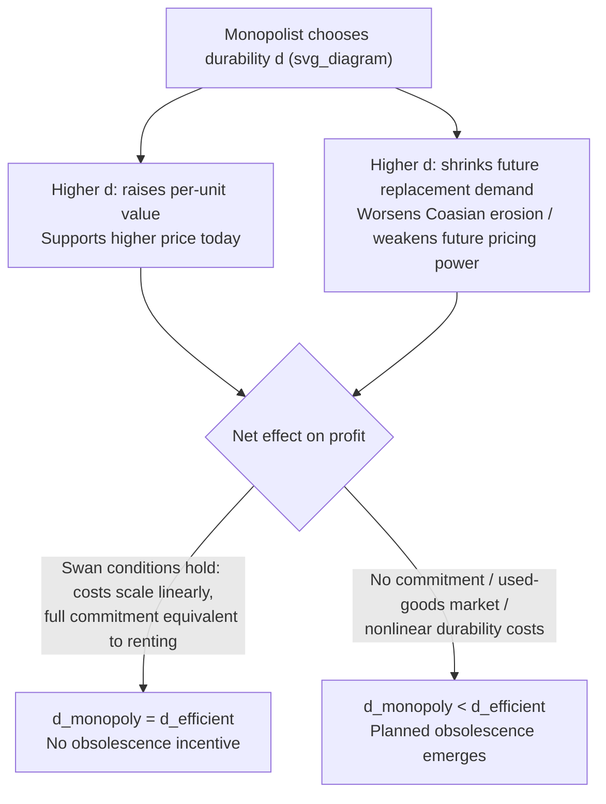

## Planned Obsolescence and Durability Choices

### Definition and Core Concept

Planned obsolescence refers to a firm's deliberate choice to limit the useful life, functional performance, or perceived desirability of a durable good, below what would be technologically or cost-efficiently feasible, in order to increase the frequency of repeat purchases or to protect the firm's pricing power. Closely related is the broader **durability choice** problem: a monopolist producing a durable good must choose not only price and quantity but also the good's **physical durability** as a strategic variable, since durability directly determines how a current sale affects the size and composition of future demand.

This topic sits at the intersection of the durable-goods monopoly literature (Coase conjecture) and monopoly product-design theory, because durability is not merely an engineering parameter — it is a **strategic choice variable** with first-order effects on a monopolist's ability to sustain market power over time.

### Why Durability Is a Strategic Variable

**Key Points**

- Higher durability means a given unit of the good yields service flow for more periods, which — holding everything else constant — increases the good's total lifetime value to a consumer.
- But higher durability also means a current sale **more completely satisfies** a consumer's future demand, more strongly shrinking future replacement demand and worsening the Coasian time-inconsistency problem discussed in the durable-goods monopoly literature.
- A monopolist that cannot commit to future prices therefore faces a **trade-off**: durability raises the value of the good (allowing a higher price to be charged), but durability also intensifies the erosion of future monopoly power (since it commits more strongly to depressing future demand), and durability affects the firm's incentive to maintain scarcity of the used/secondary market.
- The classical result associated with this literature (Swan 1970, and later refined by Bulow 1986) is that under **certain conditions** a monopolist's privately optimal durability choice coincides with the socially efficient durability choice, while under other conditions (particularly when commitment is limited or the used-goods market interacts with new sales) the monopolist has an incentive to choose **suboptimally low** durability — the formal basis for a rigorous theory of planned obsolescence.

### The Swan Independence Result (Baseline Case)

Swan (1970) established a striking baseline theorem: **if the monopolist can costlessly and continuously adjust output/replacement rate, and if durability can be chosen freely and costs scale proportionally with durability (i.e., durability is "quality" that scales the per-period cost or the units-of-service produced per unit of physical good), a monopolist selling in a competitive-rental-equivalent framework chooses the socially efficient level of durability.**

Formally, in Swan's framework, if a unit of the durable good with durability $d$ can be thought of as equivalent to $d$ units of a nondurable service flow, and the cost of producing durability scales linearly, then the monopolist's profit-maximizing choice of $d$ is independent of its market power and coincides with the competitive/efficient choice, because the monopolist essentially chooses to solve a **rescaled version of the same optimization problem** a competitive industry would solve. This is often summarized as: **"a durable-goods monopolist has no incentive to distort durability away from the efficient level, provided it can act as if renting."**

$$d^{M} = d^{*} \quad \text{(monopoly durability = efficient durability, under Swan's conditions)}$$

### Where the Independence Result Breaks Down

The Swan independence result is fragile and relies on specific assumptions. It breaks down — opening the door to genuine planned obsolescence — under several realistic conditions:

**Key Points**

- **Lack of commitment (the Coase conjecture channel)**: If the monopolist cannot commit to future prices (as in the standard durable-goods monopoly problem), it has an incentive to choose **lower** durability than efficient, because lower durability limits the extent to which a current sale forecloses future sales, thereby *mitigating* the Coasian erosion of pricing power. This is a direct, formal link between the durable-goods monopoly time-inconsistency problem and durability choice: reducing durability is a **substitute commitment device** for the inability to commit to prices.
- **Used-goods market competition**: If a secondary (used-goods) market exists and competes with new-goods sales, a monopolist may have an incentive to reduce durability specifically to weaken the used-goods market's ability to undercut new sales (Bulow 1986 formalizes this, showing that a monopolist competing against a used-goods market it does not control has a private incentive to underprovide durability relative to the social optimum, even though this differs from Swan's baseline).
- **Non-scalable durability costs**: If the technology for producing durability does not scale in the simple, linear, proportional way Swan's model assumes (e.g., there are fixed costs to durability improvements, or durability interacts nonlinearly with production cost), the independence result generally fails.
- **Network effects and technological upgrade cycles**: When a good's value depends on compatibility with a broader ecosystem, a monopolist may find it profitable to engineer artificial incompatibility or obsolescence timed with new releases, distinct from the pure Coasian mechanism but achieving a similar business objective (driving replacement purchases).
- **Asymmetric information about product quality/durability**: If consumers cannot verify true durability at the point of sale, a monopolist may have a private incentive to underinvest in durability relative to what it would choose under full information, since the market cannot fully reward unobservable quality investments (a lemons-type distortion layered on top of the strategic durability-choice problem).

### Categories of Planned Obsolescence

The applied and popular literature commonly distinguishes several distinct mechanisms, not all of which map cleanly onto the formal economic models above, but which are useful for organizing real-world practices:

| Type | Mechanism | Primary Economic Driver |
| --- | --- | --- |
| **Physical/functional obsolescence** | The good is engineered to physically fail or degrade after a target lifespan | Durable-goods monopoly erosion mitigation; replacement-demand generation |
| **Perceived/style obsolescence** | The good remains functional, but frequent style or design changes make older units seem outdated | Signaling, status/fashion demand, versioning |
| **Systemic/compatibility obsolescence** | Software updates, discontinued parts/support, or ecosystem changes render the good less useful even though it has not physically failed | Network effects, ecosystem lock-in, upgrade-cycle monetization |
| **Programmed obsolescence via unavailable repair parts or software locks** | Repair is made deliberately difficult or costly relative to replacement | Extending the logic of physical obsolescence via aftermarket control |

**Example**

- **Consumer electronics**: Smartphones and other devices where battery non-replaceability, software support cutoffs, or component design choices are frequently alleged to shorten effective product life relative to what is technically feasible. [Inference: attributing specific real-world product design choices to a deliberate obsolescence strategy versus genuine cost-minimization or engineering trade-offs is often contested, and firms typically dispute the "planned obsolescence" characterization; the economic theory establishes the *incentive* exists under certain conditions, not that every observed design choice is proof of its exercise.]
- **The historical Phoebus cartel (light bulbs, 1920s–1930s)**: Frequently cited as a documented historical case in which manufacturers coordinated to cap bulb lifespan at a lower standard than was technically achievable at the time, illustrating a coordinated durability-reduction strategy in an oligopoly setting.
- **Printer cartridges and consumable-locked hardware**: Illustrates a related but distinct strategy — the "razor and blades" model — where the durable good (the printer) is sold cheaply and durability of the *complementary consumable* is engineered to be low, generating repeat purchase revenue; this is a related but formally distinct phenomenon from pure durability-of-the-durable-good obsolescence.
- **Fast fashion and frequent style refreshes**: An example of **perceived obsolescence**, where physical durability may be unchanged, but design cycling accelerates the psychological/status depreciation rate of existing units.

### Diagram: The Durability Trade-off

### Graphical Illustration: Durability vs. Profit under the Two Regimes

<svg xmlns="http://www.w3.org/2000/svg" viewBox="0 0 640 420" font-family="sans-serif">
<text x="320" y="24" font-size="16" text-anchor="middle" font-weight="bold">Monopoly Profit as a Function of Durability (svg_diagram)</text>
<line x1="70" y1="370" x2="600" y2="370" stroke="black" stroke-width="1.5" />
<line x1="70" y1="370" x2="70" y2="50" stroke="black" stroke-width="1.5" />
<text x="600" y="392" font-size="13" text-anchor="end">Durability d</text>
<text x="45" y="55" font-size="13" text-anchor="end">Profit</text>
<path d="M 100 300 Q 280 90 460 130 T 570 250" stroke="#2563eb" stroke-width="2.5" fill="none" />
<text x="330" y="80" font-size="12" fill="#2563eb">Swan case: peak at d* = efficient durability</text>
<line x1="330" y1="370" x2="330" y2="105" stroke="#2563eb" stroke-dasharray="4,3" />
<text x="320" y="385" font-size="12" fill="#2563eb">d*</text>
<path d="M 100 320 Q 220 150 300 155 T 500 280" stroke="#dc2626" stroke-width="2.5" fill="none" />
<text x="130" y="140" font-size="12" fill="#dc2626">No-commitment case: peak shifted left of d*</text>
<line x1="240" y1="370" x2="240" y2="150" stroke="#dc2626" stroke-dasharray="4,3" />
<text x="200" y="385" font-size="12" fill="#dc2626">d_M &lt; d*</text>
</svg>

### Regulatory and Policy Responses

**Key Points**

- **Right-to-repair legislation**: Directly targets systemic and repair-based obsolescence by mandating access to parts, tools, diagnostics, and repair documentation, aiming to lower the effective cost of extending a product's life relative to replacement.
- **Minimum durability/warranty standards**: Regulatory mandates on minimum warranty periods or component lifespans function as a direct constraint on the firm's durability choice, analogous to a price floor on the durability variable.
- **Software support mandates**: Some jurisdictions have moved toward requiring minimum periods of security and software updates for connected devices, targeting systemic obsolescence specifically.
- **Antitrust scrutiny of coordinated durability reduction**: Cartel-style coordinated obsolescence (as in the historical light bulb cartel example) is treated as a competition-law violation when it involves explicit inter-firm agreement, distinct from a single firm's unilateral durability choice (which is generally legal, even if it reduces social welfare, absent a specific consumer-protection or competition violation).

[Inference: the empirical effectiveness of right-to-repair and minimum-durability regulations at improving overall welfare is an active area of empirical research and depends on how firms respond along other margins — e.g., initial pricing, product quality at launch, or innovation investment — so a definitive welfare verdict on any specific policy cannot be stated as settled economic consensus.]

### Relation to the Broader Durable-Goods Monopoly Framework

Durability choice is best understood as one of the **strategic escape mechanisms** available to a durable-goods monopolist facing the Coase conjecture's erosion of pricing power (alongside renting, capacity commitment, and most-favored-customer clauses, discussed in the durable-goods monopoly and Coase conjecture topics). Where those other mechanisms directly address the *pricing* commitment problem, reducing durability addresses the *underlying source* of the problem — the fact that durability itself is what creates the intertemporal linkage between today's sale and tomorrow's residual demand. In this sense, planned obsolescence is a **substitute** for pricing commitment: a firm that cannot commit to prices can partially achieve the same protective effect by committing (via product design) to shorter effective product life.

### Welfare Implications

The welfare analysis of durability choice is genuinely two-sided and does not admit a single unconditional verdict:

- **When Swan's conditions hold**, monopoly durability coincides with the efficient level, and there is no independent welfare loss from durability choice *per se* (though the standard monopoly quantity/price distortion still applies).
- **When commitment fails or a used-goods market is present**, the monopolist's privately optimal durability is generally **below** the socially efficient level, representing a genuine, separate source of deadweight loss beyond the standard monopoly output restriction — real resources are effectively wasted by producing goods with artificially shortened useful life, and consumers bear increased replacement costs and, [Inference] potentially, environmental costs from increased waste and resource throughput, though quantifying this environmental externality requires assumptions outside the core price-theoretic model.
- **Perceived/style obsolescence** raises a further complication: if consumers genuinely value novelty and status independent of functional durability, then accelerated style cycles may not represent a "distortion" in the welfare-economics sense at all, but rather a reflection of genuine underlying demand for variety — [Inference] this is a substantially more contested normative question than the physical-durability case, since it depends on how one treats preferences for novelty/status within a welfare framework.

**Next Steps**

- Swan (1970) durability-efficiency theorem — formal derivation
- Bulow (1986) "An Economic Theory of Planned Obsolescence" — used-goods market interaction
- Interaction between durability choice and the Coase conjecture / durable-goods monopoly
- Right-to-repair economics and empirical welfare studies
- Versioning and quality degradation in information goods (related but distinct: Mussa-Rosen framework)
- The Phoebus cartel and coordinated obsolescence as an antitrust case study
- Secondary/used-goods markets and their strategic interaction with new-goods monopolists
- Environmental economics of product lifecycle and extended producer responsibility regulation