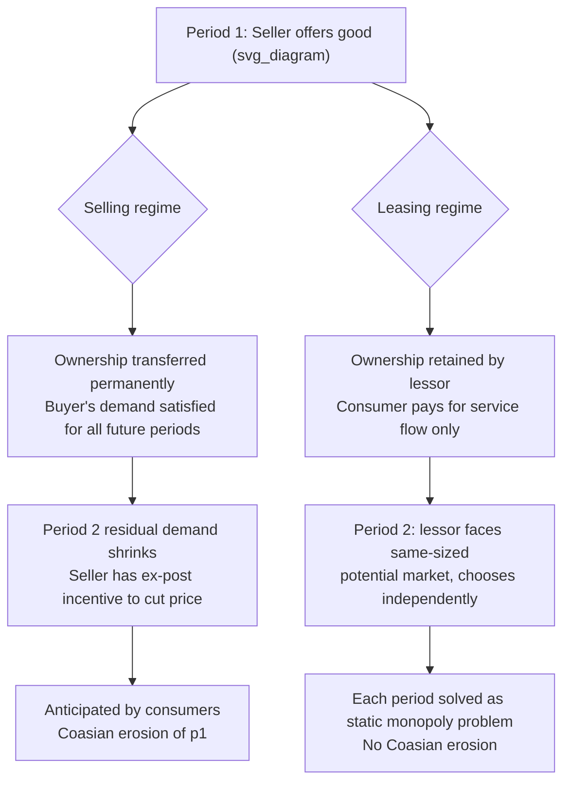

## Leasing Versus Selling as a Commitment Device

### Definition and Core Concept

The choice between **leasing** (renting) and **selling outright** is a fundamental strategic decision for a durable-goods monopolist, and it functions as a **commitment device** with respect to the time-inconsistency problem underlying the Coase conjecture. When a monopolist sells a durable good outright, it permanently transfers ownership and thus permanently forfeits control over that unit's future service flow — creating an incentive to cut prices in later periods to capture unsold demand, which erodes its own pricing power (as established in the durable-goods monopoly literature). When a monopolist instead **leases** the good, it retains ownership and control over the flow of service the good provides in every period, meaning each period's rental decision can be treated as an **independent, static monopoly problem**, largely insulated from the intertemporal linkage that generates the Coasian erosion. This makes leasing a structural solution to the commitment problem, distinct from other escape mechanisms like most-favored-customer clauses or reduced durability.

### Why Selling Creates a Commitment Problem

**Key Points**

- A sale in period 1 permanently removes a high-valuation consumer from the pool of potential buyers in period 2 and beyond, since the durable good continues to satisfy that consumer's demand indefinitely.
- This shrinks the size and changes the composition (toward lower valuations) of the residual market the seller faces in subsequent periods, creating an ex-post incentive to cut price to capture that residual demand.
- Because this price-cutting incentive is anticipated by forward-looking consumers, it depresses the price the seller can sustain in period 1 — the core Coasian unraveling dynamic.
- Under a **selling regime**, the seller's decision in each period directly affects the size of every future period's market, so the seller cannot treat each period's pricing problem independently — the periods are strategically linked through the stock of goods already sold.

### Why Leasing Restores Static Optimization

**Key Points**

- Under a **leasing regime**, the seller retains the asset and simply chooses, each period, how much of the service flow to rent out and at what price — exactly as a standard nondurable-goods (flow) monopolist would.
- Because the lessor can recall or reallocate units between periods (or simply chooses a new profit-maximizing rental quantity/price each period independent of past decisions), the size of the market available to serve in period 2 is **not diminished** by how much was rented in period 1 — a consumer's lease can, in principle, simply expire and be re-offered, or the lessor can adjust the rental price in each period without facing an already-satisfied stock of former buyers.
- This eliminates the endogenous shrinking of future demand that drives the Coasian mechanism, and each period's pricing problem reduces to the seller solving the same optimization problem a **static monopolist** would solve, achieving the standard (undistorted-by-time-inconsistency) monopoly markup in every period.

### Bulow (1982): The Formal Rent-vs-Sell Analysis

Jeremy Bulow's 1982 paper, "Durable-Goods Monopolists," is the canonical formal treatment of this comparison. Its central results:

1. **A monopolist that cannot commit to future prices may strictly prefer leasing to selling**, because leasing achieves higher discounted profit by avoiding the Coasian erosion that afflicts the selling strategy.
2. **If the monopolist could fully commit to a selling price path**, selling and leasing would generate **identical** profits — the two strategies are equivalent under commitment, since a committed seller can simply choose a price path that replicates whatever allocation a lessor would choose. The divergence between the strategies is entirely a consequence of the **commitment problem**, not an intrinsic difference in the technologies of selling versus leasing.
3. Bulow also examines how the choice of durability interacts with the sell/lease decision: since leasing sidesteps the durability-driven commitment problem, a leasing monopolist has **no independent incentive to reduce durability below the efficient level** for strategic reasons (unlike a selling monopolist facing the durability-obsolescence trade-off discussed in the planned-obsolescence topic) — reinforcing that leasing and reduced durability are, in part, *substitute* solutions to the same underlying commitment problem.

### Formal Comparison Sketch

Let $\Pi^{S}$ denote the discounted profit of a **selling** monopolist that cannot commit to future prices (the Coasian outcome), and $\Pi^{S,C}$ denote the discounted profit of a selling monopolist that **can** commit to a price path. Let $\Pi^{L}$ denote the discounted profit under **leasing**.

Bulow's result can be summarized as:

$$\Pi^{S,C} = \Pi^{L} \geq \Pi^{S}$$

with the inequality strict whenever the no-commitment selling equilibrium exhibits genuine Coasian erosion (i.e., whenever $\Pi^S$ is strictly below the fully-committed benchmark). The intuition is that leasing achieves the **same outcome as commitment** without requiring an explicit commitment mechanism, because the structural feature of retained ownership removes the very source of the time-inconsistency problem — there is no "residual stock of unsold units-in-buyers'-hands" that a leasing seller inherits from its own past decisions in the way a selling seller does.

### Diagram: Structural Difference Between Selling and Leasing

### Conditions Under Which the Leasing Advantage Weakens or Disappears

Leasing is not a costless or universally available solution, and the theoretical advantage is qualified by several practical and structural conditions:

**Key Points**

- **Resale and secondary leasing markets**: If lessees can sublease or resell their leasehold interest to other consumers, an unauthorized secondary market can reintroduce a form of the residual-demand dynamic, undermining the clean separation between periods that leasing is meant to provide.
- **Costly recall or redeployment**: If the monopolist cannot costlessly recall and redeploy leased units (e.g., physical relocation costs, condition depreciation, contractual lease terms with lock-in periods), leasing may not fully replicate the frictionless, stateless static-monopoly benchmark.
- **Consumer preference for ownership**: If consumers derive independent utility from ownership itself (e.g., for status, collateral value, or customization rights), a pure leasing strategy may leave money on the table relative to a hybrid or selling strategy, even ignoring the commitment consideration — [Inference] the empirical magnitude of pure "ownership premium" demand varies substantially by product category and is not a fixed parameter.
- **Regulatory, accounting, and tax treatment**: Leasing versus selling can be treated differently under tax law (e.g., depreciation schedules, capital versus operating lease accounting rules) and this can independently affect the relative attractiveness of the two strategies, separate from the pure commitment-theoretic consideration. [Inference: tax and accounting treatment of leases is jurisdiction- and period-specific, and firms' real-world sell/lease choices often reflect these considerations alongside the strategic commitment motive discussed here.]
- **Maintenance and moral hazard**: Under leasing, the lessor typically retains residual value risk and may bear maintenance costs or face a moral hazard problem if lessees do not treat the asset with ownership-level care — this is a cost of leasing not present under outright sale, and must be weighed against the commitment benefit.

### Real-World Examples and Patterns

**Example**

- **Automobile leasing**: Automakers and dealers commonly offer both purchase and lease options, and leasing is a well-documented mechanism that (among other motives, including tax and cash-flow considerations for consumers) helps manufacturers manage residual value and avoid flooding the used-car market with owned vehicles that would depress future new-car demand — broadly consistent with, though not purely reducible to, the Coasian commitment-theoretic motive.
- **IBM's historical leasing of mainframe computers**: Frequently cited in the industrial organization literature as a classic real-world instance where a durable-goods monopolist relied heavily on leasing (particularly in earlier decades) rather than outright sale, consistent with the commitment-theoretic prediction, though antitrust considerations regarding IBM's leasing practices were also historically significant and are a separate strand of that history.
- **Enterprise software and SaaS models**: The industry-wide shift from perpetual software licenses (a form of "selling" a durable right to use software indefinitely) to subscription-based access (a form of "leasing" a continuing service) is a modern instance of firms restructuring their commercial model in a way that is consistent with avoiding durable-goods erosion of pricing power, alongside other motives such as smoothing revenue and enabling continuous product updates.
- **Equipment leasing in heavy industry (aircraft, construction machinery)**: Leasing is pervasive in capital-intensive durable-equipment industries, where [Inference] the relative importance of the Coasian commitment motive versus financing, risk-sharing, and tax motives for leasing is difficult to disentangle empirically and is likely to vary by industry and firm.

### Contrast Table: Selling vs. Leasing under No Commitment

| Feature | Selling (No Commitment) | Leasing |
| --- | --- | --- |
| Ownership transfer | Permanent | Retained by seller |
| Effect of period-1 sales on period-2 market | Shrinks residual demand | No structural effect |
| Time-consistency of pricing | Time-inconsistent (Coasian erosion) | Time-consistent (static optimum each period) |
| Profit relative to commitment benchmark | Strictly lower (generically) | Equal to commitment benchmark |
| Vulnerable to secondary markets | Yes (used-goods market) | Yes, if subleasing/informal resale is possible |
| Typical real-world use case | Consumer durables, one-off purchases | Capital equipment, enterprise software, autos |

### Relation to Other Commitment Devices

Leasing should be understood as one of several strategic responses to the durable-goods commitment problem, alongside:

- **Most-favored-customer clauses** (raising the cost of future price cuts under a selling regime),
- **Capacity/production commitments** (limiting total future output),
- **Reduced durability / planned obsolescence** (weakening the intertemporal linkage created by durability itself).

Leasing is distinguished from these alternatives in that it addresses the commitment problem **structurally**, by removing the mechanism (permanent transfer of the service-flow-generating asset) that creates the intertemporal linkage in the first place, rather than by adding an external constraint (contractual clause, deliberately engineered short lifespan) on top of an underlying selling relationship that would otherwise be time-inconsistent.

### Welfare Implications

The welfare comparison between leasing and (uncommitted) selling parallels the broader welfare analysis of the Coase conjecture, but with the direction reversed: since leasing **restores** monopoly pricing power (relative to the eroded no-commitment selling outcome), it moves the market **away** from the competitive benchmark and **toward** the standard, static monopoly distortion (higher price, lower quantity than efficient, in every period). This means:

- [Inference] From a narrow static allocative-efficiency standpoint, a shift from uncommitted selling to leasing is not unambiguously welfare-improving — it raises seller profit and lowers consumer surplus relative to the Coasian selling outcome, moving the market back toward the standard monopoly distortion, though the magnitude and even the *sign* of the total-surplus effect depends on the specific demand and cost primitives assumed.
- Leasing may improve **dynamic efficiency** relative to Coasian selling by restoring the firm's ability to capture returns on quality, durability, and product investment, potentially improving incentives for innovation and maintenance relative to a regime where the firm anticipates its market power will be competed away by its own future pricing.
- Leasing shifts certain costs and risks (maintenance, residual value risk, potential moral hazard in asset care) from consumers to the seller, which has separate distributional and efficiency implications not captured purely within the pricing-power analysis.

**Next Steps**

- Bulow (1982) "Durable-Goods Monopolists" — full formal derivation of the sell/lease equivalence-under-commitment result
- Interaction between leasing and durability choice (planned obsolescence topic)
- Secondary/used-goods markets and their effect on both selling and leasing strategies
- Tax and accounting treatment of leases vs. sales (operating vs. capital lease distinctions)
- SaaS and subscription business model transitions as a modern application
- Residual value risk and moral hazard in equipment leasing markets
- Most-favored-customer clauses as an alternative commitment device
- Antitrust history of leasing-based market power (e.g., historical IBM mainframe leasing cases)