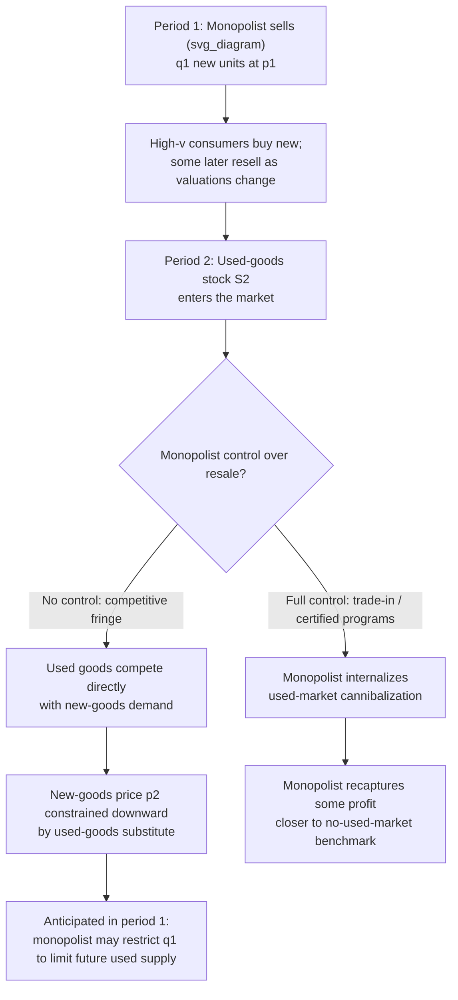

## Secondary Markets and Their Effect on New Goods Pricing

### Definition and Core Concept

A secondary (used-goods) market arises whenever a durable good, once purchased, can be resold by its original buyer to another consumer. The existence of this market fundamentally changes the monopolist's pricing problem for **new** units, because the monopolist selling new goods is no longer competing only against its own future price cuts (the standard durable-goods/Coase conjecture problem) but also against a **stock of used units** supplied by past buyers, over which the monopolist typically has little or no direct control. This creates a distinct — though related — strategic problem: the monopolist must set new-goods prices anticipating that today's new sales become tomorrow's used-goods supply, competing with its own new-goods sales in the future.

### The Basic Mechanism

**Key Points**

- Every unit sold new today is a potential unit of **used-goods supply** in future periods, once its original owner's valuation for continued ownership falls below the resale price it could command.
- The used-goods market is typically **more competitive** in structure than the new-goods market (many individual sellers, no single price-setter), which tends to depress used-good prices relative to what the monopolist would charge for an equivalent new unit.
- Because the used good is (in simple models) a reasonably close substitute for the new good, its presence constrains how high the monopolist can price new units — the new-goods demand curve the monopolist faces is now the **residual** demand net of consumers who are willing to satisfy their demand via the used market instead.
- This is conceptually similar to, but analytically distinct from, the Coase conjecture: the Coase conjecture is driven by the monopolist's *own* anticipated future price cuts, whereas the used-goods market problem is driven by *competition from a market the monopolist does not directly control* (though the monopolist's own past sales decisions determine the size of that used-goods stock).

### Formal Structure: A Simple Two-Period Sketch

Consider a monopolist selling a durable good over two periods to a continuum of consumers with valuations $v$ distributed on $[0,1]$. In period 1, the monopolist sells $q_1$ new units at price $p_1$ to the highest-valuation consumers. Some fraction of period-1 buyers may resell their units in period 2 if their valuation has fallen (e.g., due to a taste shock) or if the resale price exceeds their continued-use value.

Let $S_2(p_1, q_1)$ denote the used-goods supply available in period 2, an increasing function of how many units were sold new in period 1. The monopolist's period-2 new-goods demand is then the residual demand **after** accounting for consumers who satisfy their demand through the used market at the prevailing used-goods price $p_2^{U}$:

$$D_2^{New}(p_2) = D_2^{Total}(p_2) - \{\text{consumers served by used market at competing price } p_2^U\}$$

The monopolist must anticipate, when setting $p_1$ and $q_1$ in period 1, how the resulting used-goods stock $S_2$ will depress its own period-2 new-goods pricing opportunity. This anticipation feeds back into the period-1 pricing decision: a monopolist that fully internalizes the future cannibalization effect of used-goods resale will, in general, restrict period-1 output/sales relative to a monopolist that ignores this effect (or relative to one operating in a market with no resale possibility at all).

### Two Polar Cases: Monopolist Control Over the Used Market

**Key Points**

- **No control (competitive used market)**: If the monopolist cannot influence resale at all — any buyer can freely resell to any other consumer at a market-clearing price — the used-goods market behaves as an independent competitive fringe, and the monopolist's new-goods pricing problem must treat the used-goods supply and its equilibrium price as **exogenously determined** by past sales and consumer resale decisions. This is the case analyzed by much of the classical durable-goods/used-goods literature (e.g., in the spirit of Rust 1986 for durable goods with used markets, and related contributions).
- **Full control (monopolist also intermediates resale, e.g., via certified trade-in programs)**: If the monopolist can buy back, control, or otherwise intermediate the flow of used units (for example, through manufacturer-run trade-in and certified-pre-owned programs), it can **internalize** the externality that used-goods resale would otherwise impose on its new-goods pricing, potentially recovering some or all of the profit that a fully-committed, used-market-free monopolist would earn. This is analytically similar to how leasing (retained ownership) restores commitment in the Coase-conjecture problem — control over the secondary market functions as a partial commitment device.

### Diagram: New-Goods and Used-Goods Market Interaction

### Effects on New-Goods Pricing and Output

**Key Points**

- **Downward pressure on sustainable new-goods prices in later periods**: The presence of a growing used-goods stock acts similarly to the monopolist's "own future self" in the Coase conjecture, competing away some of the pricing power the monopolist would otherwise enjoy on new units.
- **Incentive to restrict early-period sales ("output withholding")**: A monopolist that anticipates the future used-goods cannibalization effect has an incentive to sell **fewer** units in period 1 than a static monopolist would, in order to limit the eventual size of the competing used-goods stock — this is sometimes referred to in the literature as the monopolist "renting" a smaller fraction of the market's total demand to slow the buildup of a competing used stock. [Inference: the magnitude of this output restriction effect depends sensitively on the resale/depreciation process assumed and the elasticity of used-goods supply with respect to past new sales, so no single universal formula applies across model specifications.]
- **Interaction with durability choice**: A more durable good generates a longer-lived, larger cumulative used-goods stock for any given sales path, which — as in the planned-obsolescence literature — gives the monopolist an additional strategic incentive to reduce durability specifically to limit the size and competitiveness of the future used-goods market (this is the mechanism formalized by Bulow 1986, connecting used-markets directly to durability choice).
- **New-used product differentiation as a countermeasure**: Monopolists sometimes respond to used-goods competition by differentiating new products (via warranties, updated features, or exclusive services) specifically to reduce the substitutability between new and used units, softening the competitive pressure the used market exerts on new-goods pricing.

### Real-World Examples

**Example**

- **Automobiles**: The used-car market is one of the most extensively studied real-world instances of a durable good with an active, competitive secondary market. Manufacturers' decisions about new-vehicle production volumes, leasing programs, and residual-value management are widely understood to reflect, in part, an effort to manage the size and pricing effect of the used-car stock on new-car demand.
- **Manufacturer-run trade-in and certified pre-owned (CPO) programs**: Automakers and electronics manufacturers (e.g., smartphone trade-in programs) represent an attempt to **intermediate and control** the used-goods channel rather than cede it entirely to independent resellers — consistent with the theoretical prediction that controlling the secondary market can partially restore new-goods pricing power.
- **Textbook publishers and frequent new editions**: A commonly cited example in industrial organization courses: publishers issuing new editions with only modest content changes can be interpreted as an attempt to reduce the substitutability of the existing used-book stock for the newly assigned edition, directly limiting the competitive pressure the used-book market exerts on new-textbook sales. [Inference: as with the durability-choice topic, this interpretation is debated in the literature relative to the alternative explanation of genuine content/pedagogical updates, and empirical attribution between the two motives is difficult.]
- **Video games and physical media resale**: Historically, the existence of used-game resale markets (e.g., through retail trade-in programs) was a significant point of tension for publishers, who in some cases pursued strategies (online activation codes, digital-only distribution) explicitly aimed at reducing the resalability of their new-goods sales — a direct real-world instance of a firm acting to *eliminate* rather than merely manage the secondary market.
- **Digital goods and the erosion of secondary markets**: The shift toward digital distribution (streaming, digital licenses with resale restrictions) for media that previously had active used markets (physical books, CDs, DVDs, games) can be understood, in part, as a strategic response that removes the used-goods competitive channel altogether, an even stronger countermeasure than trade-in intermediation.

### Contrast with the Pure Coase Conjecture Problem

| Feature | Pure Coase Conjecture (No Used Market) | Used-Goods Market Problem |
| --- | --- | --- |
| Source of erosion | Monopolist's own anticipated future price cuts | Competition from resold units supplied by past buyers |
| Who controls the competing supply | The monopolist itself (its own future pricing) | Potentially outside the monopolist's control (independent resellers) |
| Commitment solution | Leasing, capacity limits, MFC clauses | Trade-in/buyback programs, reduced durability, resale restrictions (DRM, non-transferable licenses) |
| Effect of durability | Higher durability worsens time-inconsistency directly | Higher durability increases future used-goods stock size |
| Typical market structure of the "competitor" | The same monopolist, just in a later period | A competitive fringe of individual resellers |

### Empirical and Measurement Considerations

**Key Points**

- Empirically estimating the magnitude of used-goods cannibalization of new-goods demand requires disentangling several confounded effects: genuine substitution between new and used units, income effects (used goods serving a different, lower-willingness-to-pay segment that might not have purchased new at all), and quality depreciation of used units over time.
- [Inference: whether a used-goods market is, on net, cannibalizing new sales or expanding total market reach (by serving a segment that would not otherwise purchase at all) is an empirical question that varies substantially by product category, and the theoretical models above characterize the *mechanism* by which cannibalization can occur, not a universal prediction that it dominates in every market.] Some empirical studies of specific durable-goods categories (a well-known example is Chevalier and Goolsbee-style analysis of textbooks, or Purohit and others' work on automobiles) have found used-goods market effects on new pricing/output, though the estimated magnitude and mechanism differ by study and product context.

### Welfare Implications

The welfare analysis of secondary markets is notably different in character from the pure Coase conjecture case, because the used-goods market involves a **genuine additional layer of consumer surplus and allocative activity** (trade between consumers) that is absent from the simple new-goods-only model:

- A used-goods market can **increase total welfare** by reallocating goods from consumers with declining valuations to consumers with higher valuations who could not (or chose not to) purchase new — this is a straightforward gains-from-trade argument independent of the monopoly-pricing distortion.
- However, if the monopolist responds to the used-goods market by **restricting new-goods output/durability more than it otherwise would**, this introduces an additional distortion layered on top of the standard monopoly output restriction, which can offset some or all of the gains-from-trade benefit of the secondary market. [Inference: the net welfare sign of secondary-market existence — accounting for both the reallocation benefit and the monopolist's strategic output/durability response — is ambiguous in general and depends on the specific model parameters, making this a case where economic theory identifies competing effects rather than a single unconditional welfare ranking.]
- Firm strategies that **eliminate** secondary markets entirely (e.g., digital rights management preventing resale, non-transferable licenses) capture more monopoly rent for the firm but eliminate the gains-from-trade benefit of used-goods reallocation entirely, representing a starker welfare trade-off than partial-control strategies like trade-in programs.

**Next Steps**

- Bulow (1986) durability choice and its formal link to used-goods market competition
- Rust (1986) and related structural models of durable-goods replacement with used markets
- Manufacturer buyback and certified pre-owned program design
- Digital rights management and the elimination of secondary markets for digital goods
- Empirical identification of new-used goods substitution (textbooks, automobiles, consumer electronics)
- Leasing as an alternative commitment device (comparison of mechanisms)
- Interaction between secondary markets and planned obsolescence incentives
- Antitrust and consumer-protection issues around resale restrictions (right-to-resell, first-sale doctrine)