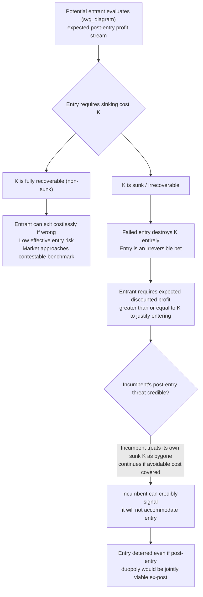

## Sunk Costs as Structural Barriers to Entry

### Definition and Core Concept

Sunk costs are expenditures that, once made, cannot be recovered regardless of a firm's subsequent decisions — they represent a cost that is committed irreversibly and does not vary with future output, exit, or continuation decisions. A **structural barrier to entry** based on sunk costs arises when incumbents possess sunk investments (or the market structure requires sunk investments) that create an asymmetry between the risk profile of an incumbent and that of a potential entrant, discouraging entry even when the market could, in a purely static sense, profitably accommodate an additional firm. This is distinguished from **strategic** barriers to entry (deliberately created by incumbent behavior, e.g., predatory pricing or capacity expansion) — sunk costs can act as a barrier even absent any strategic behavior, purely as a structural feature of the technology and cost environment.

### Sunk Costs versus Fixed Costs

**Key Points**

- **Fixed costs** are costs that do not vary with output level but may still be **recoverable** — for example, if a firm can resell equipment, sublease a facility, or exit and recoup a substantial fraction of the initial investment.
- **Sunk costs** are the *irrecoverable portion* of an investment — costs that remain unrecoverable even if the firm exits immediately after entry.
- The economically relevant distinction for entry-deterrence analysis is not fixed versus variable cost, but **sunk versus non-sunk (avoidable) cost**. A large fixed cost that is fully recoverable upon exit does not, by itself, constitute a barrier to entry in the sunk-cost sense.
- Examples of highly sunk expenditures include: specialized advertising and brand-building expenditures, R&D investment in a failed product, industry-specific regulatory approval costs, specialized plant and equipment with no resale market outside the industry, and relationship-specific investments in supplier or distribution networks.

### Why Sunk Costs Deter Entry: The Core Mechanism

**Key Points**

- A potential entrant evaluates expected discounted profit from entry against the sunk cost $K$ it must commit. Entry is attractive only if the expected discounted stream of post-entry profits exceeds $K$.
- Because the cost is sunk, the entrant cannot "try entry and exit costlessly if it goes poorly" — a failed entry results in permanent loss of the sunk investment, raising the effective option value of waiting for a potential entrant (in the real-options sense).
- Sunk costs create an asymmetry between **incumbents and entrants**: an incumbent that has already sunk its investment treats that cost as a bygone in ongoing decisions — it continues operating as long as it covers *avoidable* costs, even without covering the sunk investment. A potential entrant must weigh the *full* sunk cost ex ante.
- This generates a **first-mover advantage through commitment**: an incumbent that sinks costs first can credibly signal it will not accommodate entry, since continuing to produce post-entry is exactly what a rational incumbent covering only avoidable costs would do.

### Formal Sketch: Entry Deterrence via Sunk Cost Asymmetry

Consider a market with an incumbent that has already sunk cost $K$. A potential entrant considers entering, which requires sinking the same cost $K$. Post-entry, both firms earn duopoly profit $\pi^D$, while pre-entry monopoly profit is $\pi^M > 2\pi^D$.

- **Incumbent's decision to continue post-entry** (treating $K$ as bygone): continue if $\pi^D \geq 0$.
- **Entrant's ex-ante decision**: enter only if

$$\sum_{t=0}^{\infty} \delta^t \pi^D \geq K$$

If $K$ is large relative to $\pi^D$, entry is deterred even though the post-entry duopoly might be jointly viable once the cost is already sunk. This is the core structural sunk-cost entry barrier: **the same cost that would not deter continued operation once sunk can deter entry ex ante**.

### Contestability Theory and the Role of Sunk Costs

**Key Points**

- The theory of **contestable markets** (Baumol, Panzar, and Willig, 1982) shows why sunk costs specifically — not fixed costs generally — are the relevant barrier. A market is **perfectly contestable** if entry and exit are costless and instantaneous, in particular if there are **no sunk costs**, even with only one or a few incumbents.
- In a perfectly contestable market, the threat of **hit-and-run entry** disciplines incumbent pricing toward the competitive level even under monopoly or oligopoly structure, because any above-cost pricing invites instantaneous entry.
- The key insight: **market structure (concentration) alone does not predict market performance** — what matters is the sunk-cost component of entry/exit cost. A monopoly with zero sunk entry costs can behave competitively; an atomistic market with substantial sunk costs can sustain above-competitive pricing.
- Sunk costs break hit-and-run entry discipline: an entrant cannot "test the market" and retreat without loss if $K$ is irrecoverable, giving the incumbent room to price above the contestable benchmark.

### Diagram: Sunk Costs and the Entry Decision

### Structural versus Strategic Sunk-Cost Barriers

| Feature | Structural Sunk-Cost Barrier | Strategic Sunk-Cost Barrier |
| --- | --- | --- |
| Source | Inherent technology/cost structure of the industry | Deliberate incumbent action beyond what is cost-minimizing |
| Example | Minimum efficient scale requiring large irrecoverable plant investment | Excess capacity built specifically to signal a fight to entrants |
| Incumbent intent | Not required — barrier exists regardless of incumbent's goals | Central — barrier is created *because* it deters entry |
| Policy relevance | Harder to address via competition policy (reflects real technology) | More directly targetable by antitrust/predatory-conduct doctrine |
| Overlap | Same underlying sunk-cost mechanism can be exploited strategically once it exists structurally | Often layered on top of a structural sunk-cost base |

### Real-World Examples

**Example**

- **Telecommunications infrastructure**: Laying fiber-optic cable or building cellular towers involves enormous sunk costs with little resale value outside the specific geographic/regulatory context, historically justifying regulated entry as compensating for the absence of a naturally contestable market.
- **Airline route entry**: Aircraft are relatively non-sunk (resalable), but gate access, slot allocations at congested airports, and route-specific marketing investments are far more sunk — part of why airline markets have not behaved as pure contestability theory predicted despite mobile capital.
- **Pharmaceutical R&D**: The enormous sunk cost of clinical trials and regulatory approval (zero resale value if a drug fails) is among the starkest examples of sunk-cost-based structural entry barriers, largely independent of strategic incumbent behavior.
- **Retail and restaurant leasehold improvements**: Buildout costs for a specific concept (fixtures, signage, brand-specific design) are frequently sunk if the business fails.
- **Semiconductor fabrication plants ("fabs")**: Among the most capital-intensive and sunk investments in modern manufacturing, frequently cited as illustrating sunk-cost-driven natural barriers supporting concentrated market structure.

### Policy and Antitrust Relevance

**Key Points**

- Contestability theory implies **market concentration alone is a poor predictor of market performance**; competition authorities informed by this framework focus more on entry/exit conditions (particularly sunk costs) than simple concentration measures (e.g., HHI) alone.
- Where sunk costs are structurally high and unavoidable, policy responses often shift toward **ex-ante regulation** (rate regulation, licensing, mandated access to bottleneck infrastructure) rather than relying on entry threat to discipline pricing.
- Distinguishing structural from strategic sunk costs matters for antitrust liability: agencies generally do not penalize a firm for the mere existence of a sunk-cost-intensive industry, but scrutinize whether an incumbent took **additional, non-cost-minimizing actions** specifically to raise sunk costs beyond what the technology requires.

### Welfare Implications

**Key Points**

- Structural sunk-cost barriers are not, by themselves, a market failure requiring correction — if the technology genuinely requires large irrecoverable investment, some concentration and above-marginal-cost pricing may reflect a necessary condition for cost recovery and continued investment incentives.
- Sunk-cost-based entry barriers do generate genuine allocative inefficiency relative to a fully contestable benchmark: prices above competitive levels persist without inviting entry's disciplining threat.
- [Inference: whether the welfare loss from sunk-cost-based market power exceeds the benefit of preserving investment incentives is a case-specific empirical question, closely related to the broader dynamic-versus-static efficiency trade-off recurring throughout industrial organization — no general theoretical result establishes a universal ranking.]
- Policies aimed at artificially lowering sunk costs of entry (mandated infrastructure sharing, subsidized entry) can improve static allocative efficiency but may undermine incentives for incumbents (and future entrants) to make sunk investments in the first place — a dynamic efficiency cost weighed against the static competitive gain.

**Next Steps**

- Baumol, Panzar, and Willig (1982) contestable markets theory — formal treatment
- Strategic entry deterrence: capacity expansion and limit pricing (as distinct from structural sunk costs)
- Sunk costs and exit decisions: the asymmetry between entry and exit thresholds
- Real options theory applied to irreversible investment under uncertainty
- Minimum efficient scale and natural monopoly/oligopoly market structure
- Antitrust treatment of sunk-cost-raising strategic conduct
- Regulatory responses to structurally uncontestable markets (rate regulation, mandated access)
- Empirical measurement of sunk versus recoverable cost shares across industries