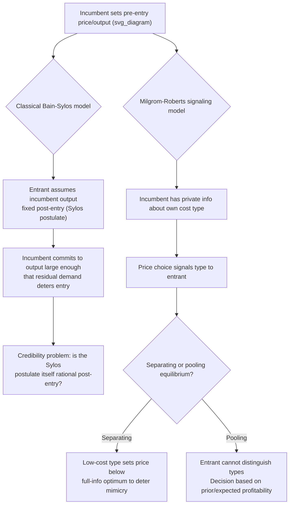

## Limit Pricing and Signaling to Deter Entry

### Definition and Core Concept

Limit pricing is a strategy in which an incumbent firm sets its price (or output) below the level that would maximize its short-run monopoly profit, specifically in order to discourage or delay entry by a potential competitor. The classical (Bain-Sylos) version treats it as a **direct output/capacity commitment**: the incumbent produces a quantity large enough that the residual demand left for an entrant would not support profitable entry. The more modern **signaling** version, developed within game theory, treats price as a **signal of the incumbent's privately known cost or demand conditions**, used strategically to influence an entrant's beliefs about the profitability of entry under asymmetric information. These are related but analytically distinct mechanisms, both falling under the broader heading of entry deterrence.

### The Classical (Bain-Sylos) Limit Pricing Model

**Key Points**

- Developed by Joe Bain and elaborated by Paolo Sylos-Labini, and later formalized rigorously by Modigliani (1958), the classical model assumes the incumbent commits to an output level **before** the entrant decides whether to enter, and assumes the entrant believes the incumbent will **maintain that output level** even after entry occurs (the "Sylos postulate").
- Under the Sylos postulate, a potential entrant calculates the residual demand curve it would face (total market demand minus the incumbent's committed output) and evaluates whether entering at any output level along that residual demand curve would be profitable given its own costs.
- The incumbent chooses the **limit output** $q_L$ — the largest output level (equivalently, the lowest price) that leaves residual demand insufficient to support any profitable entry, given the entrant's cost structure and minimum efficient scale.
- The limit price $p_L$ is generally **below** the monopoly price $p_M$, representing the foregone short-run profit the incumbent bears in exchange for deterred entry.

### Formal Sketch of the Bain-Sylos Limit Output

Let market demand be $P(Q)$, incumbent output be $q_I$, and let the entrant have minimum efficient scale $q_E^{min}$ and cost structure implying it needs a post-entry price at least $\bar{p}$ to break even at that scale. Under the Sylos postulate, the entrant evaluates the residual demand price at output $q_I + q_E^{min}$:

$$P(q_I + q_E^{min}) \leq \bar{p} \quad \Rightarrow \quad \text{entry is unprofitable}$$

The incumbent selects the smallest $q_I$ satisfying this inequality with equality — producing just enough to make entry exactly unattractive — as long as doing so is more profitable than accommodating entry or deterring more aggressively than necessary.

### The Critique of the Classical Model: Credibility

**Key Points**

- The classical Bain-Sylos framework has an important weakness identified by later game-theoretic scholars (particularly emphasized around Dixit (1980)): the **Sylos postulate is not, in general, a credible belief** for a rational entrant to hold. Once entry occurs, the incumbent typically has an incentive to **revise** output rather than mechanically maintain its pre-entry commitment, since a Cournot-Nash (or other standard) response is usually more profitable than rigidly sticking to the pre-entry level.
- If the entrant understands this, it should anticipate the incumbent's actual post-entry best response rather than take pre-entry output as fixed — undermining the Bain-Sylos mechanism as a **credible** commitment.
- The credibility problem can be resolved if the incumbent has genuinely **sunk** an irreversible capacity commitment before entry, since sunk capacity cannot be costlessly revised post-entry (linking directly to strategic capacity expansion and sunk costs as structural barriers to entry).

### The Modern Signaling Approach (Milgrom-Roberts)

**Key Points**

- Milgrom and Roberts (1982) reformulated limit pricing as a **signaling game under asymmetric information**, addressing the credibility critique by embedding limit pricing within a rigorous game-theoretic equilibrium concept.
- The incumbent has **private information** about a payoff-relevant parameter — typically its production cost (low-cost vs. high-cost type) — relevant to the entrant's decision, since a low-cost incumbent implies a less attractive post-entry environment for the entrant.
- The incumbent's pre-entry price can function as a **signal** of its unobserved type. A low-cost incumbent may set a price **below** its full-information optimum specifically to make that price costly for a high-cost incumbent to mimic — separating itself and credibly signaling unattractive entry conditions.
- This is a formal instance of a broader class of **signaling games** (structurally related to Spence's job-market signaling model): the price is **costly to fake** for the "wrong" type, which is what allows it to carry credible information.

### Separating versus Pooling Equilibria in the Signaling Model

**Key Points**

- **Separating equilibrium**: Different incumbent cost types choose **different** prices, allowing the entrant to perfectly infer type from observed price. The low-cost incumbent sets a price below its full-information optimum specifically to deter a high-cost incumbent from mimicking it.
- **Pooling equilibrium**: Both types choose the **same** price; the entrant cannot distinguish types from price alone and forms beliefs based on the prior probability of each type.
- Which equilibrium is selected depends on model parameters, and multiple equilibria are common — refinement concepts (e.g., the Intuitive Criterion) are often invoked to narrow down the plausible equilibrium.
- [Inference: the specific separating equilibrium selected, and its exact price level, depends sensitively on the assumed distribution of incumbent types and entrant parameters, so no single universal limit-price formula applies across all parameterizations.]

### Diagram: Classical vs. Signaling Limit Pricing Logic

### Illustration: Limit Price Relative to Monopoly and Competitive Benchmarks

<svg xmlns="http://www.w3.org/2000/svg" viewBox="0 0 640 400" font-family="sans-serif">
<text x="320" y="24" font-size="16" text-anchor="middle" font-weight="bold">Limit Price Relative to Monopoly and Competitive Prices (svg_diagram)</text>
<line x1="70" y1="350" x2="600" y2="350" stroke="black" stroke-width="1.5" />
<line x1="70" y1="350" x2="70" y2="50" stroke="black" stroke-width="1.5" />
<text x="600" y="372" font-size="13" text-anchor="end">Quantity Q</text>
<text x="45" y="55" font-size="13" text-anchor="end">Price</text>
<path d="M 90 80 L 560 320" stroke="#333" stroke-width="2" />
<text x="480" y="300" font-size="12">Demand P(Q)</text>
<line x1="90" y1="120" x2="560" y2="120" stroke="#999" stroke-dasharray="4,3" />
<text x="565" y="124" font-size="12">p_M (monopoly)</text>
<line x1="90" y1="230" x2="560" y2="230" stroke="#2563eb" stroke-width="2" stroke-dasharray="6,3" />
<text x="565" y="234" font-size="12" fill="#2563eb">p_L (limit price)</text>
<line x1="90" y1="330" x2="560" y2="330" stroke="#dc2626" stroke-dasharray="4,3" />
<text x="565" y="334" font-size="12" fill="#dc2626">c (marginal cost)</text>

<text x="90" y="365" font-size="12">Q_M</text>

<text x="330" y="365" font-size="12">Q_L (limit output)</text>

</svg>

### Real-World Examples

**Example**

- **Pharmaceutical pricing ahead of patent expiry**: Incumbent branded-drug manufacturers have sometimes been observed to reduce prices or adjust product lines in anticipation of generic entry, [Inference] though disentangling genuine limit-pricing motives from other explanations (demand-side responses, regulatory changes) requires careful case-specific empirical analysis.
- **Airline pricing on contested routes**: Incumbent carriers have historically been observed to set notably lower fares on routes where low-cost-carrier entry is a credible threat, consistent with (though not conclusively proving) a limit-pricing motive.
- **Technology/software markets with cost-signaling dynamics**: A firm with genuinely lower production costs may price aggressively partly to signal it would be a tough post-entry competitor, broadly consistent with the Milgrom-Roberts framework, though clean empirical identification of the signaling channel is often difficult.
- **Historical antitrust cases involving alleged limit pricing**: Raised as a theoretical concern in various monopolization cases, though generally harder to establish as legal proof than more direct exclusionary conduct.

### Contrast: Classical versus Signaling Limit Pricing

| Feature | Bain-Sylos (Classical) | Milgrom-Roberts (Signaling) |
| --- | --- | --- |
| Source of deterrence | Committed output/residual demand | Information asymmetry about incumbent type |
| Key assumption | Sylos postulate (entrant assumes fixed incumbent output) | Rational Bayesian updating by entrant on observed price |
| Credibility issue | Postulate not generally credible without sunk capacity | Equilibrium is credible by construction (sequential rationality) |
| Equilibrium concept | Not fully game-theoretic in original formulation | Perfect Bayesian / sequential equilibrium with refinements |
| What price reveals | Nothing formally — assumed fixed output | Incumbent's privately known type (cost or demand) |

### Relation to the Broader Entry-Deterrence Literature

Limit pricing sits alongside strategic capacity expansion, sunk-cost-based structural barriers, and predatory pricing as one of the principal mechanisms by which incumbents can influence entrant behavior. It is distinguished from capacity-based deterrence (which relies on genuinely sunk, hard-to-reverse commitments) by the fact that the signaling version achieves credibility not through irreversibility of a physical commitment, but through the **informational cost structure of the signaling game itself** — a fundamentally different microfoundation for credibility, though both serve the same strategic objective.

### Welfare Implications

**Key Points**

- Limit pricing, in either form, generally results in a price **below** the unconstrained monopoly price, which — holding market structure fixed — tends to increase consumer surplus in the pre-entry period relative to unconstrained monopoly pricing.
- However, the entry being deterred might, in a **full-information counterfactual**, have been genuinely welfare-improving — so successful limit pricing that deters *efficient* entry represents a genuine dynamic welfare loss, even though the static price is lower than pure monopoly pricing.
- [Inference: whether limit pricing is, on net, welfare-improving or welfare-reducing depends on comparing the static consumer-surplus gain against the forgone dynamic benefits of deterred entry — generally ambiguous in the abstract and requiring case-specific empirical analysis.]
- In the signaling variant, if the incumbent's low price genuinely reveals a truly lower cost structure, then deterred entry may be **efficient** to deter, since a genuinely higher-cost entrant would not improve total welfare — an important qualification relative to the classical model, where deterrence occurs regardless of whether entry would have been efficient.

**Next Steps**

- Modigliani (1958) formalization of the Bain-Sylos limit output model
- Dixit (1980) and the credibility critique of pre-commitment without sunk costs
- Milgrom and Roberts (1982) "Limit Pricing and Entry Under Incomplete Information"
- Signaling game equilibrium refinements (Intuitive Criterion, D1 criterion)
- Strategic capacity expansion as a credible entry-deterrence mechanism
- Predatory pricing doctrine and its relationship to limit pricing theory
- Spence (1973) job-market signaling as the foundational signaling-game template
- Empirical identification strategies for distinguishing limit pricing from competitive pricing