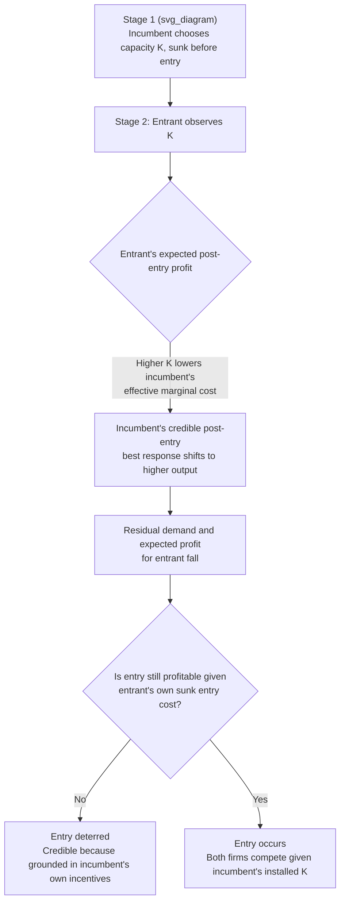

## Capacity Expansion as a Strategic Entry Deterrent

### Definition and Core Concept

Capacity expansion as an entry deterrent refers to an incumbent firm's strategy of investing in productive capacity **beyond** the level it would choose absent any entry threat, specifically because that excess capacity credibly commits the incumbent to producing a large post-entry output, which depresses the residual demand and expected profitability available to a potential entrant. Unlike the classical Bain-Sylos limit pricing model — which assumes the incumbent's committed output is credible simply by fiat (the Sylos postulate) — the capacity-expansion literature grounds credibility in a genuine economic mechanism: capacity, once installed, is a **sunk cost** that lowers the incumbent's marginal cost of producing additional output, making it privately rational (not merely assumed) for the incumbent to actually produce aggressively post-entry.

### Why Capacity, Specifically, Solves the Credibility Problem

**Key Points**

- The core credibility critique of classical limit pricing is that a flexible output commitment is not credible, because the incumbent can costlessly revise its output after entry occurs, and a standard post-entry best response (e.g., Cournot behavior) is typically more profitable than sticking to a pre-announced output level.
- **Sunk capacity changes this calculus**: once capacity $K$ is installed, the cost of that capacity is a bygone with respect to the incumbent's post-entry output decision. If having a large installed capacity **lowers the incumbent's effective marginal cost** of producing up to that capacity level (relative to a firm with less capacity that would need to invest further or operate at higher marginal cost to match that output), the incumbent's **actual, sequentially rational** post-entry best response shifts toward higher output than it would choose with less capacity.
- This means the incumbent's aggressive post-entry behavior is no longer merely assumed (as in Sylos) — it emerges endogenously as the outcome of the incumbent solving its own profit-maximization problem in the post-entry subgame, **taking its sunk capacity as given**. This is precisely what restores credibility: the commitment is real because it operates through the incumbent's own incentive structure, not through an arbitrary assumption about entrant beliefs.
- This mechanism directly connects capacity-based deterrence to the broader theory of **sunk costs as structural/strategic barriers to entry**: the capacity investment functions as a self-imposed sunk cost that alters the incumbent's own post-entry incentives in a way that benefits it strategically.

### The Formal Two-Stage Game Structure

The canonical formalization (developed in the tradition of Spence 1977, Dixit 1980, and the broader "top dog" strategic-commitment literature of Fudenberg and Tirole) structures the problem as a two-stage game:

**Stage 1**: The incumbent chooses capacity $K$, which is **sunk** before the entry decision is made.

**Stage 2**: The potential entrant observes $K$ and decides whether to enter. If entry occurs, both firms compete (typically in quantities, à la Cournot) taking the incumbent's installed capacity as a constraint or cost-shifter on its subsequent output choice.

The incumbent's Stage 1 problem is to choose $K$ to maximize its total discounted profit, accounting for **both**:

1. The direct effect of $K$ on its own cost structure and flexibility, and
2. The **strategic effect** of $K$ on the entrant's Stage 2 entry decision, since a higher $K$ shifts the entrant's expected post-entry profit downward by credibly signaling more aggressive incumbent output.

Formally, if $\pi^I(K)$ denotes incumbent profit and $\pi^E(K)$ denotes the entrant's expected post-entry profit as a function of incumbent capacity, the incumbent internalizes:

$$\frac{d\pi^I}{dK} = \underbrace{\frac{\partial \pi^I}{\partial K}}_{\text{direct cost/output effect}} + \underbrace{\frac{\partial \pi^I}{\partial \pi^E} \cdot \frac{\partial \pi^E}{\partial K}}_{\text{strategic entry-deterrence effect}}$$

The incumbent may choose $K$ **above** the level that would be privately optimal ignoring the strategic effect, specifically because $\partial \pi^E / \partial K < 0$ (more incumbent capacity reduces entrant profitability) and deterring entry entirely can be more valuable than the direct cost of holding "excess" capacity.

### The Fudenberg-Tirole Taxonomy: "Top Dog" versus "Puppy Dog" Strategies

**Key Points**

- Fudenberg and Tirole (1984) provided an influential taxonomy classifying strategic pre-commitment investments (including capacity) according to two dimensions: (1) whether the investment makes the incumbent **tough** or **soft** in the post-entry competition game, and (2) whether the incumbent's strategic variables are **strategic substitutes** (as in Cournot quantity competition) or **strategic complements** (as in Bertrand price competition with differentiated products).
- Under **quantity (Cournot) competition**, where strategies are typically strategic substitutes, an incumbent benefits from committing to be **"tough"** — i.e., overinvesting in capacity to credibly commit to high output, which induces the entrant (facing a strategic substitute) to optimally respond by producing less, or not entering at all. This is the classic **"top dog"** strategy: **overinvest** to look aggressive and induce a passive response.
- Under **price (Bertrand) competition with strategic complements**, the incentives can reverse: because competitors' prices tend to move together (a strategic complement relationship), an incumbent may prefer to appear **"soft"** (e.g., by underinvesting or signaling that it will not compete aggressively on price) to induce an entrant to also price less aggressively — the **"puppy dog"** strategy — since overinvesting to look tough could instead trigger a price war that hurts both incumbent and entrant.
- This taxonomy makes clear that **capacity expansion as an entry deterrent is not universally optimal** — it is the correct strategic response specifically under the conditions where competition is in strategic substitutes (typically associated with quantity-setting industries) and where the strategic investment makes the incumbent tough rather than soft. [Inference: correctly classifying a specific real-world industry's competitive mode (quantities vs. prices, strategic substitutes vs. complements) is an empirical judgment that can be genuinely difficult and is central to correctly predicting whether capacity overinvestment or a different strategy is the theoretically appropriate deterrent.]

### Diagram: The Capacity Commitment Mechanism

### Illustration: Reaction Functions and the Effect of Capacity Commitment

<svg xmlns="http://www.w3.org/2000/svg" viewBox="0 0 640 420" font-family="sans-serif">
<text x="320" y="24" font-size="16" text-anchor="middle" font-weight="bold">Cournot Reaction Functions: Effect of Incumbent Capacity Commitment (svg_diagram)</text>
<line x1="80" y1="370" x2="600" y2="370" stroke="black" stroke-width="1.5" />
<line x1="80" y1="370" x2="80" y2="50" stroke="black" stroke-width="1.5" />
<text x="600" y="392" font-size="13" text-anchor="end">Incumbent output q_I</text>
<text x="55" y="55" font-size="13" text-anchor="end">Entrant output q_E</text>
<path d="M 100 90 L 560 340" stroke="#2563eb" stroke-width="2" />
<text x="380" y="150" font-size="12" fill="#2563eb">Entrant reaction function R_E(q_I)</text>
<path d="M 300 350 L 300 60" stroke="#999" stroke-dasharray="4,3" />
<text x="240" y="70" font-size="12" fill="#666">Incumbent's non-strategic (Cournot-Nash) output</text>
<path d="M 460 350 L 460 60" stroke="#dc2626" stroke-dasharray="4,3" />
<text x="470" y="70" font-size="12" fill="#dc2626">Incumbent's committed capacity K (overinvested)</text>
<circle cx="300" cy="200" r="5" fill="#333" />
<text x="200" y="195" font-size="12">Cournot-Nash equilibrium (no commitment)</text>
<circle cx="460" cy="127" r="5" fill="#dc2626" />
<text x="380" y="115" font-size="12" fill="#dc2626">New equilibrium: entrant's output/entry reduced</text>
</svg>

### Real-World Examples

**Example**

- **Airline industry route capacity**: Incumbent carriers have historically been documented adding flight frequency or capacity on routes facing potential low-cost-carrier entry, consistent with (though not conclusively proving in every documented case) a strategic capacity-deterrence motive, since capacity in aviation (aircraft assigned to a route, gate access) has meaningful sunk/commitment characteristics.
- **Chemical and cement manufacturing**: Industries with lumpy, highly sunk plant investments have been widely studied as candidate settings for capacity-based entry deterrence, given the combination of large minimum efficient scale and genuinely sunk plant costs that make capacity commitments credible in the sense required by the theory.
- **Semiconductor fabrication capacity announcements**: Large incumbent chipmakers' capacity expansion announcements are sometimes interpreted, in part, through a strategic-deterrence lens, given the enormous sunk-cost character of fabrication facilities, though [Inference] such announcements also reflect genuine anticipated demand growth and are not purely strategic in every instance — disentangling the two motives empirically is difficult.
- **Historical case: aluminum industry (Alcoa)**: Frequently cited in industrial organization textbooks and in the historical *United States v. Alcoa* antitrust case as an example where sustained capacity expansion ahead of demand growth was alleged (and debated) to have functioned, in part, as a strategy to preempt entry and maintain market dominance.

### Empirical and Measurement Challenges

**Key Points**

- Empirically distinguishing strategic capacity overinvestment from capacity investment that is simply optimal in anticipation of genuine future demand growth is a persistent and difficult identification problem in the applied industrial organization literature.
- [Inference: most rigorous empirical tests of strategic capacity deterrence rely on structural econometric models that explicitly separate the direct-cost and strategic-effect channels described in the formal theory above, and findings on the empirical importance of strategic (as opposed to purely demand-driven) capacity choices vary meaningfully across studied industries and time periods, rather than supporting one universal conclusion.]
- The theory's prediction that capacity commitment should be more prevalent specifically in strategic-substitute (quantity-competition) settings provides one identifying restriction used in some empirical work, though isolating the mode of competition (quantities vs. prices) empirically is itself often non-trivial.

### Contrast: Capacity Expansion versus Classical Limit Pricing

| Feature | Classical Limit Pricing (Bain-Sylos) | Capacity Expansion (Spence-Dixit-Fudenberg-Tirole) |
| --- | --- | --- |
| Commitment mechanism | Assumed fixed post-entry output (Sylos postulate) | Genuinely sunk capacity altering post-entry marginal cost |
| Credibility | Not generally credible without further grounding | Credible because grounded in incumbent's own post-entry incentives |
| Underlying game structure | Static, output/price choice with an assumed belief | Fully specified two-stage subgame-perfect equilibrium |
| Optimality condition | Deters entry via committed residual demand | Optimal strategy depends on strategic substitutes/complements and tough/soft classification |
| Applicability | General framework, less mechanistically grounded | Requires genuinely sunk, cost-relevant capacity investment |

### Policy and Antitrust Relevance

**Key Points**

- Strategic capacity overinvestment occupies an ambiguous position in competition law: **legitimate** capacity investment made in anticipation of demand growth is a normal, procompetitive business activity, while capacity investment made **specifically and primarily** to exclude a known or anticipated competitor can, in some jurisdictions and circumstances, raise exclusionary-conduct concerns under monopolization or abuse-of-dominance doctrines.
- The empirical difficulty of distinguishing strategic-exclusionary from demand-driven capacity investment (noted above) is a significant practical obstacle to enforcement in this area, and [Inference] courts and agencies have generally required substantial additional evidence of anticompetitive intent or effect beyond the mere existence of "excess" capacity before treating it as unlawful, reflecting the genuine difficulty of establishing that a specific capacity level was strategically excessive rather than commercially reasonable.

### Welfare Implications

**Key Points**

- Successful capacity-based entry deterrence generally **reduces** total welfare relative to a counterfactual in which efficient entry occurs, since it forecloses the output expansion, price reduction, and competitive discipline that entry would otherwise bring — a straightforward instance of the general principle that deterring efficient entry imposes a dynamic welfare cost.
- However, the capacity investment itself, even though motivated strategically, still represents **real productive capacity** that could, in some circumstances, be used to serve demand (e.g., if demand grows unexpectedly, or if the "excess" capacity is later utilized), which distinguishes it from pure and wasteful cost-raising strategies with no offsetting productive value. [Inference: whether strategically motivated capacity investment nonetheless generates positive incidental welfare value through its productive-capacity effect, net of its exclusionary effect, is model- and case-specific and does not have a general answer.]
- As with limit pricing, the welfare comparison ultimately depends on weighing the loss from deterred entry against any efficiency benefits associated with the incumbent's larger scale (e.g., economies of scale genuinely realized through the larger capacity, if any), and no universal sign for the net welfare effect can be stated without reference to specific market conditions.

**Next Steps**

- Spence (1977) and Dixit (1980) formal capacity pre-commitment models
- Fudenberg and Tirole (1984) "The Fat Cat Effect, the Puppy Dog Ploy, and the Lean and Hungry Look" — full taxonomy
- Strategic substitutes versus strategic complements in oligopoly competition
- Sunk costs as structural barriers to entry (related credibility mechanism)
- Limit pricing and signaling models (alternative, non-capacity-based deterrence mechanism)
- United States v. Alcoa and historical antitrust treatment of capacity-based dominance
- Empirical structural models identifying strategic versus demand-driven capacity investment
- Real options and irreversible investment theory applied to capacity choice under uncertainty