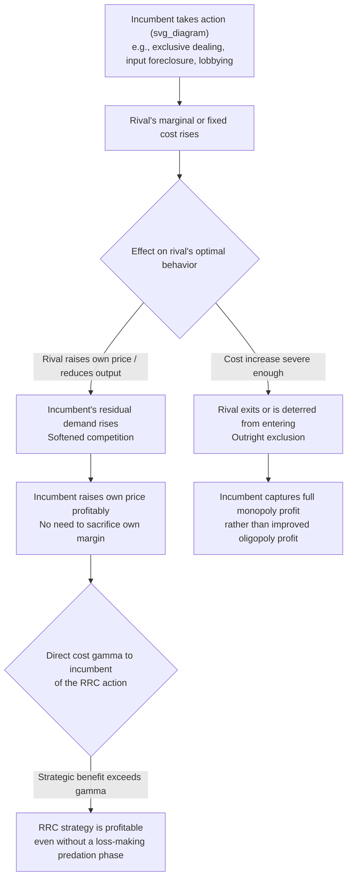

## Raising Rivals' Costs as an Exclusionary Strategy

### Definition and Core Concept

Raising rivals' costs (RRC) is an exclusionary strategy in which a dominant or incumbent firm takes actions that increase the **costs of its actual or potential competitors**, rather than (or in addition to) directly lowering its own costs or prices, with the objective of weakening rivals' competitive position, deterring entry, or facilitating the incumbent's ability to raise its own price profitably. The theory, developed and formalized principally by Salop and Scheffman (1983), reframes exclusionary conduct away from the traditional focus on **predatory pricing** (where an incumbent sacrifices its own short-run profit by pricing below cost) toward a broader class of strategies in which the incumbent **need not sacrifice its own profitability at all** — it can raise its rivals' costs while simultaneously maintaining or even increasing its own profit, making RRC strategies potentially more attractive and more difficult to detect or prohibit than classical predation.

### Why Raising Rivals' Costs Is an Attractive Exclusionary Strategy

**Key Points**

- Classical predatory pricing requires the predator to **incur losses** during the predation phase (pricing below cost) in the hope of recouping those losses later via monopoly pricing after the rival exits — a strategy that is often self-limiting because the predator itself bears substantial short-run cost, and courts have historically been skeptical of the plausibility of the "recoupment" story.
- RRC strategies, by contrast, can directly **raise a rival's marginal or fixed costs** without requiring the incumbent to sacrifice its own margin. If the incumbent can raise the rival's costs (or, more generally, worsen the rival's cost or demand position) at low cost to itself, the incumbent may be able to profitably **increase its own price** in response to the rival's now-higher costs (since the rival's optimal response to higher costs is typically to raise its own price or reduce output, softening competition and allowing the incumbent higher profit even without cutting its own price).
- This makes RRC strategies potentially **profitable in every period** — there is no need for a loss-making predation phase followed by uncertain future recoupment, which is often cited as the key economic distinction that made RRC theory influential in modern antitrust economics as arguably a more coherent and more empirically tractable theory of exclusionary harm than classical predatory pricing in many settings.

### The General Mechanism

**Key Points**

- Let $c_R$ denote the rival's marginal cost and $c_I$ the incumbent's marginal cost. In a standard oligopoly pricing model (e.g., differentiated Bertrand competition), the incumbent's optimal price $p_I^*$ is typically **increasing** in the rival's cost $c_R$, because a higher-cost rival optimally raises its own price, which — under normal conditions of strategic complementarity in pricing — induces the incumbent to also raise its price (since demand for the incumbent's product rises as the rival becomes a less attractive, higher-priced substitute).
- The incumbent's profit from a strategy that raises $c_R$ by some increment, at direct cost $\gamma$ to the incumbent, is profitable if:

$$\frac{\partial \pi_I}{\partial c_R} \cdot \Delta c_R > \gamma$$

- If the strategy raises rivals' costs sufficiently, it may push the rival's costs above a level at which the rival can no longer profitably compete or remain viable in the market at all, achieving **outright exclusion** rather than merely softened competition — in which case the incumbent captures the entire monopoly profit rather than merely an improved oligopoly profit.
- Critically, RRC strategies are most effective, and raise the most serious antitrust concern, when the increase in rivals' costs is **not** accompanied by a corresponding increase in the incumbent's own costs, and when the strategy does not simultaneously reduce total market output or harm consumers through legitimate cost-based mechanisms (e.g., a genuine, non-strategic efficiency improvement by the incumbent that happens to disadvantage a less efficient rival is generally not treated as exclusionary in the antitrust sense, even though it technically "raises the rival's relative cost position").

### Canonical Categories of RRC Strategies

**Key Points**

- **Exclusive dealing arrangements**: The incumbent contracts with key input suppliers, distributors, or retail outlets to deal exclusively (or on preferential terms) with the incumbent, foreclosing the rival's access to those inputs or channels and forcing it to rely on more costly alternatives.
- **Vertical foreclosure via vertical integration**: If the incumbent acquires or vertically integrates with a critical upstream input supplier or downstream distribution channel, it can potentially deny or degrade the rival's access to that input/channel, or offer access only on disadvantageous terms.
- **Manipulation of industry standards or regulation**: An incumbent that is well-positioned relative to a proposed technical standard, environmental regulation, licensing requirement, or other regulatory change may lobby for adoption of that standard/regulation specifically because it disproportionately raises compliance costs for rivals relative to itself — sometimes termed "raising rivals' costs through the regulatory process" in the literature.
- **Input price manipulation via bidding/hoarding**: If the incumbent is also a buyer of a scarce input used by the rival, it may bid up the price of that input (or purchase and hoard more than it needs) specifically to raise the input's price for the rival, even at some direct cost to itself, if the resulting softened downstream competition more than compensates.
- **Sabotage and network/interoperability degradation**: In network industries, an incumbent controlling a bottleneck facility or interoperability standard may degrade the quality of interconnection or access provided to rivals (raising their **effective** cost of serving customers, even without a direct monetary input-price effect), a strategy particularly discussed in telecommunications and platform-market contexts.
- **Most-favored-nation and loyalty rebate contracts**: Certain contractual structures with input suppliers or downstream buyers can have the practical effect of raising the switching or contracting costs faced by a rival attempting to secure the same suppliers/buyers, even without an explicit exclusivity clause.

### Diagram: The RRC Mechanism

### Contrast with Classical Predatory Pricing

| Feature | Classical Predatory Pricing | Raising Rivals' Costs (RRC) |
| --- | --- | --- |
| Effect on incumbent's own cost/price | Incumbent prices below its own cost (short-run loss) | Incumbent's own cost is typically unaffected or unaffected in the relevant sense |
| Timing of profitability | Requires a loss phase followed by uncertain future recoupment | Can be profitable immediately, in every period |
| Primary lever | Incumbent's own price | Rival's cost structure (input access, compliance costs, contracts) |
| Legal/economic skepticism | Courts often skeptical of recoupment plausibility (Areeda-Turner tradition) | Broader and, in some respects, more tractable theory, but raises distinct proof challenges (foreclosure share, cost-effect magnitude) |
| Typical mechanisms | Below-cost pricing in the predator's own output market | Exclusive dealing, vertical foreclosure, regulatory manipulation, input hoarding |

### Real-World and Historical Examples

**Example**

- **Exclusive dealing in retail distribution**: Antitrust cases and economic analyses of exclusive-dealing contracts between manufacturers and retailers frequently invoke RRC logic — an incumbent manufacturer's exclusive shelf-space or distribution contracts can raise the effective cost (of finding alternative distribution) faced by a rival manufacturer, distinct from any direct price effect on consumers in the short run.
- **Vertical integration and input foreclosure disputes**: Merger reviews involving vertical integration between an input supplier and one of several downstream competitors routinely apply RRC-style analysis (often termed "vertical foreclosure" analysis in merger guidelines) to assess whether the merged firm would have the ability and incentive to degrade rivals' access to the input, raising their effective costs.
- **Environmental and regulatory compliance cost asymmetries**: [Inference] Some economic and legal commentary has examined instances where an incumbent firm's lobbying for a specific regulatory standard was alleged to disproportionately raise compliance costs for smaller or differently-configured rivals relative to the incumbent's own compliance burden, though establishing lobbying-driven RRC as the *primary* motive (versus genuine public-interest regulatory objectives that happen to have asymmetric effects) is often contested and difficult to prove empirically.
- **Labor and union-related cost-raising strategies**: The original Salop-Scheffman framework was partly motivated by, and has been applied to, historical cases where an incumbent firm supported labor regulations or union agreements that it could absorb more easily than smaller rivals (due to scale or existing compliance infrastructure), a classic illustration of the "raising rivals' costs through regulation" channel.
- **Standard-setting organizations and patent-related strategies**: Disputes over standard-essential patents and licensing terms in technology standard-setting have, in some cases, been analyzed through an RRC lens, where an incumbent's control over a technical standard or its associated licensing terms can differentially raise the cost of compliance/licensing for rival implementers.

### Antitrust and Legal Treatment

**Key Points**

- RRC theory has been influential in shaping modern antitrust analysis of **exclusive dealing**, **vertical mergers**, and certain forms of **single-firm conduct** under monopolization/abuse-of-dominance statutes, precisely because it provides a coherent economic mechanism for exclusionary harm that does not require proof of a loss-making predation phase (which is often the most difficult element to establish in classical predatory-pricing cases).
- Legal and economic analysis of RRC claims typically requires evidence addressing several distinct questions: (1) whether the challenged conduct genuinely and substantially raises the rival's costs (as opposed to reflecting legitimate competition on the merits or genuine efficiency), (2) whether the foreclosure share (the proportion of the input market, distribution channel, or customer base affected) is large enough to have a material competitive effect, and (3) whether the conduct, on net, harms consumers (e.g., through higher prices or reduced output) rather than merely harming a specific competitor without corresponding consumer harm — courts and agencies generally require showing consumer harm, not merely rival harm, to sustain an antitrust violation.
- [Inference: the specific legal thresholds and evidentiary standards for RRC-based antitrust claims vary by jurisdiction and have evolved over time through case law and agency guidelines, so a comprehensive account of current legal doctrine requires consulting jurisdiction-specific and up-to-date legal sources rather than the economic theory alone.]

### Distinguishing Legitimate Competition from Exclusionary RRC

**Key Points**

- A central and genuinely difficult analytical challenge in RRC theory and its legal application is distinguishing **competition on the merits** (e.g., an incumbent that legitimately negotiates favorable input supply terms through superior efficiency or scale, which happens to leave less favorable terms available to rivals) from **genuinely exclusionary** conduct whose primary purpose or effect is to disadvantage rivals without a countervailing efficiency justification.
- Economic analysis generally looks for evidence that the conduct would be unprofitable for the incumbent **absent** its exclusionary effect on rivals (the same "no economic sense" or "profit sacrifice" style test sometimes used in predatory-pricing analysis, adapted to the RRC context) as one, though not the only, framework for making this distinction, alongside efficiency-justification defenses the defendant may raise.

### Welfare Implications

**Key Points**

- RRC strategies that succeed in softening competition (short of outright exclusion) generally **raise incumbent profit while reducing consumer surplus**, as the incumbent is able to sustain a higher price than it otherwise could — a straightforward instance of reduced competitive intensity harming consumers, distinct from any change in underlying production efficiency.
- RRC strategies that achieve **outright exclusion** of a rival generate an even larger welfare concern, since they eliminate a competitive alternative entirely, potentially returning the market to monopoly or reduced-oligopoly conditions and forfeiting whatever efficiency or variety benefits the excluded rival would have provided.
- However, not all actions that happen to raise a rival's costs are welfare-reducing: **genuine, efficiency-based competition** (e.g., an incumbent's legitimate scale economies allowing it to negotiate better input prices than a smaller rival can) also technically "raises the rival's relative cost position" but reflects normal competitive dynamics that generally benefit consumers through lower prices from the more efficient firm — this is precisely why courts and economists insist on distinguishing exclusionary intent/effect from ordinary competitive advantage rather than treating any cost-differential-widening conduct as presumptively unlawful. [Inference: the practical line between these two categories is genuinely contested in specific cases and is one of the more difficult classification problems in modern antitrust economics, rather than a matter with a bright, universally agreed-upon rule.]

**Next Steps**

- Salop and Scheffman (1983) "Raising Rivals' Costs" — original formal treatment
- Exclusive dealing contracts and antitrust foreclosure analysis
- Vertical mergers and vertical foreclosure theories of harm (merger guidelines)
- Classical predatory pricing doctrine and the Areeda-Turner recoupment test (contrast case)
- Standard-setting organizations, standard-essential patents, and licensing disputes
- Regulatory capture and strategic lobbying for cost-asymmetric regulation
- Platform and network-industry sabotage/interoperability degradation strategies
- Empirical methods for measuring foreclosure share and cost-effect magnitude in antitrust litigation