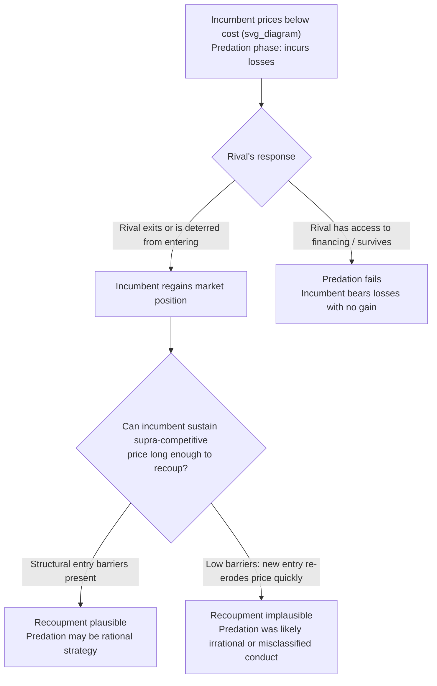

## Predatory Pricing Strategies and Legal Standards

### Definition and Core Concept

Predatory pricing is a strategy in which a dominant or incumbent firm deliberately prices its product **below some measure of cost** for a sustained period, sacrificing short-run profit, with the objective of driving an existing rival out of the market or deterring a potential entrant, and then **recouping** those losses later by raising prices to supra-competitive levels once the competitive threat has been eliminated. It is one of the most economically and legally contested forms of exclusionary conduct in antitrust economics, precisely because the same observed behavior — aggressive price cutting — can reflect either genuinely harmful predation **or** vigorous, welfare-enhancing competition, making the two difficult to distinguish from price data alone.

### The Two-Stage Logic of Predation

**Key Points**

- **Predation phase**: The incumbent prices below a relevant measure of cost, incurring losses (or foregone profit relative to a non-predatory price) in order to inflict losses on the rival sufficient to induce exit, or to signal that entry will be met with ruinous competition, deterring a potential entrant from entering at all.
- **Recoupment phase**: After the rival exits (or is deterred), the incumbent raises price above the competitive level for a sufficiently long period to recover the losses incurred during the predation phase, plus additional monopoly rents.
- For predation to be a **rational** strategy, the incumbent must have a reasonable expectation, at the time it begins pricing below cost, that recoupment is achievable — this **recoupment requirement** has become the central organizing principle of modern legal and economic analysis of predatory pricing claims, because a strategy that imposes losses on the predator without a plausible path to future recoupment is not a coherent profit-maximizing strategy and is difficult to distinguish from simple aggressive (and welfare-beneficial) competition.

### The Chicago School Critique and the Skepticism of Predation Claims

**Key Points**

- Beginning in the 1970s, scholars associated with the "Chicago School" of antitrust economics (notably work by Robert Bork, and the influential Areeda-Turner framework discussed below) argued that predatory pricing is, as a matter of economic logic, a **rare and generally irrational** strategy for several reasons:
  - The predator typically incurs **losses now** for **uncertain future gains**, while the target/rival, once it exits, can potentially be replaced by new entry once the incumbent attempts to raise prices back to supra-competitive levels — undermining the plausibility of durable recoupment in markets without structural entry barriers.
  - Capital markets, in principle, should allow a financially sound but temporarily loss-making rival to raise financing to weather a predation campaign, provided the rival's underlying business is genuinely viable.
  - The predator bears losses on its **entire output**, while the harm inflicted on the rival is limited to the rival's (typically smaller) output, meaning predation is often a relatively **inefficient** weapon compared to alternative exclusionary strategies (e.g., raising rivals' costs, which need not require the incumbent to sacrifice its own margin at all).
- This skepticism led to a significant tightening of legal standards for predatory pricing claims in many jurisdictions (most notably in U.S. antitrust law), requiring plaintiffs to establish both a below-cost pricing element and a **plausible recoupment** element, rather than relying on price-cost comparisons alone.

### The Areeda-Turner Cost-Based Test

**Key Points**

- Areeda and Turner (1975) proposed highly influential rule-based tests using **cost benchmarks** to operationalize the "below cost" element of a predatory pricing claim, motivated by the need for a workable, administrable legal standard rather than requiring courts to directly assess complex and often unobservable long-run intent.
- The canonical Areeda-Turner rule treats price **below short-run marginal cost** (approximated, for practical purposes, by average variable cost) as presumptively predatory, while price **at or above average variable cost** is presumptively lawful, on the economic logic that a firm covering its variable costs is, in a static sense, behaving as a rational profit-maximizer even under ordinary competitive conditions.
- **Refinements and criticisms**: subsequent scholarship has proposed alternative or supplementary cost benchmarks, including **average total cost** (a stricter standard, more protective against predation claims succeeding) and **average avoidable cost** (designed to capture costs avoidable in the relevant period but not classified as strictly "variable" in a traditional accounting sense).
- [Inference: which specific cost benchmark is applied, and how it is operationalized using available accounting data, varies by jurisdiction, case, and available economic evidence, and remains an area of ongoing methodological debate rather than a fully settled matter.]

### Formal Sketch of the Recoupment Condition

Let $\pi_P < 0$ denote the incumbent's per-period loss during a predation phase of length $T_P$, and $\pi_R > 0$ its per-period supra-competitive profit during a subsequent recoupment phase of length $T_R$, discounted at rate $\delta$. Predation is a rational strategy only if:

$$\sum_{t=0}^{T_P} \delta^t \pi_P + \sum_{t=T_P+1}^{T_P+T_R} \delta^t \pi_R > 0$$

relative to the alternative of simply competing normally throughout. Whether this condition can plausibly be satisfied depends critically on **market structure conditions after the rival exits** — particularly whether structural barriers to entry (sunk costs, contestability) are strong enough to prevent new entry from eroding the incumbent's post-predation supra-competitive price before recoupment is complete.

### Diagram: The Predation and Recoupment Sequence

### Illustration: Cost Benchmarks for Predatory Pricing Analysis

<svg xmlns="http://www.w3.org/2000/svg" viewBox="0 0 640 400" font-family="sans-serif">
<text x="320" y="24" font-size="16" text-anchor="middle" font-weight="bold">Cost Benchmarks Used in Predatory Pricing Analysis (svg_diagram)</text>
<line x1="80" y1="350" x2="600" y2="350" stroke="black" stroke-width="1.5" />
<line x1="80" y1="350" x2="80" y2="50" stroke="black" stroke-width="1.5" />
<text x="600" y="372" font-size="13" text-anchor="end">Output Q</text>
<text x="55" y="55" font-size="13" text-anchor="end">Cost / Price</text>
<line x1="100" y1="120" x2="580" y2="120" stroke="#111827" stroke-width="2" />
<text x="585" y="124" font-size="12">Average Total Cost (ATC)</text>
<line x1="100" y1="220" x2="580" y2="220" stroke="#2563eb" stroke-width="2" stroke-dasharray="6,3" />
<text x="585" y="224" font-size="12" fill="#2563eb">Average Avoidable Cost</text>
<line x1="100" y1="270" x2="580" y2="270" stroke="#dc2626" stroke-width="2" stroke-dasharray="4,3" />
<text x="585" y="274" font-size="12" fill="#dc2626">Average Variable Cost (AVC)</text>
<rect x="100" y="270" width="480" height="80" fill="#fecaca" opacity="0.3" />
<text x="120" y="335" font-size="12" fill="#991b1b">Presumptively predatory zone (below AVC)</text>
<rect x="100" y="220" width="480" height="50" fill="#fed7aa" opacity="0.3" />
<text x="120" y="260" font-size="12" fill="#9a3412">Contested zone (between AVC and ATC/avoidable cost)</text>
</svg>

### Post-Chicago Refinements and Modern Debates

**Key Points**

- **Brooke Group Ltd. v. Brown & Williamson Tobacco Corp. (1993, U.S. Supreme Court)**: A landmark case that codified the two-part below-cost-pricing-plus-recoupment standard in U.S. federal antitrust law, explicitly requiring plaintiffs to demonstrate a **dangerous probability of recoupment**; this remains a central reference point in U.S. predatory pricing doctrine. [Note: legal standards and their application continue to evolve through subsequent case law; consult current legal sources for the precise state of doctrine in any specific jurisdiction.]
- **Post-Chicago economic scholarship** has pushed back against the view that predation is always irrational, identifying settings where predation can be a coherent equilibrium strategy even without strict structural entry barriers, including:
  - **Reputation-based predation** (Kreps-Wilson, Milgrom-Roberts style models): an incumbent facing multiple potential entrants over time may rationally prey on an early entrant to build a reputation deterring *future* entrants — the loss on the first episode is recouped across the entire subsequent sequence of deterred entrants.
  - **Financial-constraint-based predation** (Bolton-Scharfstein and related models): if the rival faces capital-market imperfections during a period of predatory losses, the Chicago School's assumption that capital markets will finance a viable rival through predation may not hold, restoring the plausibility of successful predation even absent structural post-exit entry barriers.
  - **Signal jamming and limit pricing interactions**: predatory pricing can interact with signaling mechanisms, where low pricing serves a dual role of harming a rival and signaling low incumbent costs to deter future entrants.
- [Inference: the practical legal and economic weight given to these post-Chicago refinements varies by jurisdiction and over time, and there is no single settled consensus on how much they should relax the strict recoupment-based skepticism embodied in cases like Brooke Group; this remains an active area of scholarly and doctrinal debate.]

### Real-World and Historical Examples

**Example**

- **Standard Oil (historical antitrust case, early 20th century U.S.)**: Frequently cited in antitrust textbooks as an early and influential (though historically and empirically contested in its specific factual findings) example of alleged predatory pricing used to establish and maintain market dominance.
- **Airline industry pricing disputes**: Allegations of predatory pricing by major incumbent carriers against low-cost entrants on specific routes have been a recurring feature of antitrust litigation and regulatory scrutiny, with outcomes turning heavily on cost-benchmark and recoupment-plausibility analysis specific to route-level market structure.
- **Technology and e-commerce "below-cost" pricing disputes**: Modern antitrust discussions of large platform firms have revisited predatory pricing theory in the context of below-cost pricing used to build market share in multi-sided or network-effect markets, raising novel questions about applying traditional cost-benchmark tests when a business model deliberately involves cross-subsidization across product lines or user groups. [Inference: applying classical predatory pricing frameworks to platform and multi-sided market contexts is an active and unsettled area of both economic scholarship and legal doctrine.]

### Contrast: Predatory Pricing versus Related Exclusionary Strategies

| Feature | Predatory Pricing | Limit Pricing | Raising Rivals' Costs |
| --- | --- | --- | --- |
| Incumbent's own margin | Sacrificed (below-cost pricing) | Reduced relative to monopoly price, but typically still profitable | Typically unaffected or improved |
| Timing of profitability | Requires future recoupment | Can be immediately optimal | Can be immediately optimal |
| Target | Existing rival (primarily) | Potential entrant (primarily) | Existing rival or potential entrant |
| Key legal/economic hurdle | Establishing plausible recoupment | Establishing genuine deterrent effect vs. ordinary competitive pricing | Distinguishing exclusion from legitimate competitive advantage |

### Welfare Implications

**Key Points**

- If predation succeeds and recoupment occurs, the welfare effect is **unambiguously negative** relative to a competitive counterfactual: consumers benefit from artificially low prices during the temporary predation phase but bear the cost of durably higher, supra-competitive prices during the recoupment phase, and the market loses whatever competitive discipline the excluded rival would have provided.
- If a firm is wrongly found liable for predation when its low pricing in fact reflected genuine efficiency or vigorous competition (a **false positive**), the resulting chilling effect on aggressive but legitimate price competition can itself be welfare-reducing — this concern is a central reason the Chicago School and subsequent case law pushed toward stricter, more administrable standards rather than discretionary intent-based tests.
- [Inference: striking the right balance between deterring genuine predation and avoiding false positives that chill legitimate competition is a fundamental and unresolved tension in antitrust policy design, and reasonable economists and legal scholars continue to disagree about where that balance should be struck, including in light of the post-Chicago refinements discussed above.]

**Next Steps**

- Areeda and Turner (1975) original cost-based test and its subsequent refinements
- Brooke Group Ltd. v. Brown & Williamson Tobacco Corp. (1993) and the U.S. recoupment standard
- Post-Chicago predation models: reputation effects (Kreps-Wilson, Milgrom-Roberts) and financial constraints (Bolton-Scharfstein)
- Raising rivals' costs as an alternative, non-loss-making exclusionary strategy (contrast case)
- Limit pricing and signaling models (related deterrence mechanism)
- Sunk costs, contestability, and their role in the plausibility of post-predation recoupment
- Predatory pricing analysis in multi-sided platform and digital markets
- Comparative international legal standards for predatory pricing (EU Article 102 TFEU vs. U.S. Sherman Act approaches)