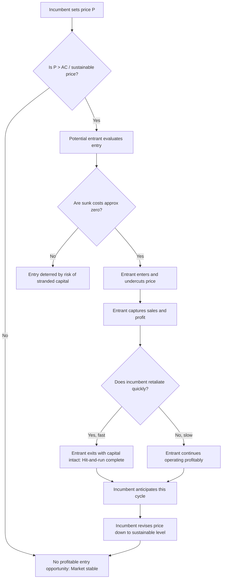

## Contestable Markets Theory and Hit-and-Run Entry

### Definition and Core Concept

A contestable market is a market in which entry and exit are free and costless, meaning that potential competition — rather than actual competition — can discipline the behavior of incumbent firms. The theory, developed primarily by William Baumol, John Panzar, and Robert Willig in the early 1980s, challenges the traditional structure-conduct-performance paradigm by arguing that market structure (the number of firms) matters less than the conditions of entry and exit in determining competitive outcomes.

The central mechanism is **hit-and-run entry**: a potential entrant can enter a market, undercut the incumbent's price, capture sales and profit, and exit before the incumbent has time to retaliate (e.g., by cutting prices). The mere *threat* of this behavior forces incumbents — even monopolists or oligopolists — to price at or near competitive levels, regardless of how many firms actually operate in the market.

### Theoretical Foundations

#### The Baumol-Panzar-Willig Framework

The theory was formalized in Baumol, Panzar, and Willig's *Contestable Markets and the Theory of Industry Structure* (1982). Their key insight was to decouple market performance from market concentration. In the traditional view, a monopoly market structure implies monopoly pricing. Contestability theory argues this link breaks down if entry/exit barriers are absent.

#### Conditions for Perfect Contestability

A market is **perfectly contestable** when the following conditions hold simultaneously:

1. **Free entry**: New entrants face no legal, regulatory, or informational disadvantages relative to incumbents; they have access to the same technology and production costs.
2. **Free (costless) exit**: Firms can leave the market without incurring **sunk costs** — costs that cannot be recovered upon exit.
3. **No incumbent response lag**: The entrant can undercut and capture the market before the incumbent adjusts its price.
4. **Absence of switching frictions**: Consumers can costlessly and immediately switch to the entrant's lower-priced offering.

The absence of sunk costs is the single most critical condition. If capital can be redeployed elsewhere (or resold at full value) upon exit, an entrant bears essentially zero risk from testing the market.

### The Hit-and-Run Entry Mechanism

#### Sequence of Events

1. **Pre-entry state**: An incumbent firm prices above marginal cost (e.g., at monopoly price $P_m$), earning positive economic profit.
2. **Entry decision**: A potential entrant observes that entering at a price slightly below $P_m$ (call it $P_e$, where $P_e < P_m$) would still be profitable given prevailing costs.
3. **Entry and price undercutting**: The entrant enters, sets $P_e$, and captures the entire market (or a significant share) because consumers switch instantly to the lower price.
4. **Profit capture**: The entrant earns profit during the period before the incumbent can react.
5. **Exit before retaliation**: If the incumbent begins to respond (e.g., by matching or undercutting $P_e$), the entrant exits the market, recovering its capital fully since no sunk costs were incurred.
6. **Result**: Anticipating this cycle, the incumbent never sets price above the competitive (or "sustainable") level in the first place, because doing so simply invites a hit-and-run raid with certain losses to the incumbent and no risk to the entrant.

#### Formal Condition for Entry Profitability

An entrant will attempt hit-and-run entry whenever:

$$\pi_{entry} = (P_e - c)Q_e - F_{sunk} > 0$$

where $P_e$ is the entrant's price, $c$ is marginal (and average variable) cost, $Q_e$ is quantity sold during the entry window, and $F_{sunk}$ is any sunk cost incurred. In a perfectly contestable market, $F_{sunk} = 0$, so entry is profitable as long as $P_e > c$ for any $Q_e > 0$ — meaning **any** incumbent price above marginal cost invites entry.

### Sustainable Pricing in Contestable Markets

The pricing outcome that survives the threat of hit-and-run entry is called a **sustainable price**. A price vector is sustainable if:

- It allows incumbent firms to earn zero economic (excess) profit, and
- No potential entrant could enter profitably at that price or lower.

For a **single-product natural monopoly** in a perfectly contestable market, the sustainable outcome converges to:

$$P = AC(Q)$$

where price equals average cost — the firm earns zero economic profit, similar to the long-run equilibrium of perfect competition, even though only one firm serves the market.

This is a striking result: **market structure (monopoly) and market performance (competitive pricing) are decoupled**. The threat of entry, not the number of active competitors, disciplines the incumbent.

#### Diagram: Sustainable Pricing Under Threat of Entry (svg_diagram)

<svg xmlns="http://www.w3.org/2000/svg" viewBox="0 0 700 460">
<text x="350" y="25" text-anchor="middle" font-size="16" font-weight="bold" fill="#1a1a1a">Sustainable Pricing in a Contestable Market (svg_diagram)</text>

<line x1="80" y1="400" x2="650" y2="400" stroke="#333" stroke-width="2" />
<line x1="80" y1="400" x2="80" y2="60" stroke="#333" stroke-width="2" />
<text x="660" y="405" font-size="13">Q</text>
<text x="65" y="55" font-size="13">P, C</text>

<path d="M 120 90 L 600 350" stroke="#2563eb" stroke-width="2.5" fill="none" />
<text x="580" y="345" font-size="12" fill="#2563eb">Demand</text>

<path d="M 150 340 Q 300 200 600 190" stroke="#dc2626" stroke-width="2.5" fill="none" />
<text x="500" y="180" font-size="12" fill="#dc2626">Average Cost (AC)</text>

<path d="M 150 340 Q 300 150 600 100" stroke="#059669" stroke-width="2.5" fill="none" stroke-dasharray="6,3" />
<text x="480" y="95" font-size="12" fill="#059669">Marginal Cost (MC)</text>

<circle cx="280" cy="184" r="5" fill="#7c3aed" />
<line x1="80" y1="184" x2="280" y2="184" stroke="#7c3aed" stroke-width="1" stroke-dasharray="3,3" />
<line x1="280" y1="184" x2="280" y2="400" stroke="#7c3aed" stroke-width="1" stroke-dasharray="3,3" />
<text x="30" y="188" font-size="12" fill="#7c3aed">Pm</text>
<text x="150" y="230" font-size="12" fill="#7c3aed" font-style="italic">Monopoly price —</text>
<text x="150" y="245" font-size="12" fill="#7c3aed" font-style="italic">invites hit-and-run entry</text>

<circle cx="420" cy="228" r="5" fill="#dc2626" />
<line x1="80" y1="228" x2="420" y2="228" stroke="#dc2626" stroke-width="1" stroke-dasharray="3,3" />
<line x1="420" y1="228" x2="420" y2="400" stroke="#dc2626" stroke-width="1" stroke-dasharray="3,3" />
<text x="30" y="232" font-size="12" fill="#dc2626">P* = AC</text>
<text x="430" y="260" font-size="12" fill="#dc2626" font-style="italic">Sustainable price —</text>
<text x="430" y="275" font-size="12" fill="#dc2626" font-style="italic">zero economic profit</text>

<text x="80" y="420" font-size="11" fill="#555">Origin</text>

</svg>

### Distinction from Perfect Competition

| Feature | Perfect Competition | Contestable Markets |
| --- | --- | --- |
| Number of firms | Many | Can be one (monopoly) or few (oligopoly) |
| Source of discipline | Actual competitors | Threat of potential entry |
| Product homogeneity | Required | Not required |
| Free entry/exit | Yes, and typically assumes some sunk costs are irrelevant in the long run | Yes — and crucially, exit must be costless (no sunk costs) |
| Equilibrium pricing | $P = MC$ | $P = AC$ (sustainable pricing), converges toward competitive pricing |
| Firm-level profit | Zero economic profit | Zero economic profit despite potential market concentration |

The critical structural difference is that contestability does not require many firms or homogeneous products — it requires only that entry and exit be free of sunk costs. This makes it theoretically applicable to monopolies and oligopolies, unlike the perfect competition model.

### The Central Role of Sunk Costs

Contestability theory sharply distinguishes between two types of costs:

- **Fixed costs**: Costs that do not vary with output but *can* be recovered upon exit (e.g., equipment that can be resold at full value or redeployed to another market).
- **Sunk costs**: Costs that, once incurred, cannot be recovered regardless of the firm's future decisions (e.g., specialized capital with no resale market, advertising expenditure, regulatory compliance costs).

A market with high fixed costs but **low or zero sunk costs** can still be perfectly contestable. A market with even modest sunk costs, however, is **not** perfectly contestable, because the entrant now bears risk: if the incumbent retaliates, the entrant cannot exit without loss. Sunk costs are therefore the primary real-world barrier that undermines the contestable markets model, more so than fixed costs or firm-count concentration per se.

#### Sequential Entry-Retaliation Game (Mermaid)

### Policy and Regulatory Implications

Contestable markets theory had substantial influence on **regulatory and antitrust policy**, particularly in the 1980s deregulation era in industries such as:

- **Airlines**: U.S. airline deregulation (1978) was partly informed by the idea that even routes served by few carriers would be disciplined by the threat of entry from carriers with mobile aircraft capital (aircraft can be redeployed to other routes, implying low route-specific sunk costs).
- **Telecommunications**: Used to argue that certain segments (e.g., long-distance service) did not require utility-style regulation because entry threats would discipline pricing.
- **Trucking and other transport sectors**: Regulatory relaxation was justified on grounds that capital equipment (trucks) is redeployable, reducing sunk costs and increasing contestability.

The policy implication is significant: if a market is contestable, **antitrust intervention or price regulation targeting market concentration may be unnecessary**, because competitive outcomes emerge without requiring many active firms. Conversely, in markets with substantial sunk costs (e.g., specialized manufacturing, network infrastructure with non-redeployable assets), the theory implies that ex-ante deregulation could permit sustained market power.

### Critiques and Limitations

1. **Empirical scarcity of perfectly contestable markets**: Very few real-world markets meet the zero-sunk-cost condition. Even the airline industry — often cited as a canonical example — has sunk costs in the form of gate access, slot allocation, brand loyalty/frequent-flyer programs, and route-specific marketing, which undermined the pure hit-and-run prediction. [Inference: this is a widely cited empirical critique in the industrial organization literature, though the precise magnitude of these frictions is context-dependent.]
2. **Incumbent response speed**: The model assumes incumbents cannot respond to entry before the entrant exits. In practice, many incumbents can adjust prices rapidly (especially with modern pricing/IT systems), undermining the "hit-and-run" window. Critics such as William Shepherd argued that the theory understates the speed and sophistication of incumbent retaliation.
3. **Asymmetric information and reputation effects**: The theory assumes entrants and incumbents have symmetric information and that consumers switch instantaneously and costlessly. Brand loyalty, switching costs, and imperfect information reduce the credibility of the entry threat.
4. **Strategic entry deterrence**: Incumbents can erect *non-price* barriers (e.g., limit pricing, capacity expansion, predatory conduct, exclusive contracts) specifically to defeat contestability even where physical/sunk-cost conditions might otherwise allow entry. This connects contestability theory to the broader literature on strategic entry deterrence (Dixit, Spence, and others).
5. **Empirical evidence from airline deregulation**: Studies of post-deregulation U.S. airline markets found that concentrated routes retained pricing power well above competitive levels despite low apparent capital sunk costs, suggesting that non-capital barriers (slots, gates, loyalty programs, "fortress hubs") mattered more than the original theory anticipated. [Unverified: specific quantitative findings vary by study and time period; the general direction of this critique is well established in IO textbooks.]

### Worked Example

**Scenario**: A regional water-bottling plant is the sole seller in a local market. Setting up an equivalent bottling operation costs $2,000,000 in equipment. Suppose this equipment is generic bottling machinery that can be resold at close to full value or relocated to serve another region without loss.

- Because equipment is fully redeployable, sunk cost ≈ $0.
- The incumbent sells at $P_m = \$3.00$ per unit (monopoly price), with $AC = \$1.50$.
- A potential entrant recognizes it can build an identical plant, enter, price at $P_e = \$1.60$ (still above $AC$), capture the market, and if the incumbent retaliates by cutting price to $1.50, the entrant sells its equipment (recovering full $2,000,000) and exits with the profit already earned.
- Because the incumbent understands this dynamic, it never sets $P_m = \$3.00$ in the first place — it instead sets $P = AC = \$1.50$ to deter entry altogether.

**Contrast case**: If the bottling equipment were highly specialized (custom-built for a unique water source, non-resalable), the entrant would face a large sunk cost. Then even $P_m = \$3.00$ might not attract entry, because a retaliatory price war would strand the entrant's capital. In this case, the market is *not* contestable, and monopoly pricing can persist.

### Relationship to Other Entry-Deterrence Concepts

- **Limit pricing**: Contestability theory implies that under perfect contestability, incumbents are *forced* into a form of limit pricing (pricing at $AC$) even without deliberate strategic intent — it is the equilibrium outcome of entry threat, not a chosen deterrence strategy per se.
- **Bain-type entry barriers**: Traditional barriers to entry (scale economies, absolute cost advantages, product differentiation) are treated by Bain as structural determinants of market power. Contestability theory reframes the relevant barrier narrowly as **sunk cost**, arguing that scale economies alone (without sunk costs) do not confer lasting market power.
- **Stackelberg/Dixit models of strategic entry deterrence**: These models assume incumbents can commit to capacity or other irreversible actions to deter entry. Contestability theory's assumption of zero sunk costs effectively removes the incumbent's ability to make such credible commitments, which is why perfectly contestable markets cannot sustain strategic deterrence.

### Related Topics

- Sunk costs versus fixed costs in entry/exit decisions
- Limit pricing and entry deterrence models (Bain, Sylos-Stiglitz)
- Strategic capacity commitment (Dixit model)
- Natural monopoly and sustainable pricing
- Airline deregulation and empirical tests of contestability (fortress hubs, slot control)
- Bain's structural barriers to entry versus Baumol-Panzar-Willig's sunk-cost approach
- Predatory pricing and its role in defeating contestability
- Network industries and non-redeployable infrastructure investment
- Regulatory policy: ex-ante regulation versus reliance on potential competition