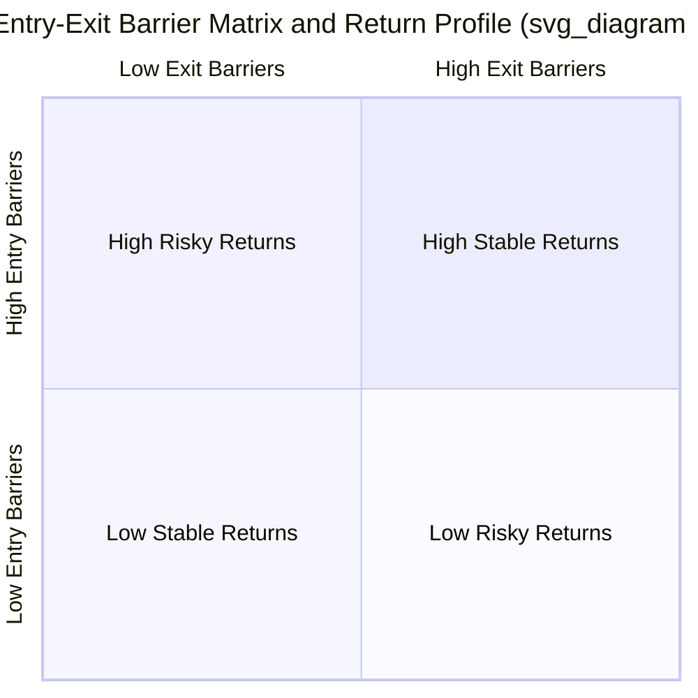
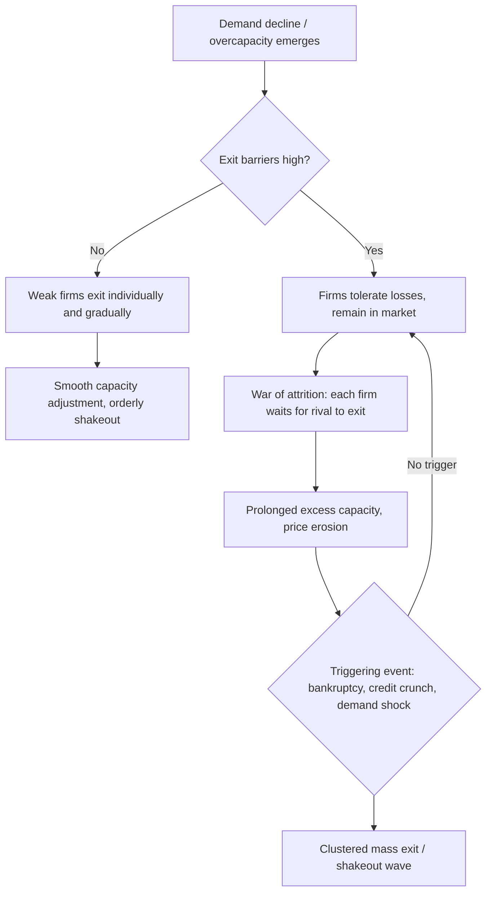
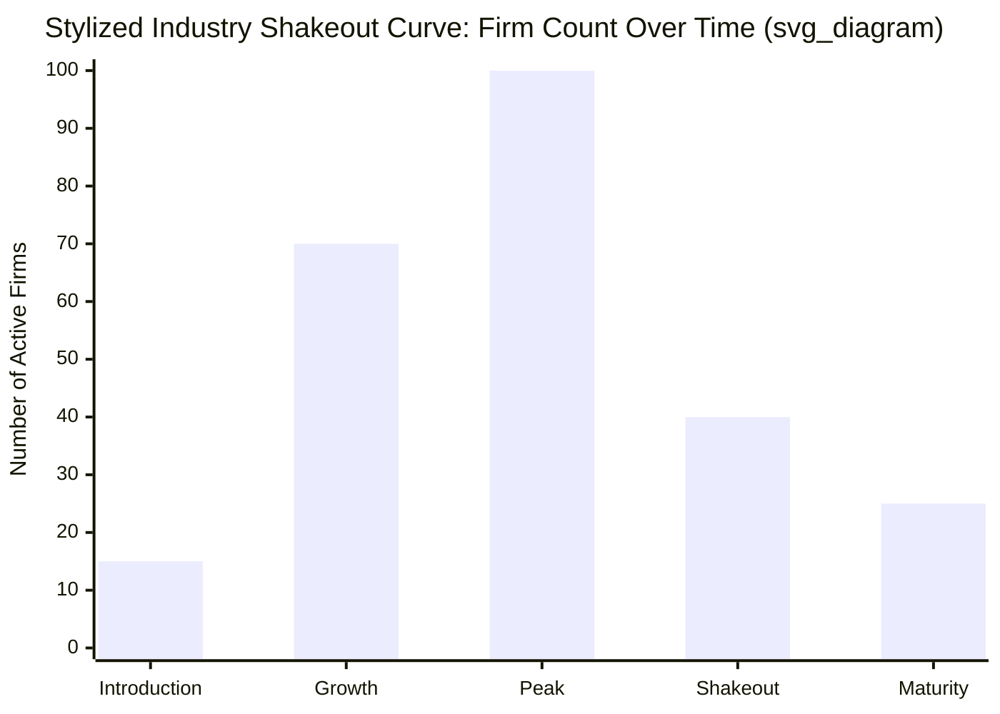

## Exit Barriers and Industry Shakeout Dynamics

### Definition and Conceptual Overview

Exit barriers are economic, legal, technical, or psychological factors that prevent or delay a firm's departure from an industry despite persistently poor performance, such as returns below the cost of capital. Industry shakeout refers to the historical pattern observed in many industries, particularly those following a product life cycle, in which a period of rapid firm entry is followed by a sharp, often abrupt, wave of exits and consolidation, causing the number of active producers to fall substantially from its peak.

These two concepts are structurally linked. Exit barriers determine the *speed and severity* of a shakeout: low exit barriers permit smooth, gradual attrition as weak firms depart individually, while high exit barriers cause distressed firms to remain in the market, intensifying price competition and delaying the shakeout until it manifests as a sudden, clustered wave of exits, bankruptcies, or acquisitions.

### Theoretical Foundation: The Exit Decision

A rational, value-maximizing firm should exit an industry when the present value of remaining is less than the present value of exiting (net of exit costs). Formally, a firm continues operating if:

$$PV(\text{continue}) > PV(\text{exit}) - C_{exit}$$

where $C_{exit}$ represents the exit costs (a positive cost reduces the attractiveness of exit, thus requiring a firm to tolerate worse continuing performance before it exits). Exit barriers operate precisely by inflating $C_{exit}$ or by making $PV(\text{continue})$ appear artificially higher than warranted by long-run fundamentals (e.g., due to sunk-cost fallacy reasoning).

A related short-run heuristic, adapted from Caves and Porter's structural approach to entry/exit barriers, is that a firm should exit if price is expected to remain below **average variable cost (AVC)** in the short run, since even shutting down entirely is preferable to operating at a loss on variable costs:

$$P < AVC \implies \text{shut down}$$

However, this shutdown rule addresses *operating* decisions, not full *exit* (liquidation of assets and departure from the industry), which is a separate, longer-run decision governed by exit barriers.

### Taxonomy of Exit Barriers

Exit barriers are typically classified into the following categories, following the framework popularized by Porter (1976, 1980) and Caves & Porter (1976).

#### 1. Durable and Specialized Assets (Asset Specificity)

- Physical capital with few alternative uses (e.g., blast furnaces, specialized chemical plants, offshore oil rigs) has low liquidation value relative to its value in current use.
- The gap between book value and salvage value creates a "sunk cost" that a firm forfeits upon exit, discouraging departure even when current operations are unprofitable.
- Asset specificity is often measured along three dimensions: site specificity, physical-asset specificity, and human-capital specificity (Williamson's transaction cost framework).

#### 2. Fixed Costs of Exit

- Labor-related costs: severance payments, pension obligations, and legally mandated redundancy costs.
- Contractual penalties: long-term supply contracts, lease obligations, or take-or-pay agreements that must be honored or bought out.
- Environmental remediation and decommissioning costs (e.g., mine reclamation, nuclear plant decommissioning, oil rig removal).

#### 3. Strategic Interrelationships (Corporate Strategic Barriers)

- Exit from one business unit may damage a firm's image, distribution relationships, or shared facilities used by other, related business units (economies of scope in reverse — "exit diseconomies").
- Vertical integration: exiting an upstream stage may jeopardize supply security for downstream operations within the same firm.

#### 4. Government and Social Barriers

- Political pressure to preserve employment in a region ("plant closing" resistance), particularly for large employers in single-industry towns.
- Regulatory requirements mandating continued service (e.g., utilities, common carriers) or requiring lengthy closure notice periods and approval processes.
- National security or strategic industry considerations (e.g., defense manufacturing, domestic steel production) that invite government intervention to prevent exit.

#### 5. Managerial and Psychological Barriers

- Emotional attachment of founders or long-tenured managers to the business.
- Managerial pride, reputational concerns, or fear of career damage associated with presiding over a failure/closure.
- Escalation of commitment / sunk-cost fallacy: decision-makers weight past (sunk) investment when it should be irrelevant to the forward-looking exit decision.

#### 6. Information Barriers

- Uncertainty about whether poor performance is a temporary industry downturn or a permanent structural decline, leading firms to "wait and see" rather than exit prematurely.
- Asymmetric information about competitors' intentions creates a coordination problem (see Whitehead's "war of attrition" model below).

**Key Points**

- Exit barriers are the mirror image of entry barriers but are not necessarily symmetric — an industry can have low entry barriers (easy to join) and high exit barriers (hard to leave) simultaneously, which is a particularly unstable combination.
- High exit barriers combined with high entry barriers produce industries prone to chronic excess capacity and low average profitability (a common characterization of heavy/capital-intensive manufacturing).
- Exit barriers primarily affect *long-run* structural adjustment; they do not prevent short-run output cuts or temporary shutdowns.

### Exit Barriers and Industry Profitability: The Structural Link

Porter's Five Forces framework treats exit barriers as a direct determinant of the intensity of rivalry. The combined effect of entry and exit barriers on industry profitability and risk is commonly summarized in a two-by-two matrix:

|  | **Low Exit Barriers** | **High Exit Barriers** |
| --- | --- | --- |
| **Low Entry Barriers** | Low, stable returns | Low, risky returns |
| **High Entry Barriers** | High, stable returns | High, risky returns |

The logic: high exit barriers keep capacity in the market even when demand falls, since unprofitable competitors cannot easily leave. This sustained excess capacity depresses prices and returns for *all* firms in the industry, including otherwise healthy ones — a negative externality imposed by the trapped firms on the rest of the industry.

### The Economics of Delayed Exit: Excess Capacity and Price Wars

When exit barriers are high, an industry facing negative demand shock (or entry-driven overcapacity) does not clear through firm departures. Instead:

1. Firms with high exit barriers rationally continue producing as long as $P \geq AVC$, even while earning economic losses on fixed/sunk costs.
2. This sustained output keeps industry supply above the level consistent with normal profits.
3. Prices are driven down toward marginal/variable cost, a phenomenon sometimes termed "destructive competition" or "ruinous competition" in mature, capital-intensive industries.
4. The eventual resolution requires either (a) demand recovery, (b) capacity-reduction coordination (mergers, joint exit agreements — often complicated by antitrust concerns), or (c) a triggering event (bankruptcy, credit crunch) that forces exit despite high barriers.

**Example**

Global steelmaking and dry-bulk shipping are archetypal cases: highly durable, single-purpose assets (blast furnaces, bulk carriers) combined with strategic/political reluctance to close plants generate multi-year periods of global overcapacity and depressed profitability, even after demand growth has clearly slowed [Inference: specific magnitude and duration figures vary by cycle and are not fixed structural constants].

### Game-Theoretic Models of Exit: The War of Attrition

A central theoretical puzzle is: in a declining industry with excess capacity, *which* firm exits first? Because the first mover to exit confers a benefit on remaining rivals (higher post-exit prices/market share) without capturing that benefit itself, firms have an incentive to wait for a rival to exit first — a classic **war of attrition** game (Fudenberg & Tirole, Ghemawat & Nalebuff).

Key predictions of the war-of-attrition framework in declining industries:

- **Asymmetric capacity**: The firm with the largest scale/lowest costs (or largest sunk-cost commitment) tends to be the one that stays, since it can sustain losses longer or has more to gain from rivals' exit; the smallest/highest-cost firms tend to exit first (Ghemawat–Nalebuff, 1985, on declining industries with lumpy capacity).
- **Under uncertainty about rivals' costs or resolve**, exit can be inefficiently delayed by *all* firms simultaneously, since each firm gambles that its rival will capitulate first — a coordination failure that leads to slower-than-optimal industry contraction.
- **Multiple equilibria** are possible: which firm "wins" the war of attrition (i.e., survives) may depend on private information, reputation, financial strength, or even seemingly irrelevant historical factors (path dependence).

$$\pi_i(t) = -c_i \quad \text{for } t < T_j, \quad \text{where firm } i \text{ exits at } T_i = \min(T_i^*, T_j)$$

Here, each firm $i$ incurs a flow loss $c_i$ while waiting for rival $j$ to exit at time $T_j$; the firm's optimal exit time $T_i^*$ balances the cost of continued waiting against the option value of potentially outlasting the rival and inheriting monopoly-like rents.

### Industry Shakeout Dynamics and the Product Life Cycle

The shakeout phenomenon is most systematically documented in the industrial organization literature on the evolution of new industries, notably by Steven Klepper and collaborators, studying industries such as automobiles, tires, televisions, and penicillin.

#### Empirical Pattern

1. **Entry phase**: Following a product innovation, the number of firms in an industry rises rapidly as entrepreneurs and diversifying firms rush to capture rents from the new market.
2. **Peak**: The firm count reaches a maximum, often coinciding with market growth beginning to decelerate and with the emergence of a **dominant design** — a de facto standard product architecture that reduces the value of further product-variety experimentation (Utterback & Abernathy's dominant design concept).
3. **Shakeout phase**: The number of firms declines sharply and often monotonically thereafter, sometimes falling by 50–75% from peak within a relatively short window, even as industry output continues to grow.
4. **Maturity**: The industry stabilizes at a lower, often oligopolistic, firm count that can persist for decades.

#### Klepper's Explanation: Innovation, Scale, and Firm Heterogeneity

Klepper's (1996) technological-change model attributes the shakeout to an evolving trade-off between product innovation and process innovation over the industry life cycle:

- Early on, firms compete primarily through **product innovation**, and small scale is not a major disadvantage since demand for product variants is fragmented.
- As a dominant design emerges, competitive advantage shifts toward **process innovation** (cost reduction) and manufacturing scale economies.
- Larger, earlier-entering firms accumulate more R&D experience and scale advantages, progressively widening the cost gap with smaller/later entrants.
- Firms unable to achieve minimum efficient scale or keep pace with process-cost reductions become unprofitable and are forced out, producing the shakeout — even though industry demand may still be expanding at the time.

**Key Points**

- Shakeouts are not necessarily driven by demand *decline*; they classically occur even during continued output growth, because per-firm viable scale is rising faster than the market as a whole.
- Order of entry matters: Klepper's empirical work finds early entrants (pioneers) into an industry tend to have systematically higher survival rates and larger eventual scale than later entrants, a pattern linked to accumulated learning and pre-emptive scale investment.
- The dominant design is the pivotal inflection point: before it emerges, product diversity provides refuge for small firms; after it emerges, undifferentiated cost competition punishes subscale producers.

### Interaction Between Exit Barriers and Shakeout Severity

The two concepts combine to determine the *shape* of the shakeout curve:

| Exit Barrier Level | Shakeout Pattern |
| --- | --- |
| Low | Gradual, continuous decline in firm count; smooth transition to mature oligopoly |
| High | Firm count plateaus artificially above the "efficient" level for an extended period, followed by a sudden, compressed wave of bankruptcies/consolidation once a shock (recession, credit crunch, regulatory change) removes the ability of marginal firms to keep operating |
| Very high (e.g., state-owned or politically protected firms) | Shakeout may be indefinitely postponed, producing chronic industry-wide overcapacity and subnormal returns (a documented pattern in state-supported heavy industry) |

This gives rise to what is sometimes called the "sudden death" vs. "slow bleed" distinction in applied industry studies: industries with low exit barriers exhibit slow, continuous attrition, while those with high exit barriers exhibit long periods of stagnant firm counts punctuated by sharp, discrete drops.

### Exit Mechanisms

Firms facing exit pressure choose among several exit modes, which differ in cost and reversibility:

1. **Liquidation/Bankruptcy**: Complete cessation of operations and asset sale; highest-cost, most visible form of exit, typically a last resort when other options are foreclosed.
2. **Divestiture/Sale as a going concern**: Selling the business unit to another operator (often a competitor engaging in horizontal consolidation), preserving some asset value and often the least costly exit route when a strategic buyer exists.
3. **Harvest strategy**: Gradual withdrawal of investment while continuing to operate and extract residual cash flows, a slower, less abrupt form of exit common when switching/exit costs are moderate.
4. **Capacity reduction short of full exit**: Partial exit — closing specific plants or product lines while remaining in the broader industry, often used by diversified firms to reduce exposure without a full corporate exit.
5. **Government-assisted exit / managed decline**: Industry-wide capacity-reduction schemes, sometimes coordinated through trade associations or government programs (e.g., historical EU steel and shipbuilding capacity-reduction schemes), used specifically because high exit barriers and coordination failures prevent private, decentralized exit.

### Empirical Measurement Approaches

Applied industrial organization research measures exit barriers and shakeout dynamics using proxies such as:

- **Asset specificity proxies**: ratio of specialized/customized capital to total capital, resale market thinness (secondary market bid-ask spreads for used equipment).
- **Sunk cost ratios**: sunk capital expenditure as a share of total assets; industries with high advertising/R&D intensity often have particularly high sunk-cost ratios.
- **Exit rate regressions**: firm-level survival/hazard models (e.g., Cox proportional hazards) regressing exit probability on firm size, age, capital intensity, and industry-level demand growth, testing whether high asset specificity or capital intensity reduces exit hazard controlling for profitability.
- **Firm-count time series**: tracking the number of active producers in an industry from introduction onward to identify peak firm count and subsequent shakeout timing and magnitude (the standard Klepper-style methodology, often using historical trade directories or patent-based industry databases).

### Policy and Strategic Implications

- **Antitrust considerations**: Coordinated capacity-reduction or "exit cartels," while potentially welfare-improving by accelerating an efficient shakeout, raise competition-law concerns because they may also serve as a vehicle for collusive price coordination; most jurisdictions treat capacity-reduction agreements with heightened antitrust scrutiny.
- **Bankruptcy law design**: The generosity or speed of a jurisdiction's insolvency regime functions as an exit-barrier variable at the macro level — legal systems that make liquidation slow, costly, or politically fraught (e.g., extensive employee-protection litigation) mechanically raise effective exit barriers economy-wide.
- **Corporate strategy**: Firms operating in industries anticipated to enter a shakeout phase should assess their own exit-barrier exposure (asset specificity, contractual lock-in) *before* entry, since the ex-ante decision to invest in specialized vs. redeployable assets directly determines the firm's later strategic flexibility.
- **Managerial decision bias correction**: Because escalation of commitment is a well-documented behavioral bias, firms often build in formal "pre-commitment" exit triggers (e.g., automatic divestiture review if ROIC remains below a threshold for $n$ consecutive years) to counteract the tendency to over-persist [Inference: the specific efficacy of such pre-commitment devices is context-dependent and not uniformly validated across firms].

### Illustrative Diagram: Exit Barrier Sources

<svg xmlns="http://www.w3.org/2000/svg" viewBox="0 0 800 420" font-family="Arial, sans-serif">
<text x="400" y="30" text-anchor="middle" font-size="18" font-weight="bold" fill="#1a1a1a">Sources of Exit Barriers (svg_diagram)</text>
<circle cx="400" cy="220" r="70" fill="#2c5f7c" opacity="0.9" />
<text x="400" y="215" text-anchor="middle" font-size="14" fill="#ffffff" font-weight="bold">Exit</text>
<text x="400" y="233" text-anchor="middle" font-size="14" fill="#ffffff" font-weight="bold">Barrier</text>
<line x1="400" y1="150" x2="400" y2="70" stroke="#555555" stroke-width="2" />
<rect x="290" y="20" width="220" height="55" rx="8" fill="#e8f0f5" stroke="#2c5f7c" stroke-width="1.5" />
<text x="400" y="42" text-anchor="middle" font-size="12" font-weight="bold" fill="#1a1a1a">Asset Specificity</text>
<text x="400" y="60" text-anchor="middle" font-size="11" fill="#333333">Low liquidation value</text>
<line x1="460" y1="175" x2="600" y2="115" stroke="#555555" stroke-width="2" />
<rect x="580" y="80" width="200" height="55" rx="8" fill="#e8f0f5" stroke="#2c5f7c" stroke-width="1.5" />
<text x="680" y="102" text-anchor="middle" font-size="12" font-weight="bold" fill="#1a1a1a">Fixed Exit Costs</text>
<text x="680" y="120" text-anchor="middle" font-size="11" fill="#333333">Severance, penalties</text>
<line x1="470" y1="220" x2="600" y2="220" stroke="#555555" stroke-width="2" />
<rect x="600" y="192" width="180" height="55" rx="8" fill="#e8f0f5" stroke="#2c5f7c" stroke-width="1.5" />
<text x="690" y="214" text-anchor="middle" font-size="12" font-weight="bold" fill="#1a1a1a">Strategic Links</text>
<text x="690" y="232" text-anchor="middle" font-size="11" fill="#333333">Shared assets/scope</text>
<line x1="460" y1="265" x2="600" y2="325" stroke="#555555" stroke-width="2" />
<rect x="580" y="330" width="200" height="55" rx="8" fill="#e8f0f5" stroke="#2c5f7c" stroke-width="1.5" />
<text x="680" y="352" text-anchor="middle" font-size="12" font-weight="bold" fill="#1a1a1a">Govt / Social</text>
<text x="680" y="370" text-anchor="middle" font-size="11" fill="#333333">Regulation, politics</text>
<line x1="340" y1="265" x2="200" y2="325" stroke="#555555" stroke-width="2" />
<rect x="20" y="330" width="200" height="55" rx="8" fill="#e8f0f5" stroke="#2c5f7c" stroke-width="1.5" />
<text x="120" y="352" text-anchor="middle" font-size="12" font-weight="bold" fill="#1a1a1a">Managerial/Psych.</text>
<text x="120" y="370" text-anchor="middle" font-size="11" fill="#333333">Sunk-cost fallacy</text>
<line x1="340" y1="220" x2="200" y2="220" stroke="#555555" stroke-width="2" />
<rect x="20" y="192" width="180" height="55" rx="8" fill="#e8f0f5" stroke="#2c5f7c" stroke-width="1.5" />
<text x="110" y="214" text-anchor="middle" font-size="12" font-weight="bold" fill="#1a1a1a">Information</text>
<text x="110" y="232" text-anchor="middle" font-size="11" fill="#333333">Uncertainty, coordination</text>
<line x1="340" y1="175" x2="200" y2="115" stroke="#555555" stroke-width="2" />
<rect x="20" y="80" width="200" height="55" rx="8" fill="#e8f0f5" stroke="#2c5f7c" stroke-width="1.5" />
<text x="120" y="102" text-anchor="middle" font-size="12" font-weight="bold" fill="#1a1a1a">Corporate Ties</text>
<text x="120" y="120" text-anchor="middle" font-size="11" fill="#333333">Vertical integration</text>
</svg>

### Numerical Illustration: Exit Threshold with Sunk Costs

Consider a firm evaluating whether to exit an industry. Let annual operating loss (before considering exit costs) be $L = \$5\text{M}$ per year, expected to persist for the foreseeable future, and let the discount rate be $r = 10\%$. Ignoring exit costs, the present value of continuing indefinitely is:

$$PV(\text{continue}) = -\frac{L}{r} = -\frac{5}{0.10} = -\$50\text{M}$$

If the exit cost (severance, contract penalties, remediation) is $C_{exit} = \$30\text{M}$, the firm exits only if:

$$-C_{exit} > -\frac{L}{r} \implies -30 > -50$$

This holds, so exit is efficient here ($-\$30\text{M}$ is a smaller loss than $-\$50\text{M}$). However, if exit costs instead were $C_{exit} = \$60\text{M}$ (e.g., due to heavy decommissioning obligations), the firm would rationally continue operating at a loss indefinitely, since $-60 < -50$ — a direct numerical illustration of how sufficiently high exit barriers can trap a firm in a value-destroying but individually rational holding pattern. [Inference: this simplified perpetuity framework abstracts from demand recovery, real-option value of waiting, and refinancing constraints, all of which affect real-world exit timing.]

### Related Topics

- Entry deterrence strategies and limit pricing
- Sunk costs versus fixed costs in market structure theory
- Contestable markets theory and hit-and-run entry
- Minimum efficient scale (MES) and its role in survivor analysis
- Product life cycle theory and dominant design (Utterback-Abernathy model)
- Mergers and acquisitions as an exit/consolidation mechanism
- Bankruptcy law and its effect on industry dynamics
- Capacity investment games and Cournot competition under demand uncertainty
- War of attrition models in economics and evolutionary game theory
- Industry evolution empirics (Klepper's work on automobiles, tires, and other industries)
- Real options theory applied to exit and abandonment decisions
- Government industrial policy: managed decline and capacity-reduction schemes