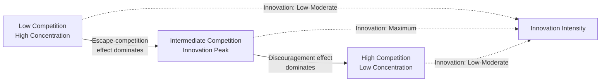

## Market Structure and Incentives to Innovate

### Overview

Market structure — the number and size distribution of firms, entry conditions, product differentiation, and information availability — shapes the incentives firms face to invest in research and development (R&D). This topic sits at the intersection of industrial organization and innovation economics, addressing a central question: does competition promote or discourage innovation? The theoretical and empirical answer is nuanced, non-monotonic, and depends heavily on industry-specific characteristics such as technological opportunity, appropriability conditions, and cumulativeness of knowledge.

### Foundational Debate: Schumpeter vs. Arrow

**Schumpeterian Hypothesis**

Joseph Schumpeter argued that large firms with market power are more conducive to innovation than small, competitive firms. His reasoning rested on several mechanisms:

- Large firms can better exploit **economies of scale and scope** in R&D, spreading fixed costs of research facilities across greater output.
- Market power generates the **retained earnings** necessary to internally finance risky, long-gestation R&D projects, especially where external capital markets are imperfect (credit constraints, information asymmetries).
- Ex-post monopoly rents from successful innovation are the **reward** that justifies the R&D investment — perfect competition dissipates these rents too quickly.
- Large firms can better manage a **portfolio of R&D projects**, diversifying risk across many uncertain research lines.

This is often summarized as the "Schumpeterian hypothesis": firm size and market concentration are positively associated with innovative activity.

**Arrow's Replacement Effect**

Kenneth Arrow (1962) provided a formal counter-argument. Consider a firm that can adopt a cost-reducing innovation:

- A **monopolist** already earns pre-innovation monopoly profit $\pi_m$. Post-innovation, it earns a higher monopoly profit $\pi_m'$. Its incremental gain from innovating is $\pi_m' - \pi_m$.
- A firm in **perfect competition** earns zero pre-innovation profit. If it innovates (and can protect the innovation, e.g., via a drastic enough cost reduction to become a monopolist), its incremental gain is the full new monopoly profit $\pi_m' - 0$.

Because the competitive firm is "replacing" a zero-profit state, its incentive to innovate is *larger* than the monopolist's incentive, which is only replacing its own already-substantial profit stream with a somewhat higher one. This is the **replacement effect** (or Arrow effect): a monopolist has a private incentive to innovate that is smaller than the social value of the innovation, because innovating partially cannibalizes its own existing rents.

$$\Delta \pi_{\text{monopolist}} = \pi_m' - \pi_m \quad < \quad \Delta \pi_{\text{competitor}} = \pi_m' - 0$$

**Key Points**

- Schumpeter: market power → more R&D (finance, scale, appropriability channels)
- Arrow: market power → less R&D incentive (replacement effect, cannibalization of own rents)
- Both mechanisms are theoretically valid; which dominates depends on parameters like drasticness of innovation, patent protection, and entry threats

### The Inverted-U Relationship (Aghion et al.)

Empirical work in the 1980s–1990s found mixed and often weak or non-monotonic relationships between concentration and R&D intensity, motivating a more sophisticated theoretical synthesis. Philippe Aghion, together with Bloom, Blundell, Griffith, and Howitt (2005), developed a model reconciling Schumpeter and Arrow via an **inverted-U relationship** between competition and innovation.

**Mechanism: Escape-Competition vs. Schumpeterian (Discouragement) Effect**

The model considers industries composed of sectors with "neck-and-neck" firms (similar technological levels) and sectors with a technological leader and laggard.

- **Escape-competition effect**: In neck-and-neck sectors, higher competition (lower profits from remaining unequal-technology) increases the incremental profit from innovating and pulling ahead of a rival. Firms innovate to escape the intensified competitive pressure, so *more* competition → *more* innovation.
- **Schumpeterian (discouragement) effect**: In sectors where one firm is already the leader, higher competition reduces the laggard's incentive to innovate and catch up, because post-catch-up profits are also competed away. Here *more* competition → *less* innovation.

At **low levels of competition**, industries are mostly composed of firms with large technology gaps (leaders far ahead of laggards), so the discouragement effect dominates weakly and the escape-competition effect dominates strongly as competition rises from very low levels — innovation increases with competition.

At **high levels of competition**, industries endogenously evolve toward more neck-and-neck sectors becoming asymmetric or firms giving up entirely on catch-up, so the discouragement effect begins to dominate — innovation decreases with further competition.

The result is an **inverted-U shape**: innovation (measured by patents or R&D intensity) rises then falls as product market competition increases, with a theoretical peak at intermediate competition levels. This was empirically validated in Aghion et al. (2005) using UK panel data on industries, employing patent counts and a firm/industry-level competition proxy (one minus the Lerner index, adjusted).

### Formal Model Sketch: Patent Race and Rent Dissipation

A standard patent-race framework illustrates how market structure interacts with R&D investment intensity. Suppose $n$ symmetric firms compete for a single innovation worth prize $V$ (the present value of post-innovation profit flow). Each firm $i$ chooses R&D expenditure $x_i$, and the probability firm $i$ wins is:

$$p_i = \frac{x_i}{\sum_{j=1}^{n} x_j}$$

Each firm maximizes expected profit:

$$\max_{x_i} \; p_i V - x_i = \frac{x_i}{\sum_j x_j} V - x_i$$

Solving the symmetric Nash equilibrium (where $x_i = x$ for all $i$) via the first-order condition yields:

$$x^* = \frac{(n-1)}{n^2} V$$

Aggregate industry R&D spending is:

$$X^* = n x^* = \frac{(n-1)}{n} V$$

**[Inference]** This stylized result shows aggregate R&D rising with the number of competitors (more rent-dissipating competition for the same prize) but each individual firm's spending eventually falling as $n$ grows large, since $\partial x^*/\partial n < 0$ for sufficiently large $n$. This is a standard qualitative feature of simple patent-race/rent-seeking-contest models; exact functional forms and comparative statics are sensitive to model specification (e.g., whether R&D affects win probability linearly, whether there is uncertainty over rival cost functions, and whether the race is winner-take-all or allows shared innovation).

**Key Points**

- Total industry R&D can rise with more competitors even while incentive per firm concentrates on smaller individual expected payoffs (business-stealing/rent dissipation)
- This is distinct from, but complementary to, the Aghion-style step-by-step innovation model above
- Excessive entry into a patent race can lead to **social over-investment** in R&D (duplicative research effort) relative to the social planner's optimum, since firms do not internalize the negative externality they impose on rivals' win probability

### Determinants of Appropriability and Their Interaction with Market Structure

The incentive to innovate is not purely a function of market concentration; it also depends on the firm's ability to **appropriate** the returns to innovation. Key determinants include:

**Patent protection and strength of intellectual property rights**

- Strong patents raise the ex-post monopoly rent $\pi_m'$ available to an innovator, increasing incentives regardless of market structure, but the fine-grained effect interacts with structure: patents matter more for competitive-fringe entrants (who have no alternative appropriation mechanism) than for incumbents who may rely on complementary assets, lead time, or trade secrecy.
- The "drastic" vs. "non-drastic" innovation distinction (Arrow, and later formalized in IO texts such as Tirole's *The Theory of Industrial Organization*) matters here: a **drastic innovation** reduces costs enough that the innovator can set the unconstrained monopoly price without fear of competitive entry from old-technology rivals, while a **non-drastic innovation** is constrained by limit pricing against rivals still using the old technology.

**Spillovers and appropriability regime**

- Weak appropriability (high knowledge spillovers to rivals) reduces private incentives to invest even when social returns are high, generating an argument for public R&D subsidies or patent protection.
- Industries with strong tacit knowledge, complex products, or fast-moving technology frontiers (Teece's appropriability regime framework) show different innovate-vs-imitate dynamics independent of raw market concentration.

**Cumulativeness and technological opportunity**

- In "cumulative" technology regimes (semiconductors, pharmaceuticals), today's innovation success predicts tomorrow's, potentially entrenching a leader's advantage — this interacts with the persistence-of-monopoly literature (Gilbert and Newbery, 1982) discussed below.
- High technological opportunity (many low-hanging discoveries available) can sustain high innovation rates across a wide range of market structures, sometimes swamping the competition effect.

### Persistence of Monopoly and Preemptive Patenting

Gilbert and Newbery (1982) extended Arrow's analysis by incorporating **strategic patent races between an incumbent monopolist and a potential entrant**. Their key result reverses part of Arrow's conclusion under competitive bidding for patents:

- An incumbent monopolist may be willing to spend *more* than a potential entrant to acquire a patent, even though the entrant's post-innovation profit gain is larger in a "profit-replacement" sense.
- This is because the incumbent's payoff from acquiring the patent includes not just the value of the new technology, but the **avoided loss** of being displaced from monopoly by the entrant. The incumbent effectively bids up to the full value of maintaining its monopoly position, which can exceed the entrant's willingness to pay.
- This generates a theory of **persistent monopoly through preemptive patenting**: incumbents patent defensively/preemptively not necessarily to use the technology immediately, but to prevent rivals from acquiring it and eroding the incumbent's position.

**[Unverified]** The empirical magnitude of preemptive patenting behavior varies substantially across industries and has been debated in the patent-thicket and strategic-patenting literature; whether it fully overturns Arrow's replacement effect in practice depends on auction mechanism design, credit constraints on entrants, and the entrant's outside option.

### Firm Size and R&D: Empirical Regularities

**Key Points**

- R&D intensity (R&D spending / sales) often rises with firm size up to a point, then plateaus or even declines — not a strictly monotonic Schumpeterian relationship.
- Large firms tend to dominate incremental, process-oriented innovation and hold more patents in aggregate; small firms and new entrants are disproportionately responsible for radical, discontinuous innovations in many industries (a stylized fact associated with work by Zoltan Acs and David Audretsch).
- The relationship between concentration and innovation output (not just input/spending) is confounded by reverse causality: successful innovation itself often *causes* increased concentration (a dynamic "innovation races to dominance" pattern), making cross-sectional concentration-innovation correlations difficult to interpret causally.
- Studies using panel data and instrumental variables (e.g., trade liberalization shocks as exogenous competition shocks) are generally considered more credible for identifying the causal competition→innovation relationship than pure cross-sectional concentration regressions.

### Market Structure Taxonomy and Innovation Incentive Summary

| Market Structure | Typical Innovation Incentive Channel | Net Effect (Stylized) |
| --- | --- | --- |
| Perfect competition | High incremental incentive (replacement effect strong); but poor appropriability, financing constraints, free-rider problems in dissemination | Often **under-invested** in basic/risky R&D absent IP protection |
| Monopolistic competition | Moderate — product differentiation offers some appropriability via brand/variety | Moderate innovation, often incremental/product-variety innovation |
| Oligopoly (moderate concentration) | Escape-competition effects strong among neck-and-neck rivals; strategic rivalry incentivizes preemption | Often **highest observed innovation intensity** (consistent with inverted-U peak) |
| Monopoly | Replacement effect strong (Arrow); but scale/scope economies and financing advantages (Schumpeter); persistence-of-monopoly motive (Gilbert-Newbery) for defensive patenting | Ambiguous — can be high (defensive/entrenchment R&D) or low (complacency, absent entry threat) |

### Policy Implications

- **Antitrust and innovation trade-off**: Competition authorities historically focused on static price effects of concentration; the inverted-U insight implies mergers that push an industry away from the innovation-maximizing intermediate competition level (in either direction) carry dynamic efficiency costs beyond standard static deadweight loss analysis.
- **Patent policy design**: Patent breadth and length should, in principle, be calibrated to the appropriability needs of a given technological/market context — broader/longer patents raise $\pi_m'$ appropriately in weak-appropriability sectors but risk entrenching incumbents in cumulative-innovation sectors (blocking follow-on innovation, per Scotchmer's "standing on shoulders" analysis).
- **R&D subsidies and tax credits**: Justified where social returns to R&D exceed private returns due to spillovers — a market-structure-independent rationale for public intervention, though the *optimal size* of subsidy interacts with market structure (e.g., subsidies to entrants may be more effective at counteracting the replacement effect than subsidies to incumbents).
- **Entry policy**: Because potential entry itself can discipline complacent incumbents (contestable markets logic, Baumol), policies lowering entry barriers can raise innovation incentives even without changing existing firm counts.

### Illustrative Example

Consider a pharmaceutical market with a single incumbent drug therapy earning $\pi_m$ per period. A generic entrant race for a next-generation therapy has the following (stylized) features:

- If the innovation is **drastic** (new therapy fully displaces old, negligible therapeutic gain from old drug and negligible cross-price constraint), the entrant's incentive is $\pi_m'$ (the full new monopoly profit), while the incumbent's incremental incentive is only $\pi_m' - \pi_m$ — consistent with Arrow, favoring entrant-led radical innovation.
- If the incumbent additionally faces the **threat of losing existing market share entirely** to the entrant absent a patent acquisition (Gilbert-Newbery logic), the incumbent's true valuation of pre-emptively acquiring the innovation rises to include the avoided loss of $\pi_m$, potentially exceeding the entrant's bid and leading the incumbent to out-bid the entrant for licensing rights or acquire the entrant outright — a commonly observed pattern in pharmaceutical "killer acquisitions."

**[Inference]** The "killer acquisition" phenomenon documented empirically in pharmaceutical markets (Cunningham, Ederer, Ma, 2021) is broadly consistent with the Gilbert-Newbery preemption logic, though the original empirical study frames it primarily around eliminating a competing R&D project rather than a strict patent-race bidding model; treat the direct mapping as illustrative rather than a literal test of the Gilbert-Newbery model.

### Related Topics

- Patent races and rent dissipation in R&D contests
- Appropriability regimes and the economics of trade secrecy vs. patenting
- Cumulative innovation and patent thickets
- Contestable markets theory (Baumol, Panzar, Willig) and its relation to innovation incentives
- Killer acquisitions and merger review standards for innovation effects
- Optimal patent breadth and length (Gilbert-Shapiro; Klemperer)
- Spillovers, absorptive capacity, and R&D cooperation/joint ventures (research joint venture antitrust exemptions)
- Schumpeterian growth models and creative destruction (Aghion-Howitt endogenous growth theory)