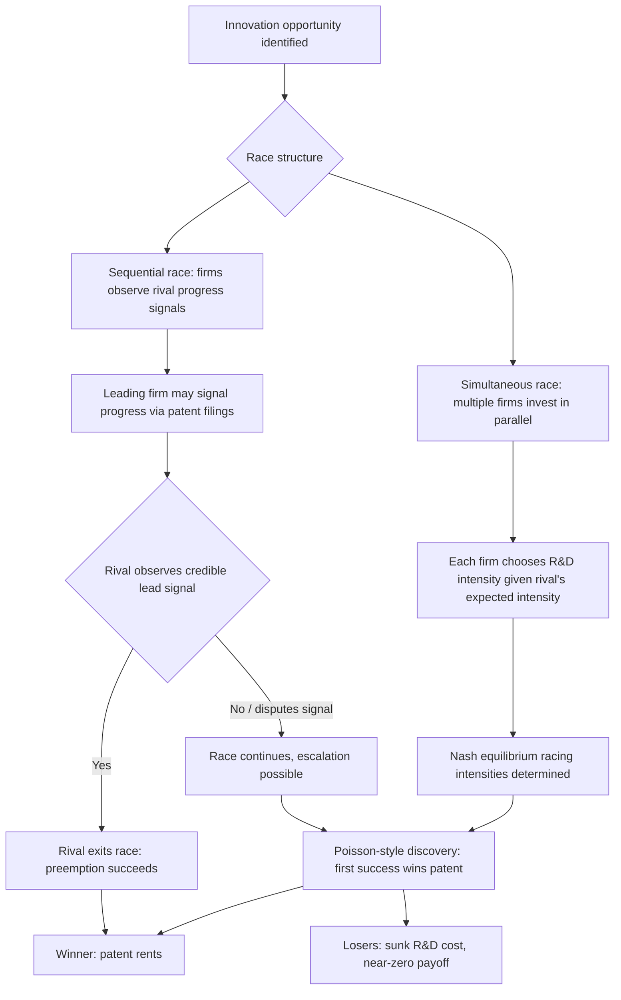

## Patent Races and Preemptive Innovation

### Definition and Core Concept

A patent race describes a competitive dynamic in which multiple firms invest in R&D to be the first to develop and patent an innovation, where the winner secures exclusive legal rights to the invention (via patent protection) and the losers typically recover little or nothing from their R&D expenditure. This "winner-take-all" structure — sometimes called the **patent system's tournament character** — creates distinctive strategic incentives that differ sharply from cooperative or non-exclusive innovation environments.

**Preemptive innovation** refers to a firm's strategic acceleration or over-investment in R&D specifically to prevent rivals from being first to market or first to patent, thereby preserving or extending market power. Firms may engage in preemptive R&D not necessarily because the innovation is independently profitable at that pace, but because the *value of being first* (patent protection, market foreclosure, reputation, network effects) exceeds the cost of racing.

### Theoretical Foundations

#### The Winner-Take-All Structure

Patents confer **exclusivity**: the successful innovator can exclude rivals from using the invention for the patent's statutory term (typically 20 years from filing in most jurisdictions, subject to renewal fees and enforcement). This creates a discontinuous payoff structure:

$$\pi_{winner} = V(patent) \quad ; \quad \pi_{loser} \approx -C_{R\&D}$$

where $V(patent)$ is the discounted value of monopoly rents from the patent, and $C_{R\&D}$ is the sunk R&D expenditure of the losing firm(s), typically unrecoverable. This all-or-nothing payoff distinguishes patent races from most economic competition, where partial success yields partial reward.

#### Core Models

**1. Loury (1979) and Lee-Wilde (1980) — Stochastic Racing Models**

These models treat the timing of innovation as a random (stochastic) process whose *hazard rate* (instantaneous probability of success) depends on the firm's R&D investment/effort. Key results:

- Firms choose R&D intensity to maximize expected discounted profit, trading off the probability of winning against the cost of investment.
- In symmetric equilibrium, competition can lead to either **more or less** aggregate R&D than the socially optimal level, depending on model assumptions (this is a genuinely contested result in the literature — see "Overinvestment versus Underinvestment" below).

**2. Reinganum (1981, 1983) — Preemption and Replacement Effect**

Reinganum's model distinguishes between:

- An **incumbent monopolist**, who already earns monopoly profits from an existing product/process.
- A **potential entrant**, who earns nothing until winning the race.

The key finding is the **replacement effect** (also called the Arrow replacement effect, building on Kenneth Arrow's 1962 insight): an incumbent has a *weaker* incentive to innovate than an entrant, because succeeding merely *replaces* the incumbent's own existing monopoly profit stream with a new one, whereas an entrant moves from zero profit to positive profit. This implies incumbents may under-invest relative to challengers in some settings — a result that appears to contradict simple "preemption" intuition and is a key tension in the literature (see below).

**3. Gilbert and Newbery (1982) — Preemptive Patenting**

Gilbert and Newbery directly challenge the replacement effect's generality by showing that an incumbent monopolist may have a *stronger* incentive than an entrant to win a patent race, specifically to **preempt** entry and preserve monopoly power. This is the foundational "efficiency effect" or **preemption effect**:

- If the incumbent loses the race, it faces competition (duopoly or loss of monopoly), which destroys a large amount of the incumbent's existing rents.
- If the incumbent wins, it maintains monopoly (now based on the new patent) and denies the entrant any foothold.
- The incumbent is therefore willing to spend up to the full value of *preserving monopoly rents* (not just the value of the new innovation alone) to win the race — an amount that can exceed what any single entrant is willing to spend, since the entrant only stands to gain (not lose) from the race outcome.

This is often summarized as: **"the incumbent has more to lose than the entrant has to gain,"** leading the incumbent to rationally overspend/preempt.

#### Reconciling Reinganum and Gilbert-Newbery

The apparent contradiction between the replacement effect (favoring entrant investment) and the efficiency/preemption effect (favoring incumbent investment) is generally reconciled as follows:

| Effect | Direction | Mechanism |
| --- | --- | --- |
| Replacement effect (Arrow) | Reduces incumbent's incentive | Innovating cannibalizes/replaces the incumbent's own existing profit stream |
| Efficiency/preemption effect (Gilbert-Newbery) | Increases incumbent's incentive | Losing the race to an entrant destroys the incumbent's monopoly entirely; winning preserves it |

Which effect dominates depends on model specifics: the persistence of the patent, whether the innovation is "drastic" (completely displacing old technology) or "non-drastic," the degree of product market competition post-entry, and the length/certainty of the patent race. [Inference: this reconciliation is the standard synthesis presented in IO textbooks (e.g., Tirole, Church & Ware) but the *relative magnitude* of each effect is model- and parameter-dependent, not a universal ranking.]

### Preemptive Innovation Strategy in Practice

Preemptive innovation manifests through several related strategic behaviors:

#### 1. R&D Racing Speed-Up ("Overtaking")

Firms accelerate development timelines beyond what pure cost-minimization would dictate, sacrificing efficiency for speed, because being second in a winner-take-all race yields near-zero payoff.

#### 2. Patent Thickets and Portfolio Racing

Firms file large numbers of related patents (not just the "core" invention) to block rivals from patenting around the primary innovation — sometimes called a **patent thicket** — raising the cost for competitors to design around the patent or enter adjacent innovation space.

#### 3. Sleeping Patents

An incumbent may patent an invention purely to prevent a rival from doing so, without any intention of commercializing it immediately — a defensive/preemptive use of the patent system rather than a market-entry strategy.

#### 4. Preemptive Product Announcements ("Vaporware")

Related to patent racing but distinct: firms announce products before completion to discourage rival R&D investment by signaling that the market will soon be preempted, reducing the rival's expected payoff from continuing its own race.

### Formal Model Sketch: Simple Patent Race with Poisson Discovery

Consider two firms racing to patent an innovation. Let firm $i$ choose R&D flow rate $x_i$ (investment per unit time), which generates a Poisson "arrival rate" of discovery $h(x_i)$, with $h' > 0$, $h'' < 0$ (diminishing returns to R&D intensity).

The probability firm $i$ wins by time $t$, given both firms race continuously, follows:

$$P_i(\text{win by } t) = \frac{h(x_i)}{h(x_i) + h(x_j)}\left(1 - e^{-[h(x_i)+h(x_j)]t}\right)$$

Each firm chooses $x_i$ to maximize:

$$\max_{x_i} \; \frac{h(x_i)}{h(x_i)+h(x_j)} \cdot V - x_i \cdot \frac{1}{r}$$

where $V$ is the discounted value of winning (patent value, possibly inclusive of preempted monopoly rents per Gilbert-Newbery) and $r$ is the discount/cost rate. The first-order condition yields each firm's best-response R&D intensity as a function of the rival's intensity, generating a Nash equilibrium race intensity. [Inference: this is a standard stylized simplification of Loury/Lee-Wilde/Reinganum-style continuous-time racing models; specific functional forms vary substantially across the literature.]

#### Diagram: Patent Race Payoff Structure (svg_diagram)

<svg xmlns="http://www.w3.org/2000/svg" viewBox="0 0 700 420">
<text x="350" y="25" text-anchor="middle" font-size="16" font-weight="bold" fill="#1a1a1a">Patent Race: Winner-Take-All Payoff Structure (svg_diagram)</text>

<rect x="60" y="70" width="220" height="80" rx="8" fill="#dbeafe" stroke="#2563eb" stroke-width="2" />
<text x="170" y="100" text-anchor="middle" font-size="13" font-weight="bold">Firm A</text>
<text x="170" y="120" text-anchor="middle" font-size="11">R&amp;D spend: C_A</text>
<text x="170" y="138" text-anchor="middle" font-size="11">Hazard rate: h(x_A)</text>

<rect x="420" y="70" width="220" height="80" rx="8" fill="#fee2e2" stroke="#dc2626" stroke-width="2" />
<text x="530" y="100" text-anchor="middle" font-size="13" font-weight="bold">Firm B</text>
<text x="530" y="120" text-anchor="middle" font-size="11">R&amp;D spend: C_B</text>
<text x="530" y="138" text-anchor="middle" font-size="11">Hazard rate: h(x_B)</text>

<line x1="280" y1="110" x2="420" y2="110" stroke="#666" stroke-width="1.5" stroke-dasharray="4,3" />
<text x="350" y="105" text-anchor="middle" font-size="10" fill="#666">racing</text>

<rect x="60" y="220" width="220" height="140" rx="8" fill="#bbf7d0" stroke="#059669" stroke-width="2" />
<text x="170" y="245" text-anchor="middle" font-size="13" font-weight="bold">If A wins</text>
<text x="170" y="268" text-anchor="middle" font-size="11">A: gets patent V(patent)</text>
<text x="170" y="286" text-anchor="middle" font-size="11">A: recovers R&amp;D + monopoly rents</text>
<text x="170" y="308" text-anchor="middle" font-size="11" fill="#dc2626">B: loses C_B entirely</text>
<text x="170" y="326" text-anchor="middle" font-size="11" fill="#dc2626">B: no patent, no recovery</text>

<rect x="420" y="220" width="220" height="140" rx="8" fill="#fecaca" stroke="#dc2626" stroke-width="2" />
<text x="530" y="245" text-anchor="middle" font-size="13" font-weight="bold">If B wins</text>
<text x="530" y="268" text-anchor="middle" font-size="11">B: gets patent V(patent)</text>
<text x="530" y="286" text-anchor="middle" font-size="11">B: recovers R&amp;D + monopoly rents</text>
<text x="530" y="308" text-anchor="middle" font-size="11" fill="#dc2626">A: loses C_A entirely</text>
<text x="530" y="326" text-anchor="middle" font-size="11" fill="#dc2626">A: no patent, no recovery</text>
<line x1="170" y1="150" x2="170" y2="220" stroke="#059669" stroke-width="1.5" />
<line x1="530" y1="150" x2="530" y2="220" stroke="#dc2626" stroke-width="1.5" />

<text x="350" y="400" text-anchor="middle" font-size="11" fill="#555" font-style="italic">Discontinuous payoff: no partial reward for "second place" innovation</text>

</svg>

### Overinvestment versus Underinvestment: The Social Efficiency Question

Whether patent races produce socially excessive or insufficient R&D is a central and unresolved question in the literature, with results depending heavily on model assumptions:

**Arguments for social overinvestment (racing/rent-dissipation view)**:

- Duplication of effort: multiple firms independently pursue the same innovation, and only one's effort is ultimately "useful" from a technology-diffusion standpoint — the losers' R&D spending is privately wasted (though it may generate some spillover knowledge).
- Firms race purely for the private prize (patent monopoly rents) rather than the social value of earlier innovation, and if the private prize value exceeds the social value gained from speeding up discovery, the equilibrium level of aggregate R&D exceeds the social optimum.
- This connects to models of **rent-seeking/contest theory** (Tullock-style contests), where the sum of participants' spending can approach or exceed the value of the prize itself in equilibrium under certain parameterizations.

**Arguments for social underinvestment (appropriability view)**:

- Firms cannot fully capture the social surplus generated by innovation (consumer surplus, spillovers to other firms/industries), so private R&D incentives fall short of the socially optimal level even accounting for racing dynamics.
- Patent protection itself is imperfect (limited duration, invent-around risk, disclosure requirements), further reducing appropriable returns relative to social value.

**Resolution**: Most modern treatments (e.g., Tirole's *The Theory of Industrial Organization*) conclude that the direction of inefficiency is **ambiguous in general** and depends on: (a) the elasticity of the hazard rate with respect to R&D spending, (b) the extent of cost duplication versus knowledge spillovers between racing firms, (c) whether the innovation is drastic or non-drastic, and (d) the patent's breadth and length. [Inference: this ambiguity is the mainstream position in the modern IO literature; it is not resolved by consensus into a single "overinvestment" or "underinvestment" verdict.]

### Sequential vs. Simultaneous Patent Races (Mermaid)

### Empirical and Real-World Illustrations

- **Pharmaceutical R&D races**: Firms developing treatments for the same disease target frequently race for regulatory approval and patent filing priority, given the high fixed cost of clinical trials and the "winner-take-most" nature of first-to-market drug approval combined with patent exclusivity.
- **Semiconductor and technology patent races**: Historical races (e.g., early LCD, LED lighting, and various telecommunications standard-essential-patent contests) illustrate preemptive patenting behavior, including strategic filing of broad or defensive patent portfolios.
- **Standard-setting races**: In network industries, firms may race not just to invent but to have their technology adopted as an industry standard, where the preemption effect is amplified by network externalities (first-mover advantage compounds beyond the patent itself).

[Unverified: specific firm-level examples and magnitudes vary by industry and time period and are illustrative rather than drawn from a specific empirical study cited here.]

### Policy Implications

1. **Patent breadth and length**: Broader or longer patents increase the prize value $V$, which can intensify racing incentives (potentially exacerbating overinvestment) while also increasing the appropriable return to genuine innovation (potentially correcting underinvestment) — a fundamental policy trade-off with no universally optimal setting.
2. **First-to-file vs. first-to-invent systems**: The shift (e.g., under the U.S. America Invents Act, effective 2013) to a first-to-file system sharpens the winner-take-all timing incentive relative to first-to-invent regimes, intensifying preemptive racing behavior around filing dates specifically (rather than actual discovery dates). [Fact — this is a documented change in U.S. patent law; behavioral consequences for racing intensity are theoretically predicted but empirically debated.]
3. **Patent pools and cross-licensing**: Policy mechanisms that reduce the winner-take-all severity (e.g., mandatory licensing, patent pools in standard-essential-patent contexts) can reduce wasteful preemptive racing by softening the all-or-nothing payoff structure.
4. **Antitrust scrutiny of preemptive patenting**: Sleeping patents and defensive patent thickets can raise antitrust concerns when used primarily to foreclose competition rather than to protect genuine innovation, though proving anticompetitive intent versus legitimate IP protection is often difficult in practice.

### Related Topics

- The Arrow replacement effect and incumbent vs. entrant innovation incentives
- Gilbert-Newbery efficiency effect and preemptive patenting
- Patent breadth, length, and optimal patent design
- Patent thickets, patent pools, and standard-essential patents (SEPs)
- Drastic versus non-drastic innovation in IO models
- Contest theory and rent-dissipation in R&D competition
- Sleeping patents and defensive IP strategy
- First-mover advantage and network externalities in innovation races
- Spillovers, knowledge diffusion, and the social value of R&D duplication