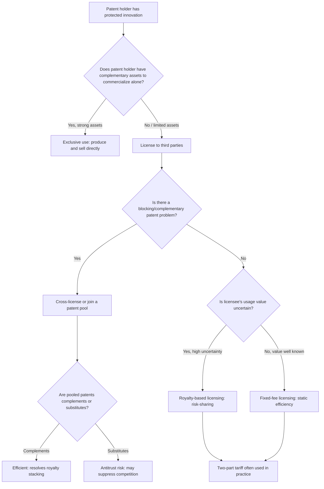

## Patent Design, Breadth, and Licensing

### Definition and Core Concept

Patent design refers to the set of policy parameters that define the scope and duration of a patent grant — chiefly **patent length** (how long protection lasts), **patent breadth** (how broad a range of related products/processes the patent covers, and how much "distance" a rival must maintain to avoid infringement), and **patent height** (the minimum inventive step required to qualify for a patent). Together, these parameters determine how much market power a patent confers and for how long, directly shaping the innovator's incentive to invest in R&D. **Licensing** refers to the mechanisms by which patent holders permit other firms to use the protected technology in exchange for compensation, transforming the patent from a pure exclusion right into an instrument for disseminating and monetizing innovation.

The central economic problem addressed by patent design theory is the **fundamental trade-off in intellectual property policy**: broader/longer patents increase the reward to innovators (encouraging more R&D investment) but also increase the static deadweight loss from monopoly pricing and restrict follow-on innovation and diffusion. Optimal patent design seeks to balance dynamic efficiency (incentivizing innovation) against static and dynamic costs (monopoly distortion, blocked follow-on innovation).

### Theoretical Foundations

#### Patent Length

**Patent length** is the number of years of legal protection granted (most jurisdictions, including the U.S. under TRIPS-compliant law, set this at **20 years from the filing date**). The foundational economic treatment is Nordhaus (1969), who modeled the **optimal patent life** as a trade-off:

- Longer patent life → greater cumulative monopoly profit → **greater incentive** to invest in R&D.
- Longer patent life → longer period of monopoly deadweight loss → **greater static welfare cost**.

Nordhaus's key result is that there exists a **finite optimal patent length** $T^*$ that maximizes the discounted sum of (increased innovation value) minus (accumulated monopoly deadweight loss), and this optimal length is generally **shorter than infinite** but also generally **greater than zero** (since zero protection eliminates the innovation incentive). The optimal $T^*$ depends on:

- The elasticity of R&D investment/cost-reduction with respect to expected patent profit (how responsive innovation is to reward size).
- The demand elasticity in the product market (how large the static deadweight loss is at any given markup).
- The discount rate (how much future monopoly profit is valued today).

$$T^* = \arg\max_T \; \left[ \int_0^T \pi_{monopoly}(t) \, e^{-rt} dt - DWL_{static} \right] \text{ subject to R\&D incentive constraints}$$

#### Patent Breadth

**Patent breadth** (formalized primarily by Klemperer, 1990, and Gilbert and Shapiro, 1990) refers to how much legal protection a patent provides against *related but non-identical* products or processes — i.e., how far a competitor must differentiate their product to avoid infringement. Broader patents:

- Prevent "invent-around" strategies, where rivals make small modifications to escape infringement while still competing closely with the patented product.
- Increase the patent holder's effective market power at any given moment (a broader patent commands closer to full monopoly pricing over a wider product space).

**Gilbert-Shapiro (1990) — Breadth vs. Length trade-off**: Gilbert and Shapiro argue that, under certain conditions (particularly when the patent holder can freely choose product pricing), **patent breadth should be minimized and patent length adjusted instead** to deliver a given level of reward to the innovator, because breadth generates *deadweight loss without corresponding innovation-relevant benefit* once the monopolist is already able to set the profit-maximizing price. In their framework, the innovator's reward is best delivered through **duration** (time) rather than **breadth** (scope), because breadth creates cross-market distortions (blocking related but distinct products) that duration does not.

**Klemperer (1990) — The opposing case**: Klemperer shows that the Gilbert-Shapiro result depends critically on assumptions about consumer preferences and demand structure. When products are highly differentiated and substitution patterns are more complex (not simply the same product priced across space), the optimal combination can favor **broad-and-short** patents over **narrow-and-long** ones, because breadth can sometimes reduce the total deadweight loss triangle relative to extending monopoly duration, depending on the shape of demand.

**Synthesis**: The Gilbert-Shapiro/Klemperer literature establishes that **there is no universally dominant combination of length and breadth** — the welfare-optimal patent design depends on demand elasticities, degree of product differentiation, and the cost structure of imitation/invention-around behavior. This ambiguity is the standard modern conclusion in patent design theory. [Inference: this synthesis reflects the mainstream treatment in graduate IO texts (e.g., Tirole, Scotchmer); it is not a claim that the literature has converged on one "correct" breadth-length combination for all cases.]

#### Patent Height (Novelty/Non-Obviousness Threshold)

**Patent height** refers to the minimum inventive step (novelty, non-obviousness) required for an innovation to qualify for patent protection. This is a distinct policy lever from breadth and length:

- A **low height** (easy-to-obtain patents) encourages many incremental patents but risks **patent thickets** — dense, overlapping webs of patent rights that raise transaction costs for follow-on innovators who must negotiate with numerous patent holders to commercialize a product.
- A **high height** (strict inventive-step requirements) reduces the number of patents granted, concentrating rewards on more significant innovations, but risks under-rewarding valuable incremental/cumulative innovation, which is empirically the dominant mode of technical progress in many industries.

#### Diagram: The Three Dimensions of Patent Design (svg_diagram)

<svg xmlns="http://www.w3.org/2000/svg" viewBox="0 0 700 420">
<text x="350" y="25" text-anchor="middle" font-size="16" font-weight="bold" fill="#1a1a1a">Three Dimensions of Patent Design (svg_diagram)</text>
<rect x="60" y="70" width="180" height="130" rx="8" fill="#dbeafe" stroke="#2563eb" stroke-width="2" />
<text x="150" y="100" text-anchor="middle" font-size="13" font-weight="bold">Length</text>
<text x="150" y="122" text-anchor="middle" font-size="10">Duration of protection</text>
<text x="150" y="140" text-anchor="middle" font-size="10">(e.g., 20 years from filing)</text>
<text x="150" y="165" text-anchor="middle" font-size="10" fill="#2563eb">Nordhaus (1969)</text>
<rect x="260" y="70" width="180" height="130" rx="8" fill="#bbf7d0" stroke="#059669" stroke-width="2" />
<text x="350" y="100" text-anchor="middle" font-size="13" font-weight="bold">Breadth</text>
<text x="350" y="122" text-anchor="middle" font-size="10">Scope against related</text>
<text x="350" y="138" text-anchor="middle" font-size="10">products/invent-around</text>
<text x="350" y="165" text-anchor="middle" font-size="10" fill="#059669">Gilbert-Shapiro (1990),</text>
<text x="350" y="180" text-anchor="middle" font-size="10" fill="#059669">Klemperer (1990)</text>
<rect x="460" y="70" width="180" height="130" rx="8" fill="#fef3c7" stroke="#d97706" stroke-width="2" />
<text x="550" y="100" text-anchor="middle" font-size="13" font-weight="bold">Height</text>
<text x="550" y="122" text-anchor="middle" font-size="10">Non-obviousness /</text>
<text x="550" y="138" text-anchor="middle" font-size="10">novelty threshold</text>
<text x="550" y="165" text-anchor="middle" font-size="10" fill="#d97706">Patent thicket risk</text>
<text x="550" y="180" text-anchor="middle" font-size="10" fill="#d97706">at low height</text>
<rect x="180" y="260" width="340" height="110" rx="8" fill="#f3e8ff" stroke="#7c3aed" stroke-width="2" />
<text x="350" y="288" text-anchor="middle" font-size="13" font-weight="bold">Trade-off</text>
<text x="350" y="312" text-anchor="middle" font-size="11">Innovation incentive (reward)</text>
<text x="350" y="330" text-anchor="middle" font-size="11">vs.</text>
<text x="350" y="348" text-anchor="middle" font-size="11">Static + follow-on deadweight loss</text>
<line x1="150" y1="200" x2="280" y2="260" stroke="#666" stroke-width="1.5" />
<line x1="350" y1="200" x2="350" y2="260" stroke="#666" stroke-width="1.5" />
<line x1="550" y1="200" x2="420" y2="260" stroke="#666" stroke-width="1.5" />
</svg>

### Cumulative Innovation and Sequential Patents

Much real-world innovation is **cumulative** — later innovations build on earlier patented ones (e.g., pharmaceutical follow-on compounds, software built on patented protocols, biotechnology research tools). This raises the **Scotchmer (1991) "standing on the shoulders of giants" problem**:

- If the first inventor's patent is too broad or too strong, follow-on innovators have insufficient incentive or ability to improve upon the technology, since most of the value accrues to the pioneer.
- If the first inventor's patent is too weak, the pioneer under-invests because they cannot capture returns from enabling follow-on innovation that builds on their work.
- Suzanne Scotchmer's analysis shows that **efficient outcomes generally require some mechanism of reward-sharing between sequential innovators** — commonly achieved through licensing, since pure "first-inventor-takes-all" or "second-inventor-takes-all" patent rules both generate inefficiencies in dynamic settings with cumulative innovation.

This cumulative-innovation problem is a central justification for the licensing mechanisms discussed below: licensing allows the patent system to function even when innovation is sequential/cumulative rather than a single discrete event.

### Patent Licensing: Mechanisms and Economics

#### Why License Rather Than Simply Exclude?

A patent holder faces a fundamental choice: exclude all rivals and produce/sell the innovation exclusively (maximizing the "monopoly" model), or license the technology to others in exchange for payment. Licensing is economically rational when:

1. The patent holder lacks complementary assets (manufacturing capacity, distribution, marketing) to fully exploit the market alone.
2. Licensing to multiple downstream users **expands total output/market size** beyond what the patent holder alone could serve, increasing total surplus that can be shared via licensing fees.
3. Cross-licensing resolves **blocking patent** situations, where the patent holder's own product may infringe on a rival's complementary patent (common in technology sectors with dense, overlapping patent landscapes).
4. Licensing revenue provides a return on R&D without requiring the innovator to build downstream production/distribution capability from scratch.

#### Licensing Contract Structures

**1. Fixed-Fee (Lump-Sum) Licensing**

The licensee pays a single upfront fee for the right to use the patented technology, regardless of subsequent output or profit.

- Efficient from a *static* production standpoint: the licensee's marginal cost of production is unaffected by the fee, so output/pricing decisions are not distorted at the margin.
- Risk: the licensor cannot easily capture upside if the licensee's use of the technology turns out to be more valuable than anticipated (unless the fee is set optimally ex ante, which requires accurate information the licensor may lack).

**2. Royalty (Per-Unit or Ad Valorem) Licensing**

The licensee pays the licensor a royalty per unit produced/sold (per-unit royalty) or as a percentage of revenue (ad valorem royalty).

- Introduces a **double marginalization problem**: the royalty effectively raises the licensee's marginal cost, causing the licensee to reduce output/raise price beyond what a single vertically integrated firm would choose, generating additional deadweight loss beyond the patent monopoly itself.
- Preferred by licensors when they face **information asymmetry** about the true value of the licensee's use of the technology, since royalties tie payment to realized output/revenue, providing a natural risk-sharing and information-revelation mechanism.

**3. Two-Part Tariffs (Fixed Fee + Royalty)**

Combines an upfront fee with a per-unit royalty, allowing the licensor to extract surplus through the fixed component while using the royalty component for risk-sharing/incentive purposes — a common real-world compromise.

**4. Cross-Licensing**

Two or more firms holding complementary or overlapping patents grant each other reciprocal licenses, often without direct monetary payment (or with a net "balancing" payment), primarily to avoid **blocking patent litigation** and enable both parties to operate freely. Common in industries with dense patent landscapes (semiconductors, telecommunications).

**5. Patent Pools**

Multiple patent holders (often holding complementary patents essential to a technology standard) combine their patents into a single licensing entity, offering a bundled license to third parties. Patent pools:

- Reduce **transaction costs** for licensees who would otherwise need to negotiate separately with each patent holder.
- Mitigate the **Cournot complements problem** (also called "royalty stacking" or the "tragedy of the anticommons"): when multiple complementary patents are required to produce a single product, and each patent holder independently sets royalties without regard to the others, the *cumulative* royalty burden exceeds what a single joint patent holder would charge, over-restricting output relative to even the standard monopoly outcome.
- Raise potential **antitrust concerns** when pools include substitute (competing) patents rather than purely complementary ones, since bundling substitutes can suppress competition between alternative technologies rather than merely reducing transaction costs.

#### The Royalty Stacking / Complements Problem (Formal Intuition)

If a final product requires $n$ complementary patented inputs, each licensed independently by a separate patent holder charging royalty $r_i$, and each patent holder sets $r_i$ to maximize its own profit without internalizing the effect on the other $n-1$ royalties, the total royalty burden $\sum r_i$ exceeds the joint-profit-maximizing (single-owner) royalty. This mirrors the classic **Cournot complementary monopoly** problem: multiple independent monopolists of complementary goods each impose a markup without accounting for the fact that a higher markup by any one of them reduces demand (and thus profit) for all the others, leading to a cumulative price/royalty higher than a coordinated monopolist would ever charge. Patent pools directly solve this by internalizing the externality across all pool members.

### Compulsory Licensing

**Compulsory licensing** is a policy mechanism (permitted under the TRIPS Agreement, Article 31, and various national patent laws) whereby a government can authorize the use of a patented invention without the patent holder's consent, typically in exchange for statutorily determined compensation, under specified circumstances such as:

- Public health emergencies (most prominently, compulsory licensing of pharmaceuticals for HIV/AIDS treatment and other public health crises in developing countries).
- National emergency or extreme urgency.
- Anti-competitive practices by the patent holder (as a remedy).
- Government use for public non-commercial purposes.

Compulsory licensing represents a direct policy intervention into the length/breadth trade-off: it effectively narrows the patent holder's exclusion right in specific circumstances, trading reduced innovator reward against increased access/diffusion, and is one of the most contentious areas of international IP policy given the tension between innovation incentives (largely benefiting firms in higher-income countries) and access to essential technologies (particularly medicines) in lower-income countries.

### Licensing Strategy Flow (Mermaid)

### Optimal Patent Policy: Synthesis

The modern theoretical consensus (synthesizing Nordhaus, Gilbert-Shapiro, Klemperer, and Scotchmer) treats patent length, breadth, and licensing rules as **jointly determined policy instruments**, not independent choices:

- **Length and breadth together** determine the total reward available to an innovator; the *specific combination* that minimizes deadweight loss for a given reward level depends on demand-side conditions (elasticity, differentiation) that vary by industry, meaning a "one-size-fits-all" patent term/breadth is unlikely to be optimal across all technology sectors.
- **Licensing rules** (voluntary vs. compulsory, permissiveness of pooling, cross-licensing norms) determine how efficiently the *given* patent reward is transmitted through the economy, and can substantially mitigate — but not eliminate — the static and follow-on innovation costs of strong patent protection.
- **Cumulative innovation settings** generally require weaker "pioneer" patents or robust licensing/reward-sharing norms to avoid stifling follow-on innovation, relative to settings with discrete, one-off innovations.

### Related Topics

- Nordhaus's optimal patent length model
- Gilbert-Shapiro and Klemperer models of patent breadth
- Scotchmer's cumulative innovation and sequential patent theory
- Patent thickets and the tragedy of the anticommons
- Royalty stacking and the Cournot complementary monopoly problem
- Patent pools, standard-essential patents (SEPs), and FRAND licensing commitments
- Compulsory licensing and TRIPS Article 31
- Patent races and preemptive innovation (contrast: race dynamics vs. design/licensing of the resulting patent)
- Antitrust treatment of patent pooling and cross-licensing arrangements