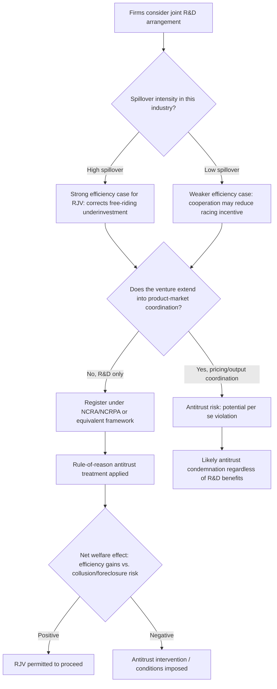

## Research Joint Ventures and Cooperative Innovation

### Definition and Core Concept

A research joint venture (RJV) is a formal arrangement in which two or more firms — often competitors in the same product market — jointly fund, conduct, or share the results of research and development activity, while typically continuing to compete independently in downstream production and sales. **Cooperative innovation** is the broader category encompassing RJVs alongside other collaborative arrangements such as R&D consortia, cooperative agreements, technology-sharing alliances, and publicly sponsored collaborative research programs.

The central economic rationale for RJVs rests on addressing two classic sources of market failure in R&D: (1) the **duplication of R&D effort** inherent in independent, uncoordinated racing behavior, and (2) the **positive externalities (spillovers)** of R&D that firms cannot fully appropriate individually, which cause private R&D investment to fall short of the socially optimal level when firms innovate independently.

### Theoretical Foundations

#### The d'Aspremont-Jacquemin (1988) Framework

The canonical formal model of RJVs is d'Aspremont and Jacquemin's two-stage duopoly model, which remains the foundational reference point in this literature. The model has two key features:

**Stage 1 (R&D investment)**: Firms choose R&D spending, which reduces their marginal cost of production. R&D generates a **spillover effect**: a portion $\beta \in [0,1]$ of each firm's R&D-driven cost reduction is automatically available to the rival firm, even without cooperation (via imitation, reverse engineering, labor mobility, publication, etc.). The parameter $\beta$ measures spillover intensity, from $\beta = 0$ (no spillover, fully appropriable) to $\beta = 1$ (perfect spillover, all R&D fully shared regardless of cooperation).

**Stage 2 (Product market competition)**: Firms compete in quantities (Cournot) or prices, given the marginal costs determined in stage 1.

The model compares four regimes:

1. **Non-cooperative R&D, non-cooperative product market** — firms independently choose R&D and independently compete; no coordination at either stage.
2. **Cooperative R&D, non-cooperative product market (RJV)** — firms jointly choose R&D levels (internalizing the spillover externality) but continue to compete independently in the product market. This is the canonical "research joint venture" case.
3. **Non-cooperative R&D, cooperative product market** — firms compete independently in R&D but collude in the product market (a cartel with independent R&D) — analytically useful as a comparison case, though it corresponds to illegal price-fixing in most jurisdictions.
4. **Full cooperation** — firms coordinate both R&D and product market decisions (a full cartel with joint R&D) — also generally illegal under antitrust law for the product-market component, but useful as a theoretical benchmark.

#### Key Result: RJVs Increase R&D When Spillovers Are High

The central finding of the d'Aspremont-Jacquemin framework is that **cooperative R&D (regime 2) tends to increase aggregate R&D investment relative to non-cooperative R&D (regime 1) when spillovers $\beta$ are sufficiently large**, because:

- Under non-cooperative R&D with high spillovers, each firm under-invests, since it knows a large share of its own R&D benefit will "leak" to its rival — this **free-riding disincentive** reduces individual R&D effort.
- Under cooperative R&D (an RJV), firms jointly internalize the spillover: since the venture captures the *combined* benefit of R&D regardless of which member firm "generates" it, the free-riding problem is eliminated, and joint R&D choice restores investment toward (and can exceed) the socially efficient level.
- At **low spillover levels**, however, cooperation may *reduce* R&D relative to independent racing, because firms lose the competitive "racing" incentive to out-innovate rivals when they coordinate rather than compete for individual advantage.

This yields the widely cited conclusion: **the case for permitting/encouraging RJVs is strongest specifically in industries with high knowledge spillovers**, where independent R&D would otherwise be systematically under-provided.

#### Formal Sketch

Let firm $i$'s cost reduction from its own R&D spending $x_i$ be $x_i$, and let each firm additionally benefit from spillover $\beta x_j$ from rival $j$'s R&D. Effective cost reduction for firm $i$:

$$\Delta c_i = x_i + \beta x_j$$

Under **non-cooperative R&D**, firm $i$ chooses $x_i$ to maximize its own profit, treating $x_j$ as given — it does not internalize the fact that its own R&D also benefits firm $j$ (a positive externality it does not capture), leading to underinvestment when $\beta$ is high.

Under **cooperative R&D**, the joint venture chooses $(x_i, x_j)$ to maximize *combined* profit, fully internalizing both the direct cost-reduction effect and the cross-firm spillover benefit — eliminating the free-riding externality that caused underinvestment.

### Types of Cooperative Innovation Arrangements

| Arrangement | Description | Product market status |
| --- | --- | --- |
| **Research joint venture (RJV)** | Formal joint entity/agreement for conducting R&D | Firms remain independent competitors downstream |
| **R&D consortium** | Broader multi-firm collaborative research program, often pre-competitive and government-supported | Typically many participants; focus on shared/basic research |
| **Cross-licensing agreement** | Reciprocal licensing of existing patents (not joint conduct of new research) | Independent competition continues |
| **Technology-sharing alliance** | Bilateral or multilateral agreement to share specific technical knowledge or platforms | Varies; can include downstream cooperation |
| **University-industry research partnership** | Firm(s) collaborate with academic institutions, often accessing basic research and talent pipelines | Firm competes independently downstream |
| **Publicly sponsored collaborative R&D program** | Government-funded or government-organized consortium (e.g., Sematech in the U.S. semiconductor industry) | Independent competition maintained; often designed explicitly around "pre-competitive" research |

#### Diagram: RJV Structure and Spillover Internalization (svg_diagram)

<svg viewBox="0 0 700 440" xmlns="http://www.w3.org/2000/svg">
<text x="350" y="25" text-anchor="middle" font-size="16" font-weight="bold" fill="#1a1a1a">Research Joint Venture: Spillover Internalization (svg_diagram)</text>

<text x="175" y="55" text-anchor="middle" font-size="13" font-weight="bold">Non-Cooperative R&D</text>

<rect x="60" y="70" width="120" height="80" rx="8" fill="`#dbeafe`" stroke="`#2563eb`" stroke-width="2"/>

<text x="120" y="100" text-anchor="middle" font-size="11">Firm A</text>

<text x="120" y="118" text-anchor="middle" font-size="10">chooses x_A alone</text>

<rect x="190" y="70" width="120" height="80" rx="8" fill="#fee2e2" stroke="#dc2626" stroke-width="2"/>
<text x="250" y="100" text-anchor="middle" font-size="11">Firm B</text>
<text x="250" y="118" text-anchor="middle" font-size="10">chooses x_B alone</text>
<path d="M 180 100 L 190 100" stroke="#999" stroke-width="1.5" stroke-dasharray="3,2" marker-end="url(#arrow2)"/>
<text x="185" y="90" text-anchor="middle" font-size="8" fill="#999">spillover β</text>

<text x="175" y="180" text-anchor="middle" font-size="10" fill="`#dc2626`" font-style="italic">Underinvestment when β is high:</text>

<text x="175" y="195" text-anchor="middle" font-size="10" fill="`#dc2626`" font-style="italic">firms don't capture rival's gain</text>

<text x="525" y="55" text-anchor="middle" font-size="13" font-weight="bold">Cooperative R&D (RJV)</text>

<rect x="410" y="70" width="230" height="90" rx="8" fill="`#bbf7d0`" stroke="`#059669`" stroke-width="2"/>

<text x="525" y="95" text-anchor="middle" font-size="11" font-weight="bold">Joint R&D Venture</text>

<text x="525" y="115" text-anchor="middle" font-size="10">Chooses (x_A, x_B) jointly</text>

<text x="525" y="132" text-anchor="middle" font-size="10">Internalizes both firms'</text>

<text x="525" y="148" text-anchor="middle" font-size="10">spillover benefits</text>

<line x1="470" y1="160" x2="470" y2="200" stroke="#059669" stroke-width="1.5"/>
<line x1="580" y1="160" x2="580" y2="200" stroke="#059669" stroke-width="1.5"/>
<rect x="410" y="200" width="105" height="60" rx="6" fill="#e0f2fe" stroke="#0284c7" stroke-width="1.5"/>
<text x="462" y="235" text-anchor="middle" font-size="10">Firm A produces</text>
<rect x="535" y="200" width="105" height="60" rx="6" fill="#e0f2fe" stroke="#0284c7" stroke-width="1.5"/>
<text x="587" y="235" text-anchor="middle" font-size="10">Firm B produces</text>

<text x="525" y="290" text-anchor="middle" font-size="10" fill="`#059669`" font-style="italic">Product market competition remains</text>

<text x="525" y="305" text-anchor="middle" font-size="10" fill="`#059669`" font-style="italic">independent (non-cooperative)</text>

<defs>
<marker id="arrow2" markerWidth="8" markerHeight="8" refX="6" refY="2" orient="auto">
<path d="M0,0 L0,4 L6,2 z" fill="#999"/>
</marker>
</defs>
</svg>

### Welfare Analysis: When Are RJVs Socially Beneficial?

#### Sources of Efficiency Gain

1. **Elimination of duplicative R&D**: Coordinated research avoids firms independently solving the same technical problem, freeing resources for a broader research agenda or cost savings.
2. **Internalization of spillover externalities**: As shown in the d'Aspremont-Jacquemin model, RJVs correct the free-riding underinvestment problem when spillovers are significant.
3. **Risk pooling and economies of scale/scope in R&D**: Joint ventures allow firms to pool financial resources and technical expertise, enabling large, capital-intensive, or high-risk research projects (e.g., basic research, long-horizon technology platforms) that no single firm might undertake alone.
4. **Standard-setting and interoperability benefits**: Cooperative research can facilitate the development of common technical standards, reducing coordination failures in network industries.

#### Sources of Welfare Concern

1. **Collusive spillover into product markets**: The central antitrust concern is that R&D cooperation may function as a **precursor or facilitating device for product-market collusion** — coordination on R&D can create repeated interaction, information-sharing channels, and mutual trust that spill over into tacit or explicit price/output coordination, even when the RJV is nominally restricted to research.
2. **Reduced innovation competition (racing incentive loss)**: At low spillover levels, cooperative R&D can *reduce* aggregate innovation effort relative to competitive racing, since part of the value of independent R&D competition is the "prize" motivation that cooperation dampens (connecting to patent-race literature).
3. **Foreclosure of non-member rivals**: RJVs among dominant firms in an industry can disadvantage smaller firms or new entrants excluded from the venture, potentially entrenching the market power of incumbent members.
4. **Reduced technological diversity**: Independent research paths increase the probability that at least one approach succeeds and generate variety in technical solutions; coordinated research may converge prematurely on a single technical trajectory, reducing the "parallel path" insurance value of independent R&D.

### Legal and Regulatory Treatment

#### U.S. National Cooperative Research Act (NCRA), 1984

In response to concerns that antitrust law (under a strict *per se* illegality standard for horizontal agreements) was excessively deterring beneficial RJVs — motivated in part by concerns about international competitiveness against foreign R&D consortia — the U.S. Congress passed the **National Cooperative Research Act of 1984**, later amended and expanded by the **National Cooperative Research and Production Act of 1993 (NCRPA)**. Key provisions:

- RJVs that register with the Department of Justice and Federal Trade Commission receive **rule-of-reason treatment** rather than *per se* illegality under antitrust law, meaning courts must weigh procompetitive R&D benefits against anticompetitive risks rather than automatically condemning horizontal cooperation.
- Registered RJVs that are later found to violate antitrust law face **single damages** (actual damages) rather than the **treble damages** standard applied to ordinary antitrust violations, substantially reducing the litigation risk of engaging in registered cooperative research.
- The 1993 amendment extended similar treatment to **joint production** ventures (not just joint research), recognizing that some cooperative innovation naturally extends into joint manufacturing of the resulting technology.

[Fact: the NCRA/NCRPA framework, its rule-of-reason treatment, and single-damages provision are documented features of U.S. antitrust law; specific case outcomes and enforcement patterns under the Act have varied and are not exhaustively covered here.]

#### EU Treatment: Research and Development Block Exemption Regulation

The European Union similarly provides more permissive antitrust treatment for R&D cooperation agreements under the **Research and Development Block Exemption Regulation** (adopted under Article 101(3) TFEU framework), which exempts qualifying R&D agreements from the general prohibition on anticompetitive agreements, subject to market-share thresholds and conditions ensuring the agreement remains focused on research (and, in some formulations, joint exploitation of results) rather than functioning as a vehicle for broader collusion. [Inference: the general structure (market-share-threshold-based block exemption for R&D agreements) reflects the standard EU competition law approach to horizontal cooperation agreements; specific threshold percentages and regulatory text are subject to periodic revision by the European Commission and should be verified against the current regulation for precise figures.]

### Empirical Examples

- **Sematech (U.S. semiconductor consortium, founded 1987)**: A prominent real-world example of a government-supported (initially DARPA co-funded) RJV among U.S. semiconductor manufacturers, formed explicitly in response to competitiveness concerns relative to Japanese semiconductor firms. Sematech focused on pre-competitive manufacturing process research shared among member firms, who continued to compete independently in chip production and sales.
- **Pharmaceutical pre-competitive consortia**: Various industry-wide collaborative research initiatives in biomedical research (e.g., shared genomic databases, pre-competitive target validation consortia) illustrate cooperative innovation focused on foundational/basic research stages, with firms reverting to independent competition at the drug-development and commercialization stages.
- **Automotive and battery technology alliances**: Joint ventures among automakers and battery manufacturers for shared R&D on electric vehicle technology platforms illustrate contemporary RJV dynamics in capital-intensive, high-spillover technology domains. [Unverified: specific contemporary alliance examples and their structures change frequently; illustrative only, not drawn from a specific verified current agreement.]

### RJV Formation and Antitrust Evaluation Flow (Mermaid)

### Distinguishing RJVs from Patent Races and Preemptive Innovation

RJVs represent a structurally distinct innovation environment from the winner-take-all patent race framework covered elsewhere in this chapter:

| Feature | Patent race (non-cooperative) | Research joint venture |
| --- | --- | --- |
| R&D coordination | None; firms independently race | Joint choice of R&D investment/direction |
| Payoff structure | Winner-take-all; losers recover little | Shared benefit among venture members |
| Duplication of effort | High (parallel independent research paths) | Reduced (coordinated research agenda) |
| Spillover treatment | Externality, typically not internalized | Internalized by joint decision-making |
| Antitrust treatment | Generally unproblematic (independent competition) | Requires case-by-case rule-of-reason scrutiny |
| Key risk | Potential social overinvestment via racing/rent dissipation | Potential underinvestment (lost racing incentive) or collusive spillover into pricing |

### Related Topics

- The d'Aspremont-Jacquemin spillover model and R&D cooperation regimes
- Free-riding and appropriability problems in independent R&D
- National Cooperative Research Act (NCRA) and rule-of-reason antitrust treatment
- EU Research and Development Block Exemption Regulation
- Patent races and preemptive innovation (contrast: competitive vs. cooperative R&D structures)
- Standard-setting organizations and pre-competitive collaboration
- Government-sponsored R&D consortia (e.g., Sematech-type models)
- Spillovers, knowledge diffusion, and the social value of R&D
- Antitrust treatment of horizontal agreements and the rule-of-reason standard