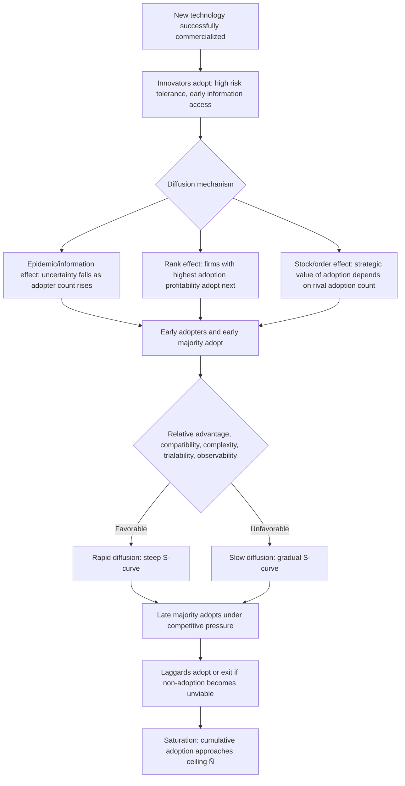

## Diffusion of Innovation Across an Industry

### Definition and Core Concept

Diffusion of innovation refers to the process by which a new technology, product, or production method spreads over time from its initial adopters throughout an industry (and, more broadly, throughout an economy). Unlike the *invention* of a technology (a discrete event) or its initial *innovation/commercialization* (the first successful market introduction), **diffusion** is fundamentally a dynamic process describing the *rate and pattern* at which the technology is subsequently adopted by other firms or consumers over time. In industrial economics, diffusion analysis is central to understanding how long it takes for productivity-enhancing innovations to generate their full economic impact, why adoption is typically gradual rather than instantaneous, and what firm- and industry-level characteristics accelerate or retard the spread of new technology.

### Theoretical Foundations

#### The S-Curve of Diffusion

The most widely documented empirical regularity in diffusion studies is the **S-shaped (sigmoid) diffusion curve**: cumulative adoption of an innovation over time typically follows a pattern of slow initial uptake, followed by accelerating adoption as the technology becomes more established, followed by a leveling-off as the pool of potential adopters is exhausted. This pattern was first rigorously documented in economics by **Zvi Griliches (1957)** in his classic study of hybrid corn adoption across U.S. states, and later generalized by **Edwin Mansfield (1961)** into a formal economic model of interfirm technology diffusion.

#### The Mansfield (1961) Epidemic Model

Mansfield's foundational model treats diffusion analogously to the spread of an epidemic/contagion: the probability that a non-adopting firm adopts the innovation in a given period increases with the **proportion of firms that have already adopted** (analogous to exposure/contagion in epidemiology), because adoption spreads through imitation, observation of adopters' success, information spillovers, and reduced uncertainty as more firms demonstrate the technology's viability. The core formal relationship:

$$\frac{dN(t)}{dt} = g \cdot N(t) \cdot \left[1 - \frac{N(t)}{\bar{N}}\right]$$

where $N(t)$ is the number (or proportion) of firms that have adopted by time $t$, $\bar{N}$ is the total eventual number of adopters (the "ceiling" or saturation level), and $g$ is a coefficient reflecting the speed of diffusion (often termed the "imitation coefficient"). This is the standard **logistic growth equation**, which generates the characteristic S-shaped cumulative adoption curve.

Mansfield's key empirical contribution was identifying the **determinants of the diffusion speed parameter $g$**, finding it to be positively related to:

- The **profitability** of the innovation relative to the technology it replaces (higher relative profitability accelerates adoption).
- The **size of investment required** to adopt (larger required investment slows diffusion, as the up-front cost creates a bigger barrier and payback-period considerations loom larger).
- Industry-specific factors affecting risk perception and information flow among firms in the same sector.

#### Diagram: The S-Curve of Technology Diffusion (svg_diagram)

<svg xmlns="http://www.w3.org/2000/svg" viewBox="0 0 700 420">
<text x="350" y="25" text-anchor="middle" font-size="16" font-weight="bold" fill="#1a1a1a">S-Curve of Industry-Wide Technology Diffusion (svg_diagram)</text>
<line x1="80" y1="360" x2="620" y2="360" stroke="#333" stroke-width="2" />
<line x1="80" y1="360" x2="80" y2="60" stroke="#333" stroke-width="2" />
<text x="630" y="365" font-size="12">Time</text>
<text x="30" y="55" font-size="12">Cumulative</text>
<text x="20" y="70" font-size="12">adopters</text>
<path d="M 100 350 C 200 345, 280 340, 330 260 S 450 90, 600 80" stroke="#2563eb" stroke-width="3" fill="none" />
<line x1="80" y1="90" x2="620" y2="90" stroke="#999" stroke-width="1" stroke-dasharray="4,3" />
<text x="595" y="82" font-size="11" fill="#999">N̄ (saturation ceiling)</text>

<text x="130" y="335" font-size="11" fill="#555">Innovators</text>

<text x="130" y="348" font-size="11" fill="#555">(early, slow uptake)</text>

<text x="270" y="230" font-size="11" fill="#555">Early adopters</text>

<text x="380" y="150" font-size="11" fill="#555">Early/Late majority</text>

<text x="380" y="165" font-size="11" fill="#555">(rapid acceleration)</text>

<text x="520" y="105" font-size="11" fill="#555">Laggards</text>

<text x="520" y="118" font-size="11" fill="#555">(saturation)</text>

</svg>

#### Rogers' Adopter Categories

While Mansfield's model is the economics-specific formalization, the broader diffusion-of-innovation framework developed by sociologist **Everett Rogers** (*Diffusion of Innovations*, 1962) is widely used alongside it in industrial economics to categorize adopters along the S-curve by their timing relative to the overall distribution of adoption times (typically modeled as approximately normally distributed around the mean adoption time):

| Category | Approximate share | Characteristics |
| --- | --- | --- |
| **Innovators** | ~2.5% | First adopters; high risk tolerance, often have superior access to capital/information |
| **Early adopters** | ~13.5% | Opinion leaders; adopt after observing innovators, influence subsequent adoption |
| **Early majority** | ~34% | Adopt once technology is proven; deliberate but not first-movers |
| **Late majority** | ~34% | Adopt due to competitive/economic pressure once technology is standard |
| **Laggards** | ~16% | Last to adopt; often resource-constrained, risk-averse, or skeptical of the innovation's value |

[Fact: Rogers' adopter category framework and approximate percentages are a well-documented standard classification from the diffusion-of-innovations literature; the precise percentage breakdown is a stylized normal-distribution approximation rather than a universal empirical constant across all technologies/industries.]

### Firm-Level and Industry-Level Determinants of Diffusion Speed

#### Firm Characteristics Affecting Adoption Timing (Rank/Order Models)

Beyond the aggregate epidemic model, later diffusion literature (e.g., work following **Davies, 1979**, and rank-effect models) emphasizes *why particular firms* adopt earlier or later than others, generally organized into three complementary theoretical approaches:

**1. Rank effects**: Firms differ in the profitability they would obtain from adopting (e.g., due to differences in firm size, factor prices, or existing capital vintage), so firms are effectively "ranked" by their adoption incentive, and higher-ranked (more profitable-to-adopt) firms adopt first — diffusion over time occurs as the profitability threshold for adoption changes (e.g., falling technology costs bring progressively lower-ranked firms into profitable adoption range).

**2. Stock/order effects**: The profitability of adoption for a given firm depends on how many *other* firms have already adopted — for instance, if adoption confers a first-mover competitive advantage, being an early adopter is disproportionately valuable, and that advantage erodes as more rivals also adopt (a form of strategic/game-theoretic diffusion determinant, connecting to preemption and first-mover-advantage literature).

**3. Epidemic/information effects**: As in Mansfield's model, adoption is constrained by *information availability* — firms cannot adopt a technology they do not yet know about or fully understand the risk/return profile of, so diffusion partly reflects the gradual spread of information and reduction of uncertainty through observation of existing adopters.

#### Industry and Technology Characteristics Affecting Diffusion Speed

- **Relative advantage**: The degree to which the innovation is perceived as better than the technology it supersedes (in cost, quality, or functionality) — larger relative advantage accelerates diffusion.
- **Compatibility**: The extent to which the innovation is compatible with existing values, past experience, and complementary technology/infrastructure already in place — greater compatibility speeds adoption; the need for complementary infrastructure investment (e.g., requiring new equipment, retraining, supply chain changes) slows it.
- **Complexity**: More technically complex innovations, requiring greater skill or understanding to implement, diffuse more slowly.
- **Trialability**: Innovations that can be tested on a limited/experimental basis before full commitment diffuse faster than those requiring an irreversible, all-or-nothing adoption decision.
- **Observability**: Innovations whose benefits are more easily observed by potential adopters (visible results, demonstrable case studies) diffuse faster than those with more opaque, hard-to-verify benefits.
- **Network externalities**: When the value of adoption to any individual firm increases with the number of other firms that have also adopted (e.g., shared technical standards, interoperability technologies), diffusion exhibits strong positive-feedback dynamics, often producing more abrupt "tipping point" adoption patterns rather than smooth epidemic spread (connecting to network-effects and standard-setting literature).
- **Sunk cost/switching cost of the incumbent technology**: Firms with substantial capital already invested in the prior technology (particularly if that capital has little resale/redeployment value) face higher effective switching costs and adopt later, all else equal — connecting to the sunk-cost concepts central to contestability and entry-deterrence analysis elsewhere in this course.

### Inter-Firm vs. Intra-Firm Diffusion

Diffusion analysis in industrial economics operates at two related but distinct levels:

- **Inter-firm (extensive margin) diffusion**: The spread of adoption *across* firms in an industry — how many firms have adopted the technology at all, and how this count grows over time. This is the primary focus of the Mansfield epidemic model.
- **Intra-firm (intensive margin) diffusion**: Once a firm has adopted a technology, the process by which it *scales up* usage internally — e.g., replacing old capital vintage with the new technology across its full production capacity, which itself can take considerable time due to the durability of existing capital equipment (firms replace old machines only as they wear out or become sufficiently obsolete, not instantaneously).

Both margins are necessary to understand the full economic impact of an innovation: an industry can show substantial inter-firm diffusion (many firms have adopted) while intra-firm diffusion remains incomplete (adopting firms still use significant amounts of older technology alongside the new).

### Diffusion Determinants Flow (Mermaid)

### Diffusion, Market Structure, and Competitive Dynamics

#### Diffusion as a Determinant of Realized Market Power

The speed of diffusion has direct implications for how long an innovator's competitive advantage (and any associated market power/rents) persists, connecting diffusion analysis to the Schumpeterian creative-destruction cycle covered elsewhere in this chapter: rapid diffusion erodes the innovator's temporary monopoly rents quickly (favoring consumers/efficiency but potentially reducing dynamic innovation incentives), while slow diffusion extends the innovator's advantage but leaves productivity gains unrealized industry-wide for longer.

#### Diffusion and the "Order of Adoption" Competitive Effect

In industries with strong rank or stock effects, firms may face a strategic incentive to adopt earlier than their static profitability calculation alone would suggest, specifically to avoid being at a *relative* competitive disadvantage once rivals adopt — this connects diffusion theory to preemptive innovation and first-mover advantage concepts, since the *fear of being a late adopter* can itself accelerate industry-wide diffusion beyond what a purely epidemic/informational model would predict.

#### Diffusion Barriers and Policy Relevance

Persistent gaps in diffusion speed — both across firms within an industry and across countries/regions — are a central concern in productivity and growth economics, since much of the aggregate productivity benefit of an innovation is only realized once diffusion is substantially complete. Barriers commonly identified in the literature include:

- Financing constraints, particularly for smaller firms facing capital-intensive adoption costs.
- Skill/human-capital gaps preventing effective implementation of more complex technologies.
- Regulatory or institutional barriers slowing adoption in specific sectors.
- Information asymmetries and coordination failures, particularly relevant when adoption benefits depend on complementary adoption by suppliers, customers, or industry infrastructure providers.

[Inference: this list reflects commonly cited diffusion-barrier categories in the technology-adoption and productivity literature; the relative importance of each barrier is highly context- and technology-specific and not established as a universal ranking.]

### Empirical Illustrations

- **Hybrid corn (Griliches, 1957)**: The foundational empirical study documenting S-shaped diffusion across U.S. agricultural regions, showing that diffusion speed varied systematically with the profitability of switching to hybrid seed in different regions.
- **Industrial process technologies (Mansfield's original studies)**: Mansfield's own empirical work examined diffusion of innovations such as diesel locomotives, continuous casting in steel production, and other industrial process technologies, generally confirming the logistic/epidemic diffusion pattern and its relationship to relative profitability and investment size.
- **Information technology adoption**: Contemporary diffusion research frequently examines the spread of digital/IT innovations (e.g., enterprise software, cloud computing, automation technologies) across firms, often finding diffusion patterns consistent with the classic S-curve while also documenting persistent "digital divides" in diffusion speed across firm sizes and sectors. [Unverified: specific quantitative diffusion rates for any particular contemporary technology are illustrative rather than drawn from a specific cited study here and would require current data to state precisely.]

### Related Topics

- Mansfield's epidemic model of technology diffusion
- Rogers' adopter categories and the S-curve of innovation adoption
- Rank, stock, and epidemic/order effects in firm-level adoption timing
- Schumpeterian creative destruction and the erosion of innovator rents through diffusion
- Network externalities and standard-setting in technology adoption
- Sunk costs, capital vintage, and switching costs as diffusion barriers
- First-mover advantage and preemptive adoption incentives
- Technology diffusion and productivity growth at the macroeconomic level
- Patent design, breadth, and licensing (contrast: legal protection versus organic diffusion speed)