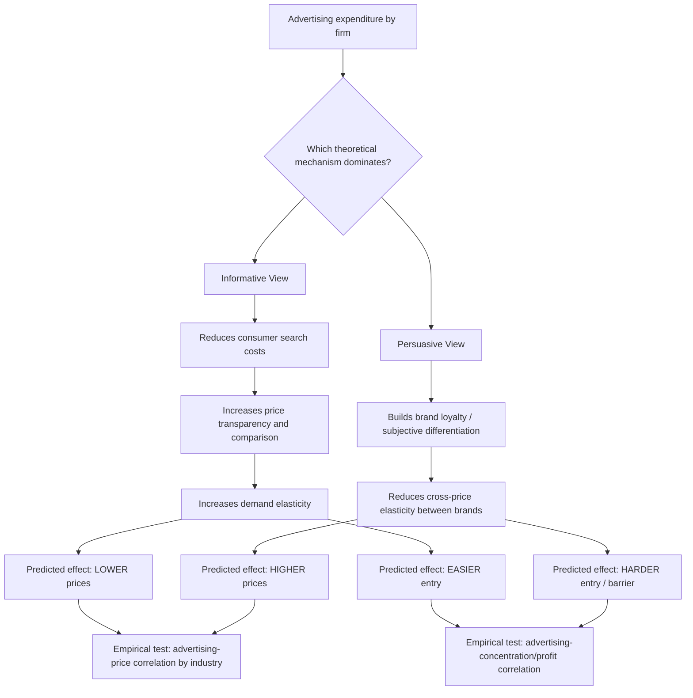

## Informative Versus Persuasive Theories of Advertising

### Definition and Core Concept

Informative and persuasive theories of advertising represent two foundational, and largely competing, economic frameworks for understanding what advertising *does* and how it affects market outcomes. The **informative view** treats advertising as a mechanism for transmitting genuine, payoff-relevant information to consumers (product existence, price, quality, characteristics), reducing search costs and improving the efficiency of consumer decision-making. The **persuasive view** treats advertising as a mechanism that *changes consumer preferences* — creating brand loyalty, artificial product differentiation, and demand inelasticity that is not grounded in any underlying informational content, thereby serving primarily to enhance the advertiser's market power rather than consumer welfare. These two views generate sharply different predictions about advertising's effect on prices, market structure, entry barriers, and social welfare, making the distinction a central organizing framework in the economics of advertising.

### The Informative View of Advertising

#### Core Theoretical Claims

The informative view, most closely associated with **George Stigler's (1961) economics of information** framework and later formalized by economists such as **Phillip Nelson (1970, 1974)** and **Butters (1977)**, holds that advertising functions primarily as a **search-cost-reducing technology**. Key claims:

1. Advertising informs consumers about the **existence** of products, their **prices**, and their **characteristics**, substituting for costly individual consumer search.
2. By reducing search costs, advertising **increases price competition and demand elasticity** — better-informed consumers can more easily compare offers and switch to lower-priced or better-value alternatives, disciplining firms' pricing power.
3. Advertising is therefore predicted to be **associated with lower prices**, not higher prices, in markets where the primary informational content concerns price (this prediction has notable empirical support — see below).
4. Advertising can facilitate **entry** by informing consumers about new entrants' existence and offerings, thereby *reducing* rather than reinforcing entry barriers.

#### Nelson's Search Goods vs. Experience Goods Distinction

Phillip Nelson's influential contribution formalizes *when* advertising is likely to be genuinely informative by distinguishing between two categories of goods based on how consumers learn about quality:

- **Search goods**: Products whose quality can be determined by inspection prior to purchase (e.g., a fabric's color, a table's dimensions). For search goods, advertising can directly convey verifiable quality/characteristic information.
- **Experience goods**: Products whose quality can only be determined through consumption/use (e.g., taste of a food product, reliability of an appliance, effectiveness of a medicine). For experience goods, direct advertised quality claims are not independently verifiable by the consumer before purchase — Nelson's key insight is that advertising can *still* convey information for experience goods, but through an indirect signaling mechanism rather than direct claims (see below).

#### Advertising as a Signal of Quality (Nelson, Milgrom-Roberts)

For experience goods, Nelson (1974) and later **Milgrom and Roberts (1986)** formalized the idea that the **sheer magnitude of advertising expenditure** — rather than its literal content — can function as a credible signal of product quality, even when the advertisement itself contains no verifiable quality claims. The logic:

- High-quality producers expect **repeat purchases** from satisfied customers, making large upfront advertising expenditure to attract initial trial a profitable investment (the initial customer acquisition cost is recouped through future repeat sales).
- Low-quality producers do **not** expect repeat purchases (since consumers, once they experience the low quality, will not buy again), so heavy advertising expenditure is *not* profitable for them — the upfront cost cannot be recouped without repeat business.
- In equilibrium, only high-quality producers find it profitable to advertise heavily, so **the level of advertising spending itself becomes a credible (self-selecting) signal of quality** — consumers rationally infer "if they're spending this much to advertise, they must be confident I'll come back," even without processing any specific informational claim in the ad content.

This is formally a **signaling equilibrium** in the tradition of Spence (1973), applied to advertising rather than education, and it resolves the apparent puzzle of how "uninformative-looking" advertising (e.g., ads with no explicit product claims) can nonetheless convey real economic information through the costly-signal mechanism.

#### Diagram: Advertising as a Quality Signal (svg_diagram)

<svg xmlns="http://www.w3.org/2000/svg" viewBox="0 0 700 400">
<text x="350" y="25" text-anchor="middle" font-size="16" font-weight="bold" fill="#1a1a1a">Advertising Expenditure as a Signal of Quality (svg_diagram)</text>
<rect x="60" y="70" width="260" height="130" rx="8" fill="#bbf7d0" stroke="#059669" stroke-width="2" />
<text x="190" y="98" text-anchor="middle" font-size="13" font-weight="bold">High-Quality Producer</text>
<text x="190" y="120" text-anchor="middle" font-size="11">Expects repeat purchases</text>
<text x="190" y="138" text-anchor="middle" font-size="11">Heavy advertising is profitable:</text>
<text x="190" y="156" text-anchor="middle" font-size="11">recoups cost via future sales</text>
<text x="190" y="180" text-anchor="middle" font-size="12" font-weight="bold" fill="#059669">→ Advertises heavily</text>
<rect x="380" y="70" width="260" height="130" rx="8" fill="#fecaca" stroke="#dc2626" stroke-width="2" />
<text x="510" y="98" text-anchor="middle" font-size="13" font-weight="bold">Low-Quality Producer</text>
<text x="510" y="120" text-anchor="middle" font-size="11">No repeat purchases expected</text>
<text x="510" y="138" text-anchor="middle" font-size="11">Heavy advertising unprofitable:</text>
<text x="510" y="156" text-anchor="middle" font-size="11">cost not recouped</text>
<text x="510" y="180" text-anchor="middle" font-size="12" font-weight="bold" fill="#dc2626">→ Advertises little</text>
<line x1="190" y1="200" x2="190" y2="250" stroke="#059669" stroke-width="1.5" />
<line x1="510" y1="200" x2="510" y2="250" stroke="#dc2626" stroke-width="1.5" />
<rect x="150" y="260" width="400" height="100" rx="8" fill="#dbeafe" stroke="#2563eb" stroke-width="2" />
<text x="350" y="288" text-anchor="middle" font-size="12" font-weight="bold">Rational Consumer Inference</text>
<text x="350" y="310" text-anchor="middle" font-size="11">Observes advertising level (not content)</text>
<text x="350" y="328" text-anchor="middle" font-size="11">Infers: heavy ad spend → high quality</text>
<text x="350" y="346" text-anchor="middle" font-size="11">(self-selecting separating equilibrium)</text>
</svg>

### The Persuasive View of Advertising

#### Core Theoretical Claims

The persuasive view, most closely associated with **Joan Robinson**, and later formalized within the industrial organization tradition by economists such as **Kaldor (1950)** and given its most influential structuralist expression by **Comanor and Wilson (1967, 1974)**, holds that advertising primarily operates by **altering consumer tastes and preferences** rather than conveying objective information. Key claims:

1. Advertising creates **brand loyalty and subjective (non-objective) product differentiation** — consumers come to prefer a brand not because of any real quality or price difference, but because advertising has shaped their tastes/perceptions.
2. By creating (or reinforcing) brand loyalty, advertising **reduces the cross-price elasticity of demand** between brands, allowing advertised firms to charge higher prices without losing significant market share.
3. Heavy advertising, particularly by incumbent firms, can function as an **entry barrier**: new entrants must incur large advertising expenditures merely to overcome the brand loyalty/goodwill established by incumbents' historical advertising, raising the minimum efficient advertising expenditure required to compete, independent of any product-quality consideration.
4. Advertising is therefore predicted to be associated with **higher prices, higher market concentration, and higher profit rates** — the opposite prediction from the informative view.

#### Comanor-Wilson and the Advertising-Concentration-Profitability Literature

Comanor and Wilson's influential empirical and theoretical work in the late 1960s and 1970s formalized the persuasive view within the structure-conduct-performance (SCP) paradigm, treating advertising intensity as a structural **barrier to entry** analogous to capital requirements or scale economies. Their empirical work found that industries with higher advertising-to-sales ratios tended to exhibit higher profit rates, which they interpreted as evidence that advertising-created entry barriers allowed incumbents to sustain above-normal profits — a direct empirical implication of the persuasive/entry-barrier view. [Fact: the Comanor-Wilson studies and their general findings are well-documented in the IO literature; the causal interpretation of the advertising-profitability correlation they identified has been extensively debated and is not treated as settled — see critiques below.]

#### Galbraith's "Dependence Effect"

A related, more sociologically oriented critique from **John Kenneth Galbraith** (*The Affluent Society*, 1958) argues that in advanced industrial economies, advertising does not merely inform consumers about pre-existing wants but actively **creates the wants themselves** (the "dependence effect") — production and the marketing/advertising apparatus that sustains it become self-perpetuating, generating demand for goods that would not otherwise be desired absent the advertising that promotes them. This represents perhaps the strongest version of the persuasive view, challenging the standard welfare-economics assumption that consumer preferences are exogenous and advertising-independent.

### Reconciling the Two Views: The Complementary/Synthesis Perspective

Contemporary industrial organization treats the informative-persuasive dichotomy less as a strict either/or empirical question and more as a spectrum, with most real-world advertising containing elements of both, and the *relative importance* of each element varying systematically by product/market characteristics:

| Dimension | Favors informative interpretation | Favors persuasive interpretation |
| --- | --- | --- |
| Good type | Search goods (verifiable characteristics) | Experience/credence goods (unverifiable claims) |
| Ad content | Price, specifications, direct comparisons | Image, emotional appeal, brand identity, celebrity endorsement |
| Market stage | New product introduction, new entrant advertising | Mature market, incumbent brand-maintenance advertising |
| Price effect observed | Negative (advertising associated with lower prices) | Positive (advertising associated with higher prices/margins) |
| Effect on entry | Facilitates entry (informs consumers of new options) | Deters entry (raises minimum efficient advertising scale) |

**Becker and Murphy (1993)** offered an influential complementary reinterpretation that partially bridges the divide: they argue advertising can be modeled as a **complement in the utility function** (like a good that is jointly consumed with the advertised product, analogous to how salt complements food) rather than as either pure information or preference-altering "brainwashing." Under this view, advertising increases demand not by changing consumers' underlying preferences (persuasion) nor by resolving informational asymmetry (information), but because consumers derive utility from the *product-plus-advertising bundle* — reframing the debate in standard rational-choice terms without requiring either the "manipulation" framing of the persuasive view or requiring advertising content to be strictly factual/verifiable as the pure informative view implies.

#### Diagram: Informative vs. Persuasive — Predicted Effects (Mermaid)

### Empirical Evidence

#### Advertising and Price: The Eyeglasses and Professional Services Studies

The most influential empirical test of the informative view comes from studies of markets where advertising restrictions were historically imposed (e.g., on optometrists/eyeglasses, legal services, and other professional services in various U.S. states) and subsequently relaxed. The classic study by **Benham (1972)** on eyeglasses found that states permitting advertising of eyeglass prices had **significantly lower average eyeglass prices** than states prohibiting such advertising — a direct empirical confirmation of the informative view's core prediction in a market where price advertising is the relevant informational content. [Fact: the Benham (1972) study and its general finding — lower prices in states permitting eyeglass advertising — is a well-established and frequently cited result in the economics-of-advertising and economics-of-information literature.]

This class of studies (extended to other professional services and search-good markets in subsequent research) provides some of the strongest and most direct empirical support for the informative view, specifically in contexts where the *content* of advertising is price/product-attribute information rather than brand-image cultivation.

#### Advertising and Concentration/Profitability: Contested Findings

In contrast, the broader cross-industry evidence on the persuasive view's prediction (advertising associated with higher concentration and profit rates, per Comanor-Wilson) has been more contested:

- Critics (notably **Nelson** himself, and later researchers) argue the observed correlation between advertising intensity and profitability may reflect **reverse causation or omitted-variable bias** — firms with genuinely superior, differentiated, or higher-margin products may simply find it more profitable to advertise (since the return per dollar of advertising is higher for products with real quality advantages), rather than advertising itself *creating* market power and profit from otherwise undifferentiated goods.
- The signaling-based informative interpretation (Nelson, Milgrom-Roberts) directly reinterprets the advertising-profitability correlation: heavy advertising by high-margin firms may reflect genuine quality-signaling behavior (since only firms confident in repeat business/quality find heavy advertising worthwhile) rather than advertising-*created* artificial market power.
- This makes the advertising-concentration-profitability relationship one of the more persistently ambiguous empirical questions in the economics of advertising: the *same* cross-sectional correlation (high advertising intensity industries have higher margins) is consistent with *both* the persuasive-barrier interpretation and the informative-signaling interpretation, making it difficult to definitively distinguish the two theories using aggregate correlational evidence alone. [Inference: this identification difficulty — that competing theories predict similar aggregate correlations — is a widely acknowledged methodological challenge in the empirical advertising literature, not a claim that no study has ever attempted to disentangle the two mechanisms using more refined identification strategies.]

### Welfare Implications

The two views generate starkly different normative/policy conclusions:

**Under the informative view**: Advertising is welfare-enhancing — it reduces search costs, improves market efficiency, facilitates entry, and should generally be *permitted and even encouraged* (this view underpinned the substantial relaxation of professional-advertising restrictions in the U.S. from the 1970s onward, following studies like Benham's).

**Under the persuasive view**: Advertising is at best a wasteful transfer (resources spent on persuasion rather than production) and at worst actively welfare-*reducing* — it creates artificial product differentiation, raises prices, and entrenches incumbent market power by raising entry barriers, implying a stronger case for regulatory scrutiny or restriction of certain advertising practices (particularly image-based/emotional advertising with minimal verifiable content).

Most contemporary industrial organization treatments avoid a categorical welfare verdict, instead emphasizing that the *net* welfare effect of advertising is likely to vary substantially by product category, market maturity, and advertising content type — consistent with the "elements of both" synthesis view described above rather than a single universal conclusion applicable to all advertising.

### Related Topics

- Nelson's search goods versus experience goods classification
- Signaling equilibria (Spence 1973) and their application to advertising (Milgrom-Roberts 1986)
- Comanor-Wilson advertising-as-entry-barrier framework
- Becker-Murphy complementary goods reinterpretation of advertising demand
- Advertising intensity as a determinant of market concentration (structure-conduct-performance paradigm)
- Price advertising restrictions and professional services markets (Benham-type studies)
- Brand loyalty, switching costs, and product differentiation
- Celebrity endorsement and other indirect quality-signaling advertising strategies
- Advertising regulation and consumer protection policy