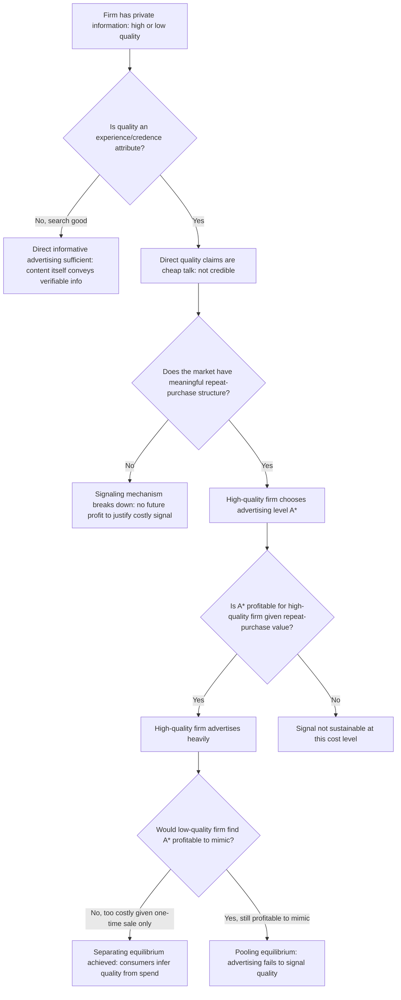

## Advertising as a Signal of Unobserved Quality

### Definition and Core Concept

Advertising as a signal of unobserved quality is a game-theoretic framework in which firms use the **magnitude of advertising expenditure itself** — rather than the informational content of the advertisement — to credibly communicate private information about product quality to consumers, in settings where quality cannot be verified prior to purchase. This theory addresses a fundamental puzzle left unresolved by simple informative theories of advertising: many real-world advertisements contain little or no verifiable factual content (image-based ads, celebrity endorsements, repetitive brand-name exposure), yet advertising demonstrably affects consumer purchasing behavior and appears correlated with product quality in many markets. The signaling framework resolves this puzzle by showing that the **act of spending money on advertising**, independent of what the advertisement says, can function as a credible quality signal under specific equilibrium conditions.

This theory sits at the intersection of the economics of information (particularly signaling theory) and the economics of advertising, and it directly extends Phillip Nelson's foundational distinction between search goods and experience goods introduced in the broader informative-versus-persuasive advertising literature.

### Theoretical Foundations

#### The Underlying Information Problem

The signaling problem arises specifically for **experience goods** and **credence goods**:

- **Experience goods**: Quality can only be ascertained through consumption (e.g., a restaurant meal, a movie, product durability/reliability revealed over time).
- **Credence goods**: Quality may remain unverifiable even *after* consumption (e.g., the necessity of a repair service performed, the effectiveness of certain professional/expert services).

For both categories, direct advertised claims about quality ("our product is superior") are **cheap talk** — statements that cost the firm nothing to make regardless of whether they are true, and that a rational consumer should therefore discount entirely, since a low-quality producer has exactly the same incentive to make the claim as a high-quality producer. Nelson (1974) recognized that if advertising is to convey real information about unobservable quality, it must do so through a mechanism *other than* the literal content of the message — specifically, through the **cost of the signal itself**.

#### The Nelson-Milgrom-Roberts Signaling Mechanism

The formal signaling logic, developed by Nelson (1974) and rigorously modeled by **Milgrom and Roberts (1986)**, rests on the following chain of reasoning:

1. **Repeat-purchase assumption**: Consumers who try a high-quality product and are satisfied will purchase it again in the future; consumers who try a low-quality product and are dissatisfied will not repurchase.
2. **Asymmetric payoff to advertising-induced trial**: Advertising's primary economic function in this model is to induce consumers to **try** the product for the first time (since experience-good quality cannot be assessed before purchase). This first-trial-inducing effect is valuable to *both* high- and low-quality firms, since both want new customers to try their product.
3. **Asymmetric value of that trial to the firm**: For a **high-quality firm**, inducing trial is profitable even at high advertising cost, because satisfied triers become repeat customers, generating a stream of future profit that justifies substantial upfront advertising expenditure.
4. For a **low-quality firm**, inducing trial generates only a **single, one-time sale** (since dissatisfied triers do not return), meaning the same advertising expenditure cannot be recouped through repeat business — the low-quality firm's willingness to pay for advertising-induced trial is therefore strictly lower than the high-quality firm's.
5. **Separating equilibrium**: Because the *marginal value* of advertising-induced trial differs systematically between high- and low-quality firms, there exists a **separating equilibrium** in which high-quality firms choose a level of advertising expenditure sufficiently high that it would be unprofitable for a low-quality firm to mimic — consumers, understanding this equilibrium logic, rationally infer high quality from high advertising spending, and low quality from low (or absent) advertising spending, even without observing any direct evidence of quality in the ad content itself.

#### Formal Condition for a Separating Equilibrium

Let $A$ denote advertising expenditure, $m_H$ and $m_L$ denote the per-unit profit margin for high- and low-quality firms respectively (with $m_H > m_L$, reflecting that high quality typically commands a premium or lower cost of production relative to price), and let repeat-purchase probability be $\rho_H$ for high-quality (high, since satisfied customers return) and $\rho_L$ for low-quality (low or zero, since dissatisfied customers do not return). A separating equilibrium requires an advertising level $A^*$ such that:

$$\underbrace{m_H \cdot (1 + \rho_H + \rho_H^2 + \dots)}_{\text{high-quality firm's discounted profit stream from trial}} > A^* > \underbrace{m_L \cdot (1 + \rho_L + \rho_L^2 + \dots)}_{\text{low-quality firm's discounted profit stream from trial}}$$

That is, $A^*$ must be **large enough** that it exceeds what a low-quality firm could profitably recoup (deterring mimicry) but **small enough** that it remains profitable for the high-quality firm to actually spend (given its larger repeat-purchase-driven profit stream). The existence of such an $A^*$ — and hence the existence of a signaling equilibrium — depends critically on the *gap* between $\rho_H$ and $\rho_L$: markets with a large quality-dependent gap in repeat-purchase probability are more conducive to advertising-as-signal equilibria than markets where repeat purchase is largely quality-independent.

#### Diagram: Separating Equilibrium in Advertising Signaling (svg_diagram)

<svg xmlns="http://www.w3.org/2000/svg" viewBox="0 0 700 420">
<text x="350" y="25" text-anchor="middle" font-size="16" font-weight="bold" fill="#1a1a1a">Separating Equilibrium: Advertising Spend by Quality Type (svg_diagram)</text>
<line x1="80" y1="360" x2="620" y2="360" stroke="#333" stroke-width="2" />
<line x1="80" y1="360" x2="80" y2="60" stroke="#333" stroke-width="2" />
<text x="630" y="365" font-size="12">Advertising level A</text>
<text x="30" y="55" font-size="12">Firm profit</text>

<path d="M 80 100 L 600 250" stroke="#059669" stroke-width="2.5" fill="none" />
<text x="450" y="215" font-size="12" fill="#059669">High-quality firm's profit from trial</text>
<text x="450" y="230" font-size="12" fill="#059669">(includes repeat-purchase value)</text>

<path d="M 80 200 L 350 360" stroke="#dc2626" stroke-width="2.5" fill="none" />
<text x="200" y="290" font-size="12" fill="#dc2626">Low-quality firm's profit from trial</text>
<text x="200" y="305" font-size="12" fill="#dc2626">(one-time sale only)</text>

<line x1="350" y1="60" x2="350" y2="360" stroke="#7c3aed" stroke-width="1.5" stroke-dasharray="4,3" />
<line x1="480" y1="60" x2="480" y2="360" stroke="#7c3aed" stroke-width="1.5" stroke-dasharray="4,3" />
<rect x="350" y="60" width="130" height="300" fill="#f3e8ff" opacity="0.4" />
<text x="415" y="80" text-anchor="middle" font-size="11" fill="#7c3aed" font-weight="bold">Separating</text>
<text x="415" y="94" text-anchor="middle" font-size="11" fill="#7c3aed" font-weight="bold">range A*</text>

<text x="415" y="380" text-anchor="middle" font-size="10" fill="#555">Unprofitable for low-quality</text>

<text x="415" y="393" text-anchor="middle" font-size="10" fill="#555">Still profitable for high-quality</text>

</svg>

### Distinguishing Signaling from Direct Persuasion and Direct Information

It is important to distinguish the signaling mechanism from the two other advertising theories it sits between:

| Theory | What conveys value to consumer | Ad content role | Underlying rationality assumption |
| --- | --- | --- | --- |
| **Direct informative** | Literal factual content (price, specs) | Central — content itself is the information | Consumers process and use stated facts |
| **Signaling (Nelson-Milgrom-Roberts)** | The cost/magnitude of the expenditure, not the content | Largely irrelevant — could be "burning money" (e.g., generic brand-image ads) as long as it is costly | Consumers rationally infer quality from equilibrium spending patterns, not from believing stated claims |
| **Persuasive** | The ad literally reshapes consumer preferences/tastes | Central — content actively manipulates perception | Consumer preferences are treated as endogenous to advertising exposure |

A distinguishing empirical implication of the pure signaling model is that the **specific content of the advertisement should be largely irrelevant to its signaling value** — what matters is that the expenditure is large and highly visible (and, in some model variants, that it is at least partly "wasteful" or non-productive, since a genuinely informative or productive expenditure would not create the same separating incentive). This is sometimes summarized as advertising functioning like a costly, visible "burning of money" — a real resource cost borne specifically because it is unrecoverable except through the future repeat-business channel, which is exactly what makes it a credible (unfakeable) signal.

### Alternative Signaling Channels

Beyond pure advertising *expenditure level*, the broader signaling-of-quality literature identifies several related mechanisms that operate on similar logic:

- **Money-back guarantees and warranties**: A firm offering a strong warranty signals confidence in its own quality, since a low-quality firm would face excessive warranty-claim costs that a high-quality firm would not — a complementary signaling device to advertising expenditure, and one with directly verifiable content (unlike pure ad-spend signaling).
- **Celebrity endorsement**: Employing a highly paid, reputationally valuable celebrity can function as a signal because the celebrity has their own reputational capital at stake and (in equilibrium) would be reluctant to endorse a product likely to fail publicly, adding a second layer of costly, self-interested certification beyond the raw advertising expenditure itself.
- **Slotting allowances and retail placement**: Payments to secure prominent retail shelf space can function similarly — a firm confident in repeat purchase is more willing to pay for the initial placement that drives trial.
- **Brand-name investment over time**: Sustained, consistent advertising under a single brand name across years/decades represents an accumulated sunk investment in reputation that would be irrational for a firm planning to sell low-quality goods and exit, reinforcing the signal through a repeated/dynamic (rather than one-shot) game structure.

### Empirical Evidence and Applications

#### Supportive Evidence

Empirical work testing the Nelson-Milgrom-Roberts framework has generally focused on testing whether advertising intensity correlates with **actual** (not merely marketed) product quality, and whether this relationship is stronger for experience goods (where the signaling mechanism is theoretically necessary) than for search goods (where direct informative content should dominate). Studies examining consumer product quality ratings (e.g., from independent testing organizations) alongside advertising intensity have generally found a **positive association between advertising expenditure and independently measured quality for experience goods**, consistent with the signaling prediction. [Inference: this is the general direction of findings commonly cited in support of the signaling theory in IO textbook treatments; specific study magnitudes and the robustness of this correlation across different product categories and time periods vary and should be checked against current empirical literature for precise figures.]

#### The Repeat-Purchase Requirement as a Boundary Condition

A key testable implication — and limitation — of the theory is that it should apply most strongly to markets with **meaningful repeat-purchase structure** (frequently purchased consumer goods, branded services). For genuinely **one-shot purchase** goods (e.g., a single major durable purchase with no realistic repeat-purchase channel for that specific consumer, or markets where firms do not expect to interact with the same customer again), the signaling logic breaks down, since there is no future profit stream to justify the initial costly signal — the theory therefore predicts advertising should be a *weaker* quality signal in such markets, an implication that has motivated research distinguishing advertising's signaling role across different purchase-frequency categories.

### Signaling Equilibrium Formation Flow (Mermaid)

### Welfare Implications of Signaling Advertising

The signaling interpretation generates a distinctive and somewhat counterintuitive welfare perspective relative to both the pure informative and pure persuasive views:

- Signaling advertising **does** convey genuine economic information (reducing consumer uncertainty about unobservable quality) and is therefore not purely wasteful/manipulative in the way the strict persuasive view characterizes advertising.
- However, unlike direct informative advertising, signaling advertising involves a **real resource cost** (the advertising expenditure) that serves *only* a certification function — the specific content conveys no direct information, meaning the same certification outcome, in principle, could potentially be achieved through less resource-costly signaling mechanisms (e.g., stronger warranty law, third-party certification/rating systems, or reputation-based institutions) if such alternatives were equally credible.
- This creates a genuine efficiency question: is costly advertising signaling a **second-best solution** to an underlying information asymmetry problem (better than no signal at all, but wasteful relative to a hypothetical costless truth-telling mechanism), or does it represent a reasonably efficient market-based solution to quality-uncertainty given the practical difficulty of establishing more direct verification institutions in many real-world markets? [Inference: this remains a genuinely debated normative question in the economics-of-information/advertising literature rather than one with an established consensus answer.]

### Related Topics

- Nelson's search goods versus experience goods classification
- Spence (1973) job-market signaling model as the foundational signaling framework
- Milgrom-Roberts (1986) formal model of price and advertising as signals of quality
- Informative versus persuasive theories of advertising (broader context)
- Warranties, guarantees, and money-back offers as complementary signaling devices
- Celebrity endorsement and third-party certification as quality signals
- Reputation and repeat-game dynamics in markets with asymmetric information
- Separating versus pooling equilibria in signaling games
- Credence goods and expert-service markets (extension beyond pure experience goods)