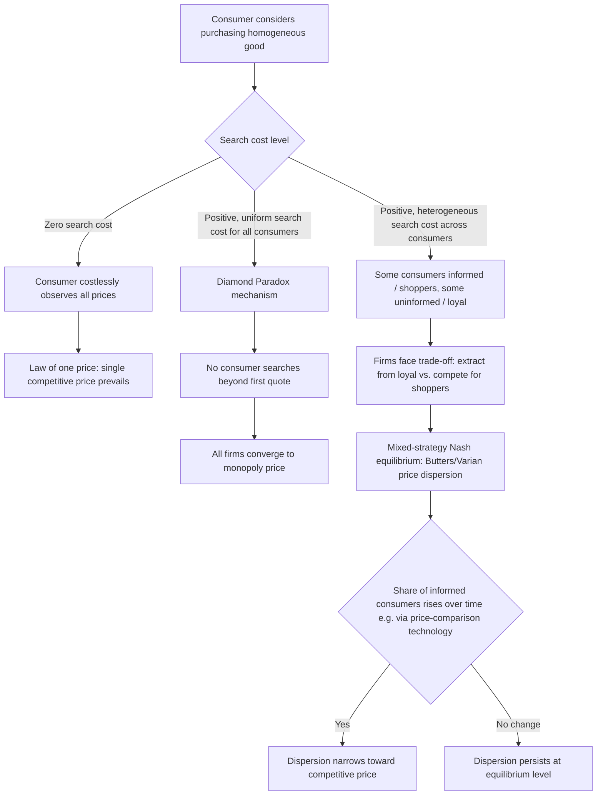

## Search Costs and Equilibrium Price Dispersion

### Definition and Core Concept

Search costs and equilibrium price dispersion is a body of theory explaining a well-documented empirical puzzle: **even for homogeneous (identical) goods sold in the same market, different firms often charge persistently different prices in equilibrium**, despite standard competitive theory predicting that identical products should sell at a single "law of one price." The resolution lies in recognizing that consumers face **costly search** — acquiring price information from multiple sellers takes time, effort, or money — and that this friction alone is sufficient to sustain a stable, non-degenerate distribution of prices across otherwise identical firms, even when all consumers and firms are fully rational. This theory forms a direct extension of the informative theory of advertising (advertising as a search-cost-reducing technology) and provides the formal micro-foundation for why price advertising has real allocative effects.

### The Foundational Puzzle: Why Isn't There a Single Market Price?

In the standard Walrasian/perfect-competition framework, if a good is homogeneous and consumers are fully informed, competition drives all sellers to a single market-clearing price — any seller charging above this price would lose all customers to lower-priced rivals. Yet extensive empirical evidence documents substantial price dispersion for seemingly homogeneous goods (identical retail products, standardized commodities, even goods with identical specifications sold online). The search-cost literature explains this by relaxing the assumption of costless, complete consumer information.

### Theoretical Foundations

#### Stigler's (1961) Economics of Information

The foundational contribution is **George Stigler's "The Economics of Information" (1961)**, widely regarded as the paper that launched the formal economic study of search behavior. Stigler's key insight: because acquiring price information from additional sellers is costly (in time or direct search cost), and because the marginal benefit of an additional price quote (the expected reduction in the price ultimately paid) diminishes as more quotes are collected, **rational consumers optimally search only a finite, limited number of sellers** rather than costlessly acquiring full market information. This "optimal stopping" search behavior implies that even in equilibrium, not all consumers are aware of the lowest available price, allowing higher-priced sellers to retain some customers (those who searched less, or who searched and did not encounter the lowest-price seller) — and hence sustaining price dispersion.

#### Diamond's (1971) Paradox

A crucial and influential theoretical complication is the **Diamond Paradox**, from Peter Diamond's 1971 paper. Diamond showed that if *all* consumers face even an arbitrarily small but strictly positive search cost (and search is sequential, with consumers deciding whether to continue searching after each price quote), the **unique equilibrium outcome is the full monopoly price** — charged by *every* firm, despite the market containing many competing sellers of an identical good. The logic:

- If any seller charged a price even slightly below the monopoly price, no *individual* consumer would find it worthwhile to search further (since the expected gain from finding an even-lower price elsewhere is smaller than the search cost), so consumers simply buy at whatever price they encounter.
- But if consumers do not search further regardless of the price quoted, **every seller has an incentive to raise price up to the point where consumers would just barely be unwilling to walk away** — which is the monopoly price.
- This is a genuine paradox: an arbitrarily *small* search friction generates the *maximal possible* departure from competitive pricing (monopoly pricing under multi-firm competition), a highly discontinuous and counterintuitive result relative to the intuition that "small frictions should produce small departures from the competitive outcome."

The Diamond Paradox motivated a substantial subsequent literature seeking economically realistic ways to escape the paradox's stark, empirically implausible prediction (since real markets with search costs clearly do **not** universally converge to monopoly pricing), primarily by introducing **consumer heterogeneity** in search costs.

#### Diagram: The Diamond Paradox Logic (svg_diagram)

<svg xmlns="http://www.w3.org/2000/svg" viewBox="0 0 700 380">
<text x="350" y="25" text-anchor="middle" font-size="16" font-weight="bold" fill="#1a1a1a">The Diamond Paradox: Small Search Cost → Monopoly Price (svg_diagram)</text>
<rect x="60" y="60" width="250" height="80" rx="8" fill="#dbeafe" stroke="#2563eb" stroke-width="2" />
<text x="185" y="90" text-anchor="middle" font-size="12" font-weight="bold">Arbitrarily small</text>
<text x="185" y="108" text-anchor="middle" font-size="12" font-weight="bold">search cost s &gt; 0</text>
<text x="185" y="128" text-anchor="middle" font-size="10">for every consumer</text>
<path d="M 310 100 L 390 100" stroke="#333" stroke-width="2" marker-end="url(#arrow3)" />
<rect x="390" y="60" width="250" height="80" rx="8" fill="#fef3c7" stroke="#d97706" stroke-width="2" />
<text x="515" y="90" text-anchor="middle" font-size="11">No consumer searches</text>
<text x="515" y="108" text-anchor="middle" font-size="11">further once quoted a price</text>
<text x="515" y="128" text-anchor="middle" font-size="10">(expected gain &lt; search cost)</text>
<path d="M 515 140 L 515 190" stroke="#333" stroke-width="2" marker-end="url(#arrow3)" />
<rect x="390" y="190" width="250" height="80" rx="8" fill="#fecaca" stroke="#dc2626" stroke-width="2" />
<text x="515" y="220" text-anchor="middle" font-size="11">Each firm can raise price</text>
<text x="515" y="238" text-anchor="middle" font-size="11">without losing customers</text>
<text x="515" y="256" text-anchor="middle" font-size="10">(no threat of comparison)</text>
<path d="M 390 230 L 310 230" stroke="#333" stroke-width="2" marker-end="url(#arrow3)" />
<rect x="60" y="190" width="250" height="80" rx="8" fill="#f3e8ff" stroke="#7c3aed" stroke-width="2" />
<text x="185" y="220" text-anchor="middle" font-size="12" font-weight="bold">Result: ALL firms set</text>
<text x="185" y="240" text-anchor="middle" font-size="12" font-weight="bold">monopoly price</text>
<text x="185" y="258" text-anchor="middle" font-size="10">despite many competitors</text>

<text x="350" y="330" text-anchor="middle" font-size="11" fill="#555" font-style="italic">Discontinuity: s → 0 does NOT recover the competitive price</text>

</svg>

### Resolving the Paradox: The Butters and Varian Frameworks

#### Butters (1977): Advertising and Equilibrium Price Dispersion

**Gerard Butters (1977)** provided one of the most influential resolutions by modeling advertising directly as the mechanism generating (rather than eliminating) equilibrium price dispersion. In Butters' model:

- Firms send price advertisements to consumers **randomly** (each consumer receives ads from a random subset of firms, not all firms) rather than consumers actively/costly searching.
- Consumers who receive **only one** price quote have no basis for comparison and must buy at that price if they buy at all — these "uninformed" (single-quote) consumers are effectively captive.
- Consumers who receive **multiple** quotes will purchase from the lowest-priced firm they were reached by — these "informed" (multi-quote) consumers exert competitive pressure.
- In equilibrium, firms **mix** across a range of prices (a non-degenerate price distribution) precisely because charging a high price extracts more surplus from captive single-quote consumers, while charging a low price is necessary to win sales from price-comparing multi-quote consumers — no single price is a dominant strategy, and the resulting **mixed-strategy equilibrium price distribution** is the formal microeconomic explanation for observed price dispersion.

#### Varian (1980): The "Model of Sales"

**Hal Varian's (1980)** closely related model — often called the **"model of sales"** — similarly generates equilibrium price dispersion using a related mechanism: a mix of **informed shoppers** (who costlessly know and compare all prices) and **uninformed/loyal consumers** (who only check one store, often due to switching costs, loyalty, or convenience). Varian's key results:

- Firms randomize prices in a **mixed-strategy Nash equilibrium**, generating a continuous distribution of prices across firms and over time (from any single firm's perspective, its price fluctuates — generating the pattern of intermittent "sales" observed in retail markets).
- The equilibrium price distribution has **no mass point at the monopoly price** and generally **no mass point at the competitive price** either — dispersion is genuinely continuous across an intermediate range, driven by the tension between extracting rents from captive loyal consumers (favoring high prices) and competing for price-sensitive shoppers (favoring low prices).
- The **proportion of informed versus uninformed consumers** is the central comparative-static driver of dispersion: as the informed-shopper share rises (search costs fall, or advertising/comparison tools improve), the equilibrium price distribution compresses toward the competitive price; as the informed share falls, dispersion widens and the distribution shifts toward higher average prices.

#### Diagram: Butters-Varian Equilibrium Price Dispersion Mechanism (svg_diagram)

<svg xmlns="http://www.w3.org/2000/svg" viewBox="0 0 700 400">
<text x="350" y="25" text-anchor="middle" font-size="16" font-weight="bold" fill="#1a1a1a">Consumer Heterogeneity Sustains Price Dispersion (svg_diagram)</text>
<rect x="60" y="60" width="270" height="110" rx="8" fill="#bbf7d0" stroke="#059669" stroke-width="2" />
<text x="195" y="88" text-anchor="middle" font-size="13" font-weight="bold">Informed / Shopper Consumers</text>
<text x="195" y="110" text-anchor="middle" font-size="11">Compare multiple prices</text>
<text x="195" y="128" text-anchor="middle" font-size="11">costlessly or at low cost</text>
<text x="195" y="150" text-anchor="middle" font-size="11" fill="#059669">Buy from lowest-price firm</text>
<rect x="370" y="60" width="270" height="110" rx="8" fill="#fecaca" stroke="#dc2626" stroke-width="2" />
<text x="505" y="88" text-anchor="middle" font-size="13" font-weight="bold">Uninformed / Loyal Consumers</text>
<text x="505" y="110" text-anchor="middle" font-size="11">See only one price quote</text>
<text x="505" y="128" text-anchor="middle" font-size="11">or face high switching cost</text>
<text x="505" y="150" text-anchor="middle" font-size="11" fill="#dc2626">Buy regardless of price level</text>
<rect x="180" y="220" width="340" height="120" rx="8" fill="#dbeafe" stroke="#2563eb" stroke-width="2" />
<text x="350" y="248" text-anchor="middle" font-size="12" font-weight="bold">Firm's Pricing Trade-off</text>
<text x="350" y="272" text-anchor="middle" font-size="11">High price: extracts more from loyal consumers</text>
<text x="350" y="290" text-anchor="middle" font-size="11">but loses shopper consumers to rivals</text>
<text x="350" y="312" text-anchor="middle" font-size="11" font-weight="bold" fill="#2563eb">→ No pure-strategy equilibrium price</text>
<text x="350" y="328" text-anchor="middle" font-size="11" font-weight="bold" fill="#2563eb">→ Mixed-strategy price distribution</text>
<line x1="195" y1="170" x2="280" y2="220" stroke="#059669" stroke-width="1.5" />
<line x1="505" y1="170" x2="420" y2="220" stroke="#dc2626" stroke-width="1.5" />
</svg>

### Comparative Statics: Determinants of Equilibrium Dispersion

The Butters-Varian class of models generates several robust comparative-static predictions that have shaped subsequent empirical work:

| Factor | Effect on price dispersion | Effect on average price level |
| --- | --- | --- |
| **Higher search costs / lower share of informed consumers** | Increases dispersion | Increases average price (closer to monopoly) |
| **Lower search costs / higher share of informed consumers** | Decreases dispersion | Decreases average price (closer to competitive) |
| **More firms in the market** | Ambiguous in general; in many model variants, more firms increase the *probability* an informed consumer finds a low price, intensifying competition among sellers for the informed segment | Generally decreases average price |
| **Advertising/price-comparison technology (e.g., search engines, price-comparison websites)** | Decreases dispersion by effectively lowering search costs | Decreases average price |
| **Product differentiation (even mild, subjective)** | Increases dispersion, as differentiation reduces the intensity of the price-comparison discipline exerted by informed shoppers | Increases average price |

### Empirical Evidence

#### Classic Offline Retail Evidence

Extensive empirical research since Stigler's original paper has documented substantial and persistent price dispersion for nominally homogeneous goods across brick-and-mortar retailers within the same local market — for identical branded grocery items, gasoline, and other standardized products — providing broad empirical support for the general search-cost framework, even though isolating the *precise* mechanism (Stigler-style costly sequential search versus Butters/Varian-style informed/uninformed consumer segmentation) is difficult using aggregate price data alone. [Inference: the general empirical finding of substantial retail price dispersion for homogeneous goods is well-established across a large body of applied IO/marketing literature; specific dispersion magnitudes vary considerably by product category, time period, and geographic market and are not summarized with a single figure here.]

#### The E-Commerce "Death of Distance" Debate

A particularly active area of empirical research examined whether the rise of internet retail and online price-comparison tools would effectively eliminate search costs and, per the theory's comparative statics, sharply compress price dispersion toward the competitive outcome. Early studies produced somewhat mixed findings: while online markets generally exhibit **lower** search costs and correspondingly **lower** average price dispersion than comparable offline markets, dispersion has generally **not been fully eliminated** even for highly standardized digital or physical goods sold online, which has been attributed to residual frictions such as consumer brand loyalty/trust in specific retailers, shipping-cost and delivery-time differences, incomplete adoption of price-comparison tools by all consumers, and algorithmic/dynamic pricing strategies that can themselves generate short-run dispersion. [Unverified: the precise magnitude of online-versus-offline dispersion reduction varies substantially across the empirical literature on e-commerce pricing and specific product categories; the qualitative direction (some reduction, not full elimination) is the more robust and widely replicated finding.]

### Search Cost Determinants and Price Dispersion Flow (Mermaid)

### Connection to the Broader Advertising and Information Literature

Search-cost theory provides the formal microeconomic foundation underlying the **informative view of advertising** discussed elsewhere in this chapter: advertising (particularly price advertising) is precisely a mechanism for reducing consumer search costs, and the search-dispersion models here formalize *why* that search-cost reduction has real allocative consequences — moving the market's price distribution from a high-dispersion, high-average-price regime (few informed consumers) toward a low-dispersion, low-average-price regime (many informed consumers). This directly connects to and provides theoretical grounding for the empirical eyeglasses/professional-services advertising studies (e.g., Benham 1972) discussed under informative-versus-persuasive advertising theory: legal restrictions on price advertising can be understood, in this framework, as **artificially restricting the technology that increases the informed-consumer share**, thereby sustaining a higher-dispersion, higher-average-price equilibrium than would otherwise prevail.

### Related Topics

- Stigler's (1961) economics of information and optimal sequential search
- The Diamond Paradox and its resolutions
- Butters (1977) equilibrium advertising and price dispersion model
- Varian's (1980) "model of sales" and mixed-strategy pricing
- Informative versus persuasive theories of advertising (search-cost foundations)
- Advertising as a signal of unobserved quality (contrast: search-good price dispersion vs. experience-good signaling)
- Loyalty programs, switching costs, and consumer lock-in
- Online price comparison technology and digital market frictions
- Dynamic/algorithmic pricing and short-run price dispersion in e-commerce