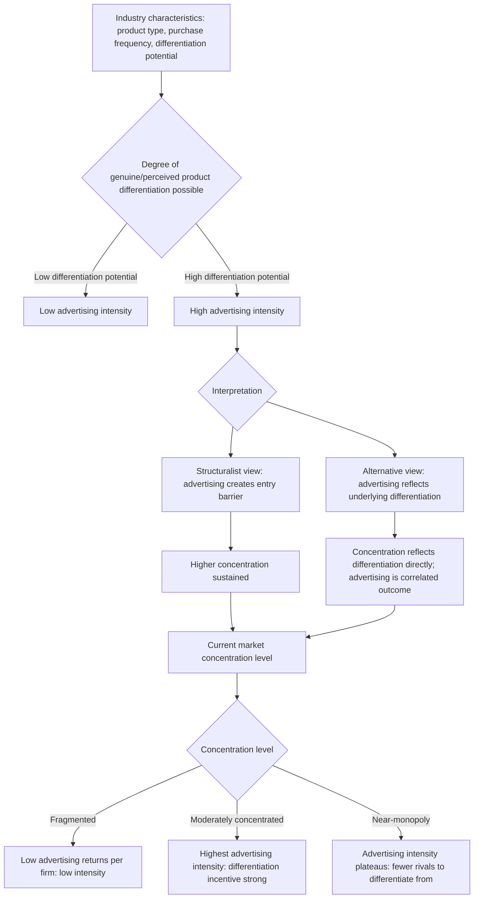

## Advertising Intensity and Market Structure

### Definition and Core Concept

Advertising intensity and market structure examines the two-way empirical and theoretical relationship between how heavily firms in an industry advertise (typically measured by the **advertising-to-sales ratio**) and the structural characteristics of that industry — concentration, entry barriers, firm size distribution, and profitability. This topic synthesizes the informative and persuasive theories of advertising into their industry-level structural implications, asking not just "what does advertising do to an individual consumer or firm" but "what patterns of market structure does advertising intensity produce, sustain, or reflect across an industry." It occupies a central position in the structure-conduct-performance (SCP) tradition of industrial organization, where advertising intensity is treated as both a determinant and a consequence of market structure.

### Theoretical Foundations

#### Advertising Intensity as a Structural Variable

The standard empirical measure is the **advertising-to-sales ratio** ($A/S$), used as an indicator of how advertising-dependent an industry's competitive strategy is. Industries range from very low $A/S$ (e.g., industrial/commodity inputs, undifferentiated raw materials) to very high $A/S$ (e.g., consumer packaged goods, cosmetics, over-the-counter pharmaceuticals, soft drinks). The theoretical treatment of *why* $A/S$ varies systematically across industries, and *what that variation implies for market structure*, follows two broad strands corresponding to the informative/persuasive divide covered earlier in this chapter.

#### The Structuralist View: Advertising as an Entry Barrier

The dominant mid-20th-century structuralist position, most associated with **Comanor and Wilson (1967, 1974)** and building on **Bain's (1956)** broader theory of entry barriers, treats high advertising intensity as functioning analogously to a **capital requirement barrier to entry**:

- Incumbent firms' historically accumulated advertising creates **goodwill/brand capital** — a stock of consumer loyalty that a new entrant cannot instantly replicate.
- A new entrant must incur a **large minimum advertising expenditure** merely to make consumers aware of its existence and to overcome incumbent brand loyalty, *before* it can compete on equal footing — this required expenditure functions as an **absolute cost/scale disadvantage** specific to new entrants, independent of any production-cost disadvantage.
- Because advertising expenditure (like physical capital) often exhibits **economies of scale** in its effectiveness (e.g., national television advertising has a large fixed component, making it more cost-effective per unit sold for large-volume incumbents than for small entrants), advertising-intensive industries tend to exhibit a **minimum efficient advertising scale**, reinforcing barriers to entry at small scale.
- Under this view, the causal chain runs: **high advertising intensity → higher entry barriers → higher sustainable concentration → higher sustainable profit margins**, making advertising intensity a *structural determinant* of concentration and profitability within the classic SCP paradigm.

#### The Alternative View: Advertising as a Response to (Not Cause of) Structure

A competing interpretation, associated with critics of the structuralist advertising-barrier view (including **Nelson**, and later **Schmalensee** and other Chicago-School-influenced IO economists), argues the causal arrow may run substantially in the **opposite direction**:

- Advertising intensity may reflect **underlying demand and product characteristics** (e.g., the degree of genuine or perceived product differentiation possible, the frequency of repeat purchase, whether the good is an experience good requiring quality signaling) rather than *creating* market power from otherwise homogeneous products.
- Firms that already possess **genuinely superior or differentiated products** may rationally choose to advertise more heavily, since the *return* on advertising expenditure (in terms of demand response) is higher for products with real quality or differentiation advantages — implying advertising intensity is a **consequence** of the underlying scope for differentiation, not an independent structural barrier imposed on an otherwise homogeneous market.
- This reverses the presumed SCP causal logic: rather than "Structure → Conduct (advertising) → Performance (profit)," the relationship may run "underlying product/demand characteristics → both advertising intensity and profitability jointly," making advertising intensity and profitability **correlated but not causally linked** through an entry-barrier mechanism.

#### Diagram: Competing Causal Structures (svg_diagram)

<svg viewBox="0 0 700 380" xmlns="http://www.w3.org/2000/svg">
<text x="350" y="25" text-anchor="middle" font-size="16" font-weight="bold" fill="#1a1a1a">Two Causal Interpretations of Advertising-Profit Correlation (svg_diagram)</text>

<text x="175" y="55" text-anchor="middle" font-size="13" font-weight="bold">Structuralist (Comanor-Wilson)</text>

<rect x="60" y="70" width="230" height="55" rx="6" fill="`#dbeafe`" stroke="`#2563eb`" stroke-width="2"/>

<text x="175" y="102" text-anchor="middle" font-size="11">High advertising intensity</text>

<path d="M 175 125 L 175 155" stroke="#333" stroke-width="2" marker-end="url(#arrow4)"/>

<rect x="60" y="160" width="230" height="55" rx="6" fill="`#fef3c7`" stroke="`#d97706`" stroke-width="2"/>

<text x="175" y="192" text-anchor="middle" font-size="11">Entry barrier created</text>

<path d="M 175 215 L 175 245" stroke="#333" stroke-width="2" marker-end="url(#arrow4)"/>

<rect x="60" y="250" width="230" height="55" rx="6" fill="`#bbf7d0`" stroke="`#059669`" stroke-width="2"/>

<text x="175" y="282" text-anchor="middle" font-size="11">Higher concentration & profit</text>

<text x="525" y="55" text-anchor="middle" font-size="13" font-weight="bold">Alternative (Nelson / Chicago-influenced)</text>

<rect x="410" y="70" width="230" height="55" rx="6" fill="`#f3e8ff`" stroke="`#7c3aed`" stroke-width="2"/>

<text x="525" y="92" text-anchor="middle" font-size="11">Genuine product differentiation</text>

<text x="525" y="108" text-anchor="middle" font-size="11">/ quality advantage exists</text>

<path d="M 480 125 L 460 155" stroke="#333" stroke-width="2" marker-end="url(#arrow4)"/>
<path d="M 570 125 L 590 155" stroke="#333" stroke-width="2" marker-end="url(#arrow4)"/>
<rect x="410" y="160" width="100" height="55" rx="6" fill="#fecaca" stroke="#dc2626" stroke-width="2"/>
<text x="460" y="192" text-anchor="middle" font-size="10">High ad</text>
<text x="460" y="205" text-anchor="middle" font-size="10">intensity</text>
<rect x="540" y="160" width="100" height="55" rx="6" fill="#bbf7d0" stroke="#059669" stroke-width="2"/>
<text x="590" y="192" text-anchor="middle" font-size="10">High</text>
<text x="590" y="205" text-anchor="middle" font-size="10">profit</text>

<text x="525" y="250" text-anchor="middle" font-size="11" fill="#555" font-style="italic">Correlated jointly, not causally</text>

<text x="525" y="266" text-anchor="middle" font-size="11" fill="#555" font-style="italic">linked via entry-barrier mechanism</text>

<defs>
<marker id="arrow4" markerWidth="10" markerHeight="10" refX="8" refY="3" orient="auto">
<path d="M0,0 L0,6 L9,3 z" fill="#333"/>
</marker>
</defs>
</svg>

### Advertising, Economies of Scale, and the Entry-Barrier Mechanism

#### Fixed-Cost and Threshold Effects

A key structural argument, distinct from pure brand-loyalty persuasion, focuses on the **cost structure of advertising itself**:

- National advertising media (historically television, now also large-scale digital advertising campaigns) often carry substantial **fixed costs** (production costs, minimum effective campaign scale to achieve threshold consumer awareness/recall).
- If advertising effectiveness exhibits **increasing returns up to a minimum threshold** (small advertising budgets generate negligible awareness/recall, while larger budgets generate disproportionately higher awareness), then small entrants face a genuine **cost disadvantage per unit of effective market awareness generated**, distinct from any brand-loyalty/persuasion effect.
- This threshold/scale-economy argument for advertising as an entry barrier is generally considered more robust and less theoretically contested than the pure persuasion-based barrier argument, since it does not require assuming advertising irrationally manipulates consumer preferences — it can operate purely through cost-structure economics even under the informative view of advertising content.

#### Sylos-Postulate-Style Limit Pricing via Advertising

The advertising-as-barrier logic can be formalized analogously to Bain/Sylos-style limit pricing models (covered under entry deterrence topics): incumbents may maintain advertising expenditure at a level specifically calibrated to deter entry — spending enough to make post-entry profitability unattractive to a potential entrant who would need to match or exceed that spending level to compete effectively, even though this advertising level might exceed what a purely profit-maximizing (non-strategic) incumbent would choose absent the entry-deterrence motive.

### Empirical Patterns Across Industry Types

| Industry characteristic | Typical advertising intensity | Theoretical interpretation |
| --- | --- | --- |
| Consumer packaged goods (cosmetics, soft drinks, cereal) | High $A/S$ | Strong brand differentiation potential; frequent repeat purchase supports signaling; low objective quality differences favor persuasive/image advertising |
| Pharmaceuticals (OTC and prescription) | High $A/S$, though channel differs (direct-to-consumer vs. professional/physician-targeted) | Experience/credence good characteristics support signaling theory; repeat purchase and health stakes create strong quality-inference incentives |
| Industrial/producer goods (steel, cement, industrial chemicals) | Low $A/S$ | Buyers are sophisticated, informed repeat purchasers (often other firms) with low search costs and direct technical evaluation capability; limited scope for brand-image differentiation |
| Retail/professional services historically subject to advertising restrictions | Variable, often historically suppressed by regulation | Regulatory barriers to price advertising specifically limited informative-content advertising, a distinct policy question from natural market-driven advertising intensity |

[Inference: this table reflects commonly cited stylized patterns in the IO/marketing literature relating industry type to advertising intensity; the precise ranking and specific ratios vary by data source, time period, and industry classification system, and are illustrative of general tendencies rather than precise current figures.]

### Concentration-Advertising Relationship: Non-Monotonicity

Later empirical and theoretical work has qualified the simple structuralist "more advertising → more concentration" prediction with evidence of a **non-monotonic (often inverted-U or threshold-type) relationship** between market concentration and advertising intensity:

- In **very fragmented** markets (many small firms, low concentration), the *return* to advertising may be limited because no single firm can capture enough of the resulting demand increase to justify the fixed advertising cost — advertising intensity tends to be low.
- In **moderately concentrated** markets, firms have enough scale to profitably fund significant advertising campaigns and have strong incentives to differentiate from a *manageable* number of rivals, so advertising intensity tends to be highest.
- In **highly concentrated** markets approaching monopoly, the incentive to advertise for competitive differentiation diminishes (there are few or no rivals to differentiate from), though advertising may persist for demand-expansion or entry-deterrence purposes — advertising intensity may plateau or decline somewhat relative to the moderately concentrated case.

This produces a theoretical **inverted-U relationship between concentration and advertising intensity**, structurally analogous to (though conceptually distinct from) the inverted-U relationship between competition and innovation intensity discussed under Schumpeterian creative destruction elsewhere in this course — in both cases, intermediate market structure conditions generate the strongest incentive for the competitive activity in question (R&D in one case, advertising in the other), while both extremes (perfect competition and pure monopoly) generate weaker incentives.

### Advertising Intensity and Market Structure Interaction Flow (Mermaid)

### Policy and Antitrust Implications

The structuralist versus alternative interpretations carry substantially different implications for competition policy:

**Under the structuralist/entry-barrier view**: Sustained high advertising intensity by dominant incumbents could be treated with a degree of antitrust scrutiny analogous to other entry-barrier-creating conduct, and industries exhibiting persistently high advertising-to-sales ratios alongside high concentration and profitability might warrant closer competitive analysis of whether the advertising serves an anticompetitive foreclosure function.

**Under the alternative/informative-signaling view**: High advertising intensity in concentrated, profitable industries is more likely to reflect legitimate underlying product differentiation, quality-signaling dynamics (per the Nelson-Milgrom-Roberts framework), or genuine efficiencies rather than artificial market-power creation, implying a more permissive policy stance is appropriate absent additional evidence of anticompetitive intent or effect (e.g., predatory or exclusionary advertising practices specifically targeting entrants).

Most contemporary antitrust practice treats advertising-intensity-based entry-barrier arguments with caution, generally requiring more specific evidence of anticompetitive foreclosure (e.g., exclusive advertising contracts, exclusionary retail slotting arrangements) rather than treating high advertising intensity alone as presumptive evidence of an antitrust-relevant barrier, reflecting the broader empirical ambiguity of the causal relationship discussed above.

### Related Topics

- Informative versus persuasive theories of advertising
- Advertising as a signal of unobserved quality (Nelson-Milgrom-Roberts)
- Bain's structural theory of entry barriers
- Sylos-Postulate limit pricing and strategic entry deterrence
- Structure-conduct-performance (SCP) paradigm and its critiques
- The inverted-U relationship between competition and innovation (parallel structural logic)
- Comanor-Wilson advertising-profitability studies and their critiques
- Minimum efficient scale in advertising and media cost structures
- Search costs and equilibrium price dispersion (complementary informative-advertising foundation)