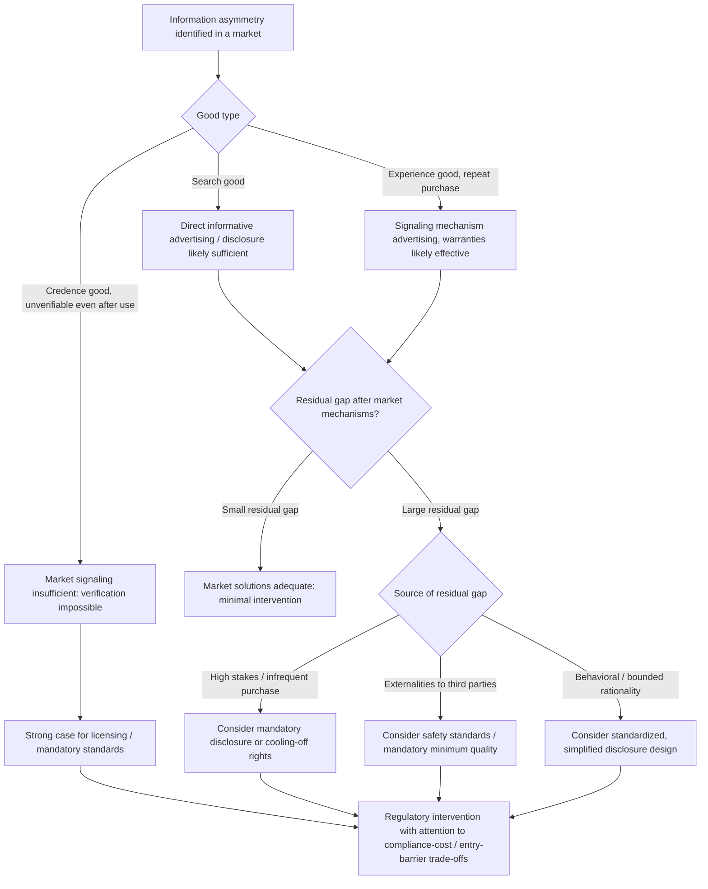

## Consumer Information and Welfare Implications

### Definition and Core Concept

Consumer information and welfare implications examines how the quantity, quality, and distribution of information available to consumers affects market outcomes and social welfare, synthesizing the informative, persuasive, and signaling theories of advertising covered elsewhere in this chapter into their broader normative and policy implications. This topic addresses the central welfare-economics question underlying the economics of advertising and consumer information: **does the market, left to itself, generate an efficient quantity and quality of consumer information, or are there systematic market failures that justify policy intervention** — and if intervention is warranted, what form should it take (disclosure mandates, advertising regulation, product standards, consumer protection law)?

### Theoretical Foundations

#### The Baseline Welfare Economics of Information

In a standard welfare-economics framework, information has value because it allows consumers to make decisions that better match their true preferences to available options, and allows markets to allocate resources toward the goods/qualities that consumers actually value. Under **complete information**, competitive markets achieve Pareto-efficient allocation (the First Welfare Theorem). Real markets, however, are characterized by **incomplete and asymmetric information**, creating a wedge between the market outcome and the full-information efficient benchmark. The economics of consumer information asks how large this wedge is, what mechanisms (market-based or regulatory) can close it, and whether those mechanisms themselves are costless or introduce their own distortions.

#### Akerlof's Market for Lemons and the Baseline Case for Market Failure

**George Akerlof's (1970) "Market for Lemons"** provides the foundational demonstration that information asymmetry between buyers and sellers can cause **severe market failure**, extending well beyond simple mispricing:

- If sellers know their product's quality but buyers cannot distinguish high- from low-quality goods before purchase, buyers rationally offer only an **average-quality-based price**.
- This average price is unattractive to sellers of genuinely high-quality goods (who would receive less than their good is worth), causing them to **exit the market**.
- As high-quality sellers exit, the average quality remaining in the market **falls further**, causing buyers to revise their price offers downward again, triggering further exit of the (now relatively higher-quality) remaining sellers.
- This **adverse selection death spiral** can, in extreme cases, cause the market to **unravel entirely** — no trade occurs even though mutually beneficial trades (a well-informed buyer purchasing a genuinely high-quality good at a fair price) would exist under complete information.

Akerlof's model establishes the theoretical baseline case that markets with severe, unaddressed information asymmetry can fail dramatically, providing the foundational justification for both market-based information-provision mechanisms (advertising, signaling, warranties, certification) and, where those mechanisms prove insufficient, regulatory intervention (mandatory disclosure, quality standards, licensing).

#### Market-Based Solutions to Information Asymmetry

Building on Akerlof's baseline problem, the broader literature identifies several **market-generated** mechanisms that can partially or fully resolve information asymmetry without requiring regulatory intervention — several of which are covered in depth elsewhere in this chapter:

1. **Signaling** (Spence 1973; applied to advertising by Nelson 1974 and Milgrom-Roberts 1986): The informed party (seller) takes a costly action that credibly reveals private information, as in advertising-expenditure-as-quality-signal models.
2. **Screening**: The uninformed party (buyer) designs a menu of contracts/offers that induces informed parties to self-select and reveal their type (e.g., warranty menus, insurance deductible options).
3. **Search** (Stigler 1961 and subsequent literature): Buyers incur costs to directly investigate quality/price themselves, generating the equilibrium price-dispersion outcomes covered under search-cost theory.
4. **Reputation and repeated interaction**: Firms that expect to interact repeatedly with the same customer base (or within a community where information about past conduct circulates) have long-run incentives to maintain quality/honesty even absent formal contracts, since reputational capital, once damaged, is costly to rebuild.
5. **Third-party certification and intermediaries**: Independent testing organizations, professional licensing bodies, credit-rating agencies, and similar intermediaries specialize in quality verification, reducing the cost of information acquisition relative to individual buyer search.

#### Diagram: Market-Based Solutions to Information Asymmetry (svg_diagram)

<svg xmlns="http://www.w3.org/2000/svg" viewBox="0 0 700 420">
<text x="350" y="25" text-anchor="middle" font-size="16" font-weight="bold" fill="#1a1a1a">Market Responses to Information Asymmetry (svg_diagram)</text>
<rect x="250" y="50" width="200" height="60" rx="8" fill="#fecaca" stroke="#dc2626" stroke-width="2" />
<text x="350" y="75" text-anchor="middle" font-size="12" font-weight="bold">Akerlof "Lemons" Problem</text>
<text x="350" y="95" text-anchor="middle" font-size="10">Adverse selection risk</text>
<path d="M 300 110 L 180 150" stroke="#333" stroke-width="1.5" marker-end="url(#arrow5)" />
<path d="M 340 110 L 300 150" stroke="#333" stroke-width="1.5" marker-end="url(#arrow5)" />
<path d="M 400 110 L 400 150" stroke="#333" stroke-width="1.5" marker-end="url(#arrow5)" />
<path d="M 440 110 L 520 150" stroke="#333" stroke-width="1.5" marker-end="url(#arrow5)" />
<path d="M 460 110 L 620 150" stroke="#333" stroke-width="1.5" marker-end="url(#arrow5)" />
<rect x="100" y="155" width="130" height="70" rx="6" fill="#dbeafe" stroke="#2563eb" stroke-width="2" />
<text x="165" y="182" text-anchor="middle" font-size="11" font-weight="bold">Signaling</text>
<text x="165" y="200" text-anchor="middle" font-size="9">Costly action reveals</text>
<text x="165" y="212" text-anchor="middle" font-size="9">private information</text>
<rect x="250" y="155" width="130" height="70" rx="6" fill="#bbf7d0" stroke="#059669" stroke-width="2" />
<text x="315" y="182" text-anchor="middle" font-size="11" font-weight="bold">Screening</text>
<text x="315" y="200" text-anchor="middle" font-size="9">Menus induce</text>
<text x="315" y="212" text-anchor="middle" font-size="9">self-selection</text>
<rect x="335" y="155" width="130" height="70" rx="6" fill="#fef3c7" stroke="#d97706" stroke-width="2" />
<text x="400" y="182" text-anchor="middle" font-size="11" font-weight="bold">Search</text>
<text x="400" y="200" text-anchor="middle" font-size="9">Buyer investigates</text>
<text x="400" y="212" text-anchor="middle" font-size="9">directly</text>
<rect x="480" y="155" width="130" height="70" rx="6" fill="#f3e8ff" stroke="#7c3aed" stroke-width="2" />
<text x="545" y="182" text-anchor="middle" font-size="11" font-weight="bold">Reputation</text>
<text x="545" y="200" text-anchor="middle" font-size="9">Repeated interaction</text>
<text x="545" y="212" text-anchor="middle" font-size="9">disciplines conduct</text>
<rect x="555" y="155" width="130" height="70" rx="6" fill="#e0f2fe" stroke="#0284c7" stroke-width="2" />
<text x="620" y="182" text-anchor="middle" font-size="11" font-weight="bold">Certification</text>
<text x="620" y="200" text-anchor="middle" font-size="9">Third party verifies</text>
<text x="620" y="212" text-anchor="middle" font-size="9">quality</text>
<rect x="180" y="270" width="340" height="90" rx="8" fill="#e5e7eb" stroke="#374151" stroke-width="2" />
<text x="350" y="298" text-anchor="middle" font-size="12" font-weight="bold">If market mechanisms remain insufficient:</text>
<text x="350" y="322" text-anchor="middle" font-size="11">Residual information gap persists</text>
<text x="350" y="342" text-anchor="middle" font-size="11" font-weight="bold" fill="#374151">→ Case for regulatory intervention</text>
</svg>

### When Market Solutions Fail: The Case for Regulatory Intervention

Market-based information mechanisms are not universally sufficient, and the literature identifies several systematic conditions under which residual information asymmetry justifies regulatory intervention:

#### 1. Credence Goods and Persistent Unverifiability

For **credence goods** (where quality remains unverifiable even after consumption — e.g., the necessity of a medical procedure or auto repair actually performed), neither search nor experience-based learning fully resolves the information gap, since the consumer cannot verify quality/necessity even in retrospect. This category presents the strongest case for regulatory responses such as professional licensing, mandatory disclosure of qualifications, or liability rules, since market-based signaling/reputation mechanisms alone may be insufficient when consumers cannot ultimately verify outcomes to update their beliefs about a specific provider.

#### 2. High Stakes and Infrequent Purchase

Goods characterized by **infrequent purchase and high consequences of error** (major durables, health-related products, financial products) limit the effectiveness of reputation- and repeat-purchase-based mechanisms (including the advertising-signaling mechanism discussed under advertising-as-signal theory, which specifically relies on repeat-purchase structure to function), since consumers may not have the opportunity to learn from repeated personal experience with the same seller before a costly mistake occurs.

#### 3. Externalities from Individual Information Failures

When a given consumer's poor information leads to decisions that impose costs on **third parties** (e.g., safety defects causing harm beyond the purchaser, misleading financial products contributing to systemic risk), the case for mandatory disclosure/safety standards extends beyond pure consumer-protection rationale into standard externality-correction logic, independent of whether market signaling mechanisms would eventually resolve the pure informational asymmetry given enough time.

#### 4. Behavioral and Bounded-Rationality Considerations

Beyond the pure asymmetric-information framework, a substantial body of behavioral economics research has documented that consumers frequently fail to process even *available* information optimally (due to cognitive limitations, present bias, or systematic behavioral biases), suggesting that even markets with abundant informative advertising and disclosure may not achieve the efficient outcome that the classical rational-search-and-signaling models predict. [Inference: this behavioral-economics qualification to the classical information-economics framework is a well-established and active area of the literature, though its precise policy implications (e.g., optimal disclosure design accounting for bounded rationality) remain an area of ongoing research and debate rather than settled consensus.]

### Regulatory and Policy Instruments

| Policy instrument | Mechanism | Primary applicable failure |
| --- | --- | --- |
| **Mandatory disclosure requirements** | Compel sellers to reveal specific verifiable information (ingredients, nutritional content, financial terms/APR, safety test results) | Search goods with verifiable attributes that firms have no independent incentive to voluntarily disclose |
| **Product safety and quality standards** | Set minimum quality/safety floors regardless of disclosure | Externality concerns; credence goods where verification is inherently difficult even with disclosure |
| **Professional licensing and certification requirements** | Restrict provision of certain services to qualified providers | Credence goods; high-stakes/infrequent-purchase expert services |
| **Advertising content regulation (truth-in-advertising, deceptive practice prohibitions)** | Prohibit false/misleading claims regardless of market self-correction | Cases where market signaling/reputation mechanisms are slow-acting relative to the harm from short-run deception |
| **Cooling-off periods and rescission rights** | Allow consumers time to reconsider high-stakes purchases | Behavioral/bounded-rationality concerns; high-pressure sales situations |
| **Comparative/standardized disclosure formats** | Mandate standardized presentation (e.g., standardized nutrition labels, standardized loan-term disclosure) to reduce comparison/search costs | Search-cost reduction to combat Diamond-Paradox-type dispersion and complexity-driven confusion |

### Welfare Trade-offs in Information Policy

#### Costs of Regulatory Information Intervention

Regulatory information mandates are not costless and generate their own trade-offs:

- **Compliance costs**: Disclosure requirements impose direct administrative and reporting costs on firms, which may be regressive relative to firm size (disproportionately burdening smaller firms/entrants relative to large incumbents who can spread compliance costs over greater volume) — creating a potential *unintended* entry-barrier effect analogous to the advertising-intensity entry-barrier concern discussed under advertising and market structure.
- **Information overload**: Excessive or overly complex mandated disclosure can overwhelm consumers' processing capacity, potentially *reducing* effective information use even as the *quantity* of disclosed information increases — a concern directly connected to the behavioral-economics critique above.
- **Standardization trade-offs**: Mandating standardized disclosure formats can improve comparability (aiding search) but may also suppress genuinely useful product-specific information that does not fit the standardized template.

#### Balancing Market-Based and Regulatory Solutions

Contemporary policy and academic treatments generally favor a **layered approach**, using market-based mechanisms (signaling, reputation, competition among information intermediaries such as rating agencies and comparison platforms) as the primary information-provision mechanism where they function reasonably well (e.g., competitive consumer goods with meaningful repeat purchase), reserving more intrusive regulatory intervention for the specific failure categories identified above (credence goods, high-stakes infrequent purchases, significant externalities, well-documented behavioral biases) rather than treating information regulation as a uniformly necessary response to all forms of information asymmetry.

### Information Policy Decision Flow (Mermaid)

### Synthesis: Consumer Information Across the Chapter's Frameworks

This topic functions as the normative synthesis point for the chapter's preceding theoretical material:

- The **informative-persuasive divide** determines *whether* advertising itself is likely to close or widen the information gap in a given market.
- **Signaling theory** explains how markets can generate credible quality information even without direct informative ad content, but is bounded by the repeat-purchase requirement.
- **Search-cost theory** explains why even informative advertising and rational consumer behavior do not fully eliminate price dispersion, and why search-cost-reducing innovations (including regulatory disclosure standardization) have genuine allocative value.
- **Advertising intensity and market structure** raises the concern that information-provision mechanisms (particularly advertising) may simultaneously serve a genuine informational/signaling function *and* an entry-deterring structural function, complicating any simple welfare verdict on high-advertising industries.

Taken together, the welfare economics of consumer information does not support a single categorical conclusion (markets are efficient / markets always fail) but instead provides a **structured framework for diagnosing which specific mechanism is likely to dominate in a given market**, based on good type (search/experience/credence), purchase frequency, stakes, and the presence of externalities or behavioral frictions — informing correspondingly targeted policy responses rather than uniform advertising or disclosure regulation across all markets.

### Related Topics

- Akerlof's market for lemons and adverse selection
- Signaling versus screening in information economics (Spence, Rothschild-Stiglitz)
- Informative versus persuasive theories of advertising
- Advertising as a signal of unobserved quality
- Search costs and equilibrium price dispersion
- Advertising intensity and market structure
- Behavioral economics and bounded rationality in consumer decision-making
- Mandatory disclosure design and standardized information formats
- Professional licensing and credence-good regulation
- Consumer protection law and deceptive advertising prohibitions